# 240115 Python_01
## Index
- 프로그래밍
- 파이썬
- Style Guide
- Data Types

## 프로그래밍
### 프로그램
- 명령어들의 집합

### 프로그램 예시
 - 친구에게 우리 집으로 오는 길을 적어주는 것 -> '프로그램 작성'
 - 적어준 길을 순서대로 따라가는 것 -> '프로그램 실행'
 - 프로그램은 이처럼 몇 가지 기초 연산으로 구성됨
    - 'xx 사거리에서 우회전', '두 블록 직진 후 좌회전' 등
 - 컴퓨터는 더 다양한 연산 집합을 가짐
    - '파일에서 3번째 줄을 지워라'. '네모 박스를 오른쪽으로 옮겨라' 등
    - 기존 연산을 사용해 더 많은 연산을 만들 수도 있음
    - 이전에 사용한 연산 위에 차곡차곡 쌓여 새로운 연산을 만들어냄

### 프로그래밍의 핵심
- 새 연산을 정의하고 조합해 유용한 작업을 수행하는 것
    -> '문제를 해결'하는 매우 강력한 방법

### 프로그래밍 언어
- 컴퓨터에게 작업을 지시하고 문제를 해결하는 도구

## 파이썬

### 파이썬의 사용성과 인기
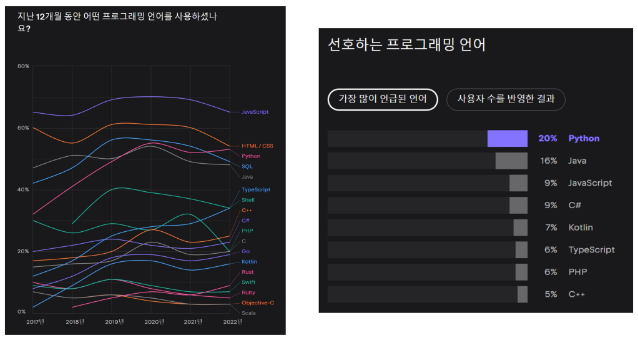

### 파이썬을 사용하는 이유
 - 간결하고 읽기 쉬운 문법
 - 다양한 응용 분야
    - 데이터 분석, 인공지능, 웹 개발, 자동화 등
 - 파이썬 커뮤니티의 지원
    - 세계적인 규모의 풍부한 온라인 포럼 및 커뮤니티 생태계

### 파이썬 프로그램이 실행되는 법
 - 컴퓨터는 기계어로 소통하기 때문에 사람이 기계어를 직접 작성하기 어려움
 - 인터프리터가 사용자의 명령어를 운영체제가 이해하는 언어로 바꿈
 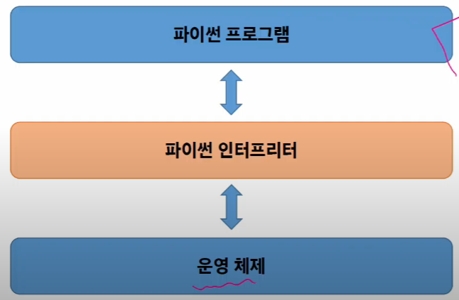
    - 사용이 더 용이해지고 운영체제간 이식도 가능하게 함(확장성)

### 파이썬 인터프리터를 사용하는 2가지 방법
1. shell이라는 프로그램으로 한 번에 한 명령어씩 입력해서 실행
    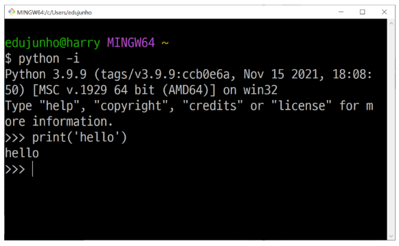
2. 확장자가 .py인 파일에 작성된 파이썬 프로그램을 실행
    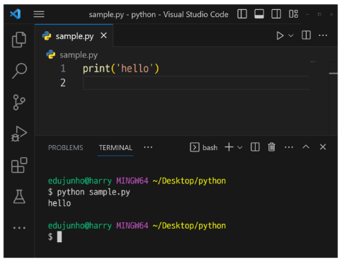

### 표현식
- 값, 변수, 연산자 등을 조합하여 계산되고 결과를 내는 코드
- 표현식이 평가되어 값이 반환됨

### 평가
- 표현식이나 문장을 실행하여 그 결과를 계산하고 값을 결정하는 과정
- 표현식이나 문장을 순차적으로 평가하여 프로그램의 동작을 결정

### 문장
- 실행 가능한 동작을 기술하는 코드 (조건문, 반복문, 함수 정의 등)
- 표현식과 문장 : 문장은 보통 여러 개의 표현식을 포함
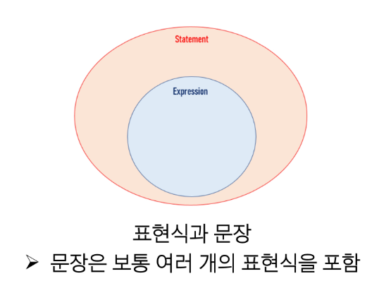

### 타입
- 값이 어떤 종류의 데이터인지, 어떻게 해석되고 처리되어야 하는 지를 정의
    - 1 + 2
    - 타입은 2가지 요소로 이루어짐 : '값(피연산자: 1, 2)' 과 '값에 적용할 수 있는 연산(: +)'

### 데이터 타입
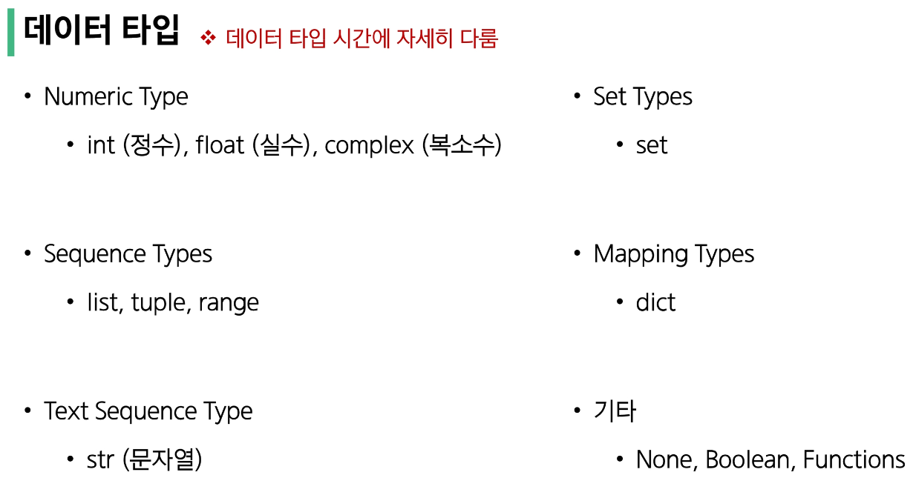

### 산술 연산자
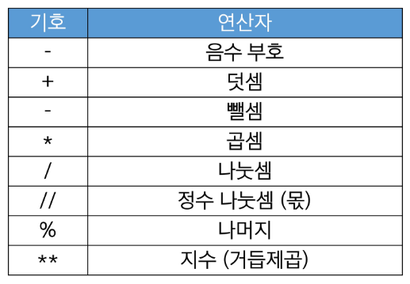

### 연산자 우선순위
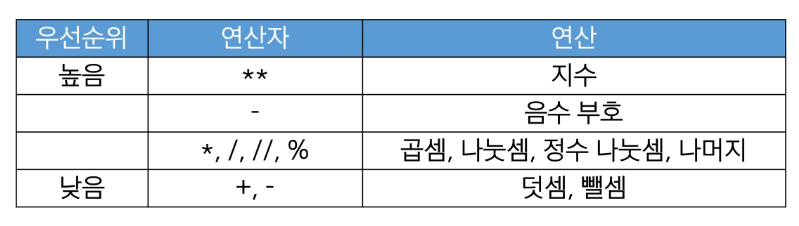

### 연산자 우선순위 예시
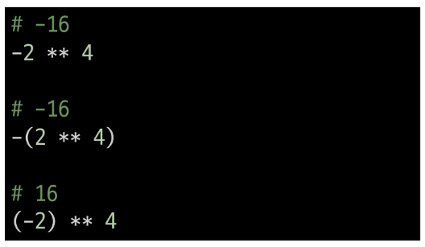
 1. ** -> - : 지수 먼저, 음수 부호 나중
 2. () -> - : 괄호 먼저, 음수 부호 나중
 3. () -> ** : 괄호 먼저, 지수 나중 (음수 부호를 포함하여 적용하기 위해 괄호로 씌웠다)

### 변수
- 값을 '**참조**'하는 이름
    - ex) degrees = 36.5
    - 할당문 : "변수 degress에 값 36.5를 할당했다"

### 변수명 규칙
 - 영문 알파벳, 언더스코어(_), 숫자로 구성
 - 숫자로 시작할 수 없음
 - 대소문자를 활용
 - 아래 키워드는 파이썬의 내부 예약어로 사용할 수 없음(오류 발생)
 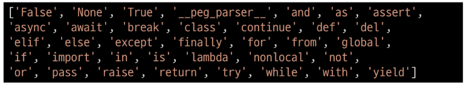

### 변수, 값 그리고 메모리
 - 거리에 집 주소가 있듯이 메모리의 모든 위치에는 그 위치를 고유하게 식별하는 메모리 주소가 존재
 - 객체(object)
    - 타입을 갖는 메모리 주소 내 값
    - 값이 들어있는 상자
 - 변수는 그 변수가 참조하는 객체의 메모리 주소를 가짐
 - 변수 degrees는 값 36.5를 참조

### 할당문
1. 할당 연산자 (=) 오른쪽에 있는 표현식을 평가해서 값(메모리 주소)을 생성
2. 값의 메모리 주소를 '=' 왼쪽에 있는 변수에 저장
    - 존재하지 않는 변수라면 : 새 변수를 생성
    - 기존에 존재했던 변수라면 : 기존 변수를 재사용하여 변수에 들어 있는 메모리 주소를 변경
3. 변수에 재할당 (예시)
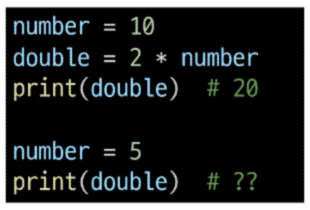
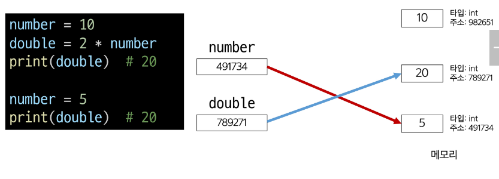

## Style Guide

### Sytle Guide
- 코드의 일관성과 가독성을 향상시키기 위한 규칙과 권장 사항들의 모음

### Python Style Guide
 - 변수명은 무엇을 위한 변수인지 직관적인 이름을 가져야 함
 - 공백(space) 4칸을 사용하여(= tab키) 코드 블록을 들여쓰기
 - 한 줄의 길이는 79자로 제한하며, 길어질 경우 줄 바꿈을 사용
 - 문자와 밑줄(_)을 사용하여 함수, 변수, 속성의 이름을 작성
 - 함수 정의나 클래스 정의 등의 블록 사이에는 빈 줄을 추가
 [Style Guide for python code](https://peps.python.org/pep-0008/)

### Python Tutor
- 파이썬 프로그램이 어떻게 실행되는지 도와주는 시각화 도우미
[Python Tutor](https://pythontutor.com/)

### 주석(Comment)
 - 프로그램 코드 내에 작성되는 설명이나 메모
 - 인터프리터에 의해 실행되지 않음
 - 한 줄을 #을 붙여서, 여러 줄은 ''' ''' -> 쌍따옴표로 묶어서 표현함
 - #을 붙이는 것을 주로 사용하고, ctrl + /를 통해 바로 붙일 수 있다

### 주석의 목적
 - 코드의 특정 부분을 설명하거나 임시로 코드를 비활성화할 때
 - 코드를 이해하거나 문서화하기 위해
 - 다른 개발자나 자신에게 코드의 의도나 동작을 설명하는 데 도움

## Data Types

### Data Types
- 값의 종류와 그 값에 적용 가능한 연산과 동작을 결정하는 속성

### 데이터 타입 분류

### 데이터 타입이 필요한 이유
 - 값들을 구분하고, 어떻게 다뤄야 하는지를 알 수 있음
 - 요리 재료마다 특정한 도구가 필요하듯이 각 데이터 타입 값들도 각자에게 적합한 도구를 가짐
 - 타입을 명시적으로 지정하면 코드를 읽는 사람이 변수의 의도를 더 쉽게 이해할 수 있고, 잘못된 데이터 타입으로 인한 오류를 미리 예방

## Numeric Types

### Int
#### 정수 자료형
- 정수를 표현하는 자료형

### 진수 표현
- 2진수(binary) : 0b
- 8진수(octal) : 0o
- 16진수(hexadecimal) : 0x

### Float
#### 실수 자료형
 - 실수를 표현하는 자료형
 - 프로그래밍 언어에서 float는 실수에 대한 근삿값

### 유한 정밀도
 - 컴퓨터 메모리 용량이 한정되어 있고 한 숫자에 대해 저장하는 용량이 제한됨
 - 2/3 = 0.66666666666
 - 5/3 = 1.66666666667 처럼 가장 가까운 값으로 저장

### 실수 연산 시 주의사항
 1. 컴퓨터는 2진수, 사람은 10진법을 사용
 2. 10진수 0.1은 2진수로 표현하면 0.000110011001100 ...와 같이 무한대로 반복
 3. 무한대 숫자를 그대로 저장할 수 없어서 사람이 사용하는 10진법의 근삿값만 표시
 4. 0.1의 경우 3602879701896397 / (2 ** 55) 이며 0.1에 가깝지만 정확히 동일하지는 않음
 5. 이런 과정은 예상치 못한 결과를 불러일으키며 이를 **Floating point rounding error**라고 함

### 실수 연산 시 해결책
- 두 수의 차이가 매우 작은 수보다 작은지를 확인하거나 math 모듈 활용
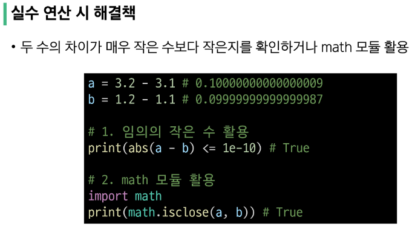

### 지수 표현 방식
- e 또는 E를 사용한 지수 표현
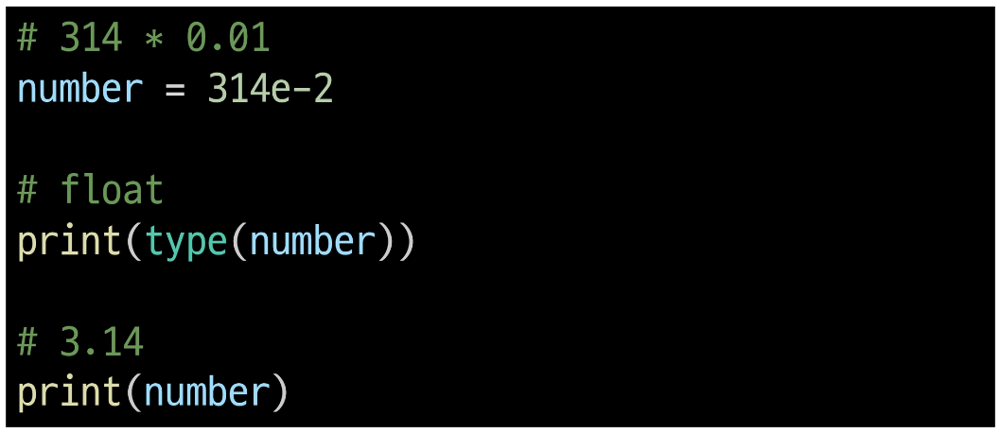

## Sequence Types
- 여러 개의 값들을 **순서대로 나열**하여 저장하는 자료형 (str, list, tuple, range)

### Sequence Types 특징
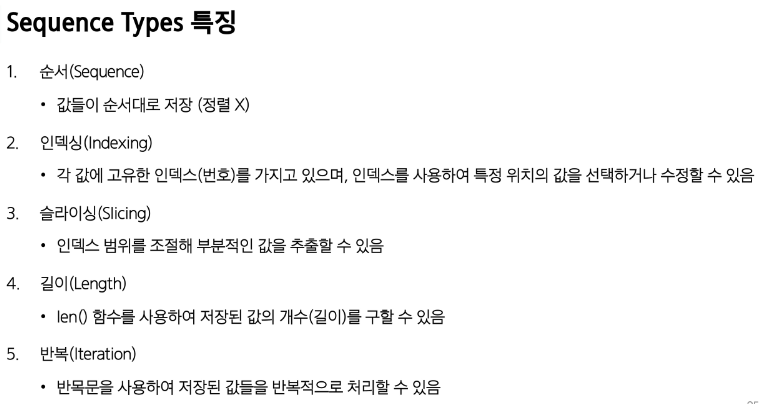

### str : 문자열
- 문자들의 순서가 있는 변경 불가능한 시퀀스 자료형

### 문자열 표현
 - 문자열은 단일 문자나 여러 문자의 조합으로 이루어짐
 - 작은따옴표(') 또는 큰따옴표(")로 감싸서 표현

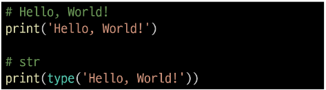

### 중첩 따옴표
 - 따옴표 안에 따옴표를 표현할 경우
    - 작은 따옴표가 들어있는 경우 큰 따옴표로 문자열 생성
    - 큰 따옴표가 들어있는 경우 작은따옴표로 문자열 생성

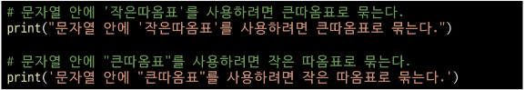

### Escape sequence
 - 역슬래시(backslash) 뒤에 특정 문자가 와서 특수한 기능을 하는 문자 조합
 - 파이썬의 일반적인 문법 규칙을 잠시 탈출한다는 의미

### Escape sequence 예시

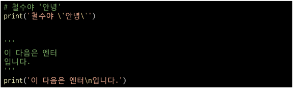

### String Interpolation
- 문자열 내에 변수나 표현식을 삽입하는 방법

### f-string
- 문자열에 f 또는 F 접두어를 붙이고 표현식을 {expression}로 작성하여 문자열에 파이썬 표현식의 값을 삽입할 수 있음

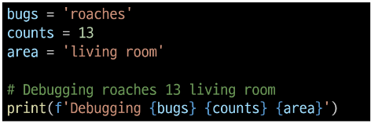

### 문자열의 시퀀스 특징
my_str = 'hello'
1. 인덱싱
print(my_str[1])    # e
2. 슬라이싱
print(my_str[2:4])  # ll
3. 길이
print(len(my_str))  # 5

### 인덱스(index)
시퀀스 내의 값들에 대한 고유한 번호로 각 값의 위치를 식별하는 데 사용되는 숫자

### 슬라이싱(slicing)
 - 시퀀스의 일부분을 선택하여 추출하는 작업
 - 시작 인덱스와 끝 인덱스를 지정하여 해당 범위의 값을 포함하는 새로운 시퀀스를 생성

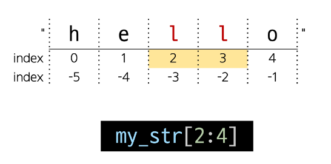

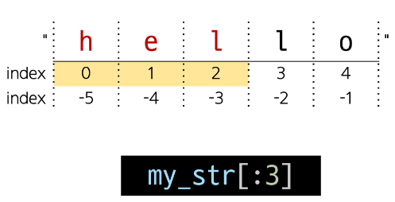

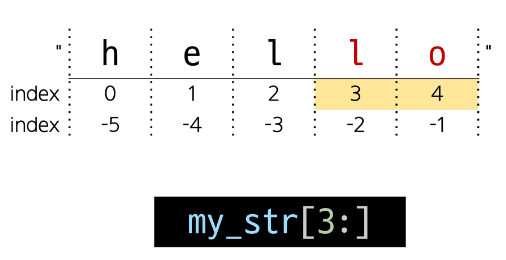

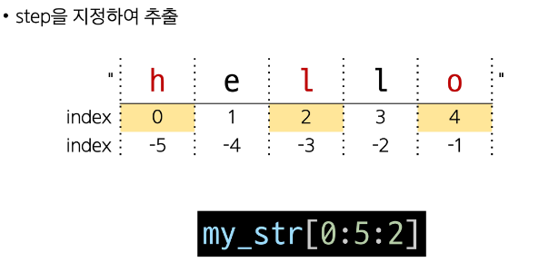

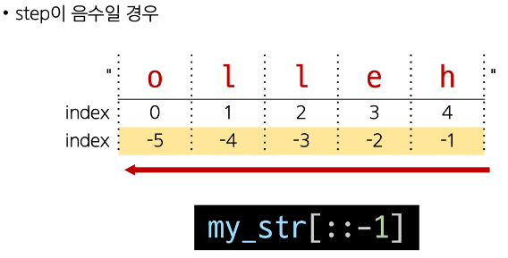

### 문자열은 불변(변경 불가)

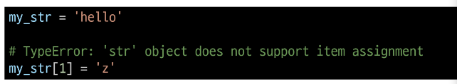
