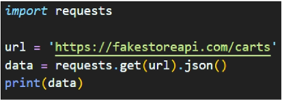
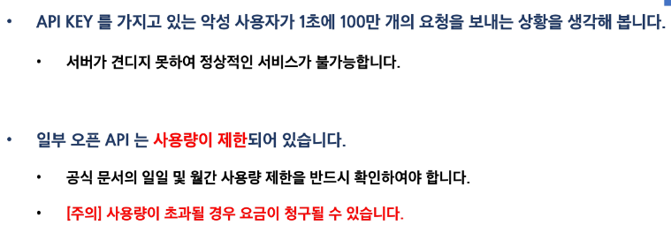
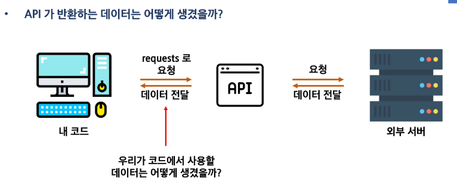
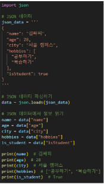
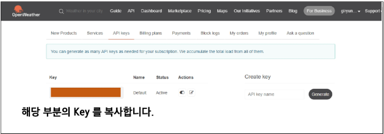
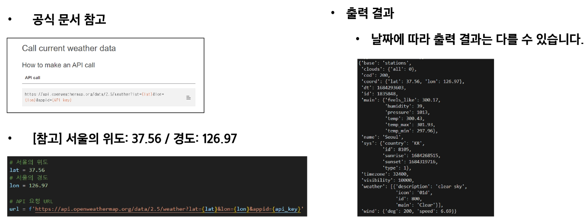
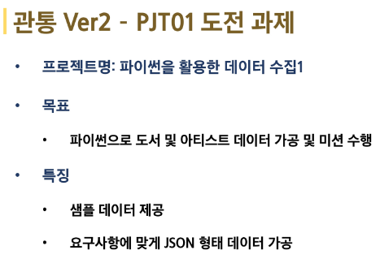

# 관통 프로젝트
## 관통 프로젝트란?
 - 강의 시간에 배운 내용을 모두 포함
 - 추가적인 내용 학습
 - 프로젝트 도전

### 관통 프로젝트를 열심히 해야 하는 이유
 - 본인의 포트폴리오를 만들어나가는 과정

### 진행 방식
 1. 프로젝트 목표 소개
 2. 이론 설명
 3. 강사님들과 함께 실습 진행
 4. 도전 과제 진행

### 도전 과제는 2개의 버전이 존재
 1. 관통 ver 1 : 금융 데이터를 활용한 금융 상품 비교 애플리케이션
 2. 관통 ver.2 Open API와 외부  데이터를 활용한 영화 추천 서비스
 -> 우리가 직접 선택 가능
 (금융 데이터 선택)

### 관통 Ver1(금융 상품 비교 앱) 최종 프로젝트 소개
- SSAFY 10기부터 적용되는 신규 PJT
- 마이뱅크, Bankbook

### 관통 Ver2(영화추천서비스) 최종 프로젝트 소개
- SSAFY 트랙 초기부터 진행하고 있는 유래 깊은 PJT

### 버전 선택
 - 둘 중에 하나 선택 필수
 - 07 PJT 까지는 자유롭게 변경 가능

## 프로젝트를 위한 배경지식
### 챕터의 포인트
1. 목표
2. API 이해하기
3. 날씨 데이터 수집

### 실습 목표
- 파이썬으로, 인터넷에 있는 날씨 정보를 가져와 내가 원하는 정보만 출력

### 날씨 정보
 - 실습 프로젝트를 진행하기 위해선 날씨 데이터가 있어야 합니다.
 - 그러나 직접 데이터를 모으기엔 너무 어렵습니다!
 - 간단하게 인터넷에 있는 데이터를 가져오면 됩니다.
    - 데이터를 가져오는 방법을 이해하기 위해서 반드시 알아야 할 전문용어들이 있습니다.

### 전문용어 이해하기
 - 서버 : 부탁을 받으면 처리해주거나, 부탁대로 원하는 값을 돌려주는 역할을 합니다.
(ex) gitlab, notion 등
 - 클라이언트: 부탁하는 역할입니다.


 - 우리가 네이버 홈페이지에 접속하는 건 다음과 같이 표현할 수 있습니다.
    - 네이버 주소를 입력하면 익히 알고 있는 네이버 화면을 달라고 요청합니다.
    - 서버는 클라이언트가 요청한 네이버 메인 화면을 돌려줍니다.


  
 - 이번 프로젝트에서는 날씨 정보가  필요합니다.
    - 날씨 정보를 가지고 있는 서버가 있습니다.
    - 해당 서버에 날씨 정보를 달라고 요청하면 됩니다.


 - 정리하면 다음과 같습니다.
    - 클라이언트가 정보를 달라고 요청한다.
    - 서버는 클라이언트의 요청에 따라 원하는 정보를 돌려준다.

 - 클라이언트는 어떻게 요청을 보낼 수 있을까요?

### 클라이언트가 서버에 요청하는 두 가지 방법
1. 웹 브라우저(크롬)을 켜서 주소창에 주소(URL)을 입력한다.
2. 서버에 요청하는 파이썬 코드를 작성한다.

### 웹 브라우저(크롬)을 켜서 URL에 접속
 - 크롬을 켜서 주소창에 아래 URL을 입력해보세요
    - https://fakestoreapi.com/carts
 -  예시

### 서버에 정보를 달라는 파이썬 코드를 작성
 - vscode를 켜고 터미널 창을 열어주세요
    - 터미널 창 여는 방법
    - 상단 Terminal 메뉴 + New terminal 클릭
    - 단축기: Ctrl + `(백틱)
 - 아래 명령어를 실행하여 필요한 도구를 설치합니다.
    - requests: 파이썬에서 서버에 요청을 보낼 수 있는 도구
    $ pip install requests
 -  test.py 파일을 만들고, 아래처럼 파이썬 코드르 작성하고 실행해보세요.
 


```
# 변수 사용법
# 파이썬

# 서버로부터 데이터를 가져와보세요
# https://fakestoreapi.com/carts

# 서버로부터 데이터 요청 보내야 함
# 실제로 정상적인지 판단
# -> 보안에 위협
# 출력
# 원하는 형태의 데이터 변환

# 라이브러리 : 남들이 만들어놓은 코드를 가져다가 쓰자!
# 데이터를 가져오는 python 라이브러리 : requests
# 파이썬 패키지 관리: pip
    # 설치 : pip install < 패키지이름 >
    # 목록 확인: pip list

# 내 코드에 다른 패키지를 추가

# func()

# 1. 내 파일에서 검색
# 2. 내장모듈 모아둔 곳 검색

import requests
```

### 파이썬 코드 이해하기
1. url
 - 요청을 보내는 서버의 주소
2. requests.get(url)
 - 해당 서버(url)에 데이터를 달라고 요청을 보내는 함수
3. json()
 - 내부의 데이터를 JSON(파이썬의 딕셔너리와 비슷함) 형태로 변환해주는 함수
 - JSON에 대한 설명은 뒤에서 다를 예정


### 서버는 어떻게 요청을 해석할까
 - 웹 브라우저(크롬)와 파이썬을 통해 서버에 데이터를 요청하는 방법을 알았습니다.
 - 그렇다면, 서버는 어떻게 요청을 이해하고 데이터를 반환할 수 있을까요?
 - 서버에 요청을 보내는 클라이언트는 매우 다양합니다.
    - 클라이언트들은 각자 다른 방식으로 요청을 보낼 것입니다.
 - 서버가 어떻게 모두 해석할 수 있을까요?

### API
 - 클라이언트가 원하는 기능을 수행하기 위해서 서버 측에 만들어놓은 프로그램
    - 기능 예시: 데이터 저장, 조회, 수정, 삭제 등등
 - 서버 측에 특정 주소로 요청이 오면 정해진 기능을 수행하는 API를 미리 만들어둡니다
    - 클라이언트는 서버가 미리 만들어 놓은 주소로 요청을 보냅니다.
 - 중간다리 역할


### 날씨 정보를 제공해주는 API
- 날씨 정보를 수집하기 위해서는 두 가지를 찾아야 합니다.
    - 날씨 정보를 가지고 있는 서버
    - 해당 서버가 제공하는 API

### Open API
 - 외부에서 사용할 수 있도록 무료로 개방된 API
 - 사용법은 공식 문서(Docs)에 명시되어 있습니다.
 - 프로젝트에서 사용되는 API
    - OpenWeatherMap API : 기상 데이터 및 날씨 정보를 제공하는 OpenAPI
    - 금융상품통합비교공시 API: 금융감독원에서 제공하는 금융상품정보를 제공하는 오픈 API

### 오픈 API 특징 및 주의사항
1. 악성 사용자가 100만개의 계정을 생성해 API에 요청을 보내는 상황을 생각해봅시다.
 - 너무 많은 계정에서 동시에 요청을 보내면 서버가 견디기 못합니다.

2. 이러한 문제점을 해결하기 위해 오픈 API는 API KEY를 활용하여 사용자를 확인합니다.

- 사용자 읹으 혹은 회원가입을 하면 API KEY를 발급해줍니다.
- 서버에 요청할 때마다 해당 API KEY를 함께 보내 정상적인 사용자인 것을 확인받습니다.




### Quiz
- 무료로 사용 가능한 API를 OPEN API라고 합니다.
 - 인증된 사용자만 제공된 API를 사용할 수 있습니다.
 - 클라이언트는 원하는 데이터를 요청할 때 서버에게 무엇을 함께 보내어 본인이 인증된 사용자인 것을 학인받을 수 있나요?(HPI KEY)

### 프로젝트 미션 정리
- 파이썬으로
날씨 정보를 제공해주는 서버의 URL을 이용하여 날씨 정보를 가져옵니다.

### JSON
 - API가 반환하는 데이터는 어떻게 생겼을까?



### API가 사용하는 데이터 형식 - JSON
 - JavaScript Object Notiation의 약자 : 직역하면 '자바스크립트 객체 표기법'
 - 데이터를 저장하거나 전송할 때 많이 사용되는 **경량의 텍스트 기반의 데이터 형식**
 - 통신 방법이나 프로그래밍 문법이 아니라 **단순히 데이터를 표현하는 표현 방법 중 하나**
 - 특징
    - 데이터는 중괄호({})로 둘러싸인 키-값 쌍의 집합으로 표현됨
    - 키 = 문자열 / 값 = 다양한 데이터 유형을 가질 수 있다.
    - 값은 쉼표(,)로 구분됨


**파이썬의 dictionary와 똑같음**

### JSON - python 예제
- 파이썬은 JSON을 활용하는 기능을 가지고 있습니다.
- 참고
    - 파싱(paring) : 데이터를 의미 있는 구조로 분석하고 해석하는 과저
    - json.loads(): JSON 형식의 문자열을 파싱하여 python Dictionary로 변환



### Openweathermap API
 - 기상 데이터 및 날씨 정보를 제공하는 오픈 API
 - 전세계 날씨 데이터를 가져와 날씨, 일일 및 시간 별 예보 등 다양한 정보를 얻을 수 있습니다.
 - API 사용량 제한
    - 60 calls/minute
    - 1,000,000 calls/month
https://openweathermap.org/

### Openweathermap API - KEY 발급
1. 사이트 접속 및 회원가입 진행
2. API Keys 탭으로 이동
3. API Key 복사
    - API Key를 복사하여 코드에서 활용합니다.



### Openweathermap API - 사용법 확인
 - 상단 API 탭을 클릭
    - 현재 날씨에 대한 데이터를 사용하기 위해 Current Weather Data의 API doc 클릭


### Openweathermap API - 실습
 - 특정 지역의 현재 날씨에 대한 모든 정보 출력하기
 - 공식 문서 참고



- 서울의 현재 날씨 중 온도만 출력하기
    - 기본적으로 캘빈(K) 온도를 반환합니다.
    - 섭씨 온도 = (캘빈 온도 - 273.15)로 계산할 수 있습니다.
    - 출력 결과
    캘빈 온도: 300.71K
    섭씨 온도: 27.56 ℃(window + .)

 - 서울의 현재 날씨에 대한 설명(description) 데이터만 출력하기
 - 출력 결과
 - '날씨 설명 : clear sky'

 - Json 형태의 데이터를 분석하여 원하는 부분만 가져오도록 구성합니다.

## 도전과제
### 관통 Ver1 - PJT01 도전 과제
- 프로젝트명 : 파이썬을 활용한 API 데이터 수집
- 목표
    - 파이썬으로 정기 예금 데이터 수집 및 미션 수행
- 특징
    - 외부 서버를 활용한 데이터 수집
    - 요구사항에 맞게 JSON 형태 데이터 가공

