# Python 07
## 객체 지향 프로그래밍
### 절차 지향 프로그래밍 (Procedural Programming)
프로그램을 '데이터'와 '절차'로 구성하는 방식의 프로그래밍 패러다임

#@@ 절차 지향 프로그래밍 특징
 - '데이터'와 해당 데이터를 처리하는 '함수(절차)'가 분리되어 있으며, 함수 호출의 흐름이 중요
 - 코드의 순차적인 흐름과 함수 호출에 의해 프로그램이 진행

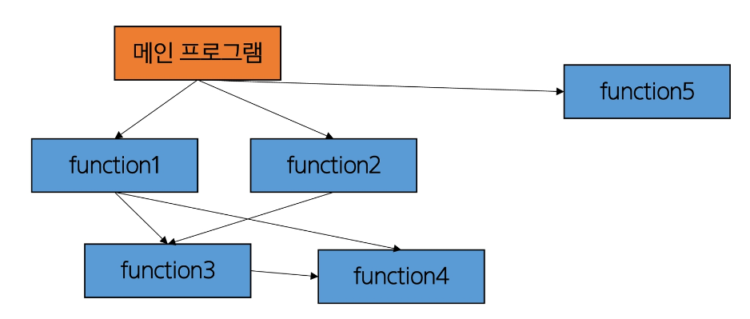

- 실제로 실행되는 내용이 무엇이 무언인가가 중요
- 데이터를 다시 재사용하거나 하기보다는 처음부터 끝까지 실행되는 결과물이 중요한 방식

### 소프트웨어 위기(Software Crisis)
 - 하드웨어의 발전으로 컴퓨터 계산용량과 문제의 복잡성이 급격히 증가함에 따라 소프트웨어에 발생한 충격

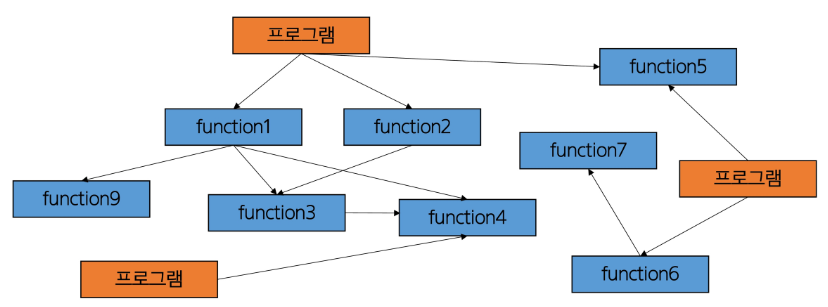

### 객체 지향 프로그래밍(Object Oriented Programming)
데이터와 해당 데이터를 조작하는 메서드를 하나의 객체로 묶어 관리하는 방식의 프로그래밍 패러다임

### 절차 지향 vs 객체 지향

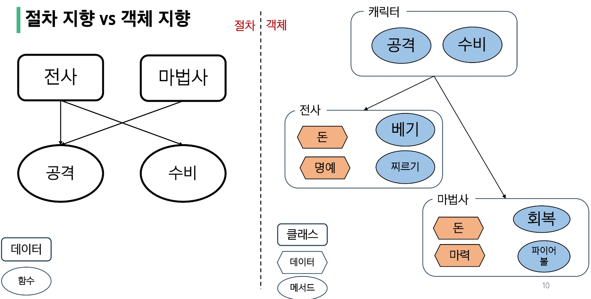
객체에서는 전사와 마법사라는 새로운 클래스가 생김
캐릭터와 전사/마법사 사이에 상하관계가 만들어짐

절차에서는 함수가 메인이지만
객체에서는 클래스가 메인이 되고 메서드가 그 안에 존재하는 형태로 변한다.

#### 절차 지향
 - 데이터와 해당 데이터를 처리하는 함수(절차)가 분리
 - 함수 호출의 흐름이 중요

#### 객체 지향
 - 데이터와 해당 데이터를  처리하는 메서드(메시지)를 하나의 객체(클래스)로 묶음
 - 객체 간 상호작용과 메시지 전달이 중요

### 클래스(class)
파이썬에서 타입을 표현하는 방법
 - 객체를 생성하기 위한 설계도
 - 데이터와 기능을 함께 묶는 방법을 제공

### 객체(object)
클래스에서 정의한 것을 토대로 메모리에 할당된 것
'속성'과 '행동'으로 구성된 모든 것

### 객체 예시

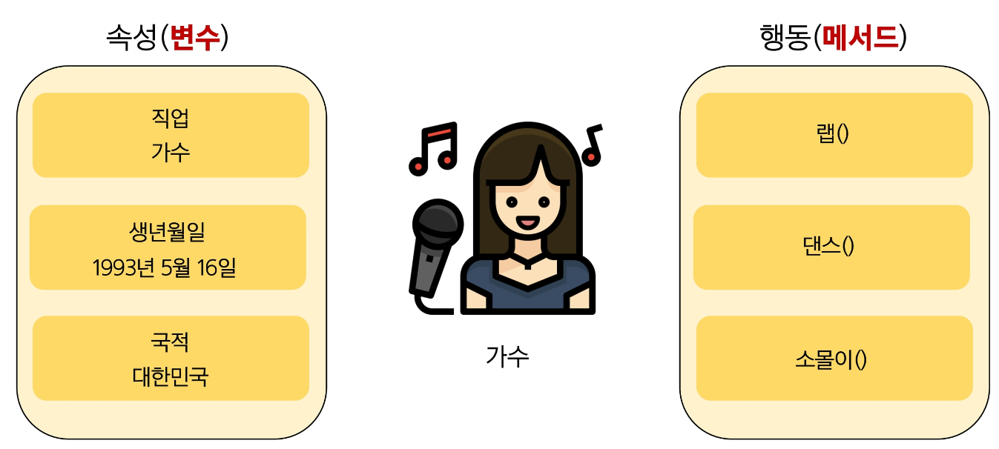

### 클래스와 객체
가수(클래스) -> 객체(아이유, BTS) 등..
설계도 == blueprint(초안)

- 클래스로 만든 객체를 **인스턴스** 라고도 함

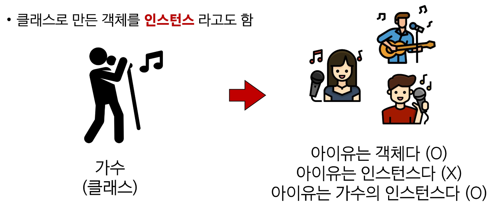

클래스를 만든다 == 타입(list)을 만든다

 - 변수 name의 타입은 str 클래스다.
 - 변수 name은 str 클래스의 인스턴스다.
 - 우리가 사용해왔던 데이터 타입은 사실 모두 클래스였다.

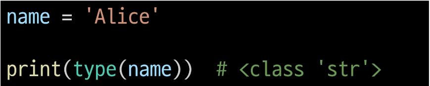

결국 문자열 타입의 변수는 str 클래스로 만든 **"인스턴스"**다.

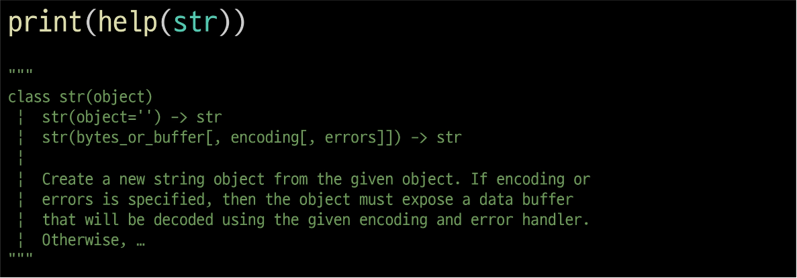

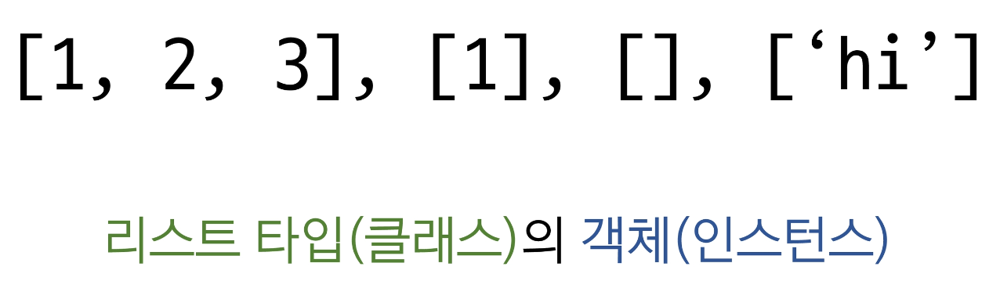

## 인스턴스와 메서드
### 'hello'.upper()
문자열.대문자로()
객체.행동()
인스턴스.메서드()

### [1, 2, 3].sort()
리스트.정렬해()
객체.행동()
인스턴스.메서드()

## 객체
### 하나의 객체(object)는 특정 타입의 인스턴스(instance)이다.
- 123, 900 ,5 는 모두 int의 인스턴스
- 'hello', 'bye'는 모두 string의 인스턴스
- [232,89.1], []은 모두 list의 인스턴스

### 객체의 특징
 - 타입(type): 어떤 연산자(operator)와 조작(method)이 가능한가?
 - 속성(attribute): 어떤 상태(데이터)를 가지는가?
 - 조작법(method): 어떤 행위(함수)를 할 수 있는가?
 - 객체(Object): = 속성(attribute) + 기능(method)

## 클래스
### 클래스
파이썬에서 타입을 표현하는 방법
- 객체를 생성하기 위한 설계도
- 데이터와 기능을 함께 묶는 방법을 제공

### 클래스 구조

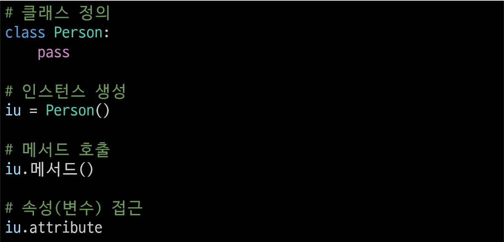
- 클래스를 만들 때는 snake_case가 아닌 Paskal Case로 만든다.
- 소괄호 생략 가능
- 인스턴스 생성(왜냐하면 클래스는 blueprint기 때문에)
- 클래스 내에 메서드를 만들어두면 클래스로 인해 생성한 모든 인스턴스는 메서드 사용 가능

### 클래스 기본 활용

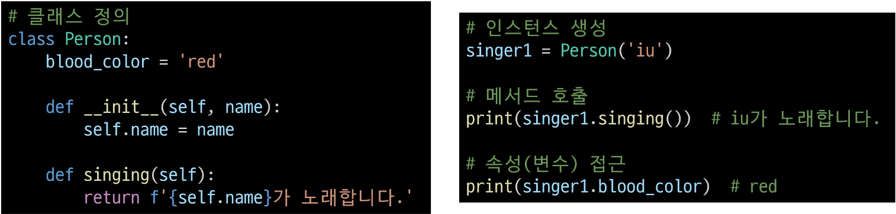

클래스에 메서드가 2개
이 중 __init__은 인스턴스가 사용하는 건 아님

 - 생성자 합수
    - 객체를 생성할 때 자동으로 호출되는 특별한 메서드
    - __init__이라는 이름의 메서드로 정의되며, 객체의 초기화를 담당
    - 생성자 함수를 통해 인스턴스를 생성하고 필요한 초기값을 설정
    - def __init__(self, name):
        self.name = name

 - 인스턴스 변수
    - 인스턴스(객체)마다 별도로 유지되는 변수
    - 인스턴스마다 독립적인 값을 가지며, 인스턴스가 생성될 때마다 초기화됨
    - self.name = name

 - 클래스 변수
    - 클래스 내부에 선언된 변수
    - 클래스로 생성된 모든 인스턴스들이 공유하는 변수
    - blood_color = 'red'

 - 인스턴스 메서드
    - 각각의 인스턴스에서 호출할 수 있는 메서드
    - 인스턴스 변수에 접근하고 수정하는 등의 작업을 수행
    - def singing(self):
        return f'{self.name}가 노래합니다.'

### 인스턴스와 클래스 간의 이름 공간(namespace)
 - 클래스를 정의하면 클래스와 해당하는 이름 공간 생성
 - 인스턴스를 만들면, 인스턴스 객체가 생성되고 **독립적인** 이름 공간 생성
 - 인스턴스에서 특정 속성에 접근하면, 인스턴스 -> 클래스 순으로 탐색
    - 본인에게 해당 속성이 있는 지 탐색 -> 없으면 클래스 탐색

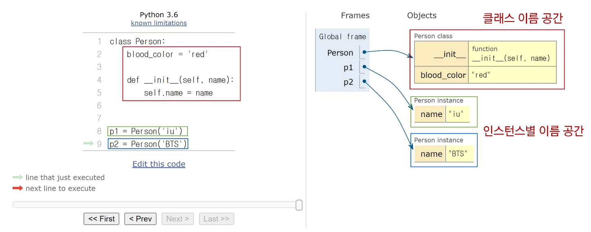

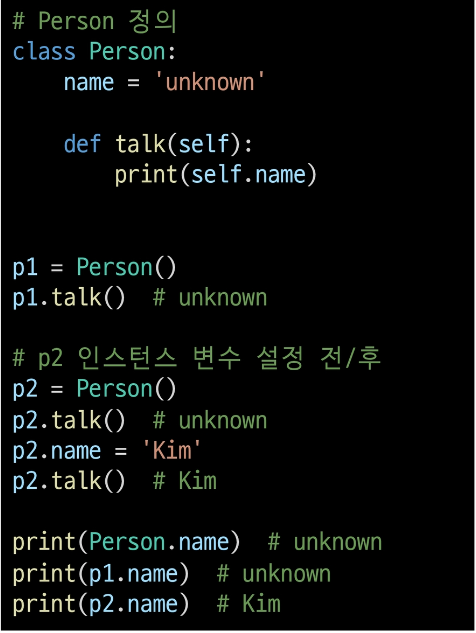

p1은 인스턴스 변수가 정의되어 있지 않아 클래스 변수(unknown)가 출력됨
p2는 인스턴스 변수가 정의되어 인스턴스 변수(Kim)가 출력됨
    - 인스턴스 변수 설정은 .변수로 한다.
    - 아무거나 만들 수 있음 / 본인에게 없는 건 클래스로 찾아올라간다.
Person 클래스의 값이 Kim으로 변경된 것이 아닌 p2 인스턴스 이름 공간에 name이 Kim으로 저장됨.

### 독립적인 이름공간을 가지는 이점
 - 각 인스턴스는 독립적인 메모리 공간을 가지며, 클래스와 다른 인스턴스 간에 서로의 데이터나 상태에 직접적인 접근이 불가능
 - 객체 지향 프로그래밍의 중요한 특성 중 하나로, 클래스와 인스턴스를 모듈화하고 각각의 객체가 독립적으로 동작하도록 보장
 - 이를 통해 클래스와 인스턴스는 다른 객체들과의 상호작용에서 서로 충돌이나 영향을 주지 않으면서 독립적으로 동작할 수 있음
 - 코드의 가독성, 유지보수성, 재사용성을 높이는 데 도움을 줌

### 클래스 변수 활용
- 가수가 몇 명인지 확인하고 싶다면?
    - 인스턴스가 생성될 때마다 클래스 변수가 늘어나도록 설정할 수 있음

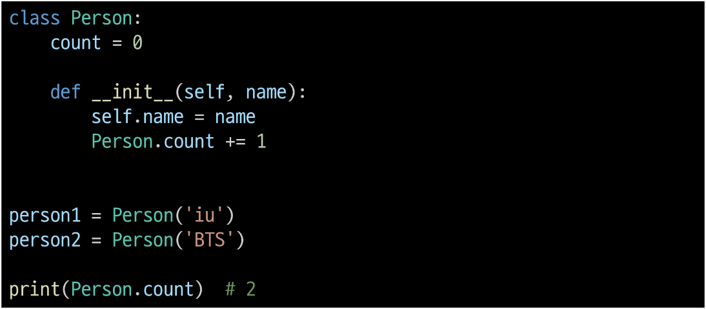

### 클래스 변수와 인스턴스 변수
- 클래스 변수를 변경할 때는 항상 클래스.클래스 변수 형식으로 변경

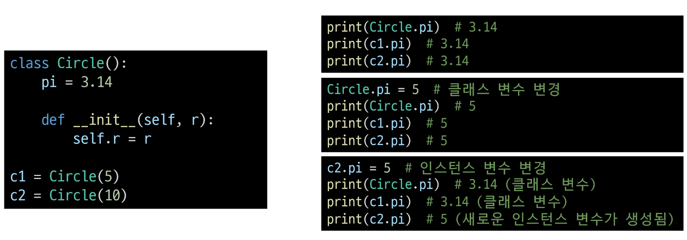

## 메서드
### 메서드 종류
- 인스턴스 메서드
- 클래스 메서드
- 정적 메서드

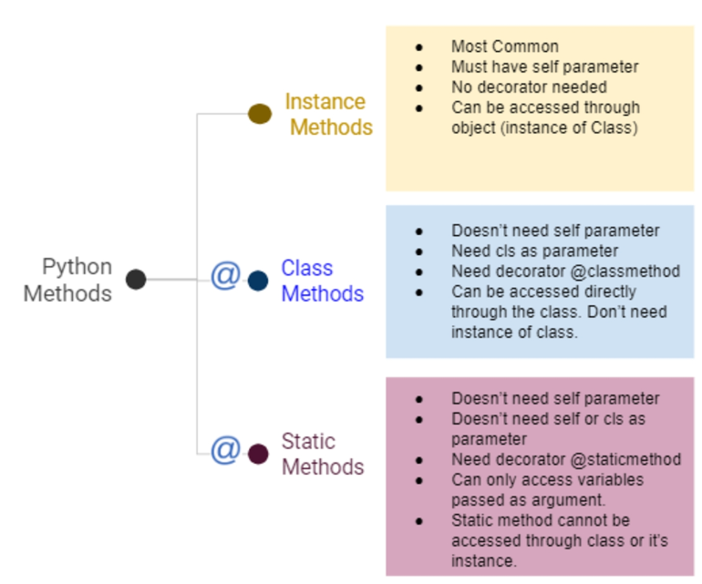

### 인스턴스 메서드(instance method)
클래스로부터 생성된 각 인스턴스에서 호출할 수 있는 메서드
- 인스턴스의 상태를 조작하거나 동작을 수행

### 인스턴스 메서드 구조
- 클래스 내부에 정의디는 메서드의 기본
- '반드시' 첫 번째 매개변수로 **인스턴스 자신(self)**을 전달받음

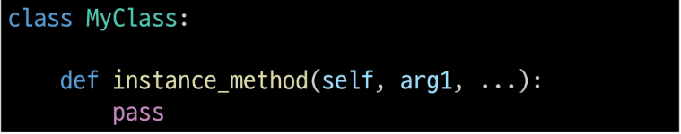