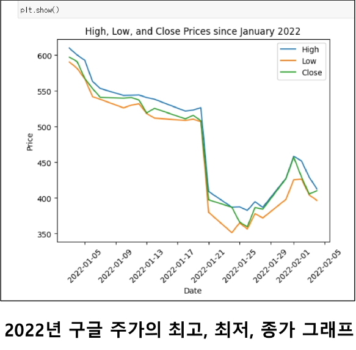
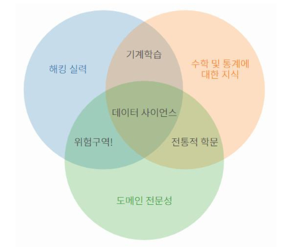
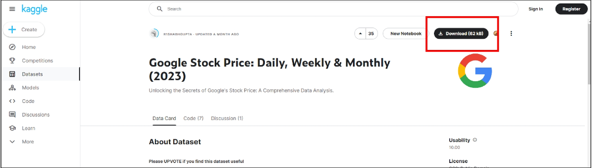
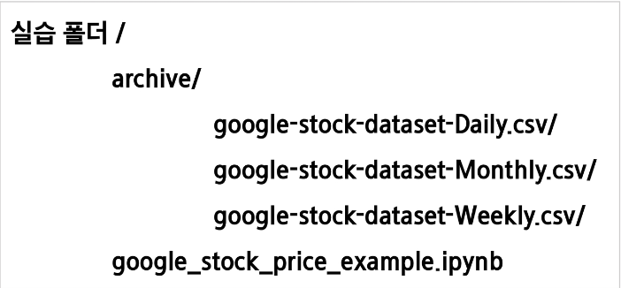
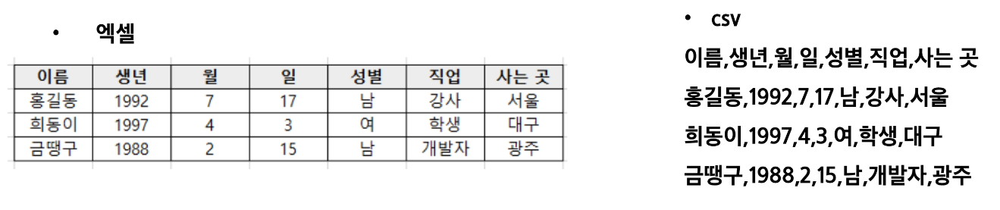

# 02PJT
## 실습 목표
### 프로젝트 목표
- 데이터 사이언스 분야에 대해 이해하기
- 데이터 사이언스에서 자주 사용되는 패키지를 사용해보기

### 학습할 내용 정리
1. Google 주식 데이터를 다운로드 받습니다.
2. 데이터 사이언스에서 자주 사용되는 패키지를 사용하여
3. 원하는 데이터만 뽑아내서 차트로 출력합니다.

### 완성 목표

### 진행 순서
1. 데이터 사이언스 기초 이론 학습
2. 데이터들이 모여 있는 "캐글(Kaggle)"이라는 사이트에서, 실습 데이터 다운로드
    - 구글 넷플릭스 주가 데이터
3. 데이터 사이언스에서 자주 쓰이는 패키지 학습

### 개발 도구
- Python 3.9+
- Jupyter notebook

### [복습] Jupyter notebook이란?
- 데이터 사이언스 작업에 많이 활용되는 파이썬 개발 환경
- 웹 브라우저에서 실행
- 코드 실행, 텍스트 문서 작성, 시각화 등을 하나의 문서에 통합하여 작업 가능
- 데이터 사이언스 작업에 많이 쓰이는 이유
    - 셀 단위 코드 실행으로 결과를 바로 확인할 수 있음
    - 문서를 작성할 수 있는 마크다운 기능을 제공
    - 개별적인 코드 블록을 실행할 수 있음

### 데이터 사이언스
 - 다양한 데이터로부터 새로운 지식과 정보를 추출하기 위해 과학적 방법론, 프로세스, 알고리즘, 시스템을 동원하는 융합 분야
 - 컴퓨터 과학, 통계학, 수학 등 다양한 학문의 원리와 기술을 활용

### 데이터 사이언스 프로세스
 - 필요한 정보를 추출하는 5가지 단계
    1. 문제 정의: 해결하고자하는 문제 정의
    2. 데이터 수집: 문제 해결에 필요한 데이터 수집
    3. 데이터 전처리(정제): 실질적인 분석을 수행하기 위해 데이터를 가공하는 단계
        - 수집한 데이터의 오류 제거(결측치, 이상치), 데이터 형식 변환 등
    4. 데이터 분석: 전처리가 완료된 데이터에서 필요한 정보를 추출하는 단계
    5. 결과 해석 및 공유: 의사 결정에 활용하기 위해 결과를 해석하고 시각화 후 공유하는 단계

## 데이터 사이언스 프로세스 실습
### 프로세스 1. 문제 정의
 - 실습에서 해결하고자 하는 문제는 다음과 같습니다.
 - 구글의 주식 가격은 앞으로 어떻게 될까

### 프로세스 2. 데이터 수집
 - 주식 가격을 분석하기 위해서는 기간별 주식 가격에 대한 데이터가 필요합니다.
 - 데이터 수집은 다양한 기술과 방법을 활용할 수 있습니다.
    - 웹 스크래핑(Web Scraping): 웹 페이지에서 데이터를 추출하는 기술
    - 웹 크롤링(Web Crawling): 웹 페이지를 자동으로 탐색하고 데이터를 수집하는 기술
    - Open API 활용: 공개된 API를 통해 데이터를 수집
    - 데이터 공유 플랫폼 활용: 다양한 사용자가 데이터를 공유하고 활용할 수 있는 온라인 플랫폼
        - 종류: 캐클(Kaggle), Data.world, 데이콘(Dacon), 공공데이터포털 등

### 프로세스 2. 데이터 수집 - 캐글(Kaggle)
- 데이터 분석 경진대회 플랫폼
- 기업 및 단체에서 데이터와 해결 과제를 등록하면, 데이터 과학자들이 이를 해결하는 방법을 개발하고 경쟁할 수 있는 플랫폼
- 경진 대회, 데이터셋 공유, 토론 등의 기능이 가능하며 많은 데이터 과학자와 분석가들이 활용함
- 실습을 위해 캐글의 구글 주가 데이터를 다운로드 받아 활용합니다.

- 회원가입
    - [Kaggle](https://www.kaggle.com/)

- Google stock Price 검색
    - 실습에 활용할 데이터는 "Google Stock Price: Weekly & Monthly (2023)" 입니다.
    - 데이터셋 요약: 2013-05-01부터 최근까지 일/주/월 데이터

- 데이터 다운로드
    - 우측 상단의 Download 버튼을 클릭하여 데이터를 다운로드 받습니다.

- 압축 해제 후 실습을 진행할 폴더에 저장합니다.
- 파일 구조를 다음과 같이 만들어 줍니다.

### [참고] csv란?
 - 몇 가지 필드를 쉼표(,)로 구분한 텍스트 데이터 및 텍스트 파일
 - 일반적으로 표 형식의 데이터를 CSV 형태로 많이 사용
 - 저장, 전송 및 처리 속도가 빠르며, 처리 가능한 프로그램이 다양합니다.
 - 예시
    

### 프로세스 3. 데이터 전처리(정제)
 - 데이터 전처리 단계를 분석을 진행하기 전 데이터를 정제하는 단계입니다.
 - 다음과 같은 과정을 포함합니다.
    - 불완전하거나 오류가 있는 데이터를 제거하여 데이터의 품질을 개선
    - 중복 데이터 제거
    - 분석하기 적절한 형식으로 데이터를 변환
 - 데이터 전처리 및 분석에 사용되는 파이썬 패키지
    - Numpy, Pandas, Matplotlib

### 자주 활용되는 파이썬 패키지
 - 데이터 사이언스에서 가장 많이 사용되는 3종 패키지입니다. 반드시 알아두어야 합니다.
 - 데이터 처리 및 데이터 분석
    - Numpy: 수학 계싼용 패키지. Pandas와 Matplotlib를 사용하기 위해 활용되는 패키지
    - Pandas: 원하는 데이터만 추출하거나 데이터를 분석할 때 활용되는 패키지
 - 데이터 시각화
    - Matplotlib: 그래프를 그려주는 패키지

### Numpy
 - 다차원 배열을 쉽게 처리하고 효율적으로 사용할 수 있도록 지우너하는 파이썬 패키지
 - 장점
    - Numpy 행렬 연산은 데이터가 많을수록 Python 반복문에 비해 훨씬 빠르다.
    - 다차원 행렬 자료 구조를 제공하여 개발하기 편하다.
 - 특징
    - CPython(공식 사이트의 Python)에서만 사용 가능
    - 행렬 인덱싱(Array Indexing) 기능 제공
 - 실습 파일: 1. Numpy_Basic.ipynb

### Pandas
 - Numpy의 한계
    - 유연성(데이터에 레이블을 붙이거나, 누락된 데이터로 작업)이 부족함
    - 그룹화, 피벗 등 구조화가 부족함
 - Pandas는 마치 프로그래밍 버전의 엑셀을 다루듯 고성능의 데이터 구조를 만들 수 있음
 - Numpy 기반으로 만들어진 패키지로, Series(1차원 배열)과 DataFrame(2차원 배열)이라는 효율적인 자료구조 제공
 - 실습 파일: 2.Pandas_Basic.ipynb / 3.Pandas_Advanced.ipynb

### Matplotlib
 - Python에서 데이터 시각화를 위해 가장 널리 사용되는 라이브러리
 - 다양한 종류의 그래프와 도표를 생성하고 데이터를 시각적으로 표현할 수 있습니다.
 - 실습 파일: 4.matplotlib_basic.ipynb

### 실습
 - 캐글을 활용하여 데이터를 다운로드 받아 활용합니다.
    - 데이터셋: "Google Stock Price: Daily, Weekly & Monthly (2023)(구글 주식 데이터)"
    - 데이터셋 요약: 2013-05-01~최근까지의 일/주/월 별 데이터
 - 실습 파일명: google_stock_price_example.ipynb
 - 데이터 전처리 및 시각화 연습

### 관통 Ver1 - PJT02 도전 과제
 - 프로젝트명: 파이썬과 Pandas를 사용한 데이터 처리
 - 목표
    - 넷플릭스 주가 데이터 분석
 - 특징
    - 데이터 사이언스  프로세스 활용
    - 캐글을 통해 데이터 다운로드

### API를 활용한 데이터 수집(실습)
 1. Dog API 사용: requests Library를 이용하여 파이썬에서 API를 사용해봅시다.
 이를 이용하여 강아지 사진의 URL을 받아옵니다.

### API를 활용한 데이터 수집(실습&도전)
 2. 알라딘 문고 API를 사용하여 파이썬에서 도서 정보를 받아와 요구사항에 맞도록 가공합니다.

### API를 활용한 데이터 수집(도전)
 3. Spotify 서비스의 API를 사용하여, 파이썬으로 음악 정보를 가져와 요구사항에 맞도록 가공합니다.

### 관통 Ver2 - PJT02 도전 과제
- 프로젝트명: 파이썬을 활용한 데이터 수집2
- 목표:
    - 파이썬으로 도서 및 아티스트 데이터 수집 및 가공을 통한 미션 수행
- 특징:
    - 외부 API를 활용한 데이터 수집 및 가공 복습
    - 요구사항에 맞게 JSON 형태 데이터 가공