## 카운팅 정렬(counting sort)
### 항목들의 순서를 결정하기 위해 집합에 각 항목이 몇 개씩 있는지 세는 작업을 하여, 선형 시간에 정렬하는 효율적인 알고리즘

### 제한 사항
 - **정수**나 **정수로 표현할 수 있는 자료**에 대해서만 적용 가능: 각 항목의 발생 회수를 기록하기 위해, 정수 항목으로 인덱스되는 카운트들의 배열을 사용하기 때문이다.
 - 카운트들을 위한 충분한 공간을 할당하려면 집합 내의 가장 큰 정수를 알아야 한다.

### 시간 복잡도
 - O(n+k): n은 리스트길이, k는 정수의 최대값

### [0,4,1,3,1,2,4,1]을 카운팅 정렬하는 과정
### 1단계
 - Data에서 각 항목들의 발생 회수를 세고, 정수 항목들로 직접 인덱스되는 카운트 배열 counts에 저장한다.

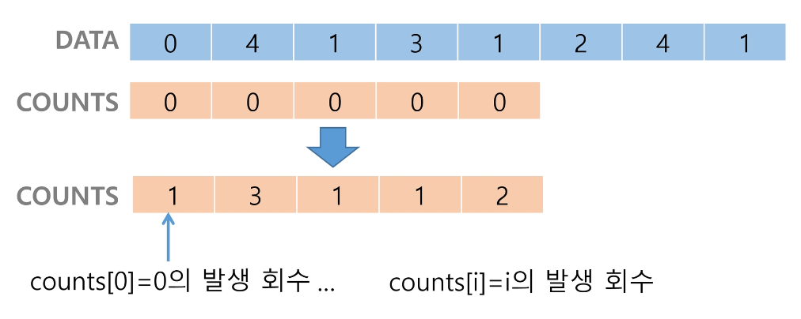

 - 정렬된 집합에서 각 항목의 앞에 위치할 항목의 개수를 반영하기 위해 counts의 원소를 조정한다.

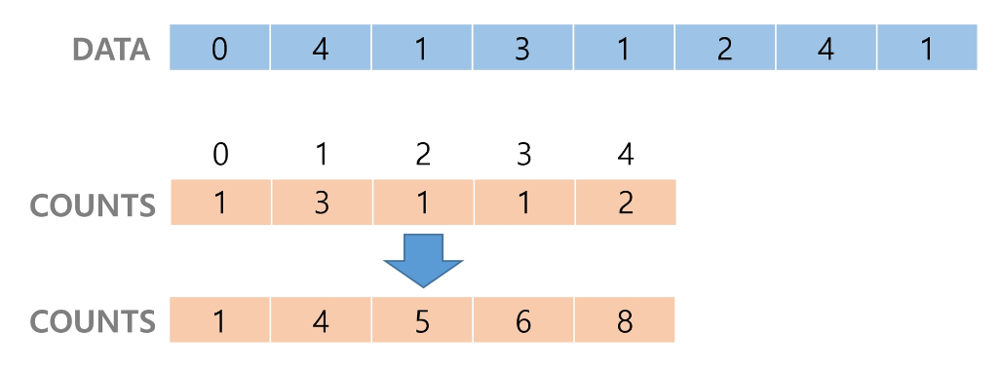
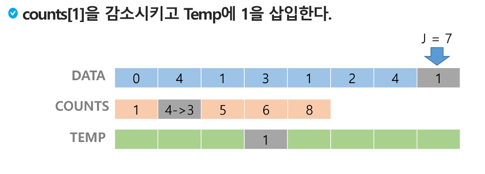
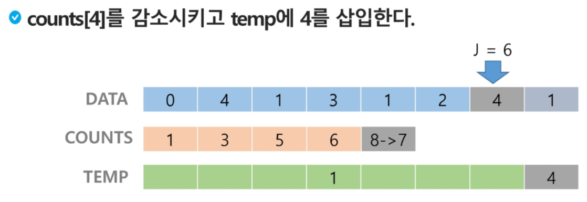
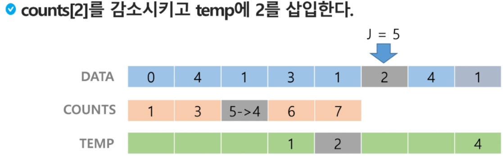
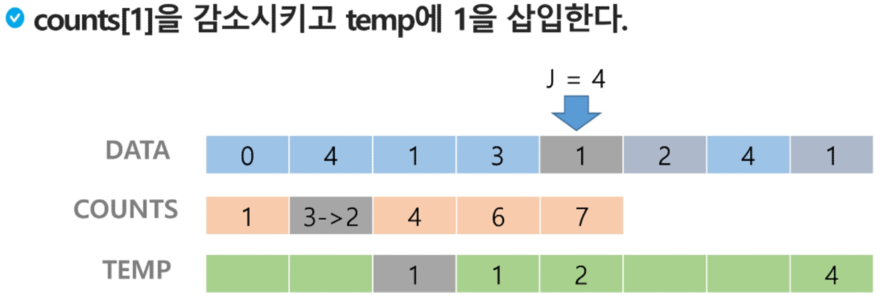
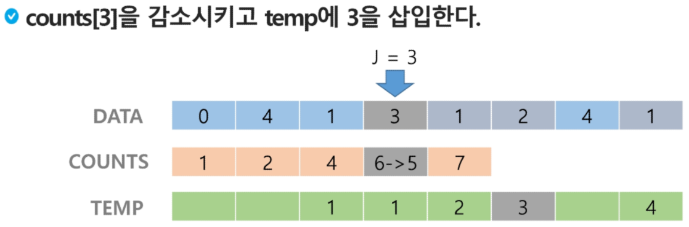
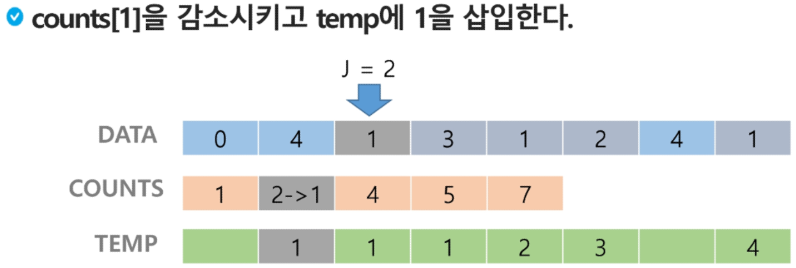
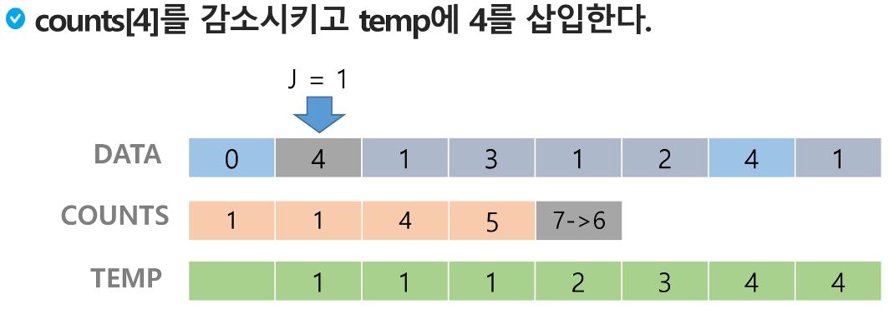
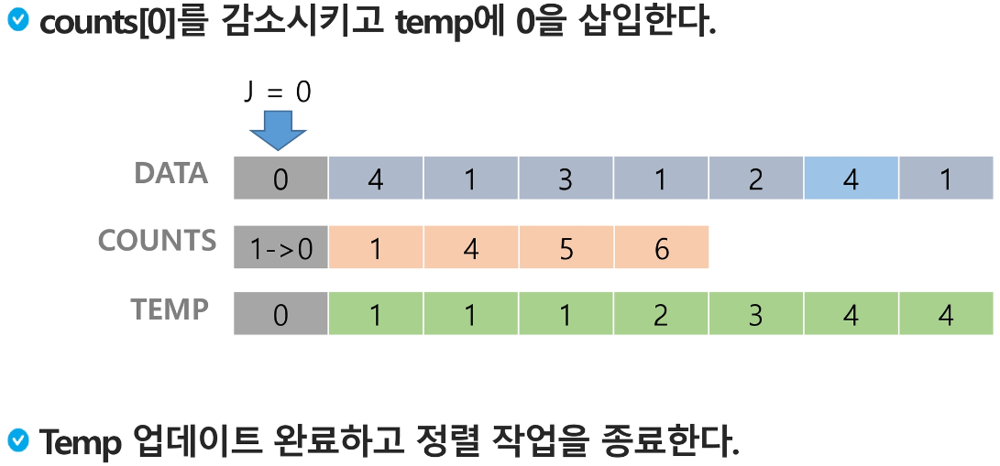
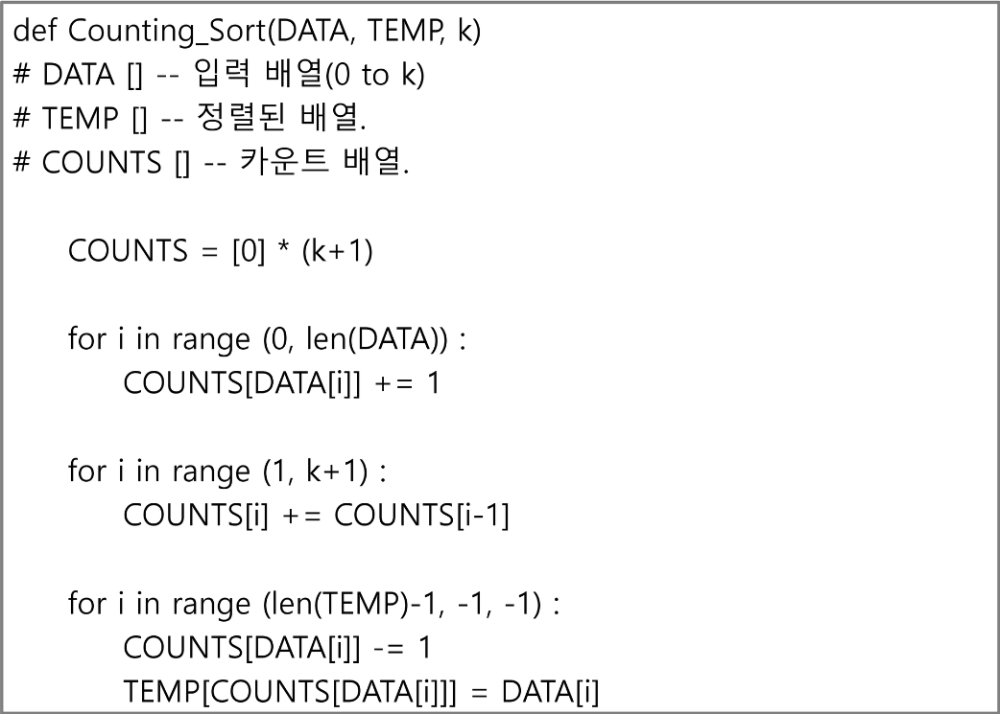

### 학습한 정렬 알고리즘의 특성을 다른 정렬들과 비교해보자.

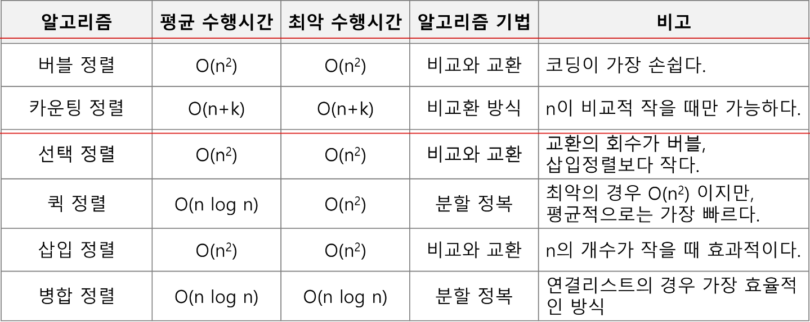

## Baby-gin Game
### 설명
 - 0~9 사이의 숫자 카드에서 임의의 카드 6장을 뽑았을 때, 3장의 카드가 연속적인 번호를 갖는 경우를 run이라 하고, 3장의 카드가 동일한 번호를 갖는 경우를 triplet이라고 한다.
 - 그리고 6장의 카드가 run과 triplet로만 구성된 경우를 baby-gin으로 부른다.
 - 6자리의 숫자를 입력 받아 baby-gin 여부를 판단하는 프로그램을 작성하라.

### 입력 예시
 - 667767은 두 개의 triplet이므로 baby-gin이다.(666,777)
 - 054060은 한 개의 triplet과 한 개의 run이므로 baby-gin이다.(000, 456)
 - 101123은 한 개의 triplet이 존재하나 023은 run이 아니므로 baby-gin이 아니다.
 123 / 011로 나누어도 마찬가지

### 6자리의 숫자를 입력 받아 어떻게 baby-gin 여부를 찾을 것인가?

#### 완전 검색 방법은 문제의 해법으로 생각할 수 있는 모든 경우의 수를 나열해보고 확인하는 기법이다.

#### Brute-force 혹은 generate -and-test 기법이라고도 불리운다.

#### 모든 경우의 수를 테스트한 후, 최종 해법을 도출한다.

#### 일반적으로 경우의 수가 상대적으로 작을 때 유용하다.

#### 모든 경우의 수를 생성하고 테스트하기 때문에 수행 속도는 느리지만, 해답을 찾아내지 못할 확률이 작다.

#### 자격검정평가 등에서 주어진 문제를 풀 때, 우선 완전 검색으로 접근하여 해답을 도출한 후 성능 개선을 위해 다른 알고리즘을 사용하고 해답을 확인하는 것이 바람직하다.

## 완전 검색을 활용한 Baby-gin 접근
### 고려할 수 있는 모든 경우의 수 생성하기
 - 고려할 수 있는 모든 경우의 수 생성하기
 - 6개의 숫자로 만들 수 있는 모든 숫자 나열(중복 포함)
 - ex) 입력으로 [2,3,5,7,7,7]을 받았을 경우, 아래와 같이 순열을 생성할 수 있다.

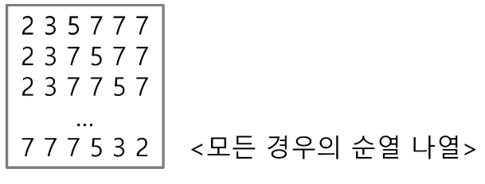

### 해답 테스트하기
 - 앞의 3자리와 뒤의 3자리를 잘라, run과 triplet 여부를 테스트하고 최종적으로 baby-gin을 판단한다.

### 순열(Permutation)
 - 서로 다른 것들 중 몇 개를 뽑아서 한 줄로 나열하는 것

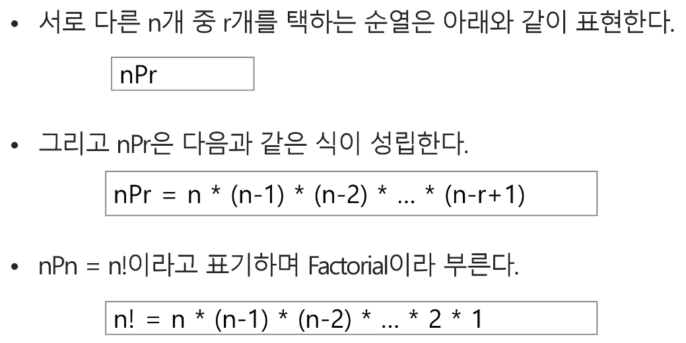

### {1,2,3}을 포함하는 모든 순열을 생성하는 함수

### 탐욕(Greedy) 알고리즘
 - 탐욕 알고리즘은 최적해를 구하는 데 사용되는 근시안적인 방법
 - 여러 경우 중 하나를 결정해야 할 때마다 그 순간에 최적이라고 생각되는 것을 선택해 나가는 방식으로 진행하여 최종적인 해답에 도달한다.
 - 각 선택의 시점에서 이루어지는 결정은 지역적으로는 최적이지만, 그 선택들을 계속 수집하여 최종적인 해답을 만들었다고 하여, 그것이 최적이라는 보장은 없다.
 - 일반적으로, 머릿속에 떠오르는 생각을 검증 없이 바로 구현하면 Greedy 접근이다.

### 탐욕 알고리즘의 동작 과정
 1) 해 선택: 현재 상태에서 부분 문제의 최적 해를 구한 뒤, 이를 부분해 집합(Solution Set)에 추가한다.
 2) 실행 가능성 검사: 새로운 부분해 집합이 실행 가능한지를 확인한다. 즉, 문제의 제약 조건을 위반하지 않는지를 검사한다.
 3) 해 검사: 새로운 부분해 집합이 문제의 해가 되는지를 확인한다. 아직 전체 문제의 해가 완성되지 않았다면 1)의 해 선택부터 다시 시작한다.

### 거스름돈 줄이기
 - "어떻게하면 손님에게 거스름돈으로 주는 지폐와 동전의 개수를 최소한으로 줄일 수 있을까?"

 1) 해 선택: 여기에서는 멀리 내다볼 것 없이 가장 좋은 해를 선택한다. 단위가 큰 동전으로만 거스름돈을 만드면 동전의 개수가 줄어드므로 현재 고를 수 있는 가장 단위가 큰 동전을 하나 골라 거스름돈에 추가한다.

 2) 실행 가능성 검사: 거스름돈이 손님에게 내드려야 할 액수를 초과하는지 확인한다. 초과한다면 마지막에 추가한 동전을 거스름돈에서 빼고, 1)로 돌아가서 현재보다 한 단계 작은 단위의 동전을 추가한다.

 3) 해 검사: 거스름돈 문제의 해는 당연히 거스름돈이 손님에게 내드려야 하는 액수와 일치하는 셈이다. 더 드려도, 덜 드려도 안 되기 때문에 거스름돈을 확인해서 액수에 모자르면 다시 1)로 돌아가서 거스름돈에 추가할 동전을 고른다.

### Baby-gin을 완전검색 아닌 방법으로 풀어보자
 - 6개의 숫자는 6자리의 정수 값으로 입력된다.
 - counts 배열의 각 원소를 체크하여 run과 triplet 및 baby-gin 여부를 판단한다.

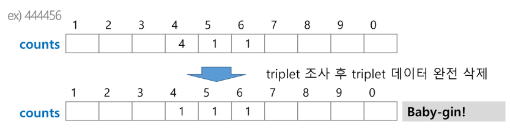
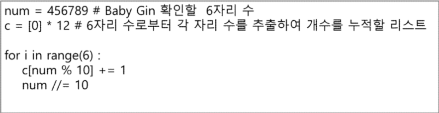
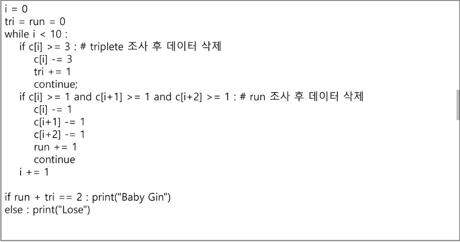

### 입력받은 숫자를 정렬한 후, 앞뒤 3자리씩 끊어서 run 및 triplet을 확인하는 방법을 고려할 수도 있다.

ex) [6,4,4,5,4,4]
    - 정렬하여 [4,4,4,4,5,6]을 얻어내면 쉽게 baby-gin을 확인할 수 있다.
    [1,2,3,1,2,3]
    - 정렬하면 [1,1,2,2,3,3]로서, 오히려 baby-gin 학인을 실패할 수 있다.

### 위의 예처럼, 탐욕 알고리즘적인 접근은 해답을 찾아내지 못하는 경우도 있으니 유의해야 한다. 