# APS 기본
## 배열 2 (Array 2)
## 2차원 배열
### 2차원 배열의 선언
 - 1차원 List를 묶어놓은 List
 - 2차원 이상의 다차원 List는 차원에 따라 Index를 선언
 - 2차원 List의 선언 : 세로길이(행의 개수), 가로길이(열의 개수)를 필요로 함
 - Python에서는 데이터 초기화를 통해 변수선언과  초기화가 가능함

arr = [[0, 1, 2, 3],[4, 5, 6, 7]] (2차 4열의 2차원 List)

[참고]
3
123
456
789

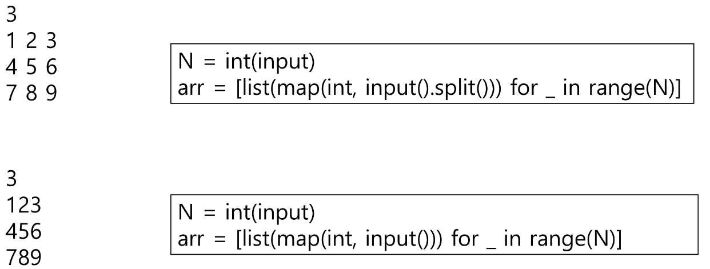

### 배열 순회
 - n X m 배열의 n * m개의 모든 원소를 빠짐없이 조사하는 방법

### 행 우선 순회

```
# i행의 좌표
# j열의 좌표
for i in range(n):
    for j in range(m):
        for(array[i][j])
```

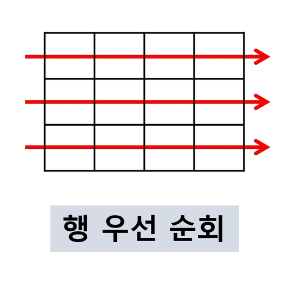

### 열 우선 순회

```
# i행의 좌표
# j열의 좌표

for j in range(m):
    for i in range(n):
        for(array[i][j])
```
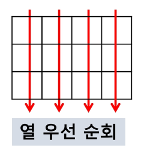

### 지그재그 순회

```
# i행의 좌표
# j행의 좌표
for i in range(n):
    for j in range(m):
        f(array[i][j + (m-1-2*j) * (i % 2)])
```

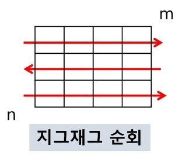

### 실제 예시

```
import numpy as np
arr = [[j for j in range(11)] for i in range(10)]
# print(array)
arr[3][2] = 100
np_arr = np.array(arr)
print(np_arr)

[[  0   1   2   3   4   5   6   7   8   9  10]
 [  0   1   2   3   4   5   6   7   8   9  10]
 [  0   1   2   3   4   5   6   7   8   9  10]
 [  0   1 100   3   4   5   6   7   8   9  10]
 [  0   1   2   3   4   5   6   7   8   9  10]
 [  0   1   2   3   4   5   6   7   8   9  10]
 [  0   1   2   3   4   5   6   7   8   9  10]
 [  0   1   2   3   4   5   6   7   8   9  10]
 [  0   1   2   3   4   5   6   7   8   9  10]
 [  0   1   2   3   4   5   6   7   8   9  10]]
```

### 델타를 이용한 2차 배열 탐색
 - 2차 배열의 한 좌표에서 4방향의 인접 배열 요소를 탐색하는 방법
 - 인덱스 (i, j)인 칸의 상하좌우 칸(nj, nj)

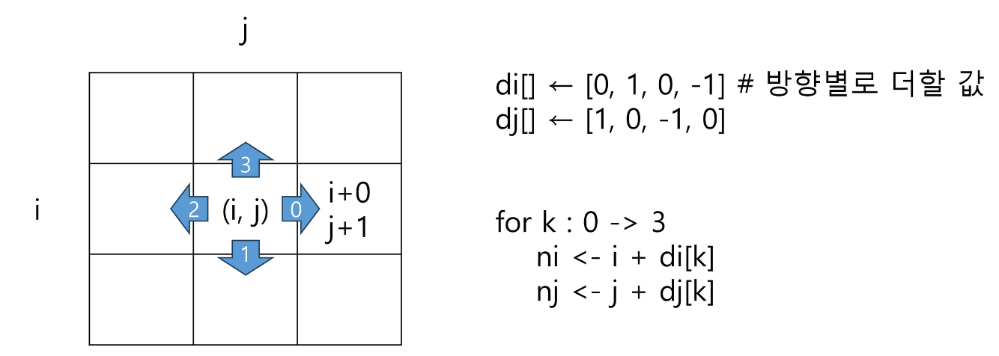

di[] = [0, 1, 0, -1]
dj[] = [1, 0, -1, 0]
왼쪽부터 1항부터 (i,j) 조합하면
(0,1) : 행은 그대로 열은 하나 뒤로 -> 우측이동
(1,0) : 행은 한 칸 내려가고 열은 그대로 -> 하방이동
(0,-1) : 행은 그대로 열은 하나 앞으로 -> 좌측이동
(-1,0) : 행은 한 칸 위로 열은 그대로 -> 상방이동

 - 2차 배열의 한 좌표에서 4방향의 인접 배열 요소를 탐색하는 방법

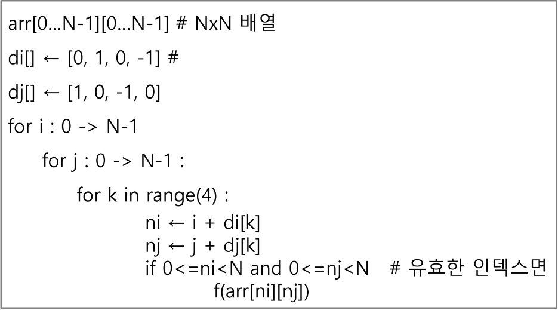

### 전치 행렬

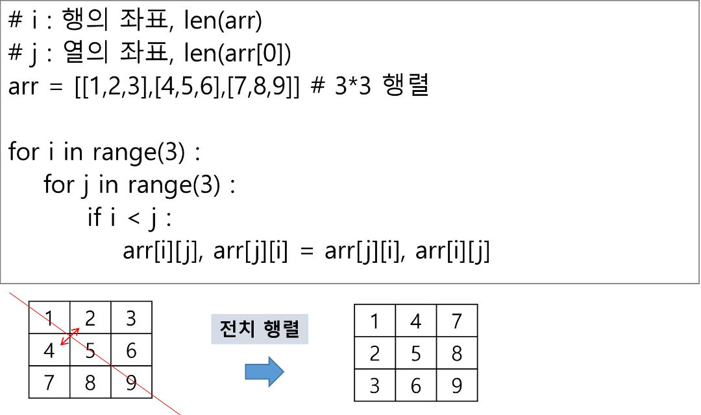

### <연습문제 1-1>
 - 5 X 5 2차 배열에 25개의 숫자를 저장하고,
 - 대각선 원소의 합을 구하시오. 대각선 원소는 다음과 같은 위치의 원소를 나타낸다.

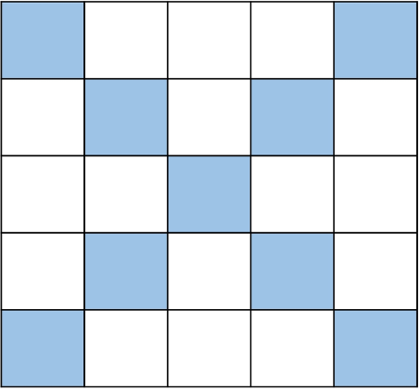

### <연습문제 1-2>

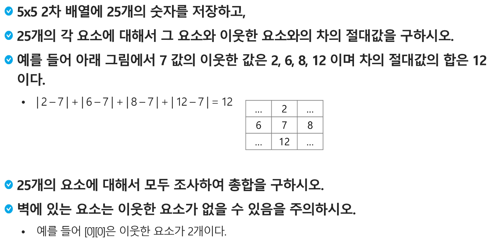

### 부분집합 합(Subset Sum) 문제
 - 유한 개의 정수로 이루어진 집합이 있을 때, 이 집합의 부분집합 중에서 그 집합의 원소를 모두 더한 값이 0이 되는 경우가 있는지를 알아내는 문제

 - 예를 들어 [-7, -3, -2, 5, 8]라는 집합이 있을 때, [-3, -2, 5]는 이 집합의 부분집합이면서 (-3)+(-2)+5 = 0이므로 이 경우의 답은 참이 된다.

### 부분집합 생성하기
 - 완전검색 기법으로 부분집합 합 문제를 풀기 위해서는, 우선 집합의 모든 부분집합을 생성한 후에 각 부분집합의 합을 계산해야 한다.

 - 주어진 집합의 부분집합을 생성하는 방법에 대해서 생각해보자

### 부분집합의 수
 - 집합의 원소가 n개일 때, 공집합을 포함한 부분집합의 수는 2 ** n개이다.
 - 이는 각 원소를 부분집합에 포함시키거나 포함시키지 않는 2가지 경우를 모든 원소에 적용한 경우의 수와 같다.

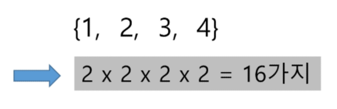

### 부분집합 생성하기
 - 각 원소가 부분집합에 포함되었는지를 loop 이용하여 확인하고 부분집합을 생성하는 방법

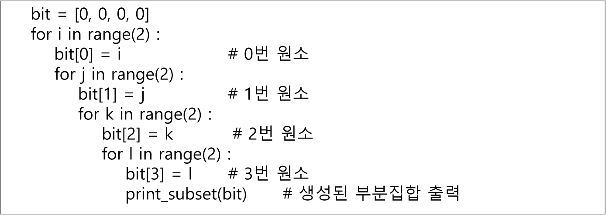

## 비트 연산자

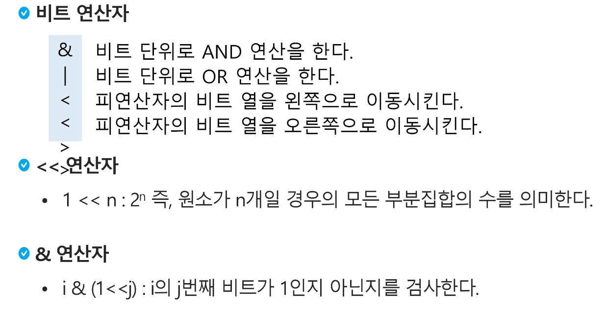

### 보다 간결하게 부분집합을 생성하는 법
- Python 코드 예

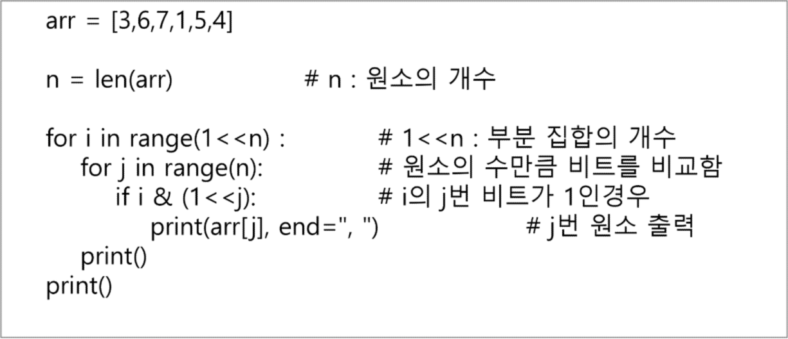

## <연습문제 2>
### 부분집합 합 문제 구현하기
 - 10개의 정수를 입력받아 부분집합의 합이 0이 되는 것을 존재하는지를 계산하는 함수를 작성해보자
 - -7, -5, 2, 3, 8, -2, 4, 6, 9
 