# Queue 2
## BFS(Breadth First Search)
### 그래프를 탐색하는 방법에는 크게 두 가지가 있음
 - 깊이 우선 탐색(Depth First Search, DFS)
 - 너비 우선 탐색(Breadth First Search, BFS)

### 너비우선탐색은 탐색 시작점의 인접한 정점들을 먼저 모두 차례로 방문한 후에, 방문했던 정점을 시작점으로 하여 다시 인접한 정점들을 차례로 방문하는 방식

### 인접한 정점들에 대해 탐색을 한 후 차례로 다시 너비우선탐색을 진행해야 하므로, 선입선출 형태의 자료구조인 큐를 활용함

### BFS는 예제 그래프를 아래와 같은 순서로 탐색함
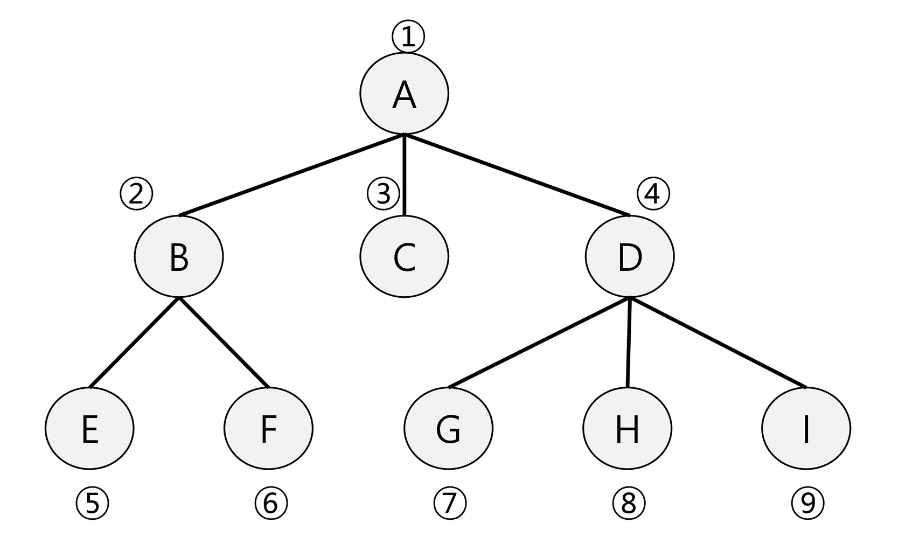

### 입력 파라미터: 그래프 G와 탐색 시작점 v
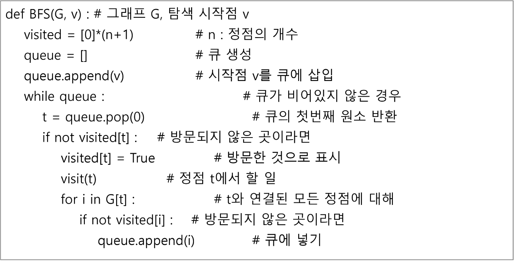

### 초기상태
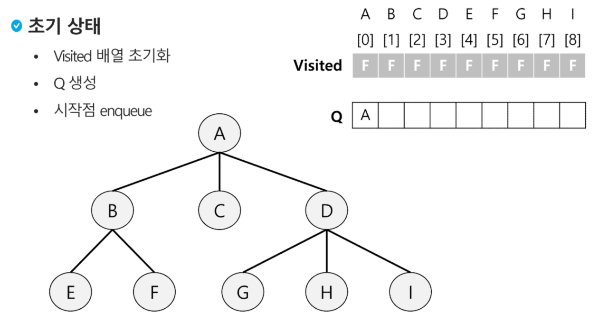
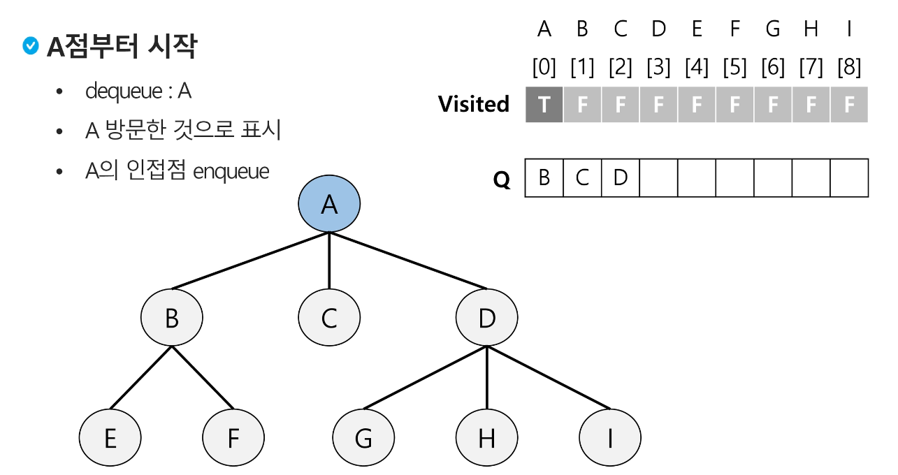
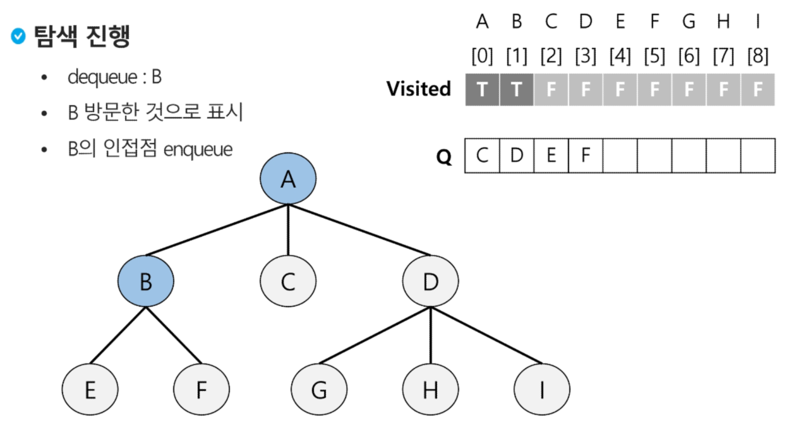
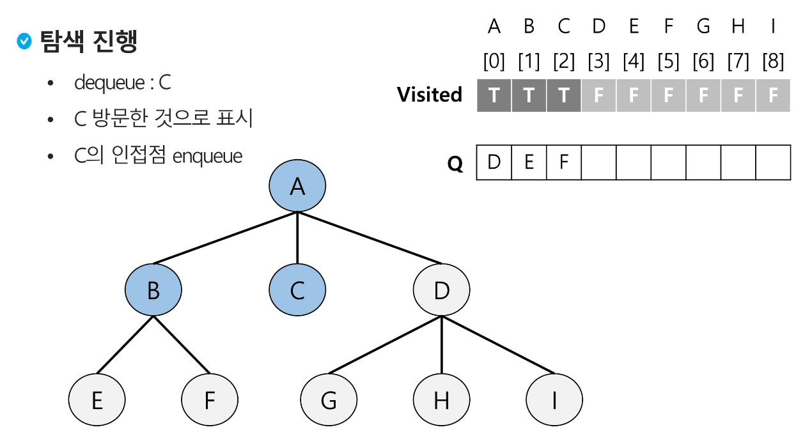
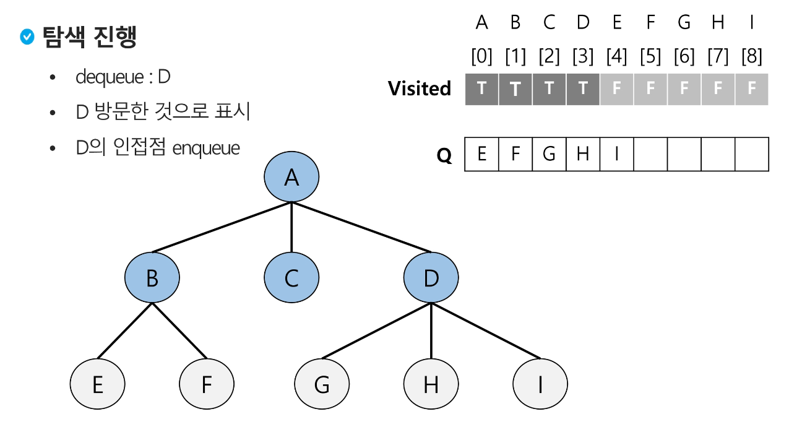
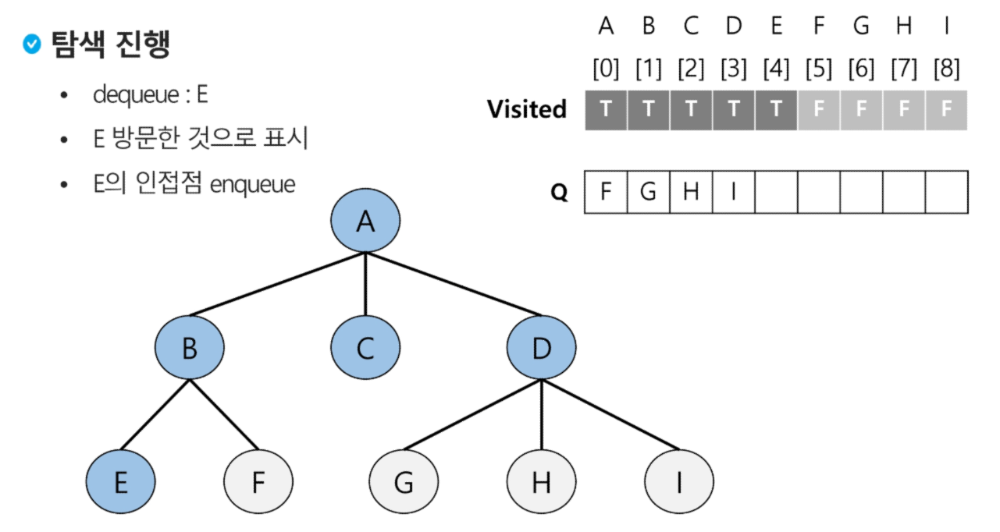
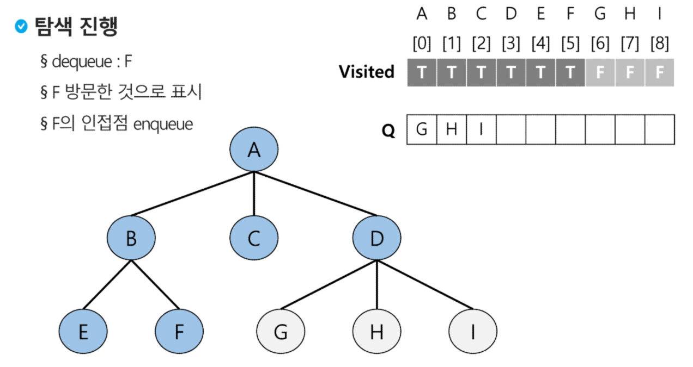
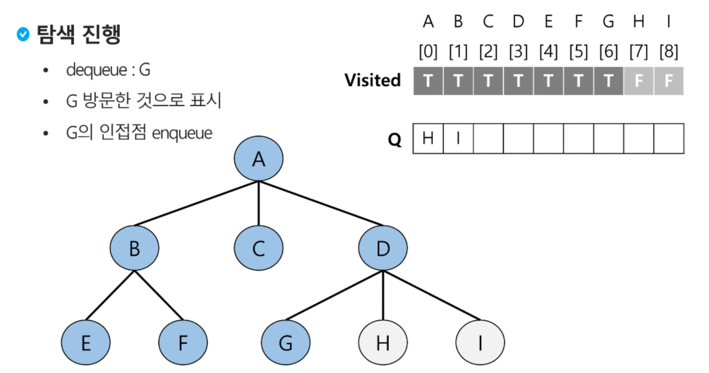
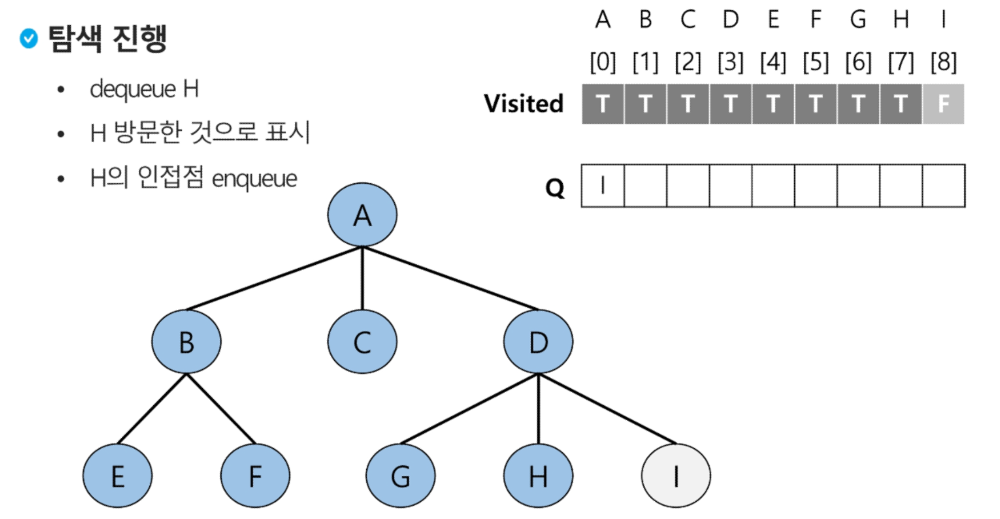
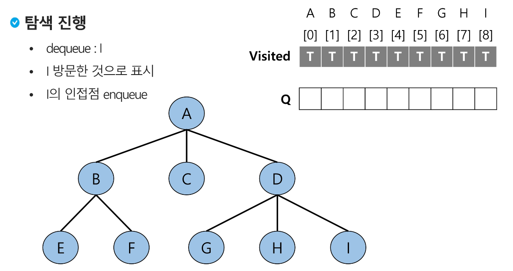
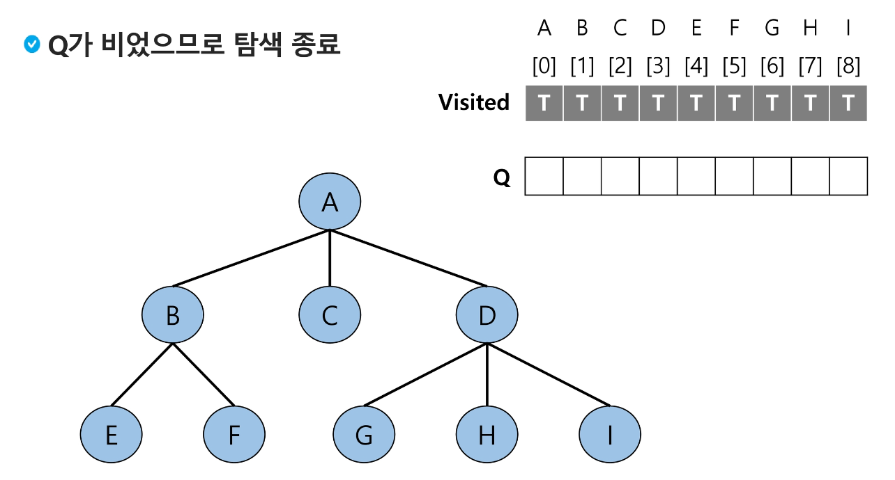

### [참고] BFS 예제
### 초기상태
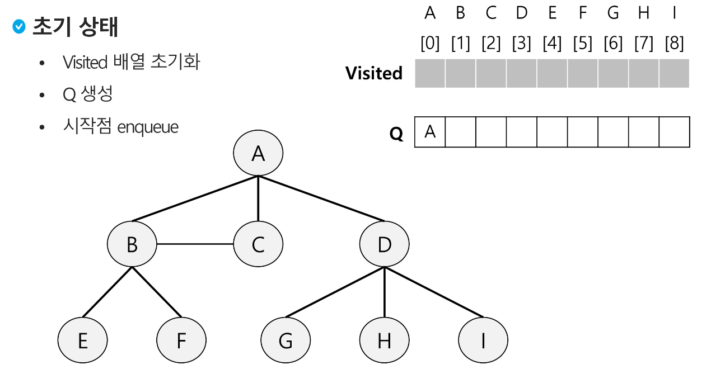
### 입력 파라미터: 그래프 G와 탐색 시작점 v

## <연습문제3>
### 다음은 연결되어있는 두 개의 정점 사이의 간선을 순서대로 나열해 놓은 것이다. 모든 정점을 너비우선탐색하여 경로를 출력하시오. 시작 정점을 1로 시작하시오.
1, 2, 1, 3, 2, 4, 2, 5, 4, 6, 5, 6, 6, 7, 3, 7

- 출력결과의 예는 다음과 같다
1-2-3-4-5-7-6
