# start 2
## 비트 연산
### 비트와 바이트
 - 1bit : 0과 1을 표현하는 정보의 단위
 - 1 Byte: 8bit를 묶어 1 Byte라고 한다.

예시
- 1001011011011100은 총 16비트면서 2바이트이다.

### 비트 연산
 - 컴퓨터의 CPU는 0과 1로 다루어 동작되며, 내부적으로 비트 연산을 사용하여 덧셈, 뺄셈, 곱셉 등을 계산한다.

### 비트연산 챕터의 목적
 - 사람이 사용하는 사칙연산(+, *, /, -)이 아닌 컴퓨터가 사용하는 연산인 "비트연산"을 이해해본다.
 - 더 나아가, 프로그래밍에서 비트연산을 활용한 코딩 방법을 익혀본다.

### 비트 연산자
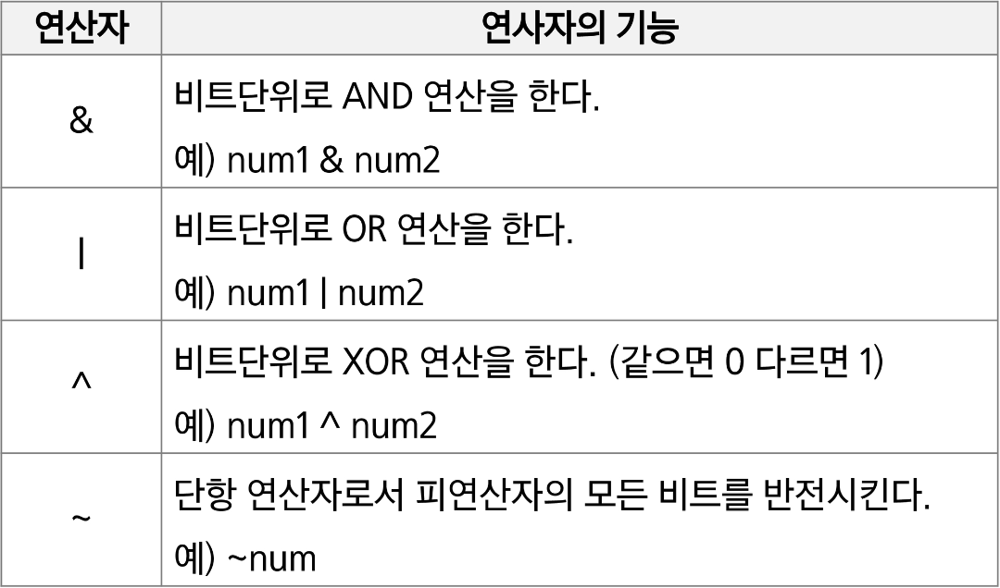
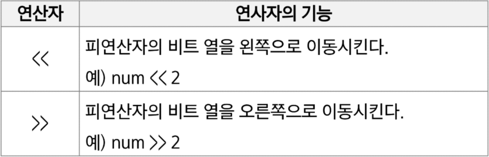

### 1 << n
 - 2 ** n의 값을 갖는다.
 - 원소가 n개일 경우 모든 부분집합의 수를 의미한다.
 - Power set(모든 부분 집합)
    - 공집합과 자기 자신을 포함한 모든 부분집합
    - 각 원소가 포함됙더나 포함되지 않는 2가지 경우의 수를 계산하면 모든 부분집합의 수가 계산된다.

### i & (1 << j)
 - 계산 결과는 i의 j번째 비트가 1인지 아닌지를 의미한다.

### 비트 연산 예제 1
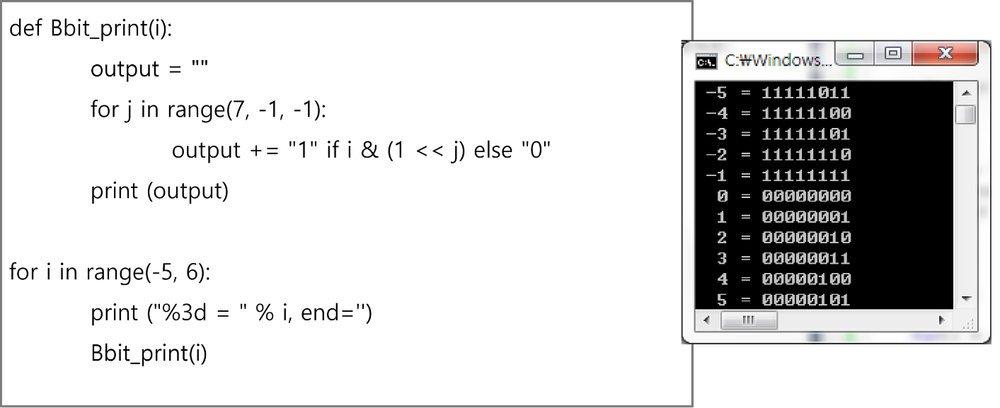

### 비트 연산 예제 2
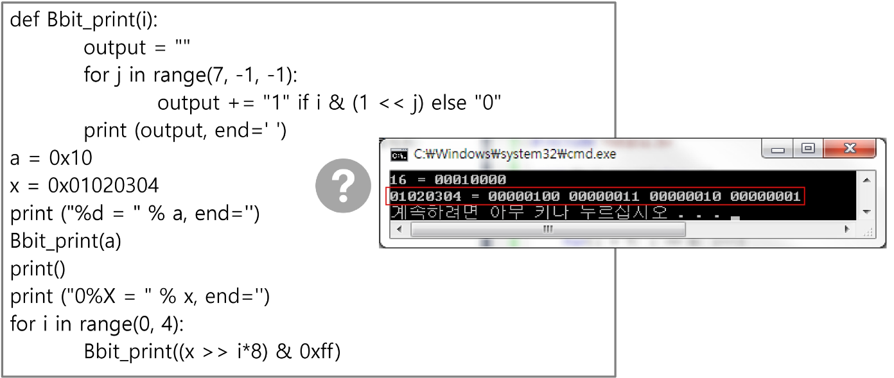

### 엔디안(Endianness)
 - 컴퓨터의 메모리와 같은 1차원의 공간에 여러 개의 연속된 대상을 배열하는 방법을 의미하며 HW 아키텍처마다 다르다.
 - 주의: 속도 향상을 위해 바이트 단위와 워드 단위를 변환하여 연산할 때 올바로 이해하지 않으면 오류를 발생시킬 수 있다.

 - 엔디안은 크게 두 가지로 나뉨
    - 빅 엔디안(Big-endian)

### AND와 OR 비트연산자 이해하기
 - a AND b: a, b 둘 다 1일때만 결과가 1이다. 그 외에는 0
 - a OR b: a, b 둘 중 하나만 1이면 결과가 1이다. 그 외에는 0
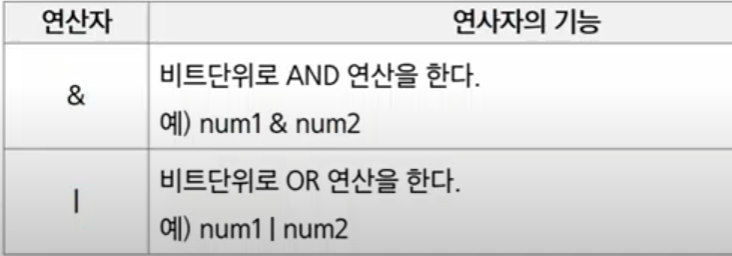

### 파이썬 구현
 - 7 & 5 -> 이진수로 표현하면 0b111 & 0b101
111 & 101 -> 101
111 | 101 -> 111
따라서
```
print(7 & 5) # 5
print(7 | 5) # 7
```

### 파이썬에서 2진수, 16진수, 10진수 변환하여 출력하기
 - 2진수는 숫자 0과 소문자 b -> 0b를 접두사로 붙여 표현한다.
 - 16진수는 숫자 0과 소문자x -> 0x를 접두사로 붙여 표현한다.
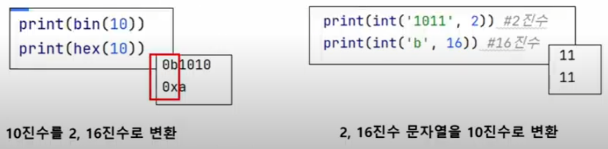

### [도전] 먼저 수기로 연산을 해본다. 이후, 직접 파이썬으로 구현하여 테스트해본다.
'''
11011110
   11011
&
   11010 = 26

4A3
 25
|
010010100011
       11001
010010111011 
4BB = 1024 + 176 + 11 = 1211
''' prac1

### XOR 연산자
 - ^: XOR(엑스오어) 연산자 OR처럼 동작되는데 둘 다 1인 경우는 0이다.
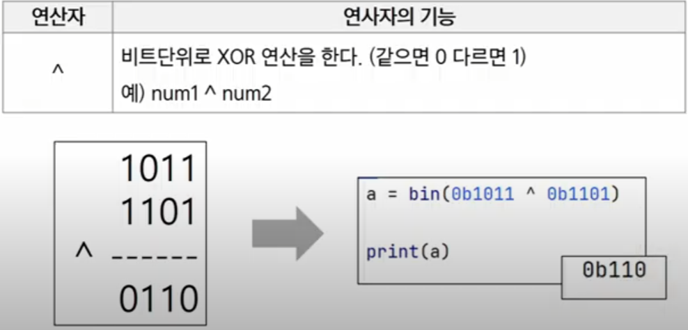

### 신기한 XOR
 - 어떤 값이던 임의의 수로 2회 XOR하면 원래 값으로 돌아온다.
'''
7070^1004 = 6258
6258^1004 = 7070
''' prac2

### Left와 Right Shift 연산자
 - Left Shift << : 특정 수만큼 비트를 왼쪽으로 밀어낸다.(우측에 0이 생성된다.)
 - Right Shift >> : 특정 수만큼 비트를 오른쪽으로 밀어낸다.(우측 비트들이 제거된다.)
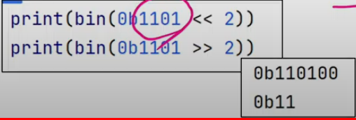

### [도전] Left Shift(<<)를 이용한 프로그래밍
 - 반복문을 이용하여 아래와 같잍 출력한다.
    - Loop 1: 0b1 출력 (2진수와 10진수로 출력)
    - Loop 2: 0b10 출력 (2진수와 10진수로 출력)
    - Loop 3: 0b100 출력 (2진수와 10진수로 출력)
    - Loop 4: 0b1000 출력 (2진수와 10진수로 출력)
    - Loop 5: 0b10000 출력 (2진수와 10진수로 출력)
    - prac3

### 비트연산 응용 1
 - 1 << n
    - 2^n의 값을 갖는다.
    - 임베디드 분야에서 계산을 빠르게 하기 위해 사용된다.

### 비트연산 응용 2
 - i & (1 << n)
    - i의 n번 비트가 1인지 아닌지를 확인할 수 있다.
    - ex) 1101 & (1<<2)
        위 연산으로 1101에서 2번 bit가 1인지 확인 가능하다.

        먼저 (1 << 2)를 하면 100이 된다.
        이후 1101 & 0100 = 0100이 되며,
        0100은 0보다 큰 수이므로, n번 비트는 1임이 확정된다.
        만약 연산 결과가 0이라면, n번 비트는 0이 확정된다.
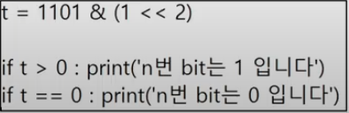

### 음수 표현 방법
 - 컴퓨터는 음수를 "2의 보수"로 관리한다.
 - 맨 앞자리 bit(MSB)는 음수 or 양수를 구분하는 비트이다.
 - 컴퓨터가 2의 보수를 사용하여 음수를 관리하는 이유
    - 뺄셈의 연산 속도를 올릴 수 있으며, +0과 -0을 따로 취급하지 않기 위해 사용한다.
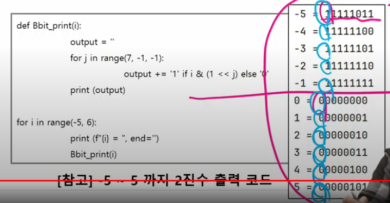

### 2의 보수 예시
 - 10001의 2의 보수
    -> 수를 모두 뒤집고 +1을 한다.
    -> 01110+1 = 01111

 - 1111000의 22의 보수
    -> 수를 뒤집으면 0000111이고 +1을 한다.
    -> 0000111 + 1 = 0001000

### -5를 2의 보수로 표현하는 방법(가정: 수를 8bit로 저장하는 경우)
 - 수 5를 2진수로 나타내면 000 0101이다.(7bit)
 - -5는 음수이기 때문에 MSB는 1이다.
 - 나머지 7bit에 대해, 수를 뒤집고 1을 더하면 된다.(2의 보수)
 - 수 5를 뒤집으면 111 1010이며, 1을 더하면 111 1011이 된다.
 - 따라서 1111 1011이 된다.

### NOT 연산자
 - (~) NOT 연산자: 모든 비트를 반전시킨다.
 - 만약 8비트일때 ~(0001 1111)이라면 값은 1110 0000이 된다.

### NOT 연산자를 파이썬에서 수행하기
 - 파이썬에서는 ~4를 수행하면 -5가 출력된다.

### ~4를 -5로 출력하는 과정
 - 4는 0b0100이다.(MSB:양수이므로 0)
 - NOT 연산자로 인해 뒤집으면 1011이 된다.
 - MSB는 1이 되었고(음수), 나머지 bit는 011이다.
 - 따라서 나머지 bit에 대해 2의 보수를 취하면 100 + 1 = 101이므로 5가 된다.
 - 따라서 -5가 된다.

### [도전] 비트연산 문제 풀어보기 (SWEA 10726. 이진수 표현)
 - 정수 N, M이 주어질 때 M의 이진수 표현의 마지막 N 비트가 모두 1로 켜져 있는지 아닌지를 판별하여 출력. 모두 켜졌다면 ON 아니면 OFF 출력 (prac4)

### 파이썬에서 실수 출력 방법
 - 파이썬은 f-string 문법을 지향한다.
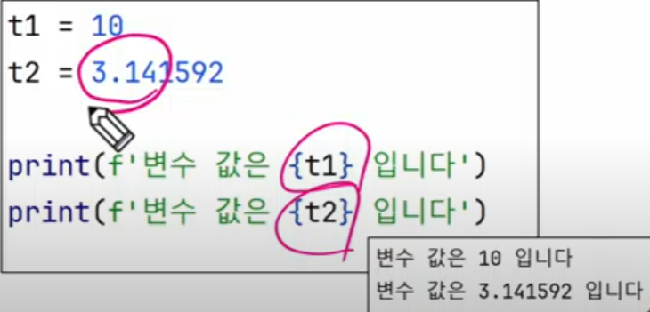

### 파이썬에서의 실수 표현 범위를 알아보자
 - 파이썬에서는 다른 언어와 달리 내부적으로 더 큰 규모의 자료구조를 사용해서 훨씬 넓은 범위의 실수를 표현할 수 있다.

 - 최대로 표현할 수 있는 값은 약 1.8 * 10^308이고 이 이상은 inf로 표현
 (참고로 1억은 1 * 10^8임)
 - 최소로 표현할 수 있는 값은 5.0 * 10^-324이며, 이 이하는 0으로 표현

### 컴퓨터는 실수로 내부적으로 근사적으로 관리한다.
 - 실수는 정확한 값이 아니라 근사값으로 저장되는데 이 때 생기는 작은 오차가 계산 과정에서 다른 결과를 가져온다.
 - print(0.1 + 0.1 + 0.1 == 0.3)

### [도전] 실수 값 출력해보기
- 0.1이 정확히 어떤 값으로 저장되었는지, f-string을 이용하여 출력해보자
- 소수점 20자리 이상으로도 출력해보자(prac5)

### 근사값으로 저장되는 원리를 알아보자.
 - 소수점이 있는 10진수를 2진수로 변환 예시
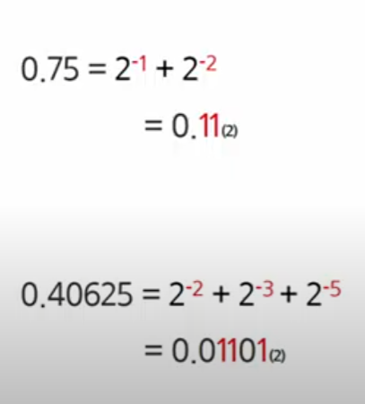
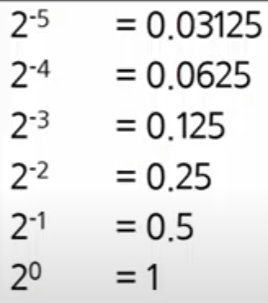
2^-1 = 0.1(2)
2^-2 = 0.01(2)

### 소수점을 포함한 2진 실수를 10진수로 변환하는 예시
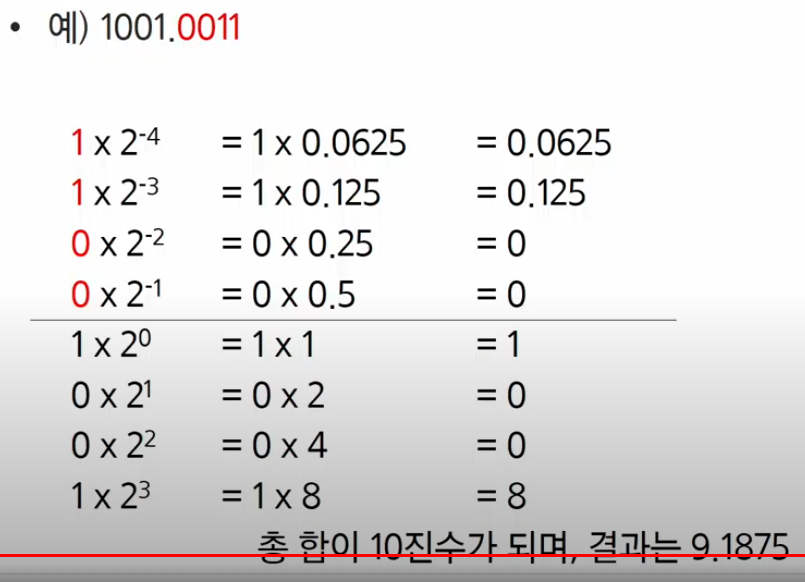

### <연습문제1> - 7-bit 10진수 swea
 - 0과 1로 이루어진 1차 배열에서 7개씩 수를 묶어, 10진수로 출력하기

