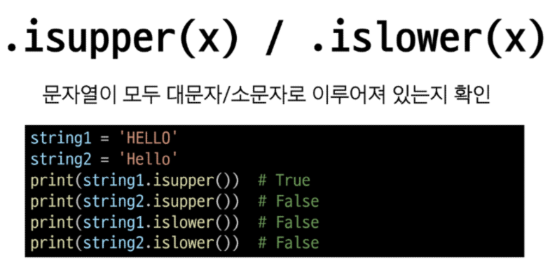

# Python 05

## Data structure
### 데이터 구조
여러 데이터를 효과적으로 사용, 관리하기 위한 구조
(str, list, dict 등)

### 자료 구조
 - 컴퓨터 공학에서는 '**자료구조**'라고 함
 - 각 데이터의 효율적인 저장, 관리를 위한 구조를 나눠놓은 것

### 데이터 구조 활용
- 문자열, 리스트, 딕셔너리 등 각 데이터 구조의 메서드를 호출하여 다양한 기능을 활용하기

### 메서드(method)
객체에 속한 함수
    - 객체의 상태를 조작하거나 동작을 수행

### 메서드 특징
 - 메서드는 클래스(class) 내부에 정의되는 함수
 - 클래스는 파이썬에서 '타입을 표현하는 방법'이며 이미 은연 중에 사용해왔음
 - 예를 들어 help 함수를 통해 str를 호출해보면 class였다는 것을 확인 가능

### 지금 시점에 알아야 할 것
 메서드는 어딘가(클래스)에 속해 있는 함수이며, 각 데이터 타입 별로 다양한 기능을 가진 메서드가 존재

 ### 메서드 호출 방법
 데이터 타입 객체.메서드()
 ex) list.append()

## 시퀀스 데이터 구조
### 문자열
### 문자열 조희 / 탐색 및 검증 메서드

cf) 앞에 is로 시작하는 것들은 boolean 값(T/F)을 출력함
    s.isalpha(), s.isupper(), s.islower()

### .find(x)

### .index(x)

### .isupper(x) / .islower(x)

### .isalpha(x)

### 문자열 조작 메서드(새 문자열 반환)
왜 새로운 것을 주는가? 
    - 문자열은 불변하는 타입이기 때문에 새로운 문자열을 반환시킨다.

### .replace(old, new[,count])
바꿀 대상 글자를 새로운 글자로 바꿔서 반환

[,count] : 대괄호의 의미 - 선택인자
왜 이렇게 표현을 했을까?
- 프로그래밍 언어가 파이썬만 있는 것은 아님
- 베커스 나우르 표기법
- 파이썬은 확장된 베커스 나우르 표기법을 사용한다.
- 대괄호 [] : 선택인자
- 따라서 표기법일 뿐 실제로 파이썬에서 이렇게 돌아간다는 것은 아니다.

### .strip([chars])
문자열의 시작과 끝에 있는 공백 혹은 지정한 문자를 제거

### .split(sep=None, maxsplit=1)
지정한 문자를 구분자로 문자열을 분리하여 문자열의 리스트로 반환

### 'seperator' .join([iterable])
iterable 요소들을 원래의 문자열을 구분자로 이용하여 하나의 문자열로 연결

### 문자열 조작 메서드

메서드는 이어서 사용 가능
if 앞쪽의 메서드가 반환값이 없는 None이라면 오류가 뜰 것이다.

## 리스트
### 리스트 값 추가 및 삭제 메서드

### .append(x)
리스트 마지막에 항목 x를 추가

### .extend(iterable)
리스트에 다른 반복 가능한 객체의 모든 항목을 추가

### .insert(i, x)
리스트의 지정한 인덱스 I 위치에 항목 x를 삽입

### .remove(x)
리스트에서 첫 번째로 일치하는 항목을 삭제

### .pop(i)
리스트에서 지정한 인덱스의 항목을 제거하고 **반환**작성하지 않을 경우 마지막 항목을 제거

### .clear()
리스트의 모든 항목을 삭제

### 리스트 탐색 및 정렬 메서드

### .index(x)
리스트에서 첫 번째로 일치하는 항목의 인덱스를 반환

### .count(x)
리스트에서 항목 x가 등장하는 횟수를 반환

### .sort(x)
원본 리스트를 오름차순으로 정렬

sort()의 메서드 리턴값 = None
원본을 바꾸니까 리턴값이 없다.

### .reverse(x)
리스트의 순서를 역순으로 변경(정렬X)
원본을 변경하기에 리턴값은 없다.

## 복사
### 데이터 타입과 복사
- 파이썬에서는 데이터에 분류에 따라 복사가 달라짐
- '변경 가능한 데이터 타입'과 '변경 불가능한 데이터 타입'을 다르게 다룸

### 변경 가능한 데이터 타입의 복사

a는 왜 바뀌었는가?

### 변경 불가능한 데이터 타입의 복사

새로운 주소를 쥐어줘야 한다.

### 복사 유형
1. 할당(Assignment)
2. 얕은 복사(Shallow copy)
3. 깊은 복사(Deep copy)

### 할당
- 리스트 복사 예시

- 리스트 복사 예시
    - 할당 연산자(=)를 통한 복사는 해당 객체에 대한 객체 참조를 복사

### 얕은 복사
- 리스트 얕은 복사 예시

    - 슬라이싱을 통해 생성된 객체는 원본 객체와 **'독립적'**으로 존재

### 얕은 복사의 한계
- 2차원 리스트와 같이 변경 가능한 객체 안에 변경 가능한 객체가 있는 경우

-a와 b는 주소는 다르지만 내부 객체의 주소는 같기 때문에 함께 변경됨

### 깊은 복사
- 리스트 깊은 복사 예시
import copy - 내장함수

- 내부에 중첩된 모든 객체까지 새로운 객체 주소를 참조하도록 함

### 참고
- 문자열에 포함된 문자들의 유형을 판별하는 메서드
 - isdecimal()
    - 문자열이 모두 숫자 문자(0~9)로만 이루어져 있어야 True
 - isdigit()
    - isdecimal()과 비슷하지만, 유니코드 숫자도 인식('①'도 숫자로 인식)
 - isnumeric()
    - isdigit()과 유사하지만, 몇 가지 추가적인 유니코드 문자들을 인식 (분수, 지수, 루트 기호도 숫자로 인식)

