# python 08
## 상속 (inheritance)
기존 클래스의 속성과 매서드를 물려받아 새로운 하위 클래스를 생성하는 것

### 상속이 필요한 이유
1. 코드 재사용
    - 상속을 통해 기존 클래스의 속성과 메서드를 재사용할 수 있음
    - 새로운 클래스를 작성할 때 기존 클래스의 기능을 그대로 활용할 수 있으며 중복된 코드를 줄일 수 있음

2. 계층 구조
    - 상속을 통해 클래스들 간의 계층 구조를 형성할 수 있음
    - 부모 클래스와 자식 클래스 간의 관계를 표현하고, 더 구체적인 클래스를 만들 수 있음

3. 유지 보수의 용이성
    - 상속을 통해 기존 클래스의 수정이 필요한 경우, 해당 클래스만 수정하면 되므로 유지 보수가 용이해짐
    - 코드의 일관성을 유지하고, 수정이 필요한 범위를 최소화할 수 있음

## 클래스 상속
### 상속 없이 구현하는 경우

- 학생 / 교수 정보를 나타내기 어려움
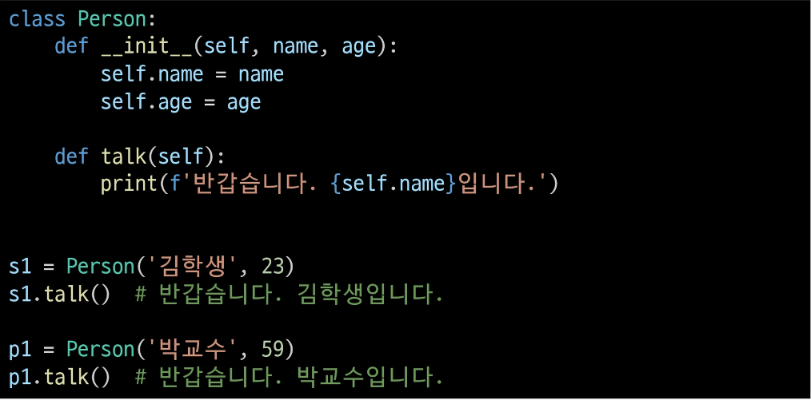
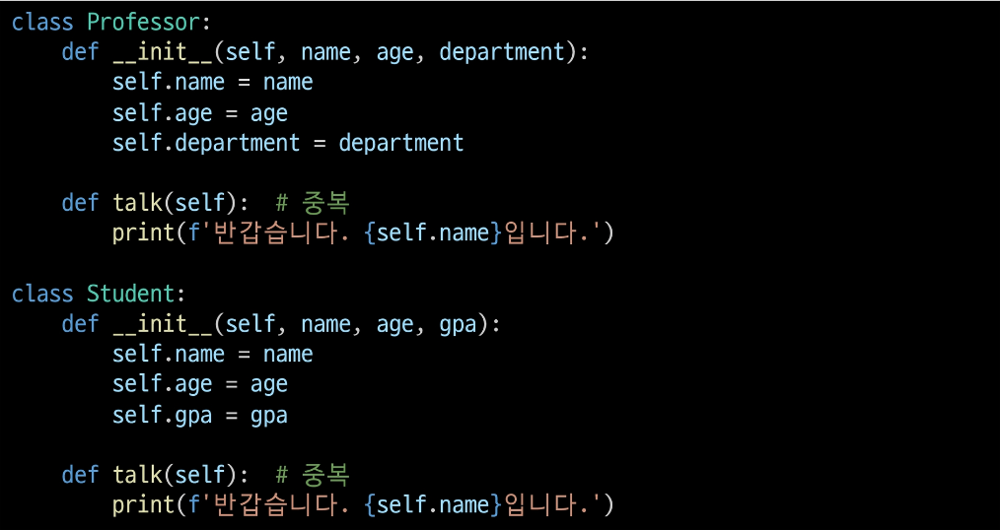

### 상속을 사용한 계층구조 변경

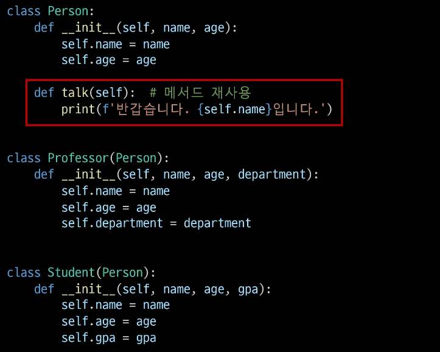
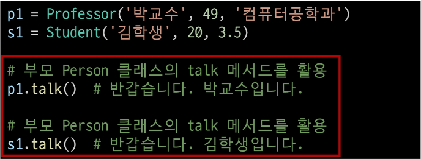
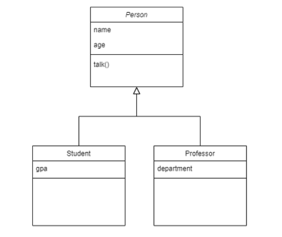

### super()
부모 클래스 객체를 반환하는 내장 함수

### super() 사용 예시

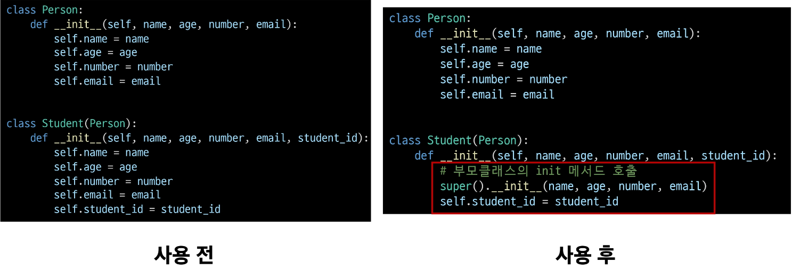

### 다중 상속
 - 둘 이상의 상위 클래스로부터 여러 행동이나 특징을 상속받을 수 있는 것
 - 상속받은 모든 클래스의 요소를 활용 가능함
 - 중복된 속성이나 매서드가 있는 경우 상속 순서에 의해 결정됨

### 다중 상속 예시

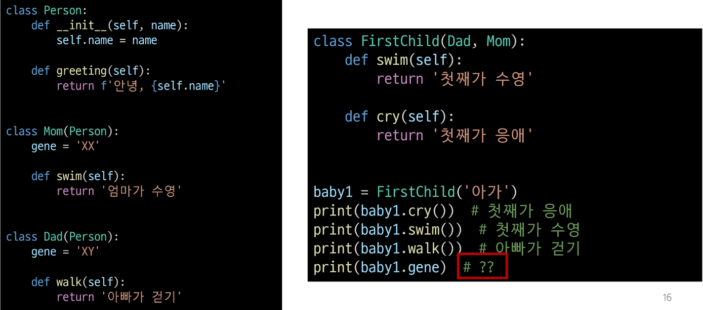
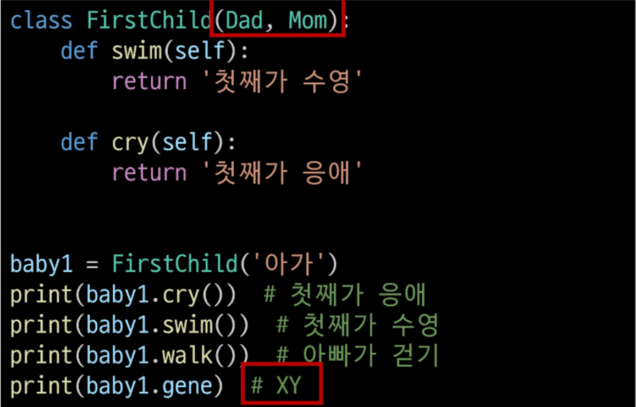

### 다이아몬드 문제(The diamond problem)
 - 두 클래스 B와 C가 A에서 상속되고, 클래스 D가 B와 C 모두에서 상속될 때 발생하는 모호함
 - B와 C가 재정의한 메서드가 A에 있고 D가 이를 재정의하지 않은 경우라면
 - D는 B의 메서드 중 어떤 버전을 상속하는가?
   아니면 C의 메서드 버전을 상속하는가?

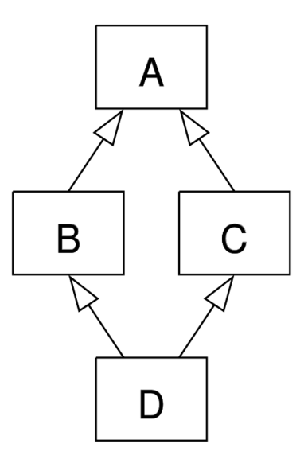

### 파이썬에서의 해결책
 - MRO(Method Resolution Order) 알고리즘을 사용하여 클래스 목록을 생성
 - 부모 클래스로부터 상속된 속성들의 검색을 깊이 우선으로, 왼쪽에서 오른쪽으로, 계층 구조에서 겹치는 같은 클래스를 두 번 검색하지 않음
 - 그래서 속성이 D에서 발견되지 않으면 B에서 찾고, 거기서 발견되지 않으면 C에서 찾고 이런 식으로 진행됨

### MRO
메서드 결정 순서

### super()
부모 클래스 객체를 반환하는 내장 함수
- 다중 상속 시 MRO를 기반으로 현재 클래스가 상속하는 모든 부모 클래스 중 다음에 호출될 메서드를 결정하여 자동으로 호출

### super() 사용 예시

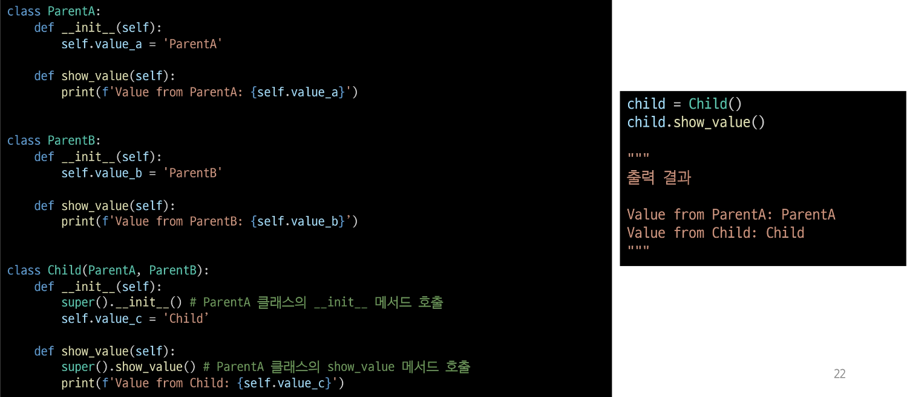

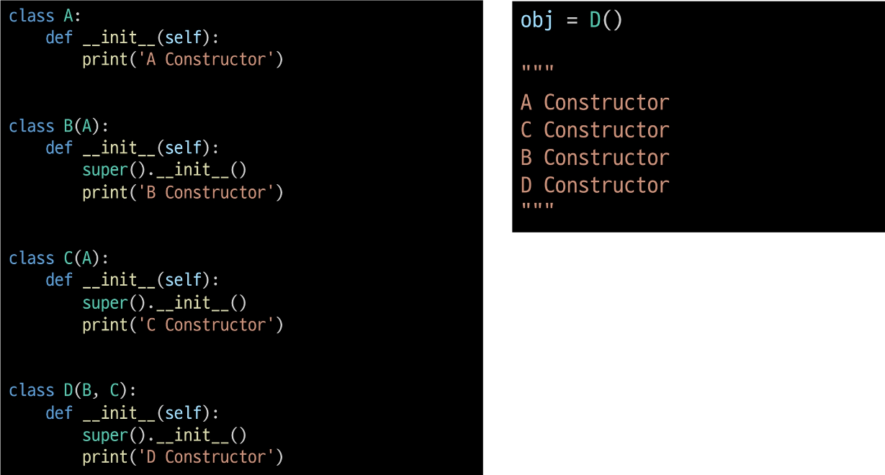

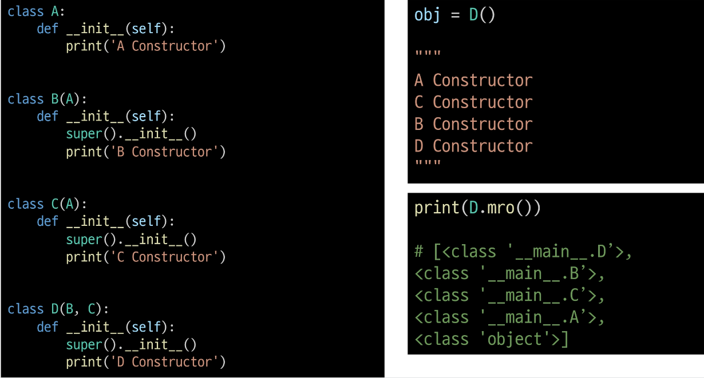

### mro() 메서드
- 해당 인스턴스의 클래스가 어떤 부모 클래스를 가지는지 확인하는 메서드
- 기존의 인스턴스->클래스 순으로 이름 공간을 탐색하는 과정에서 상속 관계에 있으면 인스턴스 -> 자식 클래스 -> 부모 클래스로 확장

### super의 2가지 사용 사례
1. 단일 상속 구조
    - 명시적으로 이름을 지정하지 않고 부모 클래스를 참조할 수 있으므로  코드를 더 유지, 관리하기 쉽게 만들 수 있음
    - 클래스 이름이 변경되거나 부모 클래스가 교체되어도 super()를 사용하면 코드 수정이 더 적게 필요

2. 다중 상속 구조
    - MRO에 따른 메서드 호출
    - 복잡한 다중 상속 구조에서 발생할 수 있는 문제를 방지

### MRO가 필요한 이유
 - 부모 클래스들이 여러 번 액세스 되지 않도록
    각 클래스에서 지정된 왼쪽에서 오른쪽으로 가는 순서를 보존하고,
    각 부모를 오직 한 번만 호출하고,
    부모들의 우선순위에 영향을 주지 않으면서 서브 클래스를 만드는 **단조적인 구조 형성**
    - 프로그래밍 언어의 신뢰성 있고 확장성 있는 클래스를 설계할 수 있도록 도움
    - 클래스 간의 메서드 호출 순서가 예측 가능하게 유지되며, 코드의 재사용성과 유지보수성이 향상

## 디버깅
### 버그 bug
- 소프트웨어에서 발생하는 오류 또는 결함
- 프로그램의 예상된 동작과 실제 동작 사이의 불일치

### 버그의 기원
- 최초의 버그는 1945년 프로그래밍 언어의 일종인 코볼 발명자 그레이스 호퍼가 발견
- 역사상 최초의 컴퓨터 버그는 Mark II 라는 컴퓨터 회로에 벌레인 나방이 들어가 합선을 일으켜 비정상적으로 동작한 것을 기록한 것
- "버그"라는 용어는 이전부터 사용되어왔지만 이 사건을 계기로 컴퓨터 시스템에서 발생하는 오류 및 결함을 지칭하는 용어로 널리 사용되기 시작

### Debugging
소프트웨어에서 발생하는 버그를 찾아내고 수정하는 과정
프로그램의 오작동 원인을 식별하여 수정하는 작업

### 디버깅 방법
1. print 함수 활용
- 특정 함수 결과, 반복 / 조건 결과 등 나눠서 생각, 코드를 bisection으로 나눠서 생각
2. 개발 환경(text editor, IDE) 등에서 제공하는 기능 활용
- breakpoint, 변수 조회 등
3. Python tutor 활용(단순 파이썬 코드인 경우)
4. 뇌 컴파일, 눈 디버깅 등

### 에러
프로그램 실행 중에 발생하는 예외 상황

### 파이썬의 에러 유형
1. 문법 에러 (Syntax Error)
프로그램의 구문이 올바르지 않은 경우 발생
(오타, 괄호 및 콜론 누락 등의 문법적 오류)
2. 예외 (Exception)
프로그램 실행 중에 감지되는 에러

# 문법 에러 예시

Invalid syntax(문법 오류)
While # SyntaxError: invalid syntax

Assign to literal(잘못된 할당)
65=3 # SyntaxError: cannot assign to literal

EOL (End of Line)
print('hello
# SyntaxError: EOL while scanning string literal

EOF(End of File)
print(
# SyntaxError: unexpected EOF while parsing

### 예외(Exception)
프로그램 실행 중에 감지되는 에러

### 내장 예외(Built-in Exceptions)
예외 상황을 나타내는 예외 클래스들
- 파이썬에서 이미 정의되어 있으며, 특정 예외 상황에 대한 처리를 위해 사용

내장 예외
- ZeroDivisionError: 나누기 또는 모듈로 연산의 두 번째 인자가 0일 때 발생
10/0 # ZeroDivisionError: division by zero

- NameError: 지역 또는 전역 이름을 찾ㅇ르 수 없을 때 발생
print(name_error)
# NameError: name 'name_error' is not defined

- TypeError
    - 타입 불일치
    '2' + 2 # TypeError: can only concatenate str (not "int) to str
    - 인지 누락
    sum() #TypeError: sum() takes at least 1 positional argument(0 given)
    - 인자 초과
    sum(1, 2, 3) # TypeError: sum() takes at most 2 arguments(3 given)
    - 인지 타입 불일치
    import random
    random.sample(1, 2)
    # TypeError: Population must be a sequence. For dics of sets, use sorted(d).

- ValueError
    - 연산이나 함수에 문제가 없지만 부적절한 값을 가진 인자를 받았고, 상황이 IndexError처럼 더 구체적인 예외로 설명되지 않는 경우 발생
    int('1.5') # ValueError: invalid literal for int() with base 10: '3.5'
    range(3).index(6) # ValueError: 6 is not in range

- IndexError - 시퀀스 인덱스가 범위를 벗어날 때 발생
    - empty_list = []
      empty_list[2]
      # IndexError: list index out of range
    
- KeyError: 딕셔너리에 해당 키가 존재하지 않는 경우
person = {'name': 'Alice'}
person['age'] #KeyError: 'age'

- ModuleNotFoundError - 모듈을 찾을 수 없을 때 발생
import hahaha # ModuleNotFoundError: No module named 'hahaha'

- ImportError: 임포트하려는 이름을 찾을 수 없을 때 발생
from random import hahaha
# ImportError: cannot import name 'hahaha' from 'random'

- KeyboardInterrupt: 사용자가 Control-C 또는 Delete를 누를 때 발생
    - 무한루프 시 강제 종료

- IndentationError: 잘못된 들여쓰기와 관련된 문법 오류
for i in range(10):
print(i) # IndentationError: expected an indented block

## 예외처리
### try & Except
파이썬에는 try문과 except 절을 사용하여 예외 처리

### try-except 구조
- try 블록 안에는 예외가 발생할 수 있는 코드를 작성
- except 블록 안에는 예외가 발생했을 때 처리할 코드를 작성
- 예외가 발생하면 프로그램 흐름은 try 블록을 빠져나와 해당 예외에 대응하는 except 블록으로 이동

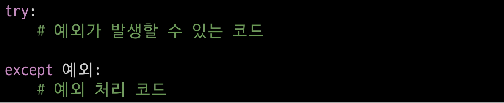

### 예외 처리 예시

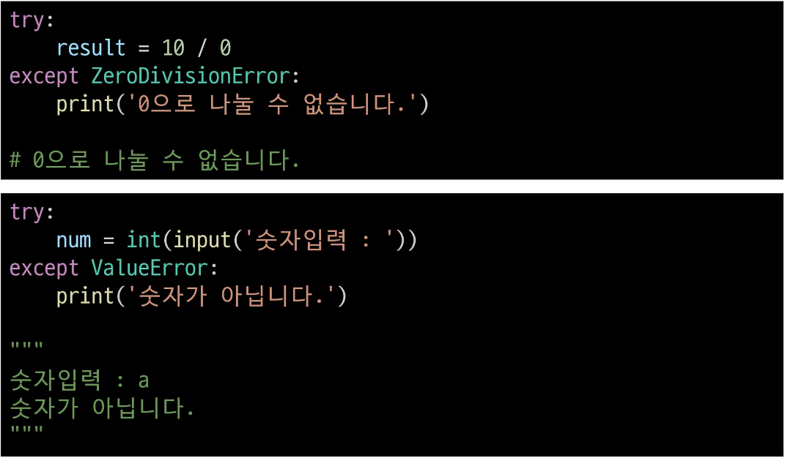

### 복수 예외 처리 연습
- 100을 사용자가 입력한 값으로 나누고 출력하는 코드를 작성해보시오.
    - 먼저, 발생 가능한 에러가 무엇인지 예상해보기

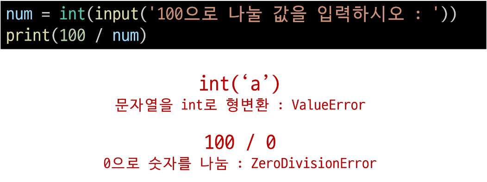

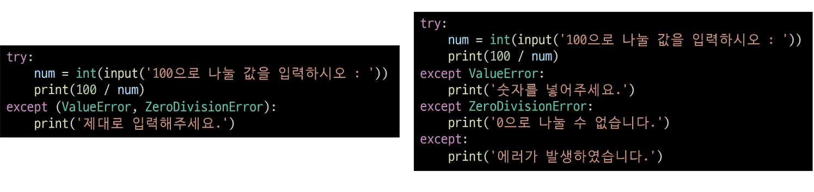

### 내장 예외의 상속 계층구조 주의
- 아래와 같이 예외를 작성하면 코드는 2번째 except 절에 이후로 도달하지 못함

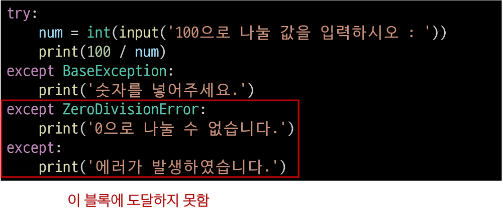

- 내장 예외 클래스는 상속 계층구조를 가지기 때문에 except 절로 분기 시 반드시 하위 클래스를 먼저 확인할 수 있도록 작성해야 한다.

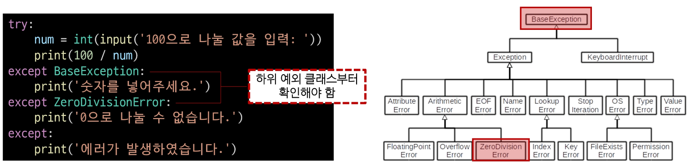

### as 키워드
- as 키워드를 활용하여 에러 메시지를 except 블록에서 사용할 수 있음

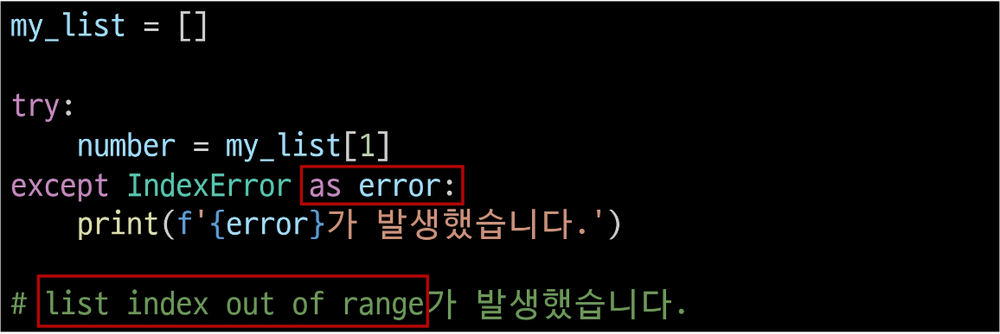

## EAFP & LBYL
### 예외처리와 값 검사에 대한 2가지 접근 방식
1. EAFP
2. LBYL

### EAFP
"Easier to Ask for Forgiveness than Permission"
예외처리를 중심으로 코드를 작성하는 접근 방식 (try-except)

### LBYL
"Look Before You Leap"
값 검사를 중심으로 코드를 작성하는 접근 방식(if-else)

### 접근 방식 비교

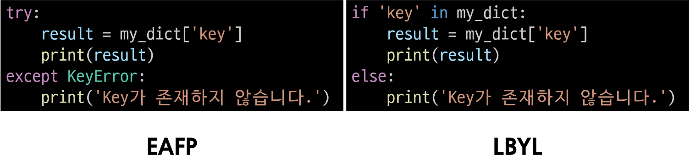

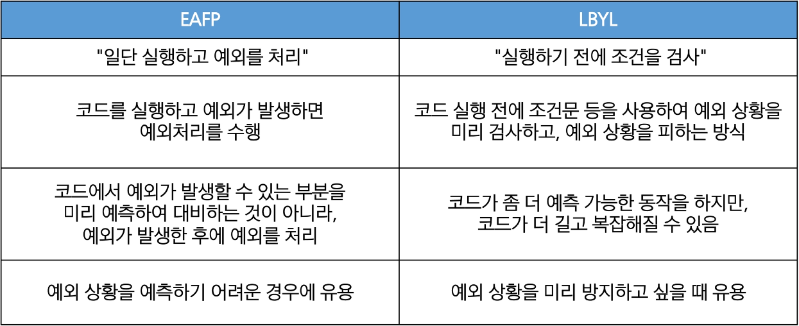