# APS solving(Algorithm Problem Solving)
## 배열 1
### 알고리즘
- 알고리즘: 유한한 단계를 통해 문제를 해결하기 위한 절차나 방법이다. 주로 컴퓨터용어로 쓰이며, 컴퓨터가 어떤 일을 수행하기 위한 단계적 방법을 말한다.
- 간단하게 다시 말하면 어떠한 문제를 해결하기 위한 절차라고 볼 수 있다.
- 예를 들어 1부터 100까지의 합을 구하는 문제를 생각해보자.

### 컴퓨터 분야에서 알고리즘을 표현하는 방법은 크게 두 가지
- 의사코드(Pseudocode)와 순서도

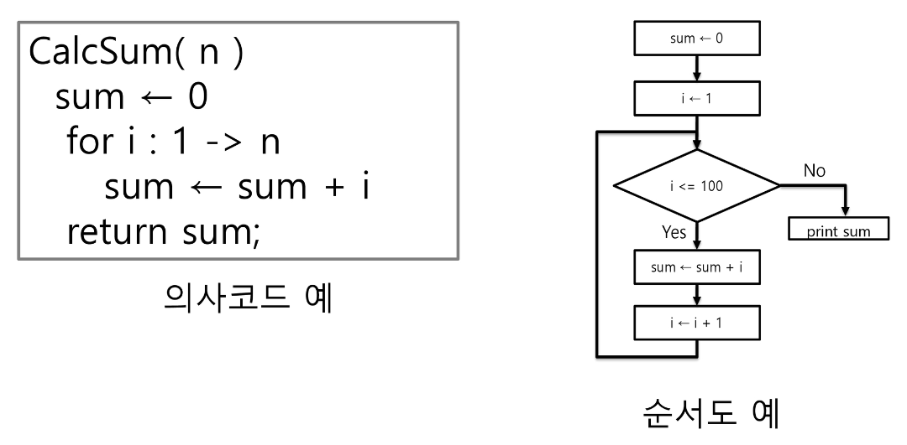

### APS 과정의 목표 중의 하나는 보다 좋은 알고리즘을 이해하고 활용하는 것이다.

### 무엇이 좋은 알고리즘인가?
    1) 정확성: 얼마나 정확하게 동작하는가
    2) 작업량: 얼마나 적은 연산으로 원하는 결과를 얻어내는가
    3) 메모리 사용량: 얼마나 적은 메모리를 사용하는가
    4) 단순성: 얼마나 단순한가
    5) 최적성: 더 이상 개선할 여지없이 최적화되었는가

### 주어진 문제를 해결하기 위해 여러 개의 다양한 알고리즘이 가능
 -> 어떤 알고리즘을 사용해야 하는가?

### 알고리즘의 성능 분석 필요
    - 많은 문제에서 성능 분석의 기준으로 알고리즘의 작업량을 비교한다.

 ex) 1부터 100까지 합을 구하는 문제

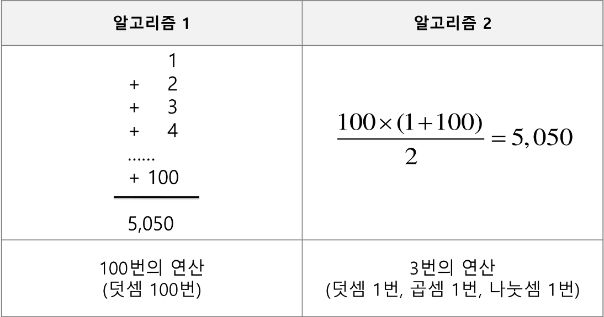

### 알고리즘의 작업량을 표현할 때 시간복잡도로 표현한다.
### 시간 복잡도(Time Complexity)
    - 실제 걸리는 시간을 측정
    - 실행되는 명령문의 개수를 계산

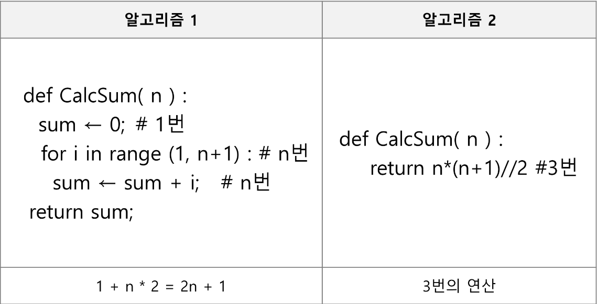

### 시간 복잡도는 빅-오(O) 표기법과 비슷하다
 - 빅-오 표기법(Big-O Notation)
 - 시간 복잡도 함수 중에서 가장 큰 영향력을 주는 n에 대한 항만을 표시
 - 계수(Coefficient)는 생략하여 표시
 - ex)

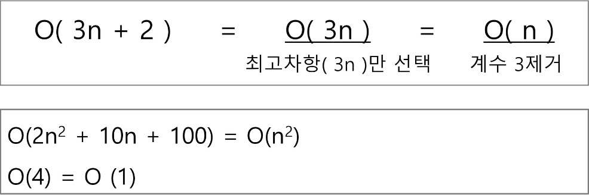

 - n개의 데이터를 입력 받아 저장한 후 각 데이터에 1씩 증가시킨 후 각 데이터를 화면에 출력하는 알고리즘의 시간복잡도는?

## 다양한 시간 복잡도의 비교
### 요소 수가 증가함에 따라 각기 다른 시간복잡도의 알고리즘은 아래와 같은 연산 수를 보인다.

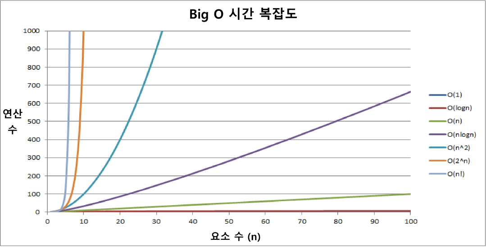

### 시간 복잡도별 실제 실행 시간 비교
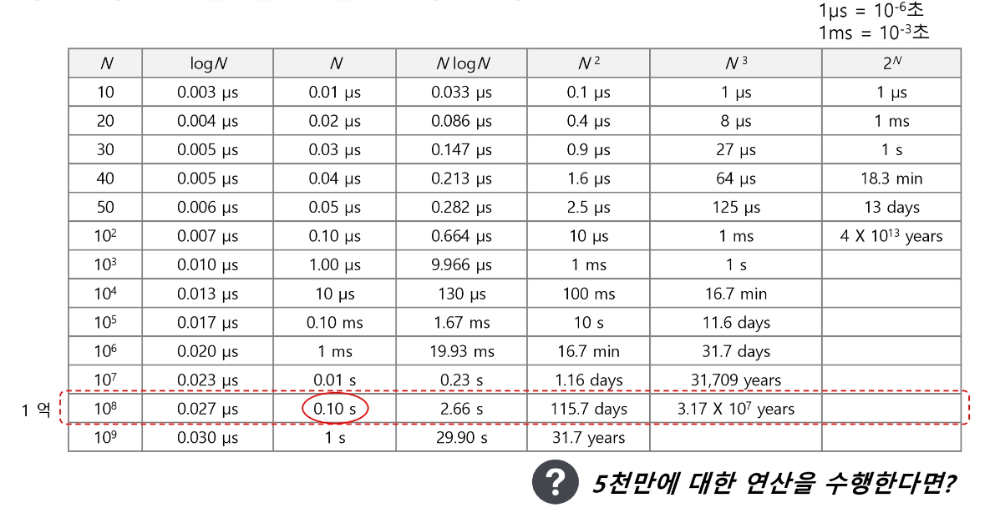

### 배열이란 무엇인가
 - 일정한 자료형의 변수들을 하나의 이름으로 열거하여 사용하는 자료구조
 - 6개의 변수를 사용해야 하는 경우, 이를 배열로 바꾸어 사용하는 예

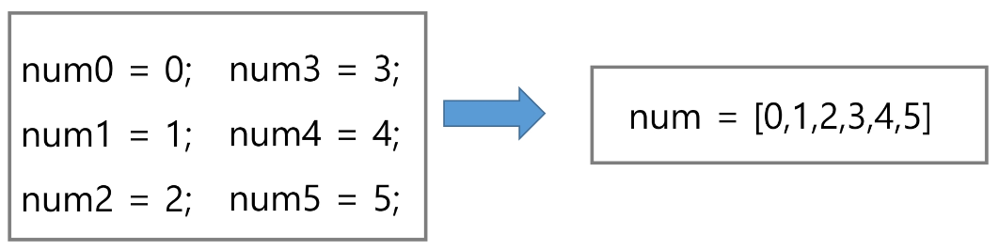

### 배열의 필요성
 - 프로그램 내에서 여러 개의 변수가 필요할 때, 일일이 다른 변수명을 이용하여 자료에 접근하는 것은 매우 비효율적이다.
 - 배열을 사용하면 하나의 선언을 통해서 둘 이상의 변수를 선언할 수 있다.
 - 단순히 다수의 변수 선언을 의미하는 것이 아니라, 다수의 변수로는 하기 힘든 작업을 배열을 활용해 쉽게 할 수 있다.

### 1차열 배열의 선언
 - 별도의 선언 방법이 없으면 변수에 처음 값을 할당할 때 생성
 - 이름: 프로그램에서 사용할 배열의 이름

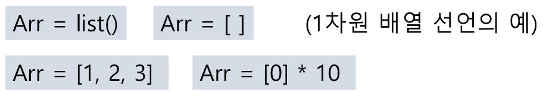

### 1차원 배열의 접근
 - Arr[0] = 10 
    - '배열 Arr의 0번 원소에 10을 저장하라'
 - Arr[idx] = 20 #'
    - '배열 Arr의 idx 원소에 20을 저장하라'

### 배열 활용 예제: Gravity
 - 상자들이 쌓여있는 방이 있다. 방이 오른쪽으로 90도 회전하여 상자들이 중력의 영향을 받아 낙하한다고 할 때, 낙차가 가장 큰 상자를 구하여 그 낮차를 리턴하는 프로그램을 작성하시오.
 - 중력은 회전이 완료된 후 적용된다.
 - 상자들은 모두 한쪽 벽면에 붙여진 상태로 쌓여 2차원의 형태를 이루며 벽에서 떨어져서 쌓인 상자는 없다.
 - 상자의 가로, 세로 길이는 각각 1이다.
 방의 가로길이는 100이며, 세로 길이도 항상 100이다.
 - 즉, 상자는 최소 0, 최대 100 높이로 쌓을 수 있다.
 - 상자가 높인 가로 칸의 수 N, 다음 줄에 각 칸의 상자 높이가 주어진다.

### 그림 설명
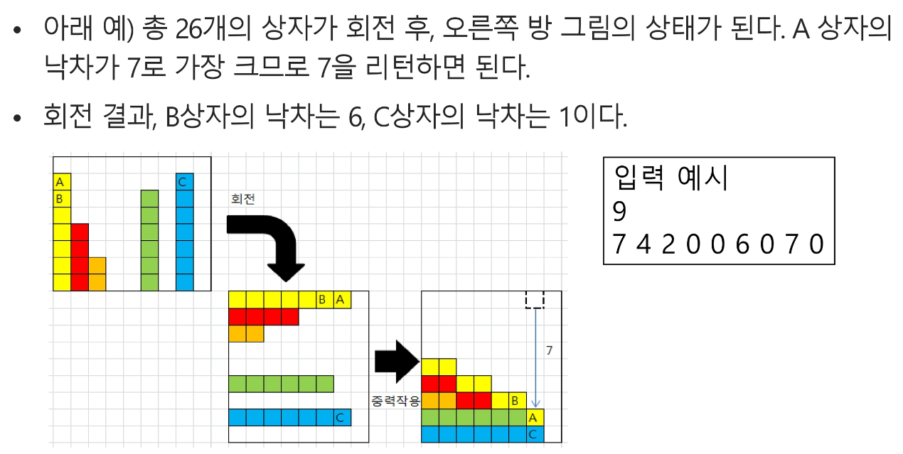

## 정렬
### 2개 이상의 자료를 특정 기준에 의해 작은 값부터 큰 값(오름차순 : ascending), 혹은 그 반대의 순서대로 (내림차순:descending) 재배열하는 것

### 대표적인 정렬 방식의 종류
 - 버블 정렬(bubble sort)
 - 카운팅 정렬(counting sort)
 - 선택 정렬(selection sort)
 - 퀵 정렬(quick sort)
 - 삽입 정렬(insertion sort)
 - 병합 저렬(merge sort)

### APS 과정을 통해 자료구조와 알고리즘을 학습하면서 다양한 혀태의 정렬을 학습하게 된다.

## 버블 정렬
### 인접한 두 개의 원소를 비교하여 자리를 계속 교환하는 방식

### 정렬 과정
 - 첫 번째 원소부터 인접한 원소끼리 계속 자리를 교환하면서 맨 마지막 자리까지 이동한다.
 - 한 단계가 끝나면 가장 큰 원소가 마지막 자리로 정렬된다.
 - 교환하면 자리를 이동하는 모습이 물 위에 올라오는 거품 모양과 같다고 하여 버블 정렬이라고 한다.

### 시간 복잡도
- O(n ** 2)

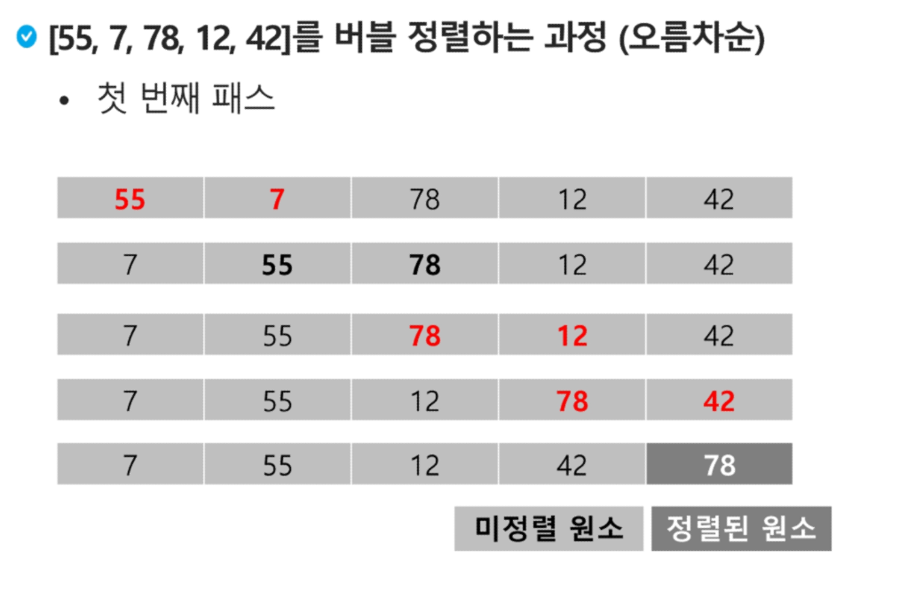
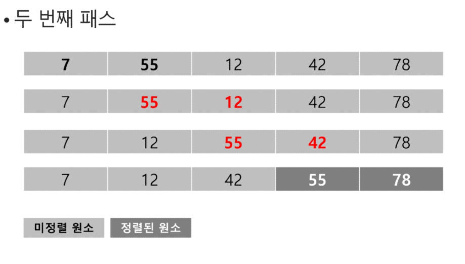
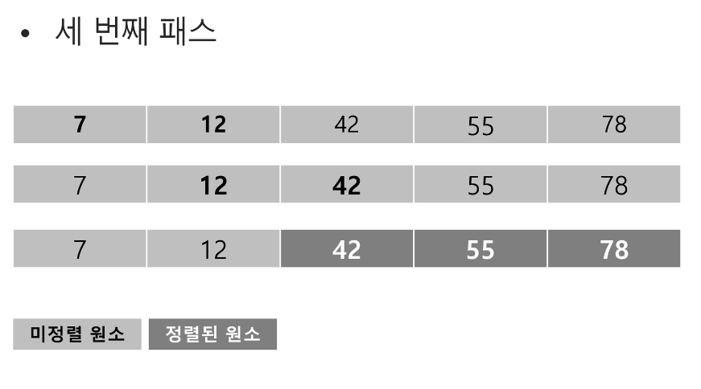
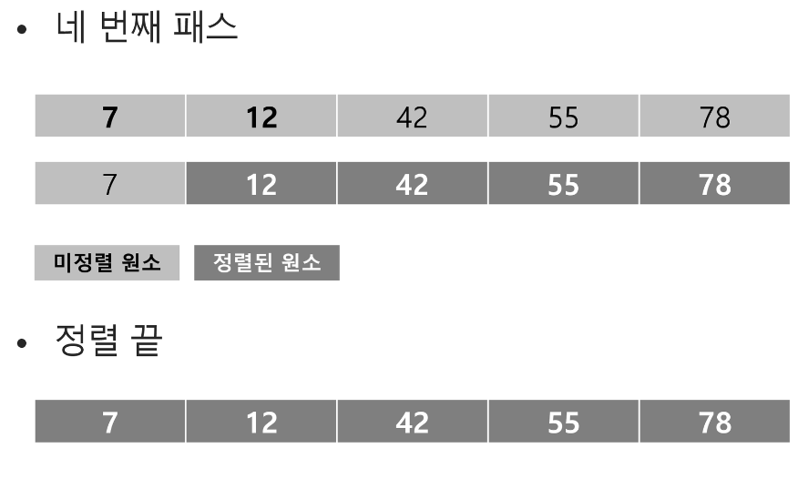

### 배열을 활용한 버블 정렬
 - 앞서 살펴 본 정렬 과정을 코드로 구현하면 아래와 같다(오름차순).

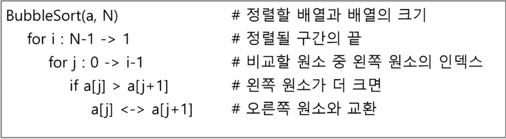
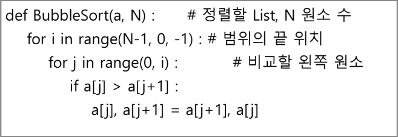

