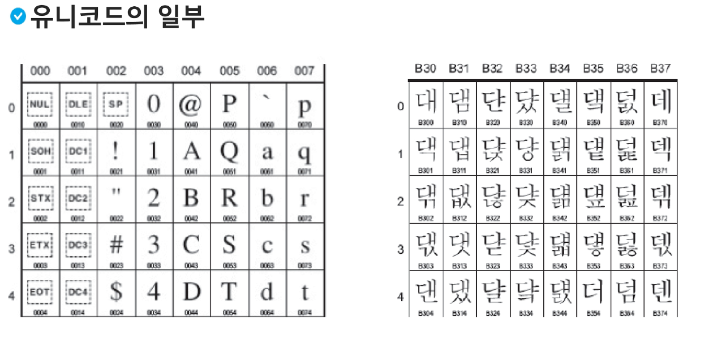
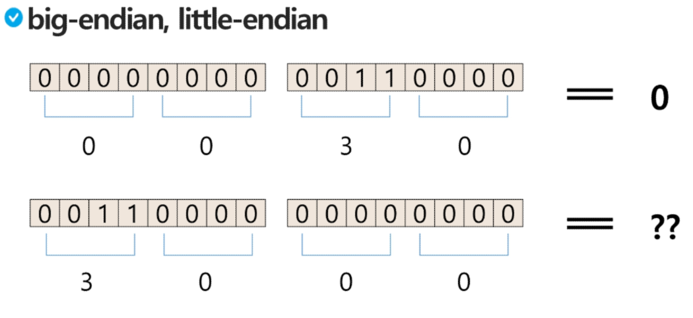
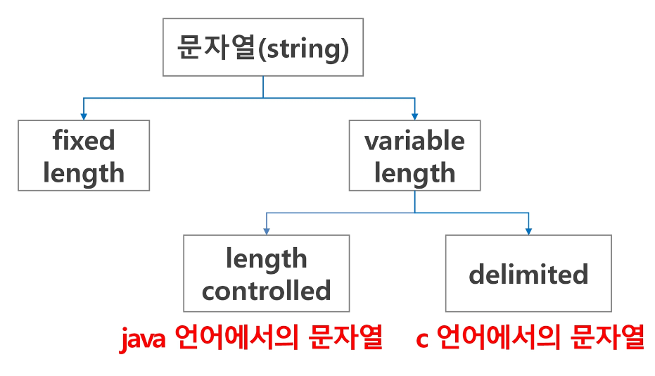
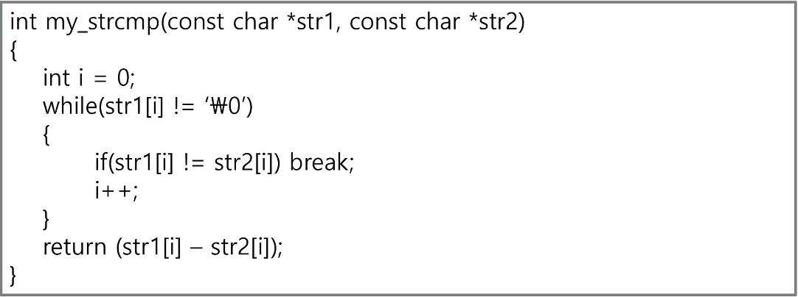

# 문자열(string)
## 문자의 표현
### 컴퓨터에서의 문자 표현
 - 글자 A를 메모리에 저장하는 방법에 대해서 생각해보자
 - 물론 칼로 A라는 글자를 새기는 방식은 아닐 것이다. 메모리는 숫자만을 저장할 수 있기 때문에 A라는 글자의 모양 그대로 비트맵으로 저장하는 방법을 사용하지 않는 한(이 방법은 메모리 낭비가 심하다) 각 문자에 대해서 대응하는 숫자를 정해 놓고 이것을 메모리에 저장하는 방법이 사용될 것이다.
 - 영어가 대소문자 합쳐서 52이므로 6(64가지)비트면 모두 표현할 수 있다.
 - 이를 코드체계라고 한다.
 - 000000 -> 'a', 000001 -> 'b'

### 그런데 네트워크가 발전되기 전 미국의 각 지역 별로 코드체계를 놓고 사용했지만
### 네트워크(인터넷: 인터넷은 미국에서 발전했다)가 발전하면서 서로 정보를 주고 받을 때 정보를 달리 해석한다는 문제가 생겼다.

### 그래서 혼동을 피하기 위해 표준안을 만들기로 했다.
### 이러한 목적으로 1967년 미국에서 ASCII(American Standard Code for Information Interchange)라는 문자 인코딩 표준이 제정되었다.

### ASCII는 7bit 인코딩으로 128문자를 표현하며 33개의 출력 불가 제어 문자들과 공백을 비롯한 95개의 출력 가능한 문자들로 이루어져 있다.

### 출력 가능한 아스키 문자(32~126)

### 확장 아스키는 표준 문자 이외의 악센트 문자, 도형 문자, 특수 무자, 특수 기호 등 부가적인 문자를 128개 추가할 수 있게 하는 부호이다.
 - 표준 아스키는 7bit를 사용하여 문자를 표현하는 데 비해 확장 아스키는 1Byte 내의 8-bit를 모두 사용함으로써 추가적인 문자를 표현할 수 있다.
 - 컴퓨터 생산자와 소프트웨어 개발자가 여러 가지 다양한 문자에 할당할 수 있도록 하고 있다. 이렇게 할당된 확장 부호는 표준 아스키와 같이 서로 다른 프로그램이나 컴퓨터 사이에 교환되지 못한다.
 - 그러므로 표준 아스키는 마이크로컴퓨터 하드웨어 및 소프트웨어 사이에서 세계적으로 통용되는 데 비해, 확장 아스키는 프로그램이나 컴퓨터 또는 프린터가 그것을 해독할 수 있도록 설계되어 있어야만 올바로 해독될 수 있다.

### 그런데 컴퓨터가 발전하면서 미국 뿐 아니라 각 나라에서도 컴퓨터가 발전했으며 각 국가들은 자국의 문자를 표현하기 위하여 코드체계를 만들어서 사용하게 되었다.
 - 우리나라도 아주 오래된 이야기지만 한글 코드체계를 만들어 사용했고 조합형, 완성형 두 종류를 가지고 있었다.

### 인터넷이 전 세계로 발전하면서 ASCII를 만들었을 때의 무제와 같은 문제가 국가 간에 정보를 주고 받을 때 발생했다.

### 자국의 코드체계를 타 국가가 가지고 있지 않으면 정보를 잘못 해석할 수 밖에 없었다.

### 그래서 다국어 처리를 위해 표준을 마련했다. 이를 유니코드라고 한다.

### 유니코드도 다시 Character Set으로 분류된다.
 - UCS-2 (universal character set 2)
 - UCS-4 (universial character set 4)
 - 유니코드를 저장하는 변수의 크기를 정의
 - 그러나, 바이트 순서에 대해서 표준화하지 못했음
 - 다시 말해 파일을 인식 시 이 파일이 ucs-2, ucs-4인지 인식하고 각 경우를 구분해서 모두 다르게 구현해야 하는 문제 발생
 - 그래서 유니코드의 적당한 외부 인코딩이 필요하게 되었다.

### 유니코드 인코딩(UTF: Unicode Transformation Format)
- UTF-8(in web)
    - Min: 8bit Max: 32bit(1 Byte * 4) 0 + 7 bit
- UTF-16(in windows, java)
    - Min: 16bit Max: 32bit(2 Byte * 2) 110 + 5bit / 10 + 6 bit
- UTF-32(in unix)
    -Min: 32bit Max: 32bit (4 Byte * 1)

### Python 인코딩
- 2.x 버전 - ASCII - #-*-coding: utf-8 -*-(첫 줄에 명시)
- 3.x 버전 - 유니코드 UTF-8 -> 생략 가능
- 다른 인코딩 방식으로 처리 시 첫 줄에 작성하는 위 항목에 원하는 인코딩 방식을 지정해주면 됨

## 문자열
### 문자열의 분류

### java에서 string 클래스에 대한 메모리 배치 예
 - 그림에서 보이듯, java, lang, String 클래스에는 기본적인 객체 메타 데이터 외에도 네 가지 필드들이 포함되어 있는데, hash값(hash), 문자열의 길이(count), 문자열 데이터의 시작점(offset), 그리고 실제 문자열 배열에 대한 참조(value)이다.

### C언어에서 문자열 처리
 - 문자열은 문자들의 배열 형태로 구현된 응용 자료형
 - 문자배열에 문자열을 저장할 때는 항상 마지막에 끝을 표시하는 널문자('\0')를 넣어줘야 한다.

 - 문자열 처리에 필요한 연산을 함수 형태로 제공한다.
 strlen(), strcpy(), strcmp() ... 

### 다음 두 코드의 차이를 이해하기
s1 = list(input())
s2 = input()

### strlen() 함수 만들어 보기
def strlen(a): # '\0'을 만나면 '\0'을 제외한 글자수를 리턴
    # while을 써서 함수를 완성해보세요

a = ['a', 'b', 'c', '\0']
print(strlen(a))

### Java(객체지향 언어)에서의 문자열 처리
 - 문자열 데이터를 저장 처리해주는 클래스를 제공한다.
 - string 클래스를 사용한다.
 String str= "abc" // 또는 String str = new String("abc")

 - 문자열 처리에 필요한 연산을 연산자, 메소드 형태로 제공한다.
 +, length(), replace(), split(), substring(),...보다 풍부한 연산을 제공한다.

### Python에서의 문자열 처리
 - char 타입 없음
 - 텍스트 데이터의 취급 방법이 통일되어 있음
 - 문자열 기호
    '(홑따옴표), "(쌍따옴표), '''(홑따옴표 3개), """(쌍따옴표 3개)
    + 연결(Concatenation)
        - 문자열 + 문자열 : 이어 붙여주는 역할
    + 반복
        - 문자열 * 수 : 수만큼 문자열이 반복

### Python에서의 문자열 처리
 - 문자열은 시퀀스 자료형으로 분류되고, 시퀀스 자료형에서 사용할 수 있는 인덱싱, 슬라이싱 연산들을 사용할 수 있음

 - 문자열 클래스에서 제공되는 메소드
 replace(), split(), isalpha(), find()

 - 문자열은 튜플과 같이 요소값을 변경할 수 없음(immutable)

### C와 Java의 String 처리의 기본적인 차이점
 - C는 아스키 코드로 저장한다.
 - java는 유니코드(UTF16, 2byte)로 저장한다.
 - Python은 유니코드(UTF8) 로 저장
 

### 자기 문자열에서 뒤집는 방법이 있고 새로운 빈 문자열을 만들어 소스의 뒤에서부터 읽어서 타겟에 쓰는 방법이 있겠다.

### 자기 문자열을 이용할 경우 swap을 위한 임시 변수가 필요하며 바복 수행을 문자열 길이의 반만을 수행해야 한다.
 

## <연습문제 1> 문자열 뒤집기
### Python에서 문자열 뒤집기
 

### for 문을 이용해 구현해봅시다.

### c strcmp()함수를 제공한다.
### Java에서는 equals() 메소드를 제공한다.
 - 문자열 비교에서 == 연산은 메모리 참조가 같은지를 묻는 것

### 파이썬에서는 == 연산자와 is 연산자를 제공한다.
 - == 연산자는 내부적으로 특수 메서드 __eq__()를 호출

[참고] s1과 나머지 문자열을 ==, is로 비교한 결과를 확인해보세요
s1 = 'abc'
s2 = 'abc'
s3 = 'def'
s4 = s1
s5 = s1[:2] + 'c'

### 다음 C 코드를 참고해 문자열 비교함수를 만들어보자
 - 문자열이 같으면 0 리턴
 - str1이 str2보다 사전 순서상 앞서면 음수 혹인 -1 리턴
 - str1이 str2보다 사전 순서상 나중이면 양수 혹은 1 리턴
 

### C 언어에서는 atoi() 함수를 제공한다. 역함수로는 iota()가 있다.

### java에서는 숫자 클래스의 parse 메소드를 제공한다.
- ex) integer.parselnt(String)
- 역함수로는 toString() 메소드를 제공한다.

### 파이썬에서는 숫자와 문자변환 함수를 제공한다.
ex) int("123"), float("3.14"), str(123), repr(123)

### int()와 같은 atoi() 함수 만들기
s = '123'
a = atoi(s)
print(a + 1)

'''
def atoi(s):
    i = 0
    for x in s:
        i = i * 10 + ord(x)-ord('0')
    return i
'''

## <연습문제 2>
### str() 함수를 사용하지 않고, itoa()를 구현해봅시다.
- 양의 정수를 입력받아 문자열로 변환하는 함수
- 입력 값: 변환할 정수 값, 변환된 문자열을 저장할 문자배열
- 반환 값: 없음
    [참고] ord(), chr()
- 음수를 변환할 때는 어떤 고려사항이 필요한가요?