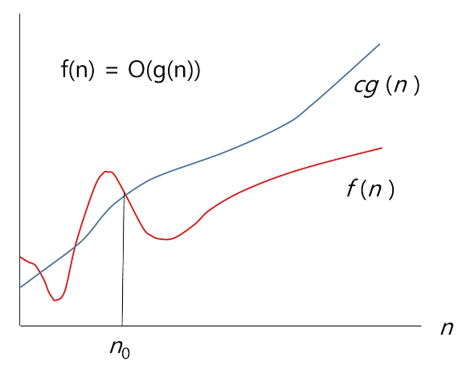
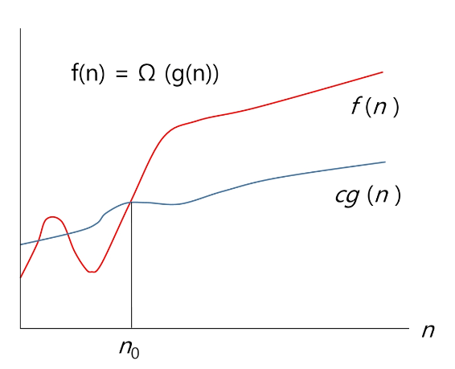
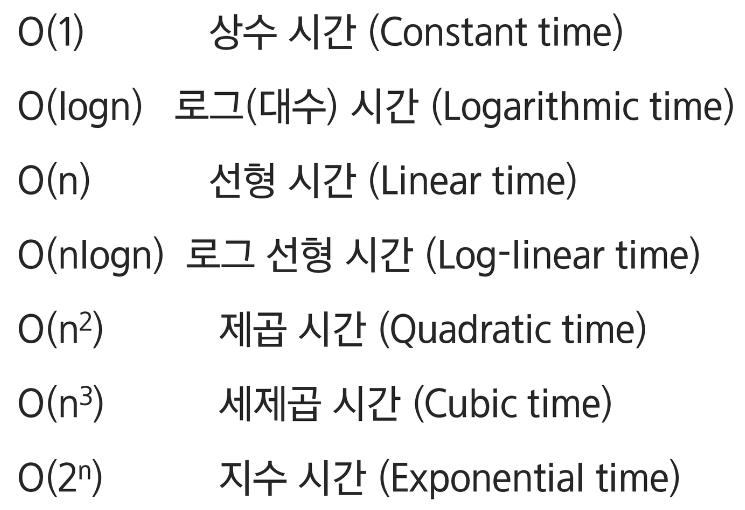
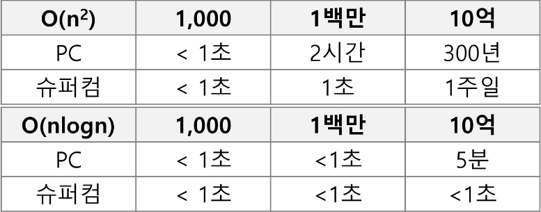
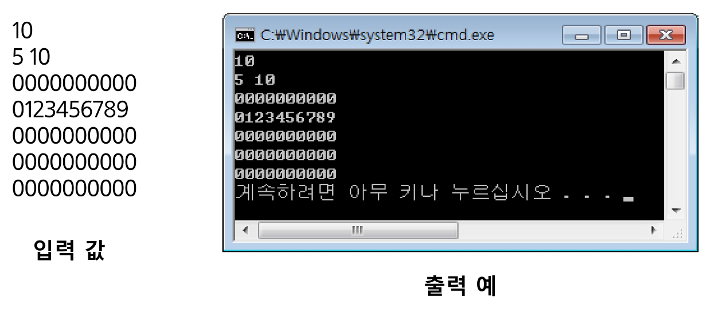
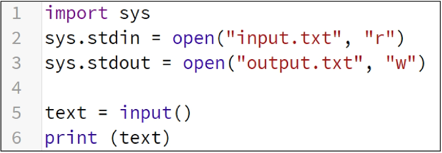
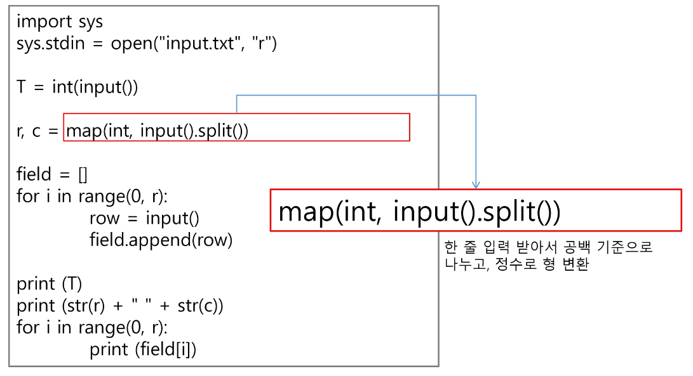
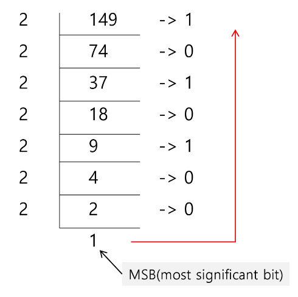
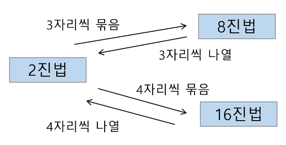

# Start
## SW 문제 해결
### 코딩 교육 이슈
 - 오바마 대통령: 모든 학생들에게 균등한 컴퓨터 교육기회가 제공되어야 한다고 연설(2010년)
 - 핀란드: 초등학교 SW 코딩 교육 도입, 컴퓨터의 작동 원리를 이해하도록 돕는 것이 목적
 - 영국: 6세부터 15세 사이의 학생들. 컴퓨터 프로그램을 제작하는 전문적 교육 과정에 초점.
 - 중국: 2001년 코딩 교육 의무 교육 시작. 초3~중3 학생들은 연간 70시간 이상의 코딩 교육. 고등학교 인공 지능 수업을 필수

### 프로그래밍하기 위한 제약 조건과 유구 사항
 - 프로그래밍 언어의 특성
 - 프로그램이 동작할 HW와 OS에 관한 지식
 - 라이브러리들의 유의 사항들
 - 프로그램이 사용할 수 있는 최대 메모리
 - 사용자 대응 시간 제한
 - 재사용성이 높은 간결한 코드

### SW 문제 해결 역량이란 무엇인가?
 - 프로그램을 하기 위한 많은 제약조건과 요구사항을 이해하고 최선의 방법을 찾아내는 능력
 - 프로그래머가 사용하는 언어나 라이브러리, 자료구조, 알고리즘에 대한 지식을 적재적소에 퍼즐을 배치하듯 이들을 연결하여 큰 그림을 만드는 능력이라 할 수 있다.
 - 문제 해결 역량은 추상적인 기술이다.
    - 프로그래밍 언어, 알고리즘처럼 명확히 정의된 실체가 없다.
    - 무작정 알고리즘을 암기하고 문제를 풀어본다고 향상되지 않는다.
 - 문제 해결 역량을 향상시키기 위해서 훈련이 필요하다.

### 문제 해결 능력을 훈련하기 위해서는
 - 일부 새로운 언어, 프레임워크, 개발 방법론만을 배워나가는 것만으로 충분하지 않다.
 - 이들을 조합해 나가는 방법을 배워야 하지만 쉽지 않다.
 - 경험을 통해서 나아지리라 막연히 짐작만 한다. 그러나 경험에서는 문제 해결능력을 개발할 수 있는 상황이 항상 주어지는 것이 아니며 또한 그런 상황에서 자기 개발을 하기는 쉽지 않다.
 - 상황을 인위적으로 만들어 훈련해야 한다. 즉 잘 정제된 추상적인 문제를 제시하고 이를 해결해 가면서 문제 해결 능력을 향상시킬 수 있는 훈련이 필요하다.

### 문제 해결 과정
 - 1. 문제를 읽고 이해한다.
 - 2. 문제를 익숙한 용어로 재정의한다.
 - 3. 어떻게 해결할 지 계획을 세운다.
 - 4. 계획을 검증한다.
 - 5. 프로그램으로 구현한다.
 - 6. 어떻게 풀었는지 돌아보고, 개선할 방법이 있는지 찾아본다.

### 문제 해결 전략
 - 직관과 체계적인 접근

### 체계적인 접근을 위한 질문들
 - 비슷한 문제를 풀어본 적이 있던가?
 - 단순한 방법에서 시작할 수 있는가?
 - 문제를 단순화할 수 있는가?
 - 그림으로 그려볼 수 있는가?
 - 수식으로 표현할 수 있을까?
 - 문제를 분해할 수 있을까?
 - 뒤에서부터 생각해서 문제를 풀 수 있을까?
 - 특정 형태의 답만을 고려할 수 있을까?

## 복잡도 분석
### 알고리즘?
 - (명) 알고리즘: 유한한 단계를 통해 문제를 해결하기 위한 절차나 방법이다.
 - 주로 컴퓨터 용어로 쓰이며, 컴퓨터가 어떤 일을 수행하기 위한 단계적 방법을 말한다.
 - 간단하게 다시 말하면 어떠한 문제를 해결하기 위한 절차라고 볼 수 있다.
 - 예를 들어 1에서 100까지의 합을 구하는 문제를 생각해보자

```
n = int(input())

sum_v = 0
for i in range(1, n+1):
    sum_v += i
print(sum_v)

val = n * (n + 1) / 2
print(val)
```

### 알고리즘의 효율
 - 공간적 효율성과 시간적 효율성
 - 공간적 효율성은 연ㅇ산량 대비 얼마나 적은 메모리 공간을 요하는 가를 말한다.
 - 시간적 효율성은 연산량 대비 얼마나 적은 시간을 요하는 가를 말한다.
 - 효율성을 뒤집어 표현하면 복잡도(Complexity)가 된다. 복잡도가 높을수록 효율성은 저하된다.
    = 반복(문)을 얼마나 많이 썼는가

### 알고리즘의 효율
 - 시간적 복잡도 분석
    - 하드웨어 환경에 따라 처리시간이 달라진다.
        - 부동소수 처리 프로세서 존재유무, 나눗셈 가속기능 유무
        - 입출력 장비의 성능, 공유 여부
    - 소프트웨어 환경에 따라 처리시간이 달라진다.
        - 프로그램 언어의 종류
        - 운영체제, 컴파일러의 종류
    - 이러한 환경적 차이로 인해 분석이 어렵다.

### 복잡도의 점근적 표기
 - 시간 (또는 공간)복잡도는 입력 크기에 대한 함수로 표기하는데, 이 함수는 주로 여러 개의 항을 가지는 다항식이다.
 - 이를 단순한 함수로 표현하기 위해 점근적 표기(Asymptotic Notation)를 사용한다.
 - 입력 크기 n이 무한대로 커질 때의 복잡도를 간단히 표현하기 위해 사용하는 표기법이다.
 - O(Big-Oh) - 표기
 - Ω(Big-Omega) - 표기
 - Θ(Big-Theta) - 표기

### O(Big-Oh)- 표기
 - O - 표기는 복잡도의 점근적 상한을 나타낸다.
 - 복잡도가 f(n) = 2n²-7n+4이라면, f(n)의 O-표기는 O(n²)이다.
 - 먼저 f(n)의 단순화된 표현은 n²이다.
 - 단순화된 함수 n²에 임의의 상수 c를 곱한 cn²이 n이 증가함에 따라 f(n)의 상한이 된다.
 - 단 c > 0
 - 상수반복 : O(1)


표기법 중에 O(5N)과 같은 형태가 존재한다.
 - 5배수 강조해서 표현하고 싶을 때 이렇게 적는다.
 - why? 알고리즘 성능을 미세하게 비교하고 싶은 경우:
    - 기존 성능이 O(7n)인데 새로운 성능은 O(2n)인 경우

로그 복잡도 분석
- log₂N이고 (로그 분석은 밑이 항상 '2'다)
- 앞으로 밑이 생략되어도 다 2라고 생각하면 된다.
- 복잡도는 항상 올림처리 ex) log₂10000 = 13.2 -> 14

.pop(0)
복잡도 O(n)이다. why? pop 이후 n-1개의 원소가 앞으로 한 칸씩 땡겨야하니까
.popleft()
복잡도 O(1)이다.

O(logn) - 이진탐색
O(nlogn) - sort()

단순히 "실행시간이 n²에 비례"하는 알고리즘이라고 말함
## 복잡도 분석
### 복잡도 f(n)과 O-표기를 그래프로 나타내고 있다.

### n이 증가함에 따라 O(g(n))이 점근적 상한이라는 것(즉, g(n))이 n0보다 큰 모든 n에 대해서 항상 f(n)보다 크다는 것을 보여준다.


### Ω(Big-Omega)-표기
 - 복잡도의 점근적 하한을 의미한다.
 - f(n) = 2n²-7n+4의 Ω-표기는 Ω(n²)이다.
 - f(n) = Ω(n²)은 "n이 증가함에 따라 2n²-7n+4이 cn²보다 작을 수 없다."라는 의미이다.
 - 이 때 상수 c= 1로 놓으면 된다.
 - O-표기 때와 마찬가지로, Ω-표기도 복잡도 다항식의 최고차항만 계수 없이 취하면 된다.
 - "최소한 이만한 시간은 걸린다."

### 복잡도 f(n)과 Ω-표기를 그래프로 나타낸 것인데, n이 증가함에 따라 Ω(g(n))이 점근적 하한이라는 것(즉, g(n)이 n0보다 큰 모든 n에 대해서 항상 f(n)보다 작다는 것)을 보여준다.


### Θ(Theta)-표기
 - O-표기와 Ω-표기가 같은 경우에 사용한다.
 - f(n) = 2n²+8n+3 = O(n²) = Ω(n²)이므로, f(n) = Θ(n²)이다.
 - f(n)은 n이 증가함에 따라 **n²과 동일한 증가율을 가진다**라는 의미이다.

### 자주 사용하는 O-표기


### 왜 효율적인 알고리즘이 필요한가
 - 10억개의 숫자를 정렬하는데 PC에서 O(n²) 알고리즘은 300여년이 걸리는 반면에 O(nlogn) 알고리즘 5분 만에 정렬한다.


- 효율적인 알고맂므은 슈퍼컴퓨터보다 더 큰 가치가 있다.
- 값비싼 HW의 기술개발보다 효율적인 알고리즘 개발이 훨씬 더 경제적이다.

## 표준 입출력 방법
### Python3 표준입출력
 - 입력
    - Raw 값의 입력: input()
        - 받은 입력값을 문자열로 취급
    - Evaluated된 값 입력: eval(input())
        - 받은 입력값을 평가된 데이터 형으로 취급

 - 출력
    - print()
        - 표준 출력 함수, 출력값의 마지막에 개행 문자 포함
    - print('text', end='')
        - 출력 시 마지막에 개행문자 제외할 시
    - print('%d %number)
        - Formatting된 출력

### 문제 제시: 다음 내용을 표준 입력으로 읽어들여 변수에 저장 후 출력하시오


### 파일의 내용을 표준 입력으로 읽어오는 방법
import sys
sys.stdin = open("a.txt", "r")

같은 디렉토리로 하는 게 좋음
(다른 디렉토리로 할 시 경로설정을 해야함)
코드를 제출할 때는 파일 입력하는 코드를 주석처리하고 제출한다.
(감점 혹은 런타임 에러 뜬다.)

### Python3 소스 코드


## 진수
### 2진수, 8진수, 10진수, 16진수
 - 10진수: 사람이 사용하는 진수, 0~9로 표현
 - 2진수: 컴퓨터가 사용하는 진수, 0~1로 표현
 - 8진수: 2진수를 더 가독성 있게 사용
 - 16진수: 2진수를 더 가독성 있게 사용. 0~9,A~F로 표현
    - 16진수는 왜 중요한가?
    - 2진수를 10진수로 변환 시 연산이 오래 걸림
    - 16진수로 변환 시 연산 속도가 매우 빠름 **(현업 사용)**

계산기 : window+r (실행) => calc 입력
alt + 4 누를 시 프로그래머 창 켜짐
HEX - 16진수
DEC - 10진수
OCT - 8진수
BIN - 2진수

## 진법 변환
### 10진수 -> 타 진수로 변환
 - 원하는 타진법의 수로 나눈 뒤 나머지를 거꾸로 읽는다.
 - 예제) (149)10 = (10010101)2 = (225)8 = (95)16


### 타 진수 -> 10진수로 변환
 - 예 (135)8 = 1 * 8^2 + 3 * 8^1 + 5 * 8^0 = (93)10
 - 소수점이 있을 때의 예)
 - (135.12)8 = 1 * 8^2 + 3 * 8^1 + 5 * 8^0 + 1 * 8^-1 + 2 * 8^-2 = (93.15625)10

### 2진수, 8진수, 16진수 변환

진수표 암기 권장 (0~15)10
16진수는 앞에 0x를 붙인다
16진수 0xF9 = (1111 1001)2
16진수 0xBB3 = (1011 1011 0011)2
2진수 1100101111 = 16진수 0x32F
