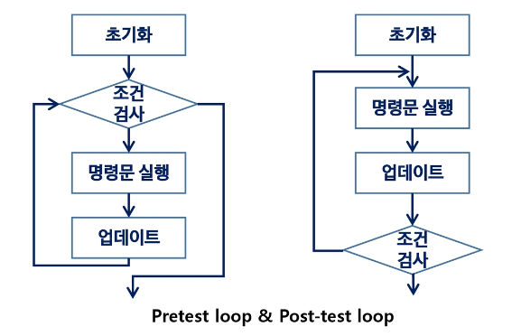
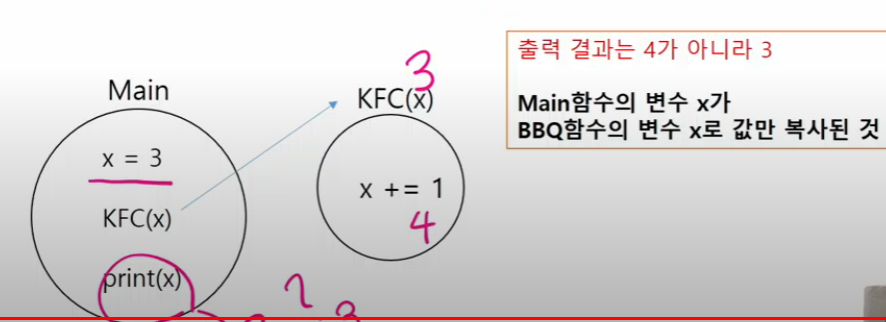
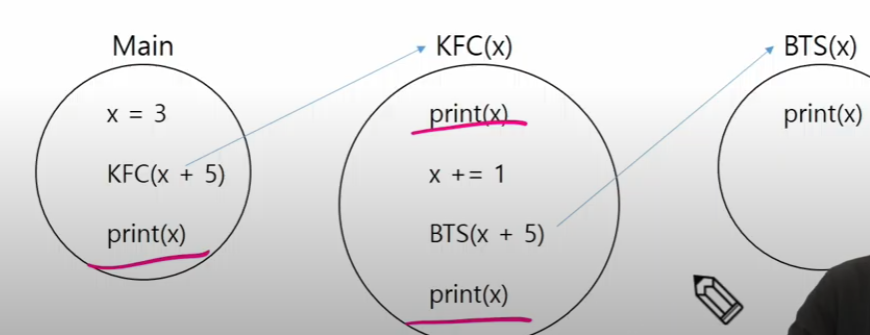
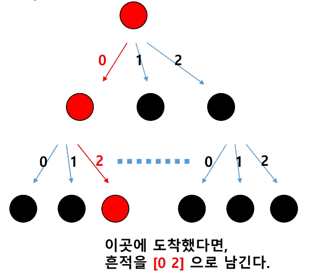
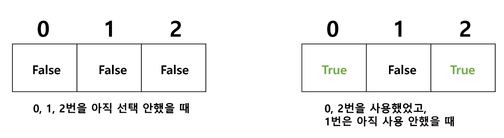

# 완전 검색 & 그리디
## 학습목표
 1. 재귀적 알고리즘의 특성을 이해하고 이를 구현하기 위한 재귀 호출에 대해 학습한다.
 2. 완전 검색의 개념을 이해하고 완전 검색을 통한 문제 해결 방법에 대해 학습한다.
 3. 조합적 문제(combinatorial Problems)에 대한 완전 검색 방법에 대해 이해한다.
     - 순열, 조합, 부분집합을 생성하는 알고리즘을 학습한다.
 4. 탐욕 알고리즘 기법의 개념과 주요 특성을 이해한다.

## 반복(Iteration)과 재귀(Recursion)
 1. 반복과 재귀는 유사한 작업을 수행할 수 있다.
 2. 반복은 수행하는 작업이 완료될 때까지 계속 반복
     - 루프 (for, while 구조)
 3. 재귀는 주어진 문제의 해를 구하기 위해 동일하면서 더 작은 문제의 해를 이용하는 방법
     - 하나의 큰 문제를 해결할 수 있는 (해결하기 쉬운) 더 작은 문제로 쪼개고 결과들을 결합한다.
     - 재귀 함수로 구현

### 반복구조
 1. 초기화
    - 반복되는 명령문을 실행하기 전에 (한번만) 조건 검사에 사용할 변수의 초기값 설정
 2. 조건 검사 (check control expression)
 3. 반복할 명령문 실행 (action)
 4. 업데이트 (loop update)
     - 무한 루프가 되지 않게 조건이 거짓이 되게 한다.
    


### 반복을 이용한 선택정렬
```
def SelectionSort(A):
n = len(A)
for i in range(0, n-1):
    minl = i
    for j in range(i+1, n):
        if A[j] < A[minl]:
            minl = j
    A[minl], A[i] = A[i], A[minl]
```

### 재귀적 알고리즘
 1. 재귀적 정의는 두 부분으로 나뉜다.
 2. 하나 또는 그 이상의 기본 경우 (basic case or rule)
     - 집합에 포함되어 있는 원소로 induction을 생성하기 위한 시드(seed) 역할
 3. 하나 또는 그 이상의 유도된 경우(inductive case or rule)
     - 새로운 집합의 원소를 생성하기 위해 결합되어지는 방법

### 재귀 함수
 - 함수 내부에서 직접 혹은 간접적으로 자기 자신을 호출하는 함수
 - 일반적으로 재귀적 정의를 이용해서 재귀함수를 구현한다.
 - 따라서, 기본 부분(basis part)와 유도 부분(inductive part)으로 구성된다.
 - 재귀적 프로그램을 작성하는 것은 반복 구조에 비해 간결하고 이해하기 쉽다.
     - 그러나 재귀에 대해 익숙하지 않은 개발자들은 재귀적 프로그램이 어렵다고 느낀다.
 - 함수 호출은 프로그램 메모리 구조에서 스택을 사용한다. 따라서 재귀 호출은 반복적인 스택의 사용을 의미하며 메모리 및 속도에서 성능 저하가 발생한다.

### 팩토리얼 재귀 함수
 - 재귀적 정의
    Basis rule: 
        n <= 1, n = 1
    Inductive rule:
        n > 1, n! = n * (n-1)!
 - n에 대한 재귀함수
 ```
 def fact(n):       # basis part
    if n <= 1:
        return 1
    else:           # inductive part
        return n * fact(n-1)
 ```

### 재귀를 연습하기 전, 알아야 하는 함수의 특징 1
 1. KFC 함수를 호출할 때, int 타입 객체를 전달하면 값만 복사가 된다.
 2. 아래 예시에서 main 함수의 x와 KFC 함수의 x는 서로 다른 객체이다.
 (마치 한국 사는 KIM과 미국 사는 KIM처럼)


### 재귀를 연습하기 전, 알아야 하는 함수의 특징 2
 - 함수가 끝나면 Main으로 돌아오는 것이 아니라, 해당 함수를 호출했던 곳으로 돌아온다.

 - 아래 코드의 실행 결과는?


 - 함수가 끝나면 Main으로 되돌아 오는 것이 아니라, 해당 함수를 호출했던 곳으로 돌아온다.
 - 우측 코드의 실행 결과는?
```
def BBQ(x):
    x += 10
    print(x)

def KFC(x):
    print(x)
    x += 3
    BBQ(x+2)
    print(x)

x = 3
KFC(x+1)
print(x)
```

### [도전] 무한 재귀호출(제한시간 2분)
 - 아래와 그림과 같은 코드를 직접 구현해라
     - 첫 번째 KFC 함수의 x 값은 0이 된다.
     - 두 번째 KFC 함수의 x 값은 1이 된다.
     - 3번째 KFC 함수의 x 값은 2가 된다.
    
 - 무한 재귀 호출이 발생하면 어떻게 되는지, 직접 코드를 작성하고 실행해보자.

```
def KFC(x):
    KFC(x+1)

KFC(0)
print('끝')
```
RecursionError: maximum recursion depth exceeded

### 재귀호출 공부의 시작은, 무한 재귀호출을 막는 것부터 시작한다.
 - 출력결과는 0 1 1 0 이다.
 - 아래 if문을 "기저조건 (base case)"이라고 한다.

```
def KFC(x):
    if x == 2:
        return
    print(x)
    KFC(x+1)
    print(x)

KFC(0)
print('끝')
```

### [도전] 0 1 2 3 4 5 5 4 3 2 1 0을 재귀호출을 이용하여 구현한다. (제한시간: 3분)
```
def recur(x):
    if x == 6:
        return
    print(x, end= ' ')
    recur(x+1)
    print(x, end=' ')

recur(0)
print('끝')
```

0 1 2 3 4 5 5 4 3 2 1 0 끝

### 재귀함수 코드가 1개
 - KFC 함수 내부에 KFC(x+1) 재귀 호출 코드가 하나인 경우 예시 그림 출력 결과는 1 0이다.

```
def KFC(x):
    if x == 2:
        return
    KFC(x + 1)
    print(x, end= ' ')

KFC(0)
```

### 재귀호출 코드가 2개
 - KFC 함수 내부에 KFC(x+1) 재귀 호출 코드가 두 개
 - 출력결과: 110

```
def KFC(x):
    if x == 2:
        return
    KFC(x+1)
    KFC(x+1)
    print(x)

KFC(0)

1
1
0
```
### [도전] Depth 3, 재귀호출 개수 4개인 경우 그림 그려보기
     - 제한시간: 1분
     - 그림판에 직접 트리형태로 그려보자

```    
def KFC(x):
    if x == 3:
        return
    
    KFC(x+1)
    KFC(x+1)
    KFC(x+1)
    KFC(x+1)

KFC(0)
```

### [도전] 트리형태를 보고, 직접 재귀호출 코드 구현하기
 - Branch, level 파악 후 직접 구현한다.
```
def tree(x):
    if x == 3:
        return
    tree(x+1)
    tree(x+1)

tree(0)
```

## 순열(Permutation)
 - 서로 다른 N개에서, R개를 중복 없이, 순서를 고려해 나가는 것

ex) 0 1 2 로 구성된 3장의 카드 중 2장을 뽑아 순열을 나열하라
    3P2 = 6

### 중복순열이란?
    - 서로 다른 N개에서 R개를 중복 허용하고, 순서를 고려하여 나열하는 것
    0 1 2 // 3장의 카드 중 2장을 뽑아 중복순열 나열
    3 ** 2 = 9

### 중복순열 구현 원리
 1. 재귀호출을 할 때마다 이동 경로를 흔적으로 남긴다.
 2. 가장 마지막레벨에 도착했을 때, 이동 경로를 출력한다.



### 순열 구현 원리
 1. 재귀호출을 할 때마다, 이동 경로를 흔적으로 남긴다.
 2. 가장 마지막 레벨에 도착했을 때 이동 경로(흔적)를 출력한다.

### 먼저 path라는 전역 리스트를 준비한다. 그리고 Level 2, Branch 3으로 동작되는 재귀 코드를 구현한다.

### 재귀호출을 하기 직전에 이동할 곳의 위치를 path 리스트에 기록한다.

### 재귀호출 되었다. 그리고 다시 path.append(i)를 수행한다.

### 두 번 재귀호출 되었고 이제 바닥에 도착했으니 이제 출력하는 코드를 수행한다.

### 함수가 리턴되고, 되돌아오자마자 기록을 삭제한다.

### 다시 for문이 이어서 진행되고 값 i는 1이 된다.

### 재귀호출이 되고 path 값을 출력한다.

### 완성된 순열 소스코드 [0,0] ~ [2,2]까지 출력하는 소스코드

```
path = []

def KFC(x):
    if x == 2:
        print(path)
        return
    for i in range(3):
        path.append(i)
        KFC(x+1)
        path.pop()

KFC(0)   
```

### [도전] 중복순열[1,1,1]~[6,6,6]까지 출력하는 코드를 재귀호출로 구현하자

```
path = []
def call(x):
    if x == 3:
        print(path)
        return
    for i in range(1, 7):
        path.append(i)
        call(x+1)
        path.pop()

call(0)
```

### 중복을 취급하지 않는 "순열" 구현 방법
 1. 중복순열 코드를 작성한다.
 2. 중복을 제거하는 코드를 추가하면 순열 코드가 된다.

### 중복을 제거하는 원리
 1. 전역 리스트를 사용하면 이미 선택했던 숫자인지 아닌지 구분할 수 있다.
 2. 이를 used 배열 또는 visited 배열이라고 한다.
    (DFS, BFS에 사용되는 것과 같다.)

### 중복을 제거 예시
 - 0을 선택하고 재귀호출 한 후에는 또 다시 0을 선택하지 못하도록 막아야한다.

### 재귀 호출을 하기 직전, 이미 선택했던 숫자인지 아닌지 검사하는 코드가 필요하다.

### 이미 사용한 숫자인지 아닌지 구분하는 List 준비하기
 - 전역으로 used라는 리스트를 준비한다.
 used = [False, False, False]
 used = [False for _ in range(3)]


### 순열 구현하기 1
 - 이미 사용을 한 숫자인지 아닌지 구분하는 코드
 - 만약 이미 사용한 숫자일 경우, 재귀호출을 생략하는 코드를 추가

### 순열 구현하기 2
 - 처음 사용하는 숫자라면 Used에 기록해준다.
 - 그리고 모든 처리가 끝나고 돌아왔다면, Used에 기록을 지워준다.

```
path = []
used = [False for _ in range(3)]

def KFC(x):
    if x == 2:
        print(path)
        return
    
    for i in range(3):
        if used[i] == True:
            continue
        used[i] = True
        path.append(i)
        KFC(x+1)
        path.pop()
        used[i] = False
KFC(0)
```
[0, 1]
[0, 2]
[1, 0]
[1, 2]
[2, 0]
[2, 1]

### [도전] 중복 순열과 순열 구현하기
 - N개의 주사위를 던져 나올 수 있는 모든 중복 순열(type1)과 순열(type2)를 출력하시오.
 - 입력 2 1 #N, Type
 - N = 2이고, Type = 1이므로 중복순열을 출력
 - 출력: [1,1]~[6,6]

```
N, type = map(int, input().split())
path = []
used = [False for _ in range(6)]

def play(x):
    if x == N:
        print(path)
        return
    
    if type == 1:
        for i in range(1, 7):
            path.append(i)
            play(x+1)
            path.pop()
    else:
        for i in range(1, 7):
            if used[i-1] == True:
                continue
            used[i-1] = True
            path.append(i)
            play(x+1)
            path.pop()
            used[i-1] = False

play(0)
```

## 완전탐색
### 완전탐색(= Brute-Force, 부르트 포스 알고리즘이라고 한다.)
 - 모든 가능한 경우를 모두 시도를 해보아 정답을 찾아내는 알고리즘

### 예시
 - 자전거 열쇠 비밀번호 맞추기
 1111~9999
 -> for 문 / 재귀함수

### 이번 챕터의 목표
 - 완전탐색 세 문제를 통해 재귀호출을 이용한 완전탐색 구현 방법에 대해 학습한다.

1. 주사위 눈금의 합
2. 연속 3장의 트럼프 카드
3. Baby-Jin

### 완전탐색 문제 1. 주사위 눈금의 합
 - 3개의 주사위를 던져 나올 수 있는 모든 경우에 대해, 합이 10 이하가 나오는 경우는 총 몇 가지인가?
  -> 가능한 모든 케이스를 탐색한다: 완전탐색 알고리즘

### 먼저 합을 출력하는 코드를 작성한다.
 - 재귀호출을 할 때마다 선택한 값의 누적 합을 구한다.

### 파라미터에 sum을 추가하여 구현한다.
 - sum = 지금까지 구한 합
 - i = 선택한 주사위 눈금
 - 재귀호출 할 때 sum + i 값을 전달한다.

### sum이 <= 10 일때만 출력
 - 실제로는 모두 탐색하지만 출력만 하지 않는 방법

### 가지치기
 - 답이 아닌 것에 대해 즉시 되돌아간다.

### 완성된 코드

### 합이 10 이하가 되는 경우의 수를 고하는 코드
 - 합이 10 이하일 때를 찾을 때마다, cnt += 1을 수행
 - cnt 값이 정답이 된다.
```
path = []
cnt = 0
def kfc(x, sum):
    if sum > 10:
        return

    if x == 3:
        # print(f'{path} = {sum}')
        cnt += 1
        return
    
    for i in range(1, 7):
        path.append(i)
        kfc(x + 1, sum + i)
        path.pop()

kfc(x = 0, sum = 0)
print(cnt)
```
