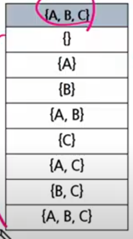
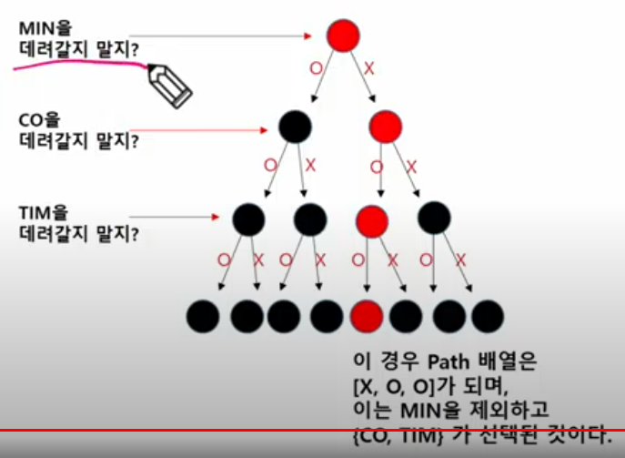
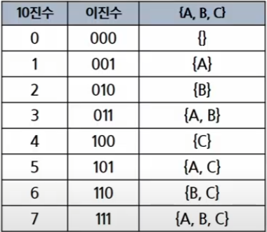
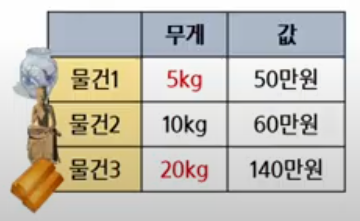
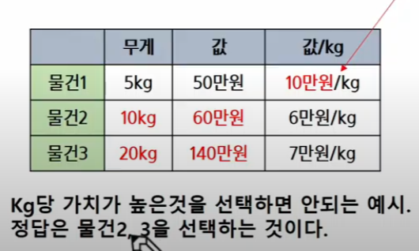
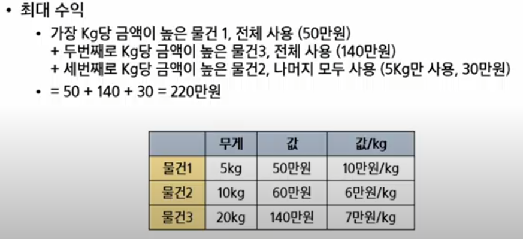
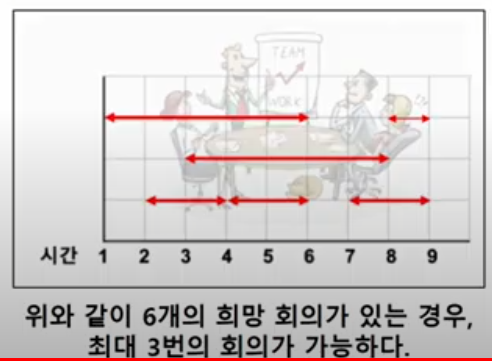

# 부분집합, 조합 / 그리디
## 부분집합
### 집합에 포함된 원소들을 선택하는 것이다.

### 부분 집합 예시
 - 오른쪽 표는 집합 {A,B,C} 로 만들 수 있는 부분집합의 예시이다.
 - 부분집합에는 아무것도 선택하지 않은 경우도 집합에 포함된다.(= 공집합)



### 집합에서 부분 집합을 찾아내는 구현 방법
 1. 완전 탐색
  - 재귀호출을 이용한 완전탐색으로, 부분집합을 구할 수 있다.
  - 실전보다는 완전 탐색 학습용으로 추천하는 방법
 2. Binary Counting
  - 2진수 & 비트 연산을 이용하여, 부분집합을 구할 수 있다.
  - 부분집합이 필요할 때 사용하는 추천 방법

### 완전탐색으로 부분집합 구하기
 - 민철이에게는 세 명의 친구가 있다.{MIN, CO, TIM}
 - 영화관에 갈 수 있는 멤버 구성해보기



### 구현 방법
 - Branch: 2개
 - Level: 3개

### 완성된 소스코드
```
arr = ['O', 'X']
path = []
name = ['MIN', 'CO', 'TIM']

def print_name():
    print('{', end = '')
    for i in range(3):
        if path[i] == '0':
            print(name[i], end=' ')
    print('}')

def run(lev):
    if lev == 3:
        print_name()
        return
    
    for i in range(2):
        path.append(arr[i])
        run(lev+1)
        path.pop()

run(0)
```

## 부분 집합 구현(Binary Counting)
### 바이너리 카운팅(Binary Counting)
 - 원소 수에 해당하는 N개의 비트열을 이용한다.
 - 0 0 1이면 {A}임을 나타냄
 - 1 1 0 이면 {B, C}임을 나타냄



### 집합의 총 개수
 - 만들 수 있는 집합의 총 개수는 2^n이며 n = 3이기에 총 8개 집합이다.
 - 2^n은 1<<n 공식을 이용하여 빠르게 구할 수 있음.
print(pow(2,3))
print(1 << 3)

### 0b110이 주어지면 BC 출력하는 함수
 - 6(0b110)에서 비트연산을 이용하여 마지막 한 자리가 1인지 0인지를 검사한다.

```
arr = ['A', 'B', 'C']
n = len(arr)

def get_sub(tar):
    for i in range(n):
        if tar & 0x1:
            print(arr[i], end='')
        tar >>= 1       # 오른쪽으로 한 칸씩 민다.

for tar in range(1<<n):
    print('{', end='')
    get_sub(tar)
    print('}')
```

- 검사한 한 자리를 제거한다(tar >> 1)

### [도전] 친구와 카페 방문

민철이는 친구{A,B,C,D,E}가 있다.
이 중 최소 2명 이상의 친구를 선정하여 함께 카페에 가려고 한다.
총 몇 가지 경우가 가능할까?
26가지

## 조합
### 서로 다른 n개의 원소 중 r개를 순서 없이 골라낸 것을 조합(combination)이라고 한다.

### 순열과 조합 차이
 - 순열: {A,B,C,D,E} 5명 중 1등, 2등 3등 뽑기 (순서 O)
 - 조합: 5명 중 3명 뽑기 (순서 X)

### [도전] {A,B,C,D,E} 5명 중 3명을 뽑을 수 있는 모든 경우를 메모장에 적어보자(제한시간 2분)
힌트 : ABC~CDE

Level = 5
Branch = 5
코드에 start 파라미터를 추가하여 조합 소스코드를 완성한다.
1. 처음 run함수의 start 값은 0이다.
따라서 0~5까지 반복하면서 재귀호출을 한다.

2. 만약 i가 3이 선택되는 경우는 재귀 호출할 때 start는 4가 된다.
다음 for문은 4부터 수행한다.

```
arr = ['A', 'B', 'C', 'D', 'E']
path = []

n = 3
def run(lev, start):
    if lev == n:
        print(path)
        return

    for i in range(start, 5):
        path.append(arr[i])
        run(lev+1, i+1)
        path.pop()

run(lev = 0, start = 0)
```

### [도전] 주사위 던지기
주사위 눈금 N개를 던져서 나올 수 있는 모든 조합 을 출력하시오.(구현)

N = 3일 때 출력 결과

```
N = 3
path = []

def func(lev, start):
    if lev == N:
        print(path)
        return
    
    for i in range(start, 7):
        path.append(i)
        func(lev+1, i)
        path.pop()

func(0, 1)
```

## Greedy
### Greedy(욕심쟁이 기법, 알고리즘)이란?
     - 결정이 필요할 때, 현재 기준으로 가장 좋아보이는 선택지로 결정하여 답을 도축하는 알고리즘

### 대표적인 문제해결기법
 1. 완전탐색(Brute-Force)
 2. Greedy
    - 결정이 필요할 때 가장 좋아보이는 선택지로 결정하는 알고리즘
 3. DP(차후 학습 예정)
    - 현재에서 가장 좋아보이는 것을 선택하는 것이 아니라, 과거의 데이터를 이용하여, 현재의 데이터를 만들어내는 문제해결기법
 4. 분할정복(차후 학습 예정)
  - 큰 문제를 작은 문제로 나누어 해결하는 문제해결기법

### 문제: 동전교환
1730원을 최소한의 동전 수를 사용하여 교환해주려고 한다.
 -> 큰 동전부터 최대한 거슬러 주면 된다.

```
coin_list = [500, 100, 50, 10]
tar = 1730

cnt = 0
for coin in coin_list:
    possible_cnt = tar // coin

    cnt += possible_cnt
    tar -= coin * possible_cnt

print(cnt)
```

### 아래 경우에도 가장 큰 동전부터 거슬러주면 된다.
if coin = [100, 20, 5]
530원 거슬러줄 때 최소 동전 개수?

if 완전탐색 사용:
    0원이 될 때까지 모든 경우를 다 해본다.
    이 중 최소 level이 되는 경우를 찾으면 정답이 된다.

### greedy 알고리즘으로 동전교환 문제를 접근하면 아래 케이스에서 예외가 발생할 수 있다.

coin = [70, 50, 10]
greedy로 접근할 경우 70 / 10 * 3해서 4개지만
정답은 50 * 2로 2개이다.

### 그리디가 성립하는 경우 vs 성립하지 않는 경우
 - 모든 동전이 배수의 관계인 경우 그리디가 성립한다.
 - 모든 동전이 배수관계가 아닌 경우는 그리디가 성립하지 않는다.

기숙사에는 하나의 화장실만 존재한다.
A~D학생은 각자의 평균 화장실 사용 시간이 다음과 같다.
A: 15분, B: 30분, C: 50분, D: 10분

A가 먼저 이용할 경우 나머지 인원은 대기해야 한다.
대기 시간 총합: 15 * 3 = 45분
이후 B가 이용하는 경우 나머지 인원(안 간 사람)은 대기해야 한다.
대기 시간 총합 45 + 30 * 2 = 105분
이후 C가 이용하는 경우 나머지 D는 대기해야 한다.
대기 시간 총합 45 + 60 + 50 = 155분

```
person = [10, 15, 30, 50]
n = len(person)
sum_v = 0
left_person = n-1

for turn in range(n):
    time = person[turn]
    sum_v += left_person * time
    left_person -= 1
print(sum_v)
```

## 그리디 (0-1 Knapsack)
도둑은 보물들이 있는 창고에 침입하였다.
도둑은 최대 30kg까지 짐을 담아갈 수 있다.
물건의 개수(N) 그리고 물건 별 무게 (w)와 가격(P)이 주어질 때
어떤 물건을 담아야, 도둑이 최대 이득을 볼 수 있을 지 구하시오.
물건은 하나씩만 존재한다.


### 이 문제는 kg 당 가치가 가장 높은 것을 먼저 담으면 안 된다
 - 0-1 Knapsack을 그리디로 접근하면 안 되는 예외 케이스가 존재한다.
 - 0-1 Knapsack 문제는 그리디로 해결할 수 없다.
    완전탐색 or DP로 접근해야 한다.


Fractional Knapsack 문제
 - 0-1 Knapsack과 달리, 물건을 원하는 만큼 자를 수 있는 Knapsack 문제
 - 그리디가 성립한다.
 - price/kg가 가장 높은 물건을 최대한 담으면 된다.


```
n = 3
target = 30
things = [(5, 50), (10, 60), (20, 140)]

things.sort(key = lambda x:(x[1]/x[0]), reverse = True)
# 큰 것부터 앞으로 나오게 하기 위해

sum = 0
for kg, price in things:
    per_price = price / kg
    if target < kg:
        sum += target * per_price
        break
    
    sum += price
    target -= kg

print(int(sum))
```

## 그리디 (회의실 배정)
### 회의실이 하나인 회사가 있다. 여러 팀들이 원하는 회의실 예약 시간이 주어질 때, 가능한 많은 회의가 열리기 위해서는 회의들을 어떻게 배정해야 할까?

 - 희망 회의 개수, 시작시간, 종료시간을 입력 받는다.
 

### [도전] 무엇을 기준으로 회의를 선택해야 최대한 많은 횟수의 회의가 될 지 고민해보자.
(이 문제는 그리디로 가능하다)

회의실 문제 전략
1. 끝나는 시간을 기준으로 오름차순 정렬한다.
2. 빠르게 끝나는 회의를 선택하여 확정한다.
3. 이후로 가능한 회의 중 빠르게 끝나는 회의를 선택하여 확정한다.

## <연습문제 3> 부분집합의 합
### 부분집합 합 문제 구현하기
 - 아래의 10개의 정수 집합에 대한 모든 부분 집합 중 원소의 합이 0이 되는 부분집합을 모두 출력하시오
 {-1,3,9,6,7,-6,1,5,4,-2}