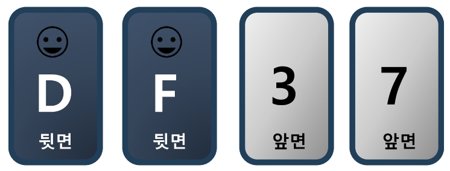
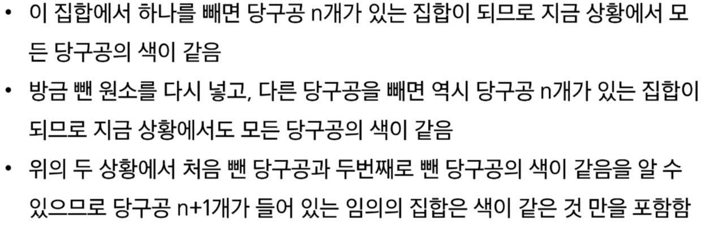
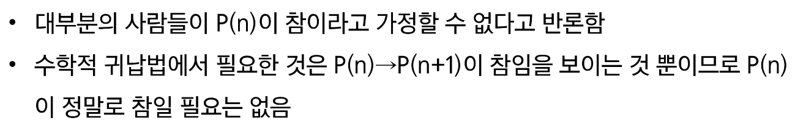
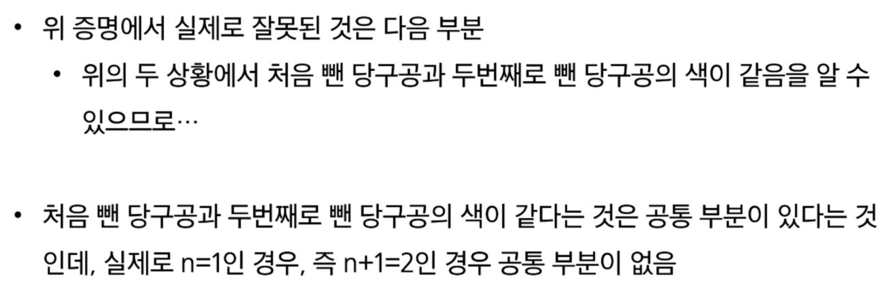
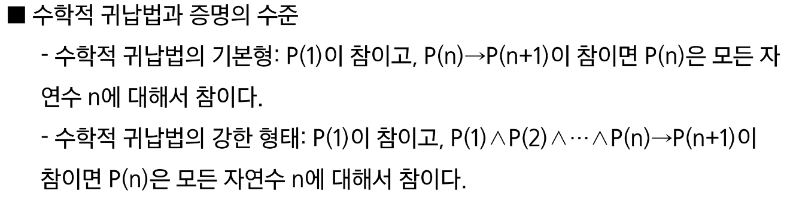
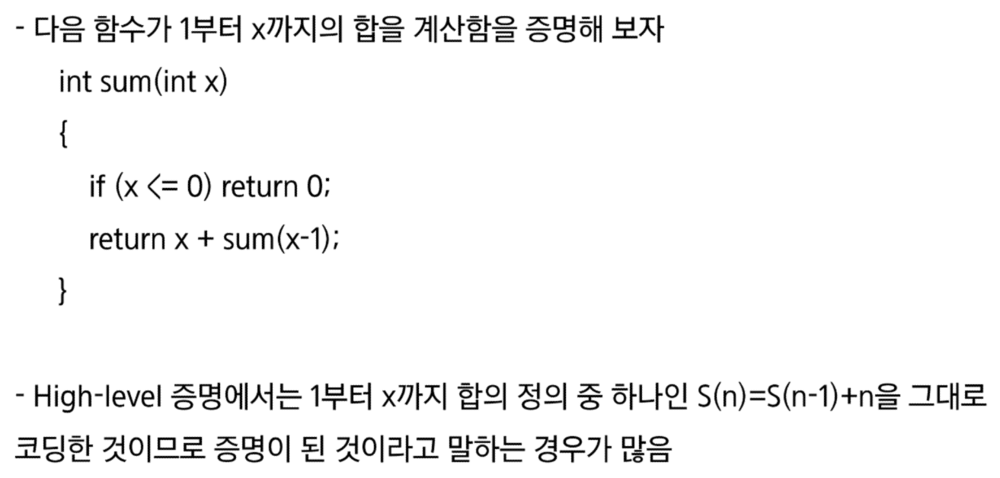
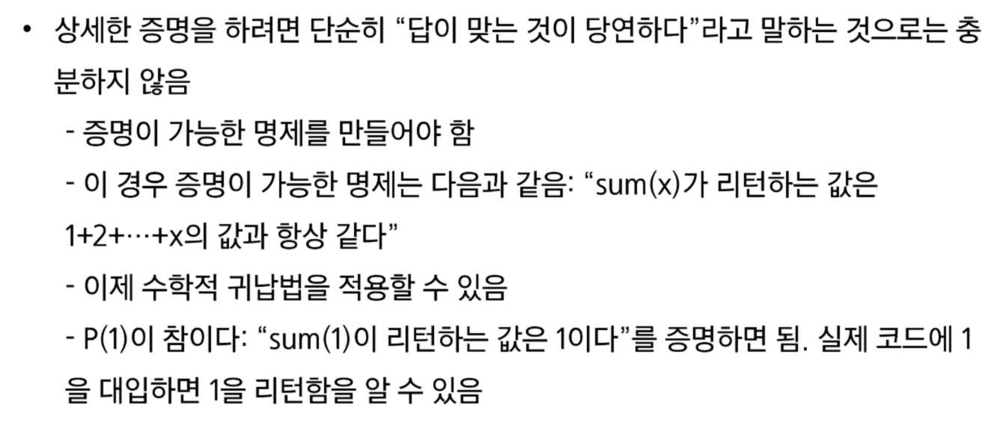
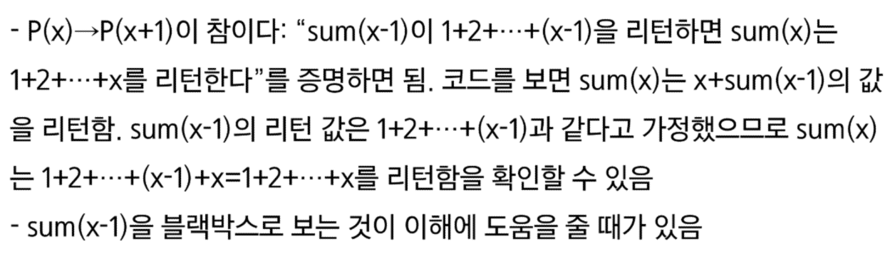
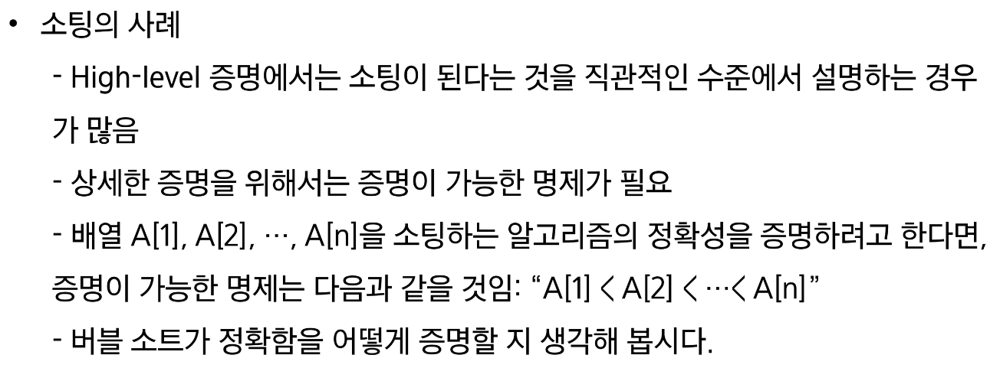

# Computational Thinking
## 서론 - 프로그래밍과 논리/수학
 1. 초보자에게 복잡해보이는 프로그래밍 언어 문법, 복잡한 라이브러리 사용
    - 처음 배울 때는 어렵지만, 훈련을 통해 점차 실력이 늘어감
 2. 논리(Hard Logic)
    - 이번 수업에선느 논리에 포컷를 맞춘다.

논리는 Hard Logic // Soft Logic으로 나뉜다.

카드 문제
카드의 한 쪽에는 알파벳이 다른 쪽에는 숫자가 써 있음
만약 한 쪽이 D인 경우, 반대쪽은 3이 적혀 있을 것이다.

위 주장이 사실인지 아래 카드를 직접 뒤집어보면서 확인하고자 한다.
주장의 참과 거짓을 증명하기 위해, 반드시 뒤집어봐야하는 카드는 무엇인가?

D와 7

D를 뒤집었을 때 3이 안 나오면 거짓을 증명 가능
3을 뒤집었을 때 D가 있더라도 주자이 참임을 확신할 수 없음(역의 논리)
7을 뒤집었을 때, D가 있다면 거짓을 증명할 수 있음(대우의 논리)

맥주집 문제
맥주집의 규칙:20세 이하인 사람은 맥주를 마실 수 없음
사실: 나이 or 마시고 있는 것이 표시되어 있음

규칙이 잘 지켜지고 있는지 확인하고자 한다면
다음 4명 중 확인이 필요한 사람은 누구인가?
17세, 맥주

Soft Logic
 - 맥주집 문제를 풀 때 직관을 사용한 것
 - 직관은 논리적인 느낌을 주는 것

직관은 나쁜 게 아니다.
 - 직관의 장점은 익숙한 상황에서 빠르다는 것

직관의 단점은 정확하지 않다는 것(가끔 익숙한 상황에서도 틀림)
 - 그리고 강한 착각을 일으킨다는 것

직관적인 논리와 진짜 논리를 구분해야 하는 이유
너 과자 몇 개 먹었니? vs 버스 타려고 하는 데 천 원 있니?

정확한 수 요구 vs 액수 이상 있는 지 확인
진짜 논리가 아닌 직관적인 논리를 사용하면 논리적 오류가 발생한다.

합격하려면 토플 500점 이상 혹은 토익 600점 이상 필요
복권에 당첨되면 자동차 혹은 천만원을 줍니다.

첫 번째는 둘 중 하나만 있으면 합격 긜고 둘 다 있어도 합격(=inclusive OR)
두 번째는 둘 중 하나만 준다는 것이고 둘 다 준다는 것이 아니다.(=exclusive OR)

### 일상 생활에서는 soft logic이 빠르기 때문에 유용
 - 논리적으로 부정확한 표현을 쓰더라도 어떤 의미인지 알고 있을 것이라고 생각하고 넘어간다.

### 프로그래밍은 Hard Logic을 사용
 - 직관적인 논리로는 작동 안 함
 - 프로그래밍 언어 표현은 모두 논리학에서 나온 것
 - Soft Logic으로 알고리즘을 이해하려고 하면 안 된다.
 - Hard Logic이 필요

### 논리 연습 1
아들에게 이번 시험에 100점을 맞으면 치킨을 사주겠다. 약속을 했다.
약속을 지켰는지 안 키졌는지 모든 경우를 보자.

1. 100점 맞아서 치킨을 사줌: O
2. 100점 맞아서 치킨을 안 사줌: X
3. 100점을 못 받았는데 치킨을 사 줌: O
4. 100점을 못 받았는데 치킨 안 사주었다.: O
O O / O X / X O / X X
**가정이 거짓이면 전체는 항상 참이 된다.**(가정의 상황에 대해서 이야기한 것이 없음)

### 논리 연습 2
- 문제 1: 다음을 명제식 형태로 쓰고 참인지 거짓인지 판단하시오
 1. 만약 0이 홀수라면, 미국에서 2080년 월드컵이 열린다.: True(p가 False)
 2. 만약 19893827938274839이 Prime Number라면, 2는 짝수이다.: True(q가 True)

- 문제 2: p와 q는 명제이고 p->q가 거짓이라고 하자. 다음 명제식의 참 거짓은 어떻게 되는 가?
 1. ~p->q: True
 2. pVq: True
 3. q->p: True

- 문제 3: 다음 명제들의 역, 이, 대우를 쓰시오.
 1. 만약 0이 홀수라면, 미국에서 2080년 월드컵이 열린다.
 역 q->p
 이 ~p -> ~q
 대우 ~q -> ~p

 2. 만약 19893827938274839이 Prime Number라면, 2는 짝수이다.
 역
 이
 대우

- 문제 4: 다음 명제식의 진리표를 만드시오
 1. p^(q->~p)
 2. (p^~q)->r

### 증명
- 증명은 정확한 명제식으로 표현할 수 있는 것이라야 함
- 보통은 정확한 명제식까지 쓰지는 않으나 근본적으로는 명제식으로 바꿀 수 있음
- 증명에 대한 수많은 오해가 p->q를 p<->q와 혼동하는 것에서 일어남

모든 당구공은 색이 같다는 다음 증명에서 잘못된 것은?

Prime Number의 개수는 무한히 많다는 다음 증명은 옳은가?
 - Prime Number의 개수가 유한한 k개라고 가정
 - 모든 Prime Number를 다 곱하고 1을 더한 수를 n이라고 하자
 - 이 수 n은 어떤 prime으로 나누어도 나머지가 1이다.
 - 그런데 n은 어떤 Prime보다 크므로 합성수이다.
 - 합성수이지만 어떤 Prime으로도 나누어지지 않으므로 모순 발생

Prime Number가 k일 때 모순이므로 Prime Number가 k개라는 명제가 항상 거짓일 수 밖에 없다.

p.100 => 평가에도 나올 수 있음
### 연습 문제들: 다음 재귀식들을 O() notation 수준으로 풀어라.(시간 복잡도 빅오 표기법으로 풀어라)
문제1: T(n) = T(n-1) + 1, T(0) = 1(n >= 1인 정수라는 가정이 있어야 할 것 같아요)
    T(n) = T(n-2) + 2
    T(n) = T(n-k) + k
    T(n) = n+1
    O(T(n)) = O(n)

문제2: T(n) = T(n-1) + n, T(0) = 1
T(n) = T(n-2) + n + n-1
T(n) = T(n-k) + n + ... + n-k
T(n) = T(0) + 1~n
T(n) = n(n+1)/2 + 1
O(T(n)) = O(n^2)

문제 3: T(n) = T(n-1) + logn, T(0) = 1
T(n) = T(n-2) + 2logn
T(n) = T(n-k) + klogn
T(n) = nlogn + 1

O(T(n)) = nlogn

문제4 : T(n) = T(n/2) + 1, T(1) = 1
    T(n) = T(n/4) + 2
    T(n) = T(n/ 2**k) + k
    T(n) = T(1) + logn = logn+1
    O(T(n)) = logn

컴퓨터에서 logn은 log₂n이다(상용로그 아님!)