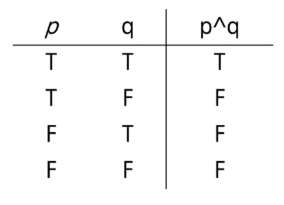
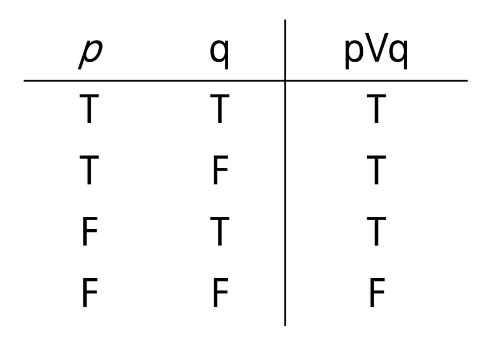
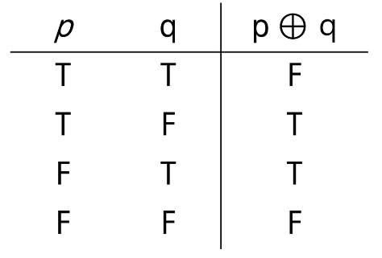
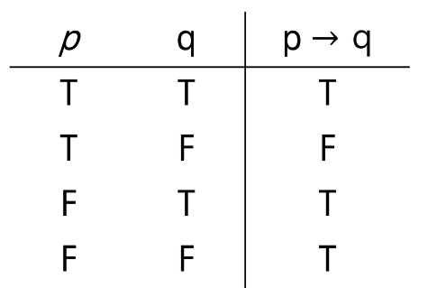
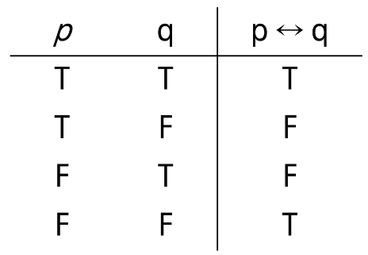
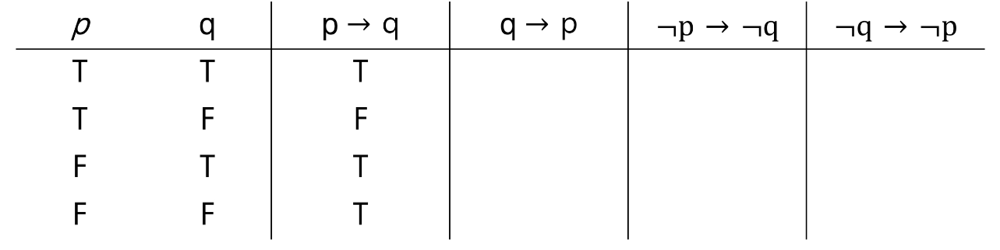

### 증명 연습
Trivial Proof: ∀x, P(x) -> Q(x)를 증명하려는데, Q(x)가 항상 참인 경우
∀(for all)이라는 기호

문제 1: 다음 명제를 증명하시오
 1. 실수 x에 대해 만약 x<-1이면 x^2+1/4 >0이다.
    실수 범위에서 제곱수 x^2 >=0이다.
    1/4 >0 이므로 0 + '+' > 0 이므로 당연히 양수이다.

 2. n이 홀수이면 4n^3+6n^2+12는 짝수이다.
    4n^3 + 6n^2 + 12 = 2(n^3 + 3n^2+ 6)

Vacuous Proof: ∀x, P(x) -> Q(x)를 증명하려는데, P(x)가 항상 거짓인 경우
 1. 실수 x에 대해, 만약 2x^2 - 4x + 4 <0이면 x>8이다.
    2x^2 -4x + 4 = 2(x-1)^2 + 2 > 0, 즉 항상 양이므로 x가 뭐냐는 상관없다.
 2. 4n^3 + 6n^2 + 11은 짝수이면 n이 홀수이다.
    4n^3 + 6n^2 + 11 = 2(2n^3 + 3n^2+5)+1이므로 항상 홀수이다.

명제 - 참 거짓 판멸 문장
진릿값 - 참 / 거짓 표현 (T,F) (1,0)

[연산(결합)]
- 부정(NOT)
    - p가 명제일 때, 명제의 진릿값이 반대
    - ~p 또는 ￢p로 표기 (not p 또는 p 부정으로 읽음)

- 논리곱 AND
    - p, q가 명제일 때 p, q 모두 참일 때만 참이 되는 명제
    - p Λ q (p and q)
    

- 논리합 OR
    - p, q가 명제일 때 p, q 모두 거짓일 때만 거짓이 되는 명제
    - p V q (p or q)
    

- 배타적 논리합 XOR
    - p, q가 명제일 때 p, q 중 하나만 참일 때 참이 되는 명제
    - p⊕q (p xor q)
    

[합성]
- 연산자 우선 순위
    - ￢>∨, ∧>->. <->
- 항진명제: 진릿값이 항상 참
- 모순명제: 진릿값이 항상 거짓
- 사건명제: 항진명제도 모순명제도 아닌 명제

- 조건명제
    - p, q가 명제일 때, 명제 p가 조건(또는 원인), q가 결론(또는 결과)로 제시되는 명제.
    - p->q (p이면 q이다.)
    

- 쌍방조건명제
    - p, q가 명제일 때, 명제 p와 q가 모두 조건이면서 결론인 명제
    - p <-> q (p면 q고 q면 p다.)
    

- 조건명제의 역, 이, 대우
    - 역: q-> p
    - 이: ~p -> ~q
    - 대우: ~q -> ~p
    

문제 1: 다음 명제들이 항진명제라는 것을 진리표를 이용해서 보이시오.
    - 1. ~(~p∧q)∨q = (p∨~q)∨q = S(all)
    - 2. (~p∨q)∨(p∧~q) = (~p∨q∨p)∧(~p∨q∨~q) = S(all)

문제 2: 다음 명제들이 모순명제라는 것을 진리표를 이용해서 보이시오.
    - 1. (~p∨q)∧(p∧~q) = (~p∧p∧~q)∨(q∧p∧~q) = 공집합 ∨ 공집합 = 공집합
    - 2. (p∧q)∧(p∧~q) = 공집합

문제 3: 다음 명제의 쌍들에 대해서 두 명제가 동등한지를 진리표를 이용해 확인하시오.
    - 1. p∧(p∨q)와 p: 참
    - 2. ~p∨~q 와 ~(p∨q)
         - ~p∨~q = ~(p∧q) 이므로 거짓

문제 4: 명제식의 변형을 통하여 다음 명제를 간소화하시오.

문제 6: n이 짝수이면 3n + 5는 홀수임을 증명하라
n = 2k, 3n +5 = 3*(2k)+5= 2(3k+2) + 1
따라서 홀수

문제 7: n이 홀수이면 n^2 + n은 짝수임을 증명하라
n = 2k-1
n^2 + n = 4k^2 - 4k + 1 + 2k - 1 = 2(2k^2-k)

문제 8: m이 짝수이고 n이 홀수이면 2m+3n은 홀수임을 증명하라
m = 2k, n = 2l + 1
2m+3n = 2(2k+3l+1)+1

문제 9: 자연수 n에 대해 n^2+5가 홀수이면 n은 짝수임을 증명하라
-> 대우로 증명: n이 홀수면 n^2+5는 짝수이다.
n = 2k+1, n^2+5 = 4k^2+4k+6 = 2(2^k+2k+3)이다.

문제 10: n^2이 짝수이면 n은 짝수임을 증명하라.
-> 대우로 증명: n이 홀수면 n^2도 홀수
n = 2k+1 -> n^2 = 2(2k^2+2k)+1

문제 11: 자연수 n에 대해 n^2+5n+3은 항상 홀수임을 증명하라
if n= 2k, n^2+5n+3 = 2(2k^2+5k+1)+1
   n=2k+1, n^2+5n+3 = 2(2k^2+7k+4)+1

문제 12: n^2이 3의 배수면 n은 3의 배수임을 증명하라
대우 : n이 3의 배수가 아니면 n^2이 3의 배수이다.
n = 3k+a, n^2=3(3k^2+2k)+a^2
a^2%3 = 1이다.

직접 풀어보세요: 1-2, 2-2, 3-2, 4-2, 5-2, 5-4, 7, 9, 11

## 2. 수와 표현
### 약간의 설명
컴퓨터는 0/1을 표현할 수 있는 비트들을 모아 수를 표현
k개의 비트를 사용하면 0부터 2^k-1까지 표현 가능
사실, 꼭 저 범위인 것은 아님. 약속하는 방식에 따라 다르지만, 어떤 경우든 최대 2^k 가지의 값을 표현하는 것이 가능
10진수로 k자리를 쓰면 0부터 10^k-1까지 표현이 가능한 것과 완전히 동일한 과정

어떤 값 n을 표현하기 위해서는 몇 개의 비트가  필요할까?
- 2^k-1 >= n이 성립해야 함, 즉 2^k >= n+1
같은 의미로 k >=log(n+1) -> 약 logn의 비트가 필요

위의 식에서 logn이란
1. 2의 몇 승이 n이 되느냐의 답
2. n을 표현하는 데 몇 비트가  필요한가의 답
3. 1로 시작해서 계속 두 배를 할 때 몇 번 하면 n이 되느냐의 답
4. n을 2로 계속 나눌 때 몇 번 나누면 거의 1이 되느냐에 대한 답

x = logn일 때 x와 n을 비교하면 x가 더 작고, n이 커질수록 엄청나게 달라진다
100자리로 표현할 수 있는 10진수 값은 읽을 수도 없을 정도로 큰 값이다.
컴퓨터 분야에서 로그의 밑은 항상 2

32비트 컴퓨터의 주소 공간은 2^32 = 약 40억개 주소
n + (n/2+n/2) + (n/4+n/4+n/4+n/4) + ... + (1+1+...) = nlogn(why?)
n + n/ 2 + n/4 + 1은 2n으로 근사한다.
위 두 식의 항의 개수는 logn개
