# 웹
## World Wide Web
인터넷으로 연결된 컴퓨터들이 정보를 공유하는 거대한 정보 공간

### Web
web site, web application 등을 통해 사용자들이 정보를 검색하고 상호 작용하는 기술

### Web site
인터넷에서 여러 개의 Web page가 모인 것으로, 사용자들에게 정보나 서비스를 제공하는 공간

### Web page
HTML, CSS 등의 웹 기술을 이용하여 만들어진 "Web site"를 구성하는 하나의 요소

### Web page 구성 요소
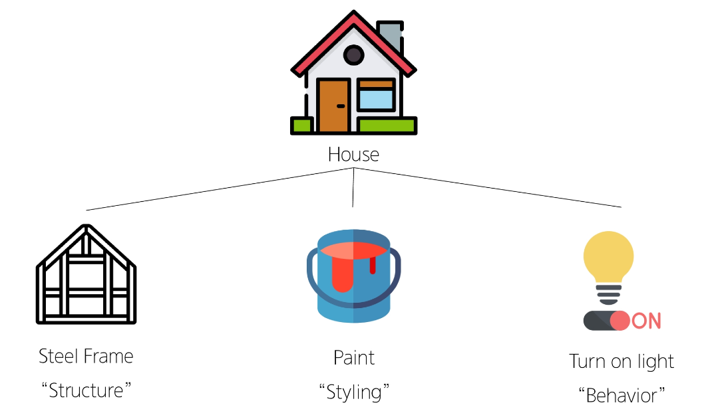
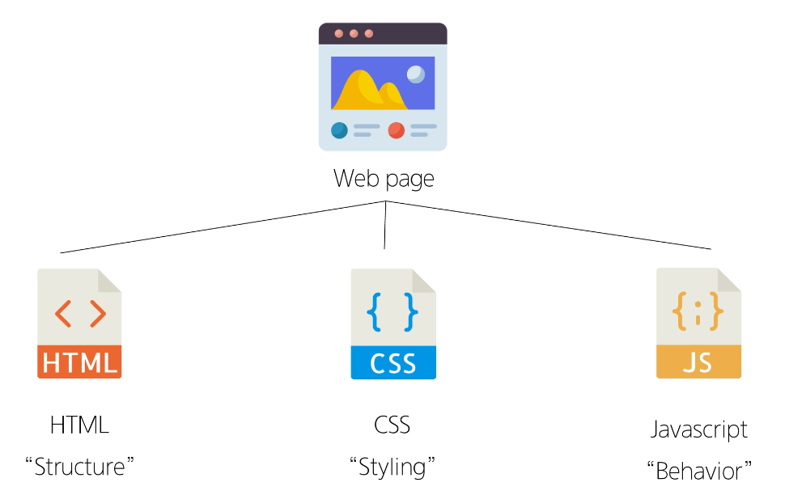

### HTML
HyperText Markup Language
웹 페이지의 의미와 '구조'를 정의하는 언어

### Hypertext
웹 페이지를 다른 페이지로 연결하는 링크
참조를 통해 사용자가 한 문서에서 다른 문서로 즉시 접근할 수 있는 텍스트

### Markup Language
태그 등을 이용하여 문서나 데이터의 구조를 명시하는 언어
ex) HTML, Markdown

### Markup Language 예시
HTML. HTML이란 Hyper Text Markup Language의 약자이다. Hyper Text. Hyper Text란 기존의 선형적인 텍스트가 아닌 비선형적으로 이루어진 텍스트를 의미하며, 이는 인터넷의 등장과 함께 대두되었다. 기본적으로 HyperLink를 통해 텍스트를 이동한다. 이러한 Hyper Text는 인간이 기억하는 방식까지 바꾸고 있는데 이를 컬럼비아대 벳시 스패로 교수팀은 구글 효과(Google Effect)라고 이름 붙이고 해당 연구를 '사이언스'지에 게재하였다. 구글 효과란...

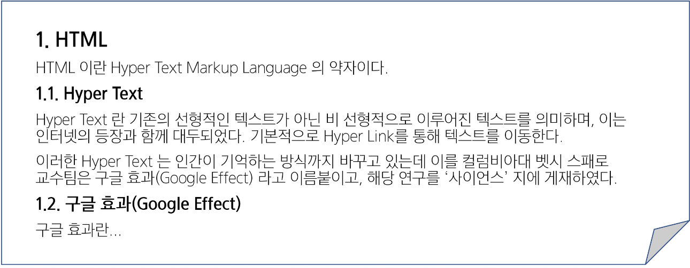
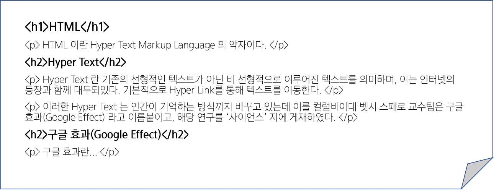
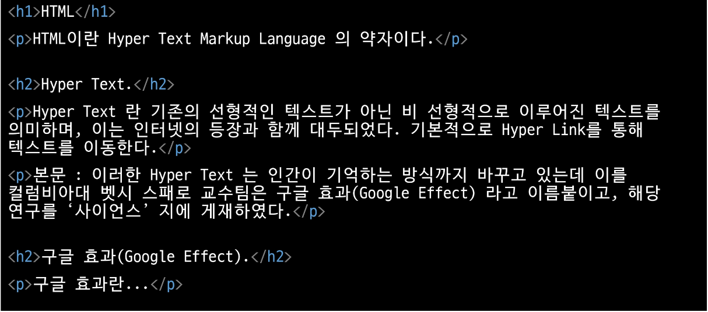

## 웹 구조화
### HTML 구조

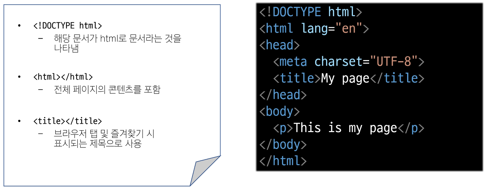
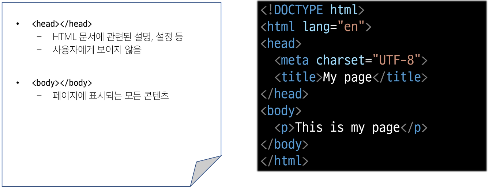
ctrl+shift+i 혹은 우측 클릭 후 검사를 통해 개발자 코드를 볼 수 있다. 

### HTML Element(요소)
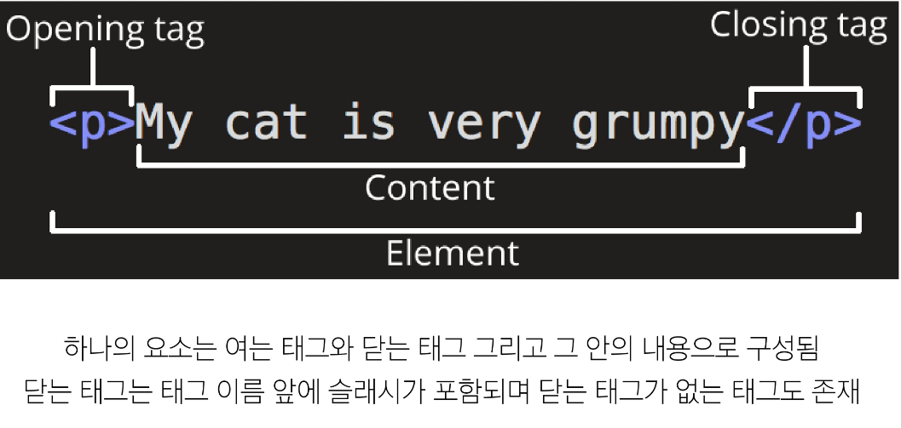

### HTML Attribute(속성)
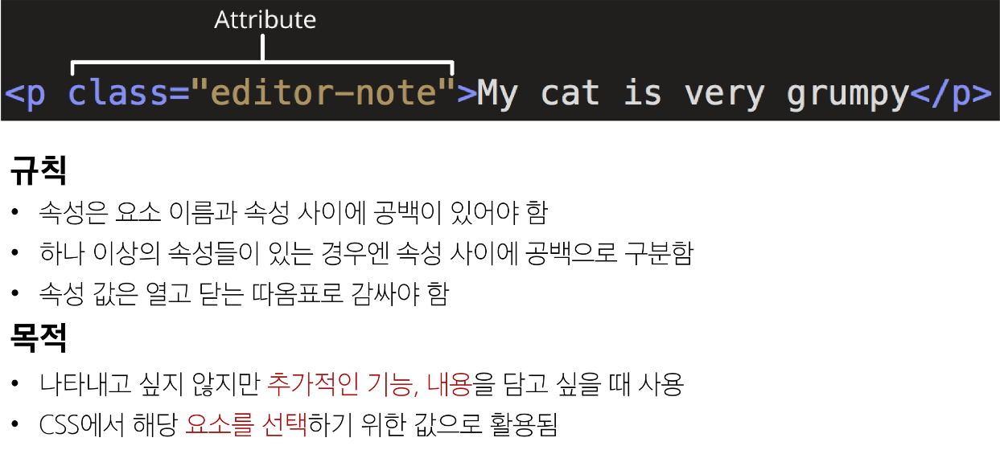

### HTML 구조 예시
<html>만 치고 엔터 치면 알아서 나옵니다(닫는 태그가)
meta charset
주석 단축기: ctrl + / (모든 언어에서 똑같음) <!--  --> 이렇게 생겼다.
head 안은 보이지 않는다.
title - 탭 위에 있는 이름

는 문단이 들어가는 곳
<a>는 자동 완성이 들어가는 것(필수적으로 들어가는 속성)
이 태그는 앵커 태그 : 하이퍼텍스트의 역할을 한다.
href에 주소를 넣는다.
alt + b 누르면 바로 크롬으로 연결됨
! + enter 치면 기본 구조 나옴

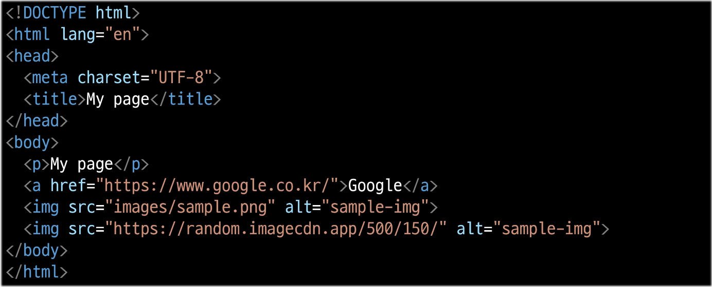
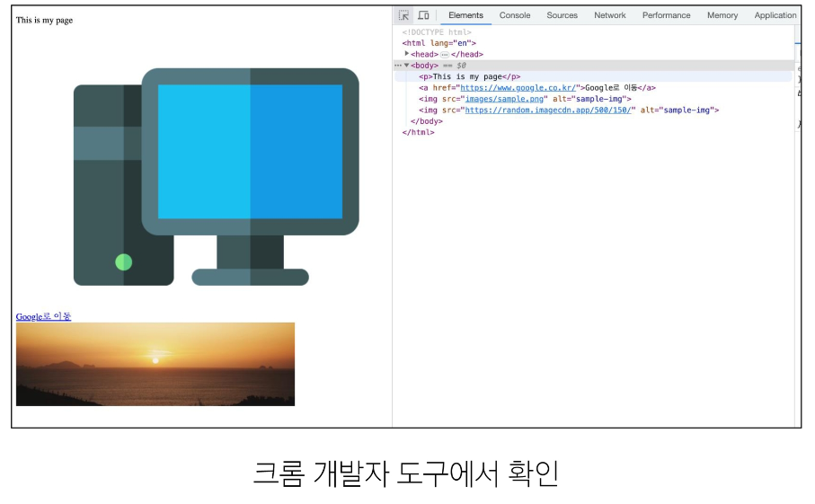

## 웹 구조화
### HTML
HyperText Markup Language
웹 페이지의 의미와 구조를 정의하는 언어
<h1>Heading</h1>
예를 들어 h1 요소는 단순히 텍스트를 크게만 만드는 것이 아닌 현재 문서의 최상위 제목이라는 의미를 부여하는 것

### HTML Text structure 예시
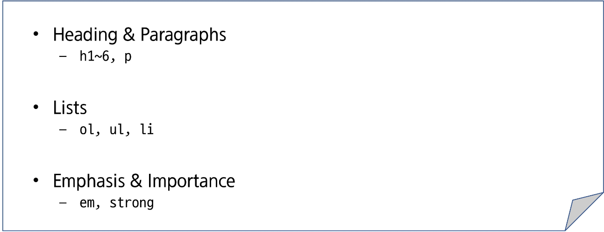
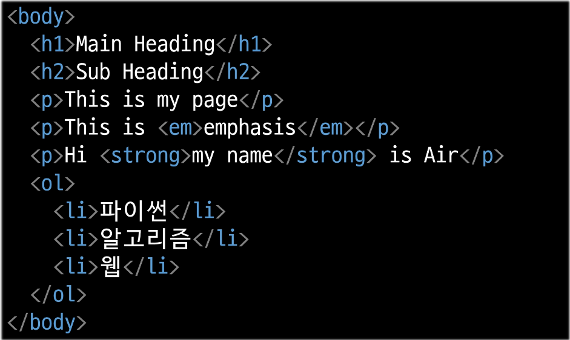

웹에 관련된 기술을 배울 땐
ex) html h1 tag mdn
여기서 mdn을 꼭 써야 한다. -> 상세한 개념 확인 가능(mdn web docs 사이트)

# 웹 스타일링
## CSS
### CSS
cascading style sheet
웹 페이지의 디자인과 레이아웃을 구성하는 언어

### CSS를 적용하지 않은 웹사이트 모습
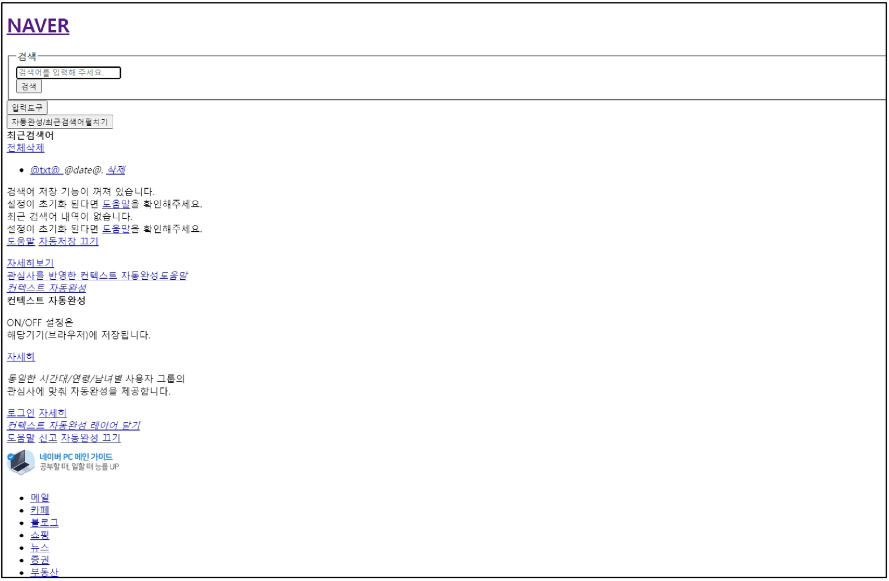
### CSS 구문
h1{
    color: blue;
    font-size: 30px;
}

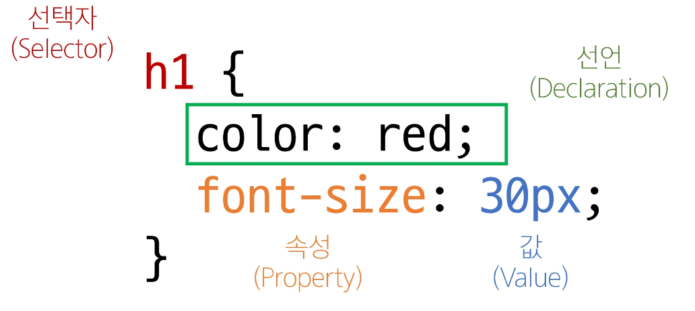

CSS 적용 방법
1. 인라인(Inline) 스타일
 - HTML 요소 안에 style 속성 값으로 작성
 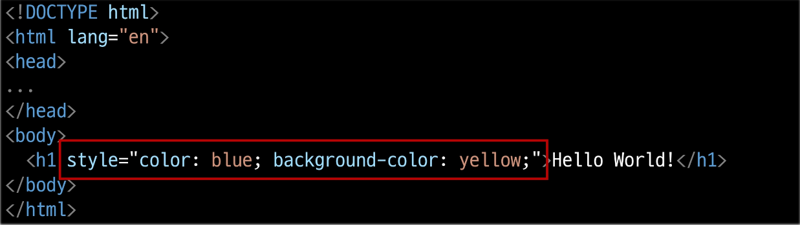

2. 내부(Internal) 스타일 시트
 - head 태그 안에 style 태그에 작성
 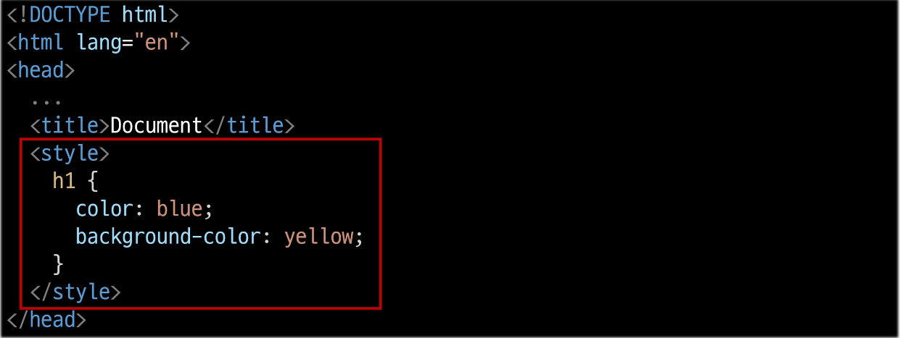

3. 외부(external) 스타일 시트
 - 별도의 CSS 파일 생성 후 HTML link 태그를 사용해 불러오기
 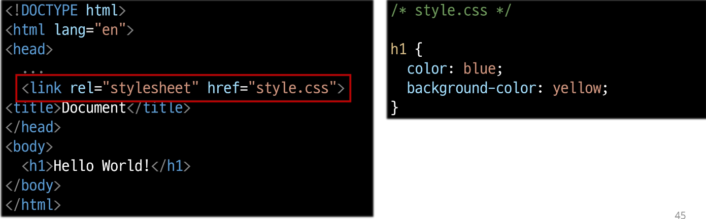

### CSS selectors
HTML 요소를 선택하여 스타일을 적용할 수 있도록 하는 선택자
 - 기본 선택자
    - 전체("*") 선택자
    - 요소(tag) 선택자
    - 클래스(class) 선택자
    - 아이디(id) 선택자
    - 속성(attr) 선택자 등
 - 결합자 (combinators)
    - 자손 결합자(" "(space))
    - 자식 결합자(">")

### CSS Selectors 특징(1/3)
 - 전체 선택자(*)
  - HTML 모든 요소를 선택

 - 요소 선택자
  - 지정한 모든 태그를 선택

 - 클래스 선택자('.' (dot))
  - 주어진 클래스 속성을 가진 모든 요소를 선택

 - 아이디 선택자('#')
    - 주어진 아이디 속성을 가진 요소 선택
    - 문서에는 주어진 아이디를 가진 요소가 하나만 있어야 함
    - 의미론적으로 다르고, 우선순위 문제도 있음(다른 것보다 우선순위 높음)

 - 자손 결합자(" "(space))
  - 첫 번째 요소의 자손 요소들 선택
  - ex) p span은 
 안에 있는 모든 를 선택(하위 레벨 상관 없이)

 - 자식 결합자(">")
  - 첫 번째 요소의 직계 자식만 선택
  - 예) ul > li은 <ul> 안에 있는 모든 <li>를 선택(한 단계 아래 자식들만)

   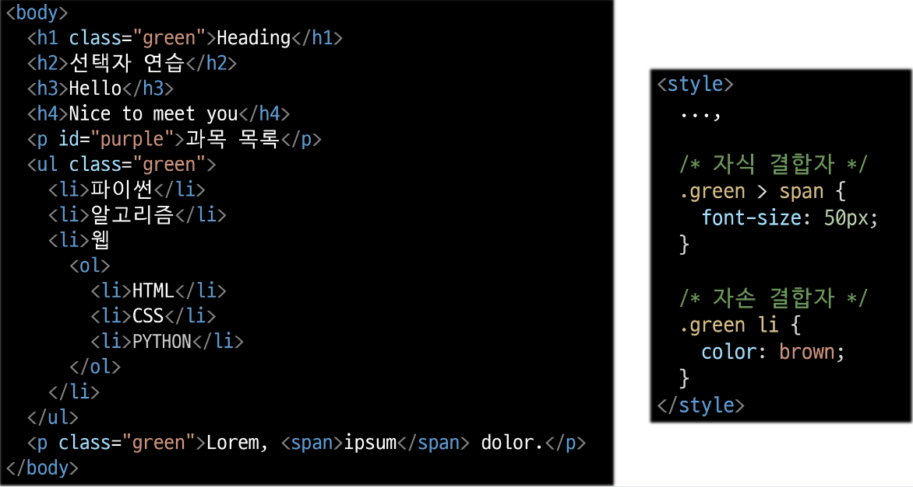

## 명시도
### Specificity 명시도
결과적으로 요소에 적용할 CSS 선언을 결정하기 위한 알고리즘
CSS Selector에 가중치를 계산하여 어떤 스타일을 적용할 지 결정
동일한 요소를 가리키는 2개 이상의 CSS 규칙이 있는 경우 가장 높은 명시도를 가진 Selector가 승리하여 스타일이 적용됨

### CSS
Cascading Style Sheet
웹 페이지의 디자인과 레이아웃을 구성하는 언어

### Cascade
계단식
한 요소에 동일한 가중치를 가진 선택자가 적용될 때 CSS에서 마지막에 나오는 선언이 사용됨

### Casecade 예시
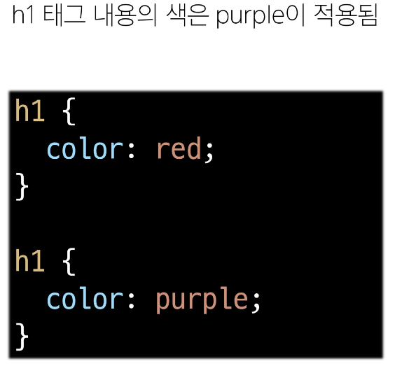

### 명시도 적용 예시
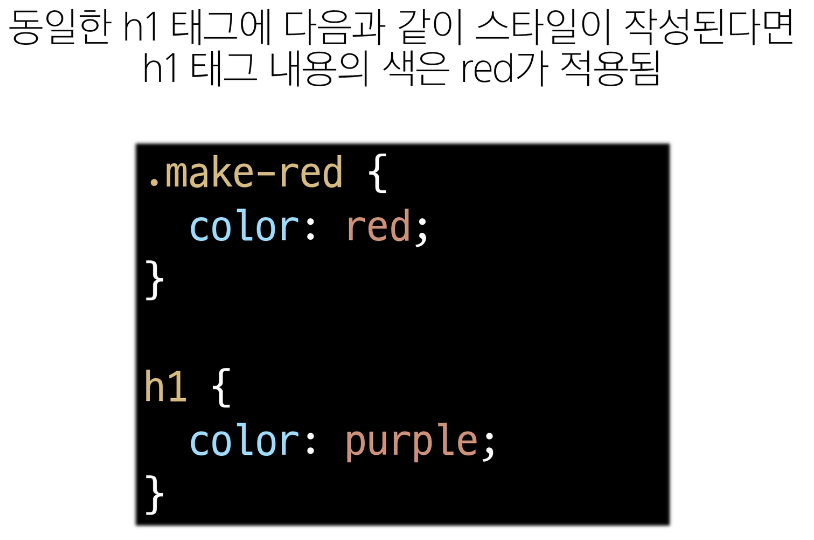

### 명시도가 높은 순
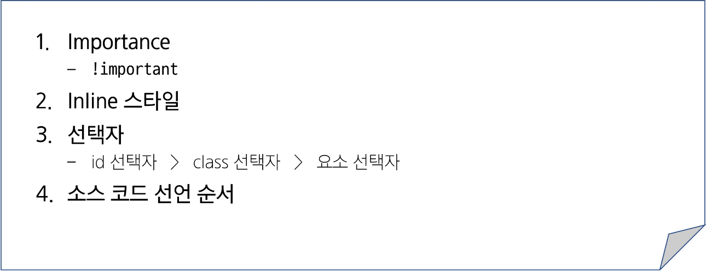

### 명시도 예시
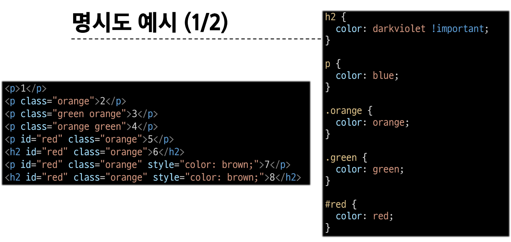

### !important
다른 우선순위 규칙보다 우선하여 적용하는 키워드
Cascade 구조를 무시하고 강제로 스타일을 적용하는 방식이므로 사용을 권장하지 않음

### 명시도 관련 문서
 - 그림으로 보는 명시도
 https://specifishity.com/

 - 명시도 계산기
 https://specificity.keegan.st/

### CSS 상속
기본적으로 CSS는 상속을 통해 부모 요소의 속성을 자식에게 상속해 재사용성을 높임

### CSS 속성 2가지 분류
 - 상속 되는 속성
    - TEXT 관련 요소(font, color, text-align), opacity, visibility 등

 - 상속 되지 않은 속성
    - Box model 관련 요소(width, height, border, box-sizing...)
      position 관련 요소(position, top/right/bottom/left, z-index) 등

### 상속 예시
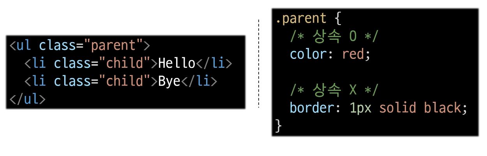
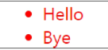

### CSS 상속 여부는 MDN 문서에서 확인하기
MDN 각 속성별 문서 하단에서 상속 여부를 확인할 수 있음
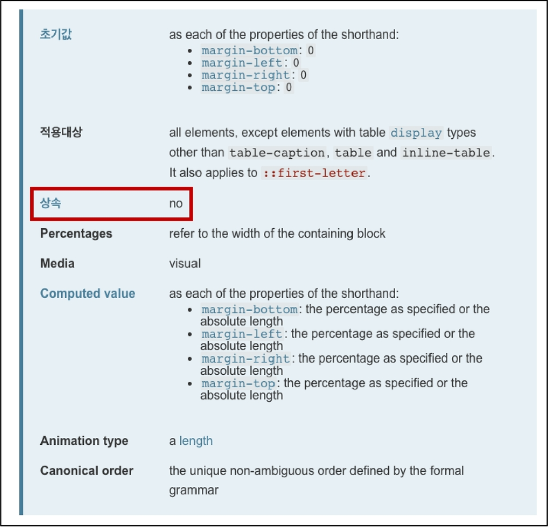

## 참고
### HTML 관련 사항
 - 요소(태그) 이름은 대소문자를 구분하지 않지만 "소문자"사용을 권장
 - 속성의 따옴표는 작은 따옴표와 큰 따옴표를 구분하지 않지만 "큰 따옴표" 권장
 - HTML은 프로그래밍 언어와 달리 에러를 반환하지 않기 때문에 작성 시 주의

### CSS 인라인(inline) 스타일은 사용하지 말 것
 - CSS와 HTML 구조 정보가 혼합되어 작성되기 때문에 코드를 이해하기 어렵게 만듦

### CSS의 모든 속성을 외우는 것이 아님
 - 자주 사용되는 속성은 그리 많지 않으며 주로 활용하는 속성 위주로 사용하다 보면 자연스럽게 익히게 됨
 - 그 외 속성들은 개발하며 필요할 때마다 검색해서 학습 후 사용할 것

### 속성은 되도록 'class'만 사용할 것
 - id, 요소 선택자 등 여러 선택자들과 함께 사용할 경우 우선순위 규칙에 따라 예기치 못한 스타일 규칙이 적용되어 전반적인 유지보수가 어려워지기 때문
 - 문서에서 단 한 번 유일하게 적용될 스타일에 경우에만 "id 선택자" 사용을 고려