# CSS Layout
## CSS Box Model
- 모든 HTML 요소를 사각형 박스로 표현하는 개념
- 원은 네모 박스를 깎은 것
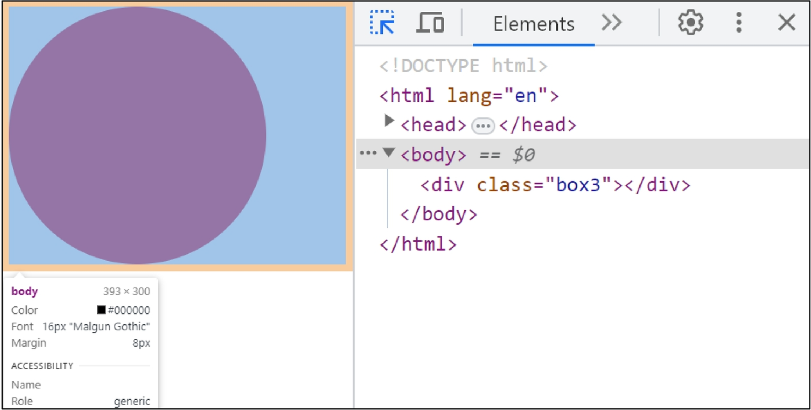
보이는 건 원으로 보이지만 차지하는 영역은 박스만큼이다

### 박스 요소들로 구조화한 웹 페이지
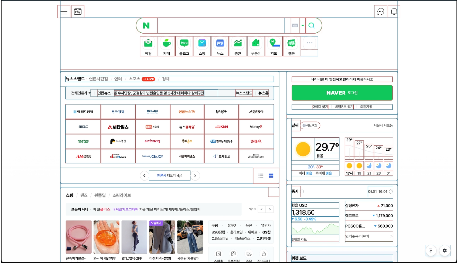
빨간색 표시: 영역 표시

### CSS Box Model
모든 HTML 요소를 사각형 박스로 표현하는 개념
- 내용(content), 안쪽 여백(padding), 테두리(border), 외부 간격(margin)으로 구성되는 개념

### Box 구성 요소
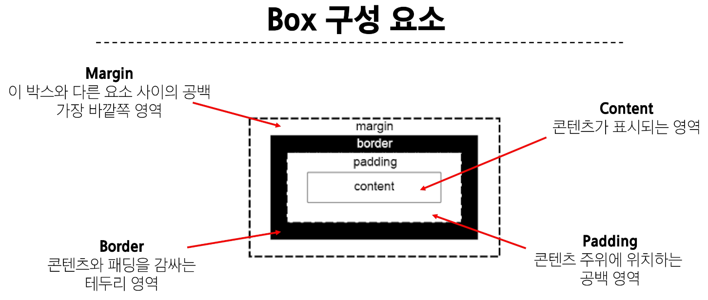

### Box 구성의 방향별 명칭
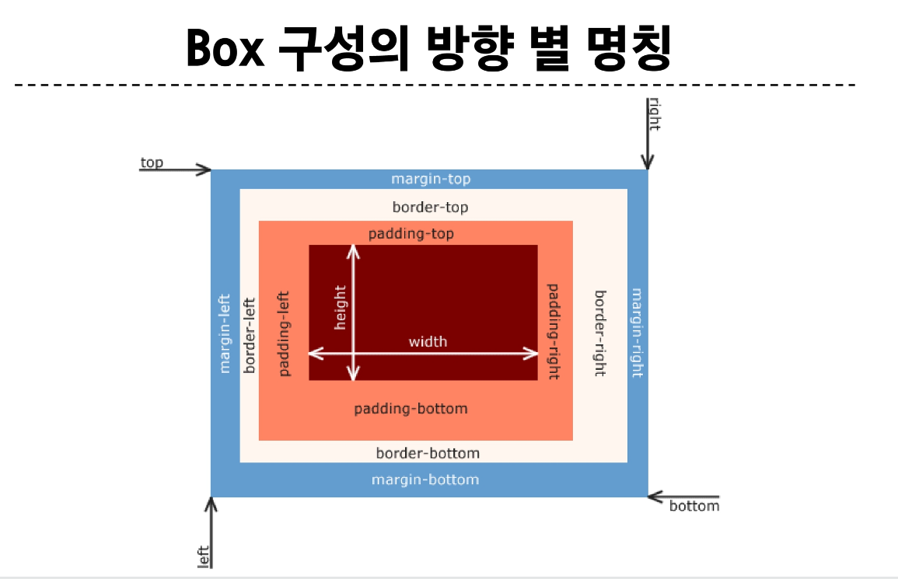

### Box 구성 요소 예시
01-part-of-box 확인
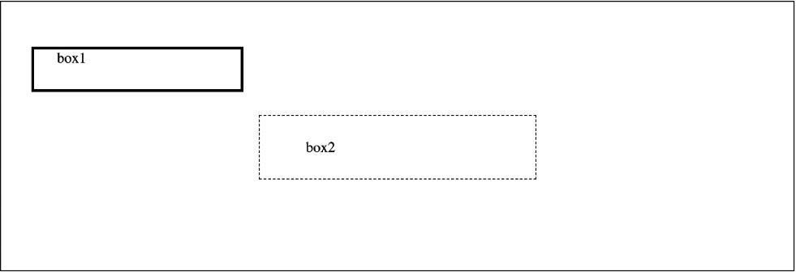

### width& height 속성
요소의 너비와 높이를 지정
이 때 지정되는 요소의 너비와 높이는 content 영역을 대상으로 함
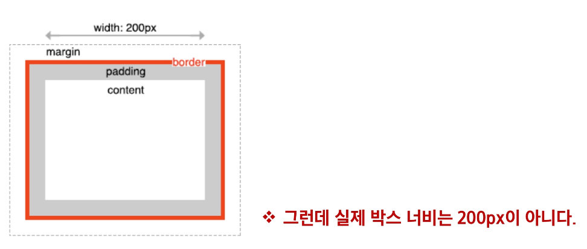

### box-sizing 속성
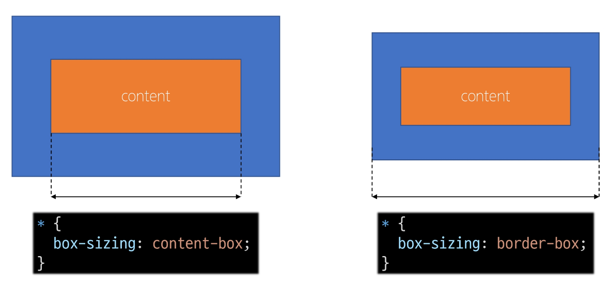
*는 전체 선택자

### box-sizing 예시(1/2)
02-box-sizing 확인

### 박스 타입
Block & inline
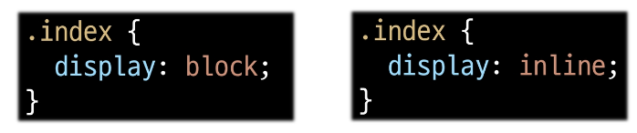

### Normal flow
CSS를 적용하지 않았을 경우 웹페이지 요소가 기본적으로 배치되는 방향
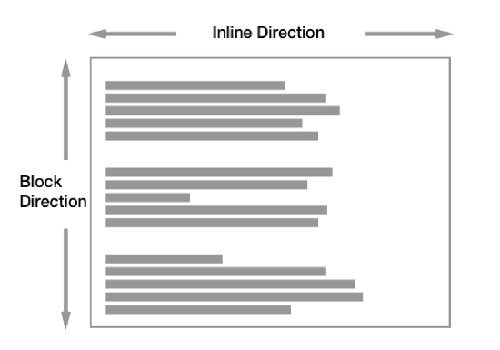

### 박스 타입 예시
03-block-inline 확인
block 요소가 아래로 흐르는 이유는 옆으로 모든 영역을 가지고 있기 때문

### block 타입 특징
- 항상 새로운 행으로 나뉨
- width와 height 속성을 사용하여 너비와 높이를 지정할 수 있음
- 기본적으로 width 속성을 지정하지 않으면 박스는 inline 방향으로 사용 가능한 공간을 모두 차지함
    - (너비를 사용가능한공간의 100%로 채우는 것)
- 대표적인 block 타입 태그
    - h1~6, p, div

### inline 타입 특징
- 새로운 행으로 나뉘지 않음
- width와 height 속성을 사용할 수 없음
- 수직 방향
    - padding, margins, borders가 적용되지만 다른 요소를 밀어낼 수는 없음
- 수평 방향
    - padding, margins, borders가 적용되어 다른 요소를 밀어낼 수 있음
- 대표적인 inline 타입 태그
    - a, img,span
- cf) 이미지는 사이즈 조정이 가능

### 속성에 따른 수평 정렬
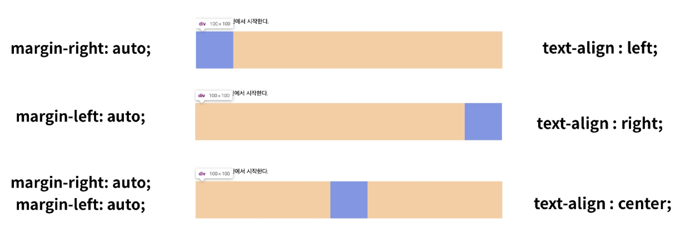

### 기타 display 속성
1. inline-block
2. none

### Inline-block
- inline과 block 요소 사이의 중간 지점을 제공하는 display 값
- block 요소이 특징을 가짐
    - width 및 height 속성 사용 가능
    - padding, margin 및 border로 인해 다른 요소가 밀려남
- 요소가 줄바꿈 되는 것을 원하지 않으면서 너비와 높이를 적용하고 싶은 경우에 사용

### inline-block 예시
04-inline-block 확인
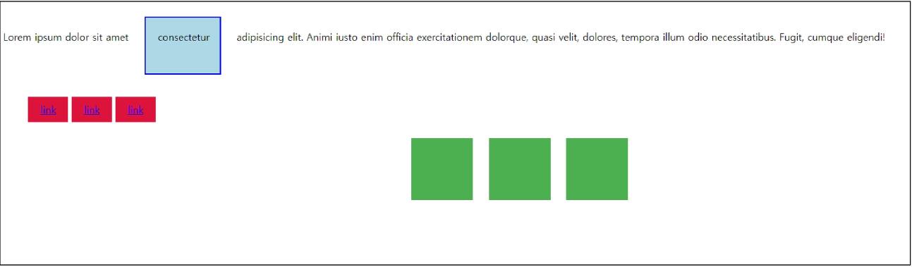

### None
- 요소를 화면에 표시하지 않고, 공간조차 부여되지 않음

### none 예시
05-none 확인

## 참고
### shorthand 속성 - 'border'
border-width, border-style, border-color를 한 번에 설정하기 위한 속성

### shorthand 속성= 'margin'&'padding'
- 4방향 속성을 각각 지정하지 않고 한 번에 지정할 수 있는 속성
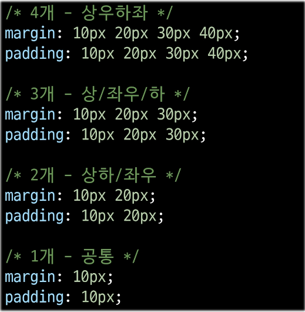

### Margin collapsing(마진 상쇄)
- 두 block 타입 요소의 margin top과 bottom이 만나 더 큰 margin으로 결합되는 현상
- 웹 개발자가 레이아웃을 더욱 쉽게 관리할 수 있도록 함
- 각 요소에 대한 상/하 margin을 각각 설정하지 않고 한 요소에 대해서만 설정하기 위함
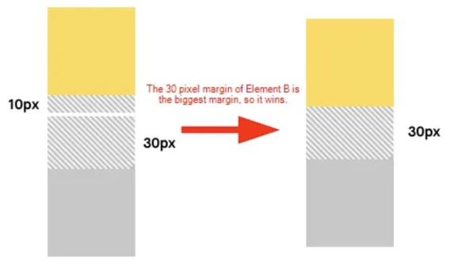

### 마진 상쇄 예시
두 요소 모두 margin 20px 이지만 실제 두 요소 상/하 여백은 40이 아닌 20으로 상쇄
02-box-sizing 확인

## CSS position
### CSS Layout
각 요소의 위치와 크기를 조정하여 웹 페이지의 디자인을 결정하는 것
Display, Position, Float, Flexbox 등

### CSS Position
요소를 Normal Flow에서 제거하여 다른 위치로 배치하는 것
 - 요소를 Normal Flow에서 제거하여 다른 위치로 배치하는 것
 - 다른 요소 위에 올리기, 화면의 특정 위치에 고정시키기 등

### position 이동 방향
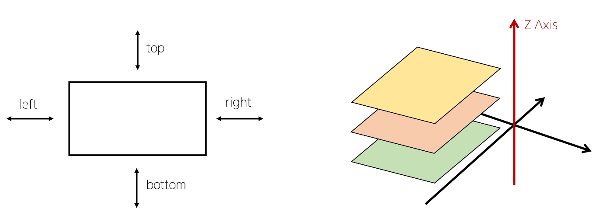

### Position 유형
1. static
2. relative
3. absolute
4. fixed
5. sticky
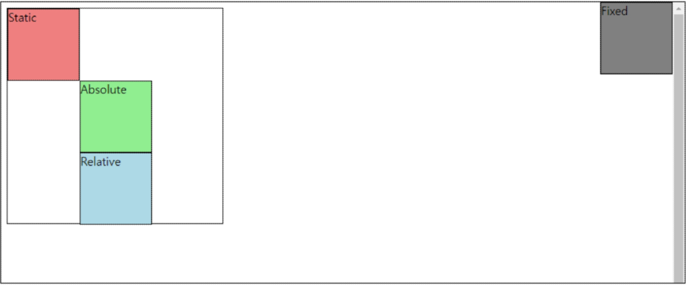
01-position 확인

### position 예시 - sticky
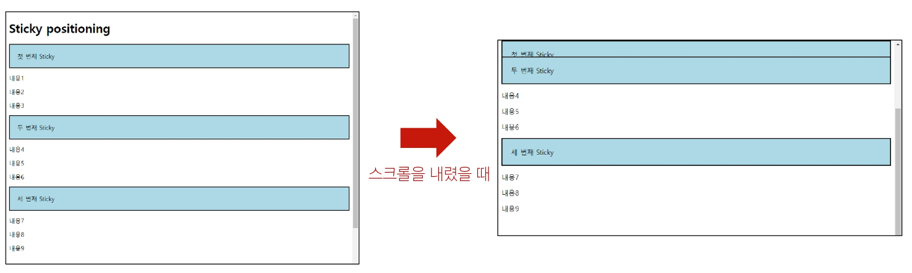
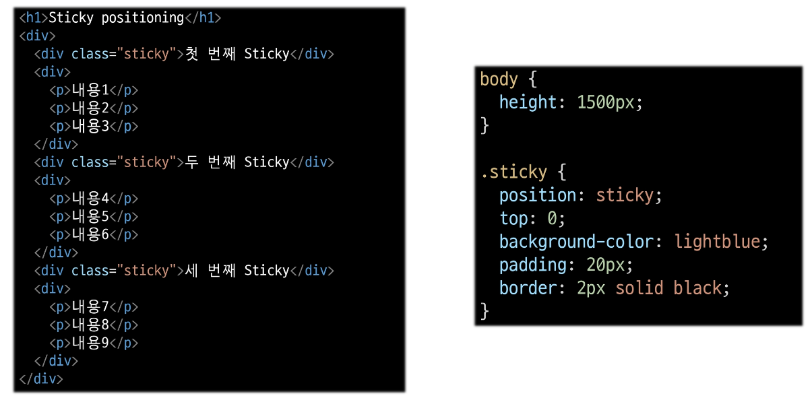
02-sticky 확인

### Position 유형별 특징
 - static
     - 기본값
     - 요소를 Normal Flow에 따라 배치

 - relative
     - 요소를 Normal Flow에 따라 배치
     - 자기 자신을 기준으로 이동
     - 요소가 차지하는 공간을 static일 때와 같음
 - absolute
     - 요소를 Normal Flow에서 제거
     - 가장 가까운 relative 부모 요소를 기준으로 이동
     - 문서에서 요소가 차지하는 공간이 없어짐
 - fixed
     - 요소를 Normal Flow에서 제거
     - 현재 화면영역(viewport)을 기준으로 이동
     - 문서에서 요소가 차지하는 공간이 없어짐
     - 화면을 스크롤하더라도 그 위치에 그대로 있음
 - sticky
     - 요소를 Normal Flow에 따라 배치
     - 요소가 일반적인 문서 흐름에 따라 배치되다가 스크롤이 특정 임계점에 도달하면 그 위치에서 고정됨(fixed)
     - 만약 다음 sticky 요소가 나오면 다음 sticky 요소가 이전 sticky 요소의 자리를 대체
         - 이전 sticky 요소가 고정되어 있던 위치와 다음 sticky 요소가 고정되어야 할 위치가 겹치게 되기 때문

### 실제 position 사용 예시 - absolute
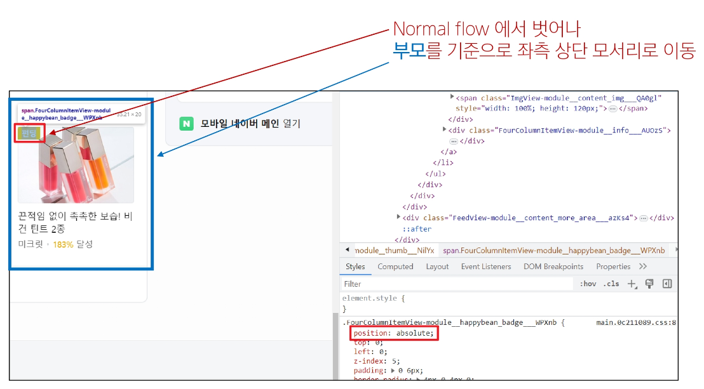

### 실제 position 사용 예시 - fixed
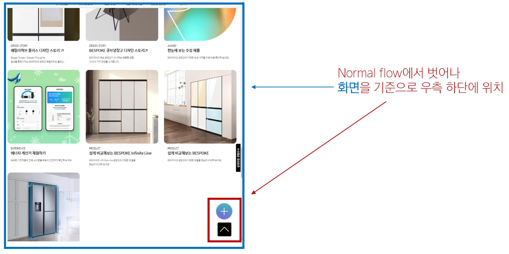

### 실제 position 사용 예시 - sticky
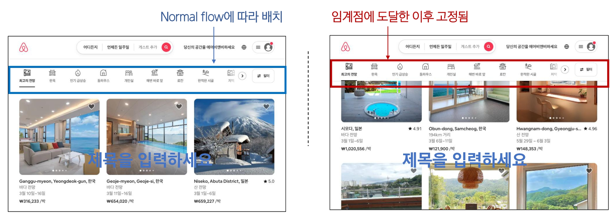

### absolute 예시 (1/2)
03-absolute 확인

### z-index
요소가 겹쳤을 때 어떤 요소 순으로 위에 나타낼 지 결정
 - 정수 값을 사용해 Z축 순서를 지정
 - 더 큰 값을 가진 요소가 작은 값의 요소를 덮음
04-z-index 확인

## 참고
### Position의 역할
전체 페이지에 대한 레이아웃을 구성하는 것이 아닌 페이지 특정 항목의 위치를 조정하는 것

### CSS Flexbox
요소를 행과 열 행태로 배치하는 1차원 레이아웃 방식
     - 공간 배역 & 정렬

### 요소를 행과 열 형태로 배치하는 1차원 레이아웃 방식
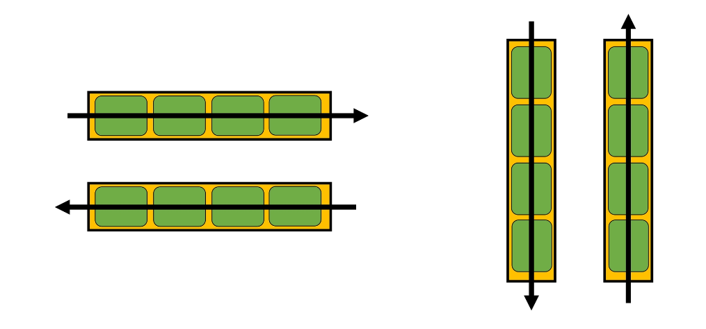

### Flexbox 구성 요소
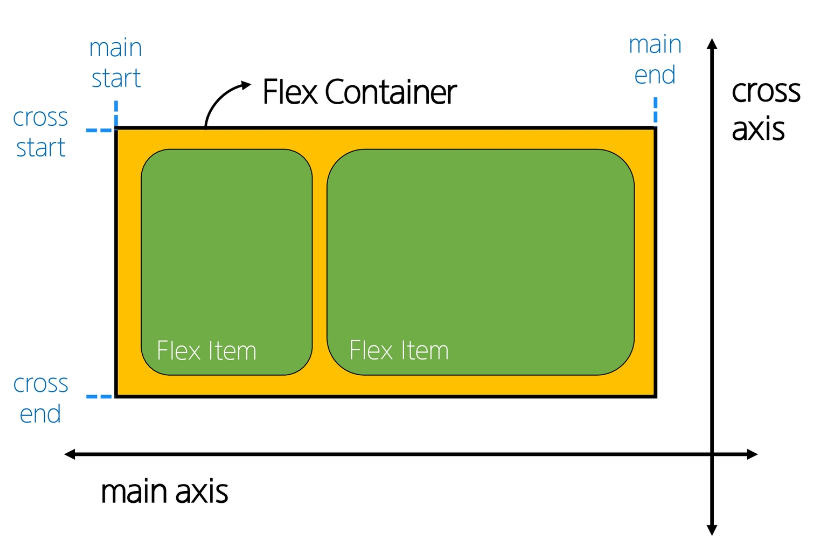
flex container - 부모, 이걸 기준으로 삼음

### main axis(주 축)
 - flex item들이 배치되는 기본 축
 - main start에서 시작하여 main end 방향으로 배치(기본 값)

### cross axis(교차 축)
 - main axis에 수직인 축
 - cross start에서 시작하여 cross end 방향으로 배치(기본 값)

### Flex container
 - display: flex; 혹은 display: inline-flex;가 설저된 부모 요소
 - 이 컨테이너의 1차 자식 요소들이 Flex item이 됨
 - flexbox 속성 값들을 사용하여 지식 요소 flex item들을 배치하는 주체

### Flex item
 - Flex Container 내부에 레이아웃 되는 항목

## 레이아웃 구성
### 1. Flex Container 지정
 - flex item은 기본적으로 행으로 나열
 - flex item은 주 축의 시작 선에서 시작
 - flex item은 교차 축의 크기를 채우기 위해 늘어남
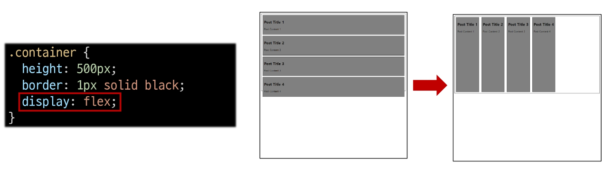

### 2. flex-direction
 - flex item이 나열되는 방향을 지정
 - column으로 지정할 경우 주 축이 변경됨
 - "-reverse"로 지정하면 flex item 배치이 시작 선과 끝 선이 서로 바뀜
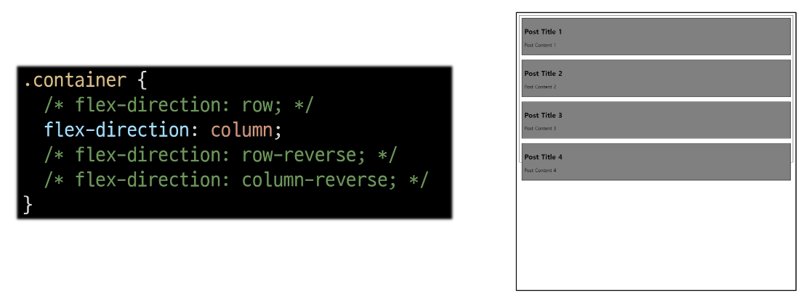

### 3. flex-wrap
 - flex item 목록이 flex container의 한 행에 들어가지 않을 경우 다른 행에 배치할 지 여부 설정

### 4. justify-content
 - 주 축을 따라 flex item과 주위의 공간을 분배
 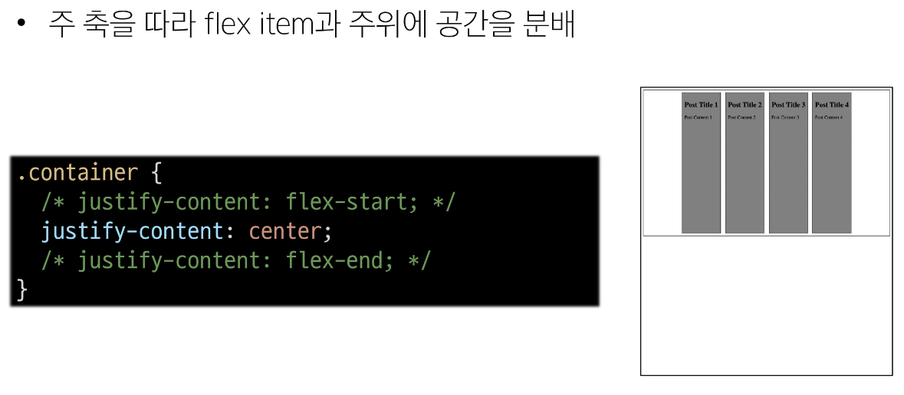

### 5. align-content
 - 교차 축을 따라 flex item과 주위에 공간을 분배
    - flex-wrap이 wrap 또는 wrap-reverse로 설정된 여러 행에만 적용됨
    - 한 줄 짜리 행에는 효과 없음(flex-wrap이 nowrap으로 설정된 경우)
 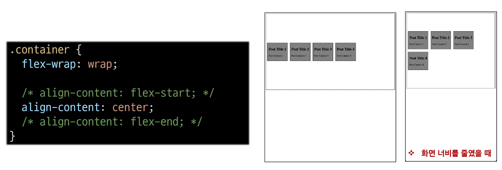

### 6. align-items
 - 교차 축을 따라 flex-itme 행을 정렬
 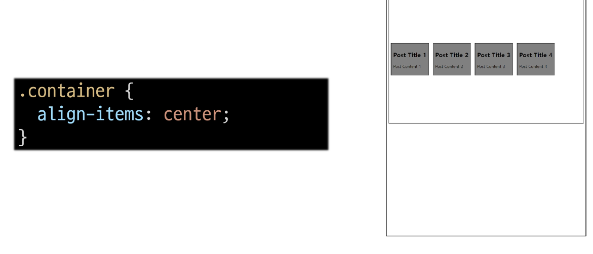

### 7. align-self
 - 교차 축을 따라 개별 flex item을 정렬
 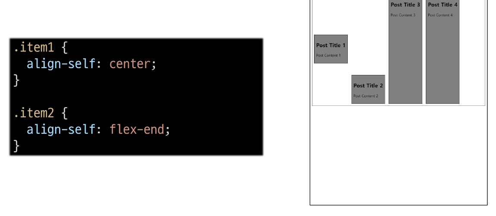

### Flexbox 속성
 - Flex Container 관련 속성
     - display, flex-direction, flex-wrap, justify-content. align-itmes. align-content
 - Flex Item 관련 속성
     - align-self, flex-grow, flex-basis, order

### 목적에 따른 속성 분류
 - 배치
     - flex-direction, flex-wrap
 - 공간 분배
     - justify-content
     - align-content
 - 정렬
     - align-items
     - align-self

### 속성명 tip
- justify 주축
- align 교차 축

### 8. flex-grow
 - 남는 행 여백을 비율에 따라 각 flex item에 분배
    - 아이템이 컨테이너 내에서 확장하는 비율을 지정
 - flex-grow의 반대는 flex-shrink

02-flexbox-grow 확인
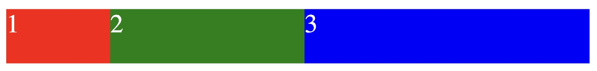
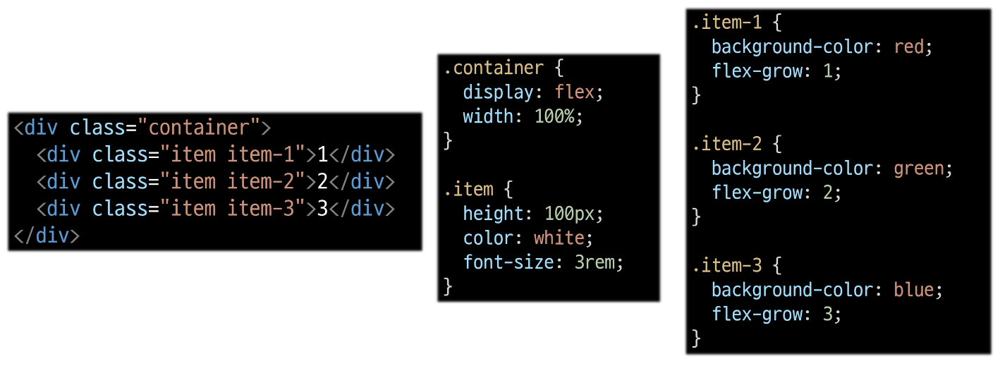
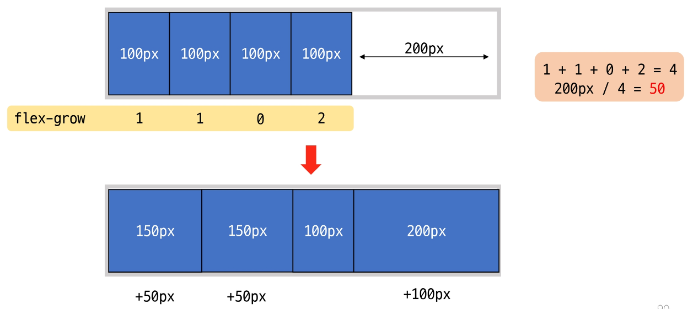

### 9.flex-basis
 - flex item의 초기 크기 값을 지정
 - flex-basis와 width값을 동시에 적용한 경우 flex-basis가 우선

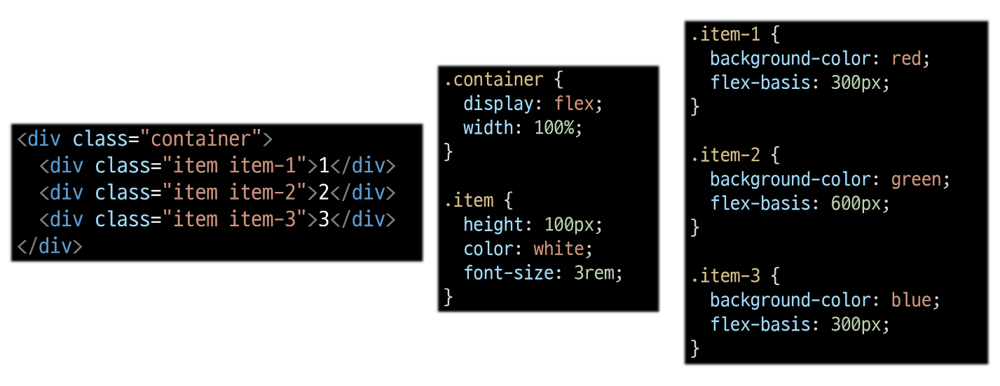
03-flexbox-basis 확인

### 반응형 레이아웃
 - 다양한 디바이스와 화면 크기에 자동으로 적응하여 콘텐츠를 최적으로 표시하는 웹 레이아웃 방식
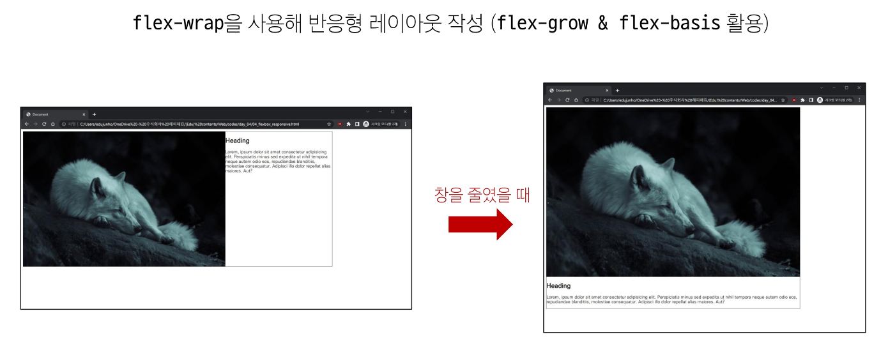
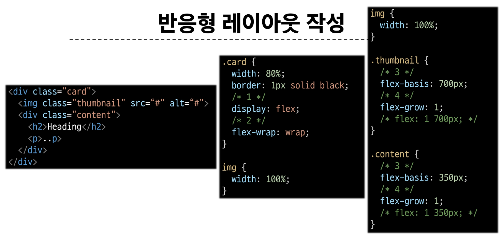

## 정리
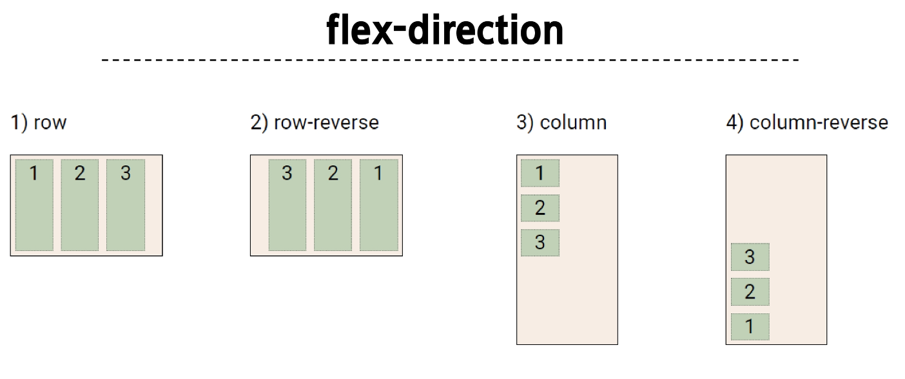
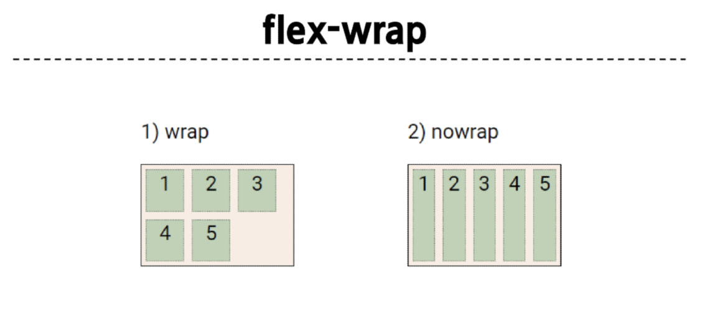
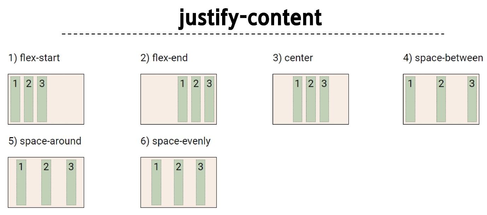
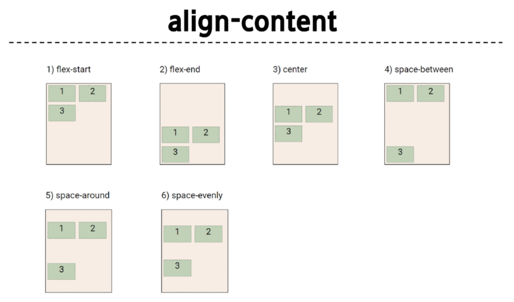
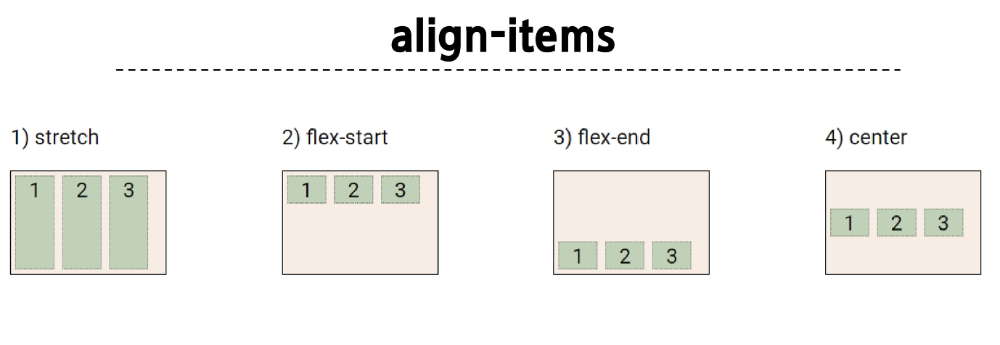
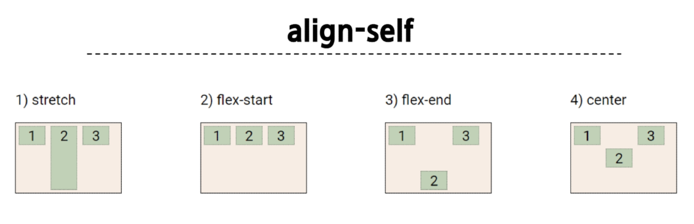

## 참고
### justify-itmes 및 justify-self 속성이 없는 이유
 - 필요 없기 때문
 - margin auto를 통해 정렬 및 배치가 가능

### Shorthand - flex-flow
.container{
    flew-flow: flex-direction flex-wrap;
}

### shorthand - "flex"
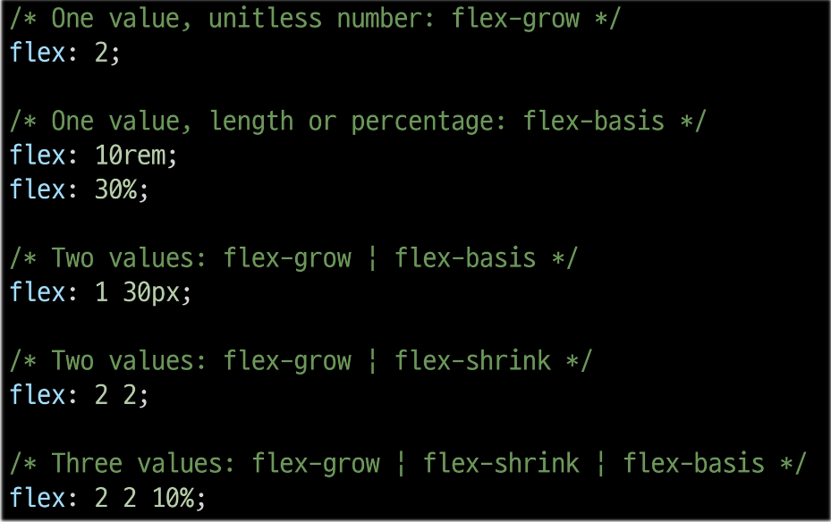

