# 240308 Bootstrap
### Bootstrap
CSS 프론트엔드 프레임워크(Toolkit)
 - 미리 만들어진 다양한 디자인 요소들을 제공하여 웹사이트를 빠르고 쉽게 개발할 수 있돌고 함

The world most popular front-end open source -> 16위
https://gitstar-ranking.com/repositories

### Bootstrap 사용해보기
1. Bootstrap 공식 문서 접속
- https://getbootstrap.com/

2. Docs -> Introduction -> Quick Start
3. Include Bootstrap's CSS and JS 코드 확인 및 가져오기
 - https://getbootstrap.com/docs/5.3/getting-started/introduction/#quick-start
 - head와 body에 bootstrap CDN이 포함된 코드 블록

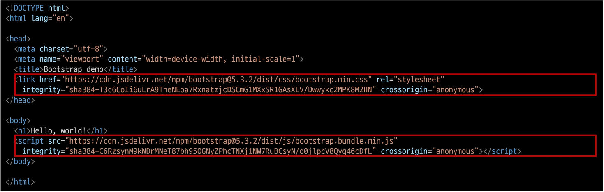

추가한 2가지 코드로 인해 왼쪽 끝에 완전 붙은 느낌이 난다
위에 가져온 코드를 뭐라고 하는가?

### CDN
content delivery network
지리적 제약 없이 빠르고 안전하게 콘텐츠를 전송할 수 있는 전송 기술
서버와 사용자 사이의 물리적인 거리를 줄여 콘텐츠 로딩에 소요되는 시간을 최소화
(웹 페이지 로드 속도를 높임)
지리적으로 사용자와 가까운 CDN 서버에 콘텐츠를 저장해서 사용자에게 전달

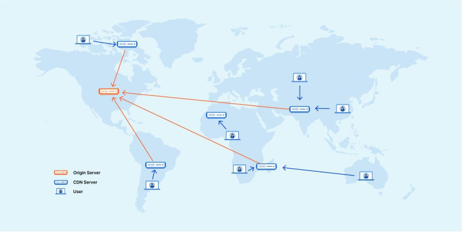

### Bootstrap CDN
1. Bootstrap 홈페이지 - Download - "complied CSS and JS"
2. CDN을 통해 가져오는 bootstrap css와 js 파일을 확인
3. bootstrap.css 파일 참고
 - 온라인 CDN 서버에 업로드 된 css 및 js 파일을 불러와서 사용하는 것

 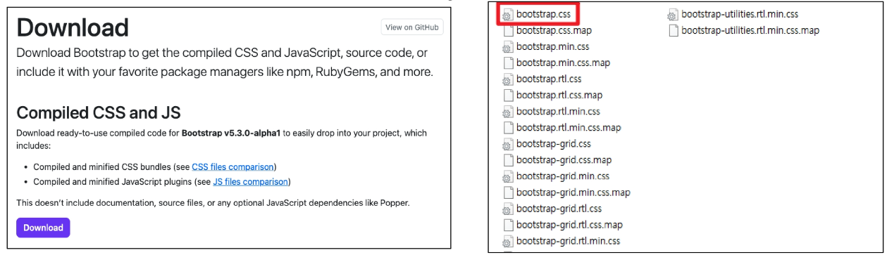

Bootstrap 기본 사용법

Hello, world!

mt-5
{property}{sides}-{size}

bootstrap.css을 살펴보니 h1을
margin-top:0;
margin-bottom: 0.5rem;
font-weight:500;
line-weight:1.2;
로 설정되어있었음

Bootstrap에서 클래스 이름으로 Spacing을 표현하는 방법
 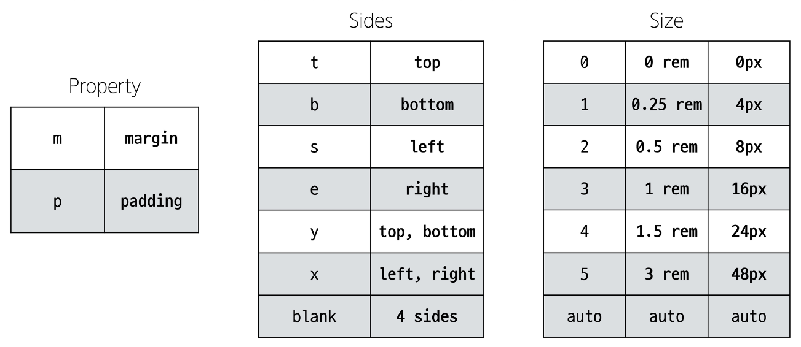

실제로 size는 rem = 16px 단위를 제일 많이 쓴다

https://getbootstrap.com/docs/5.3/utilities/spacing/#margin-and-padding

### Bootstrap에는 특정한 규칙이 있는 클래스 이름으로 스타일 및 레이아웃이 미리 작성되어 있음
왜 본인들이 만들 클래스 이름들에 !important를 써놨을까?
개발자가 실수로 동일한 이름을 만들더라도 기존에 있는 게 적용되도록 설정해놓음

## Reset CSS
### Bootstrap 적용 전/후 비교
 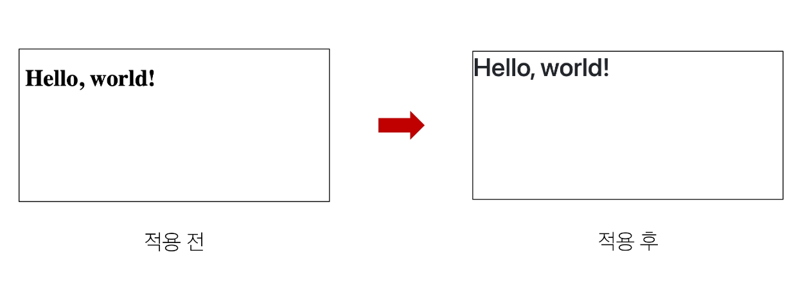

모든 HTML 요소 스타일을 일관된 기준으로 재설정하는 간결하고 압축된 규칙 세트
 - HTML element, table, list 등의 요소들에 일관성 있게 스타일을 적용시키는 기본 단계

모든 브라우저는 각자의 'user agent stylesheet'를 가지고 있음
    - 웹사이트를 보다 읽기 편하게 하기 위해

문제는 이 설정이 브라우저마다 상이하다는 것
모든 브라우저에서 웹사이트를 동일하게 보이게 만들어야하는 개발자에겐 매우 골치 아픈 일

모두 똑같은 스타일 상태로 만들고 스타일 개발을 시작하자!

### User-agent stylesheets
 - 모든 문서에 기본 스타일을 제공하는 기본 스타일 시트
 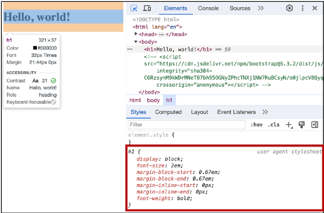

### Normalized CSS
 - Reset CSS 방법 중 대표적인 방법
 - 웹 표준 기준으로 브라우저 중 하나가 불일치한다면 차이가 있는 브라우저를 수정하는 방법
    - 경우에 따라 IE 또는 EDGE 브라우저는 표준에 따라 수정할 수 없는 경우도 있는데, 이 경우 IE 또는 EDGE의 스타일을 나머지 브라우저에 적용시킴

### Bootstrap에서의 Reset CSS
 - bootstrap은 bootstrap-reboot.css라는 파일명으로 normalize.css를 자체적으로 커스텀해서 사용하고 있음
 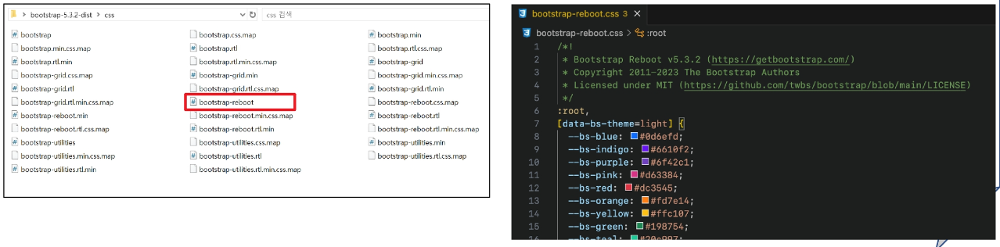

## Typography
 - 제목, 본문 텍스트, 목록 등
 01-typography 확인

### Display headings
기존 heading보다 더 눈에 띄는 제목이 필요할 경우
(더 크고 약간 다른 스타일)

### Inline text elelments
HTML inline 요소에 대한 스타일

### LIST
HTML list 요소에 대한 스타일

### Bootstrap Color system
Bootstrap이 지정하고 제공하는 색상 시스템

### Colors
Text, Border, Background 및 다양한 요소에 사용하는 Bootstrap의 색상 키워드
02-colors 확인

### text colors

### background colors

### Bootstrap 실습
 - 너비가 높이가 각각 200px인 정사각형 작성하기
    - 너비와 높이를 제외한 스타일은 모두 bootstrap으로 작성

### Bootstrap Component
- Bootstrap에서 제공하는 UI 관련 요소
    - 버튼, 네비게이션 바, 카드, 폼, 드롭다운

### 대표 Component
- Alerts
- Badges
- Buttons
- Cards
- Navbar

### Component 이점
- 일관된 디자인을 제공하여 웹사이트의 구성 요소를 구축하는 데 유용하게 활용

### Bootstrap 코드 파일을 불러와 사용하기
 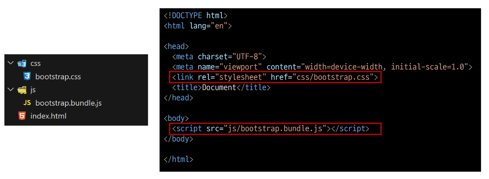

### Bootstrap을 사용하는 이유
 - 가장 많이 사용되는 CSS 프레임워크
 - 사전에 디자인된 다양한 컴포넌트 및 기능
     - 빠른 개발과 유지 보수
 - 손쉬운 반응형 웹 디자인 구현
 - 커스터마이징(customizing)이 용이
 - 크로스 브라우징(cross browsing) 지원
     - 모든 주요 브라우저에서 작동하도록 설계되어 있음

### carousel
05-carousel 확인
cf) data-bs-target과 id가 carousel마다 따로따로 매칭시켜야함

### Semantic Web
 - 웹 데이터를 의미론적으로 구조화된 형태로 표현하는 방식

이 요소가 시각적으로 어떻게 보여질까? -> 이 요소가 가진 목적과 역할은 무엇일까?

### HTML 요소가 의미를 가진다는 것
 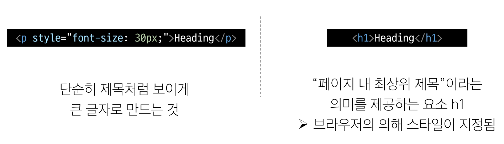

### HTML Semantic Element
 - 기본적인 모양과 기능 이외에 의미를 가지는 HTML 요소
     - 검색엔진 및 개발자가 웹 페이지 콘텐츠를 이해하기 쉽도록

### 대표적인 Semantic Element
 - header
 - nav
 - main
 - article
 - section
 - aside
 - footer

**
랑 100% 똑같은데 영역 분리를 위해 만든 것**

### Semantic element 사용 예시
 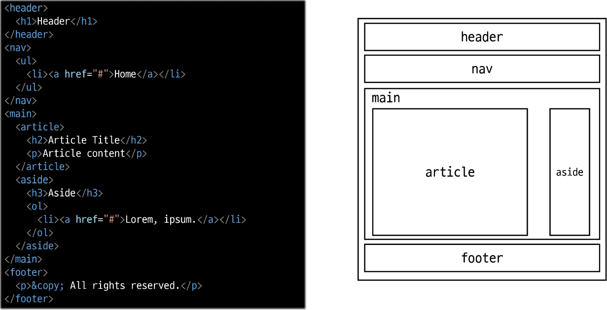

## Semantic in CSS
### CSS 방법론
 - CSS를 효율적이고 유지 보수가 용이하게 작성하기 위한 일련의 가이드라인

### OOCSS
- Object Oriented CSS
- 객체 지향적 접근법을 적용하여 CSS를 구성하는 방법론

### OOCSS 기본 원칙
1. 구조와 스킨을 분리
2. 컨테이너와 콘텐츠를 분리

### 1. 구조와 스킨 분리
구조와 스킨을 분리함으로써 재사용 가능성을 높임

모든 버튼의 공통 구조를 정의 + 각각의 스킨(배경색과 폰트 색상)을 정의
 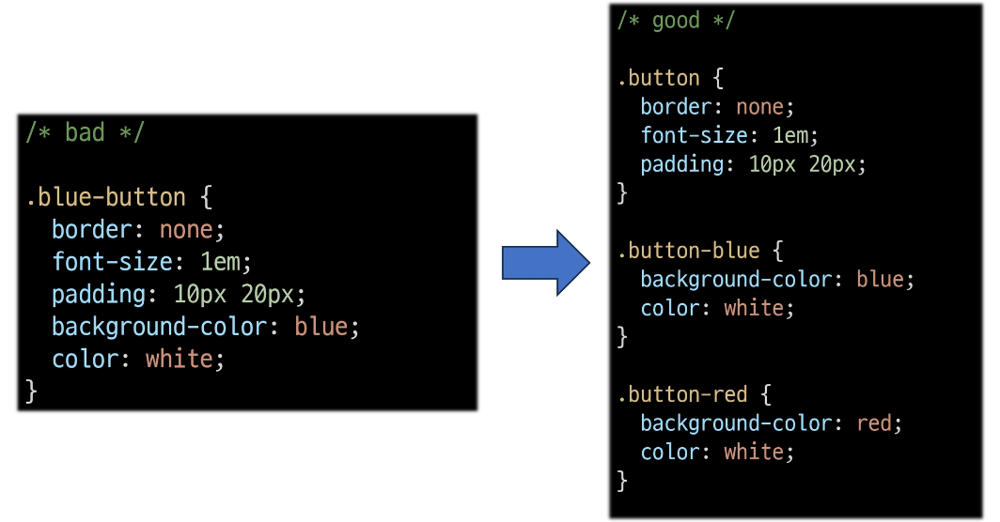

### 2. 컨테이너와 콘텐츠 분리
 - 객체에 직접 적용하는 대신 객체를 둘러싸는 컨테이너에 스타일을 적용
 - 스타일을 정의할 때 위치에 의존적인 스타일을 사용하지 않도록 함
 - 콘텐츠를 다른 컨테이너로 이동시키거나 재배치할 때 스타일이 깨지는 것을 방지

### OOCSS 적용 예시
 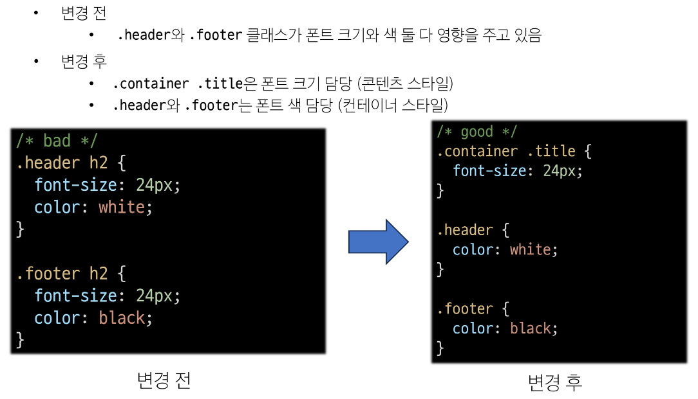

## 참고
### 책임과 역할
HTML - 콘텐츠의 구조와 의미
CSS - 레이아웃과 디자인

### 의미론적인 마크업이 필요한 이유
 - 검색엔진 최적화(SEO)
     - 검색 엔진이 해당 웹 사이트를 분석하기 쉽게 마들어 검색 순위에 영향을 줌

 - 웹 접근성(Web Accessibility)
     - 웹 사이트, 도구, 기술이 고령자나 장애를 가진 사용자들이 사용할 수 있도록 설계 및 개발하는 것
     - ex) 스크린 리더를 통해 전맹 시각장애 사용자에게 웹의 글씨를 읽어줌
     - https://nuli.navercorp.com/