# Responsive Web

## html 팁

<!-- div>ul>li*5 -->
<!-- 

  <ul>
    <li></li>
    <li></li>
    <li></li>
    <li></li>
    <li></li>
  </ul>

 -->

<!-- div>.container>h1{hello}+nav>ul>li*5>a{Link $} -->
<!-- 

  

    <h1>hello</h1>
    <nav>
      <ul>
        <li><a href="">Link 1</a></li>
        <li><a href="">Link 2</a></li>
        <li><a href="">Link 3</a></li>
        <li><a href="">Link 4</a></li>
        <li><a href="">Link 5</a></li>
      </ul>
    </nav>
  

 -->

### 사이트: Emmet
Emmet -> documentation
Emmet -> cheat sheet
Syntax 상단에 있는 것들을 주로 활용

### 단축키
1. ctrl + l : 한 줄 선택
2. ctrl + d : 동일한 키워드 연속 선택
3. ctrl + alt + 화살표: 멀티 커서
4. alt + 클릭: 멀티 커서
5. alt + 화살표: 선택한 라인 끌고 가기
6. alt + shift + 화살표: 선택한 라인 복사

## Bootstrap Grid system
### Bootstrap Grid system
 - 페이지의 레이아웃을 조정하는 데 사용되는 **'12개의 컬럼'**으로 구성된 시스템
   - 왜 12개인가? 약수가 많음 2^2 * 3 => 6개의 약수 비교적 적은 수임에도 불구하고 약수가 많음
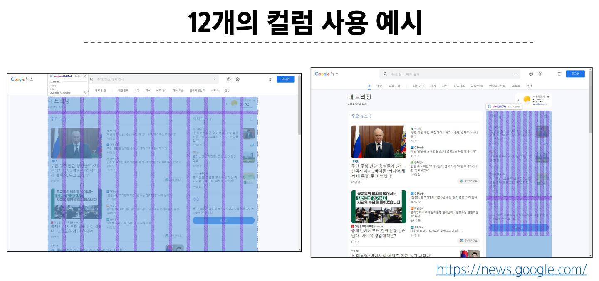

### Grid system 목적
 - 반응형 디자인을 지원해 웹 페이지를 모바일, 태블릿, 데스크탑 등 다양한 기기에서 적절하게 표시할 수 있도록 도움

### 반응형 웹 디자인
 - Resposive Web Design
 - 디바이스 종류나 화면 크기에 상관없이 어디서든 일관된 레이아웃 및 사용자 경험을 제공하는 디자인 기술

### Grid system 기본 요소
 1. Container
   - column 들을 담고 있는 공간
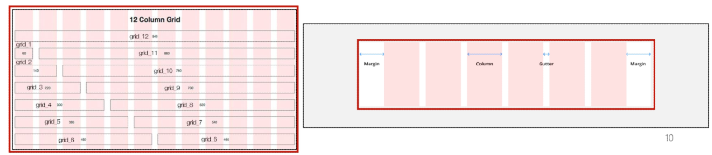

 2. Column
   - 실제 컨텐츠를 포함하는 부분
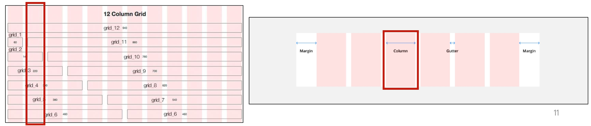

 3. Gutter
   - 컬럼과 컬럼 사이의 여백 영역
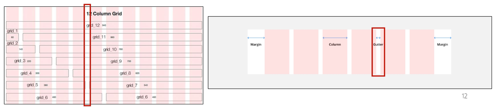

 4. 1개의 row 안에 12개의 column 영역이 구성
   - 각 요소는 12개 중 몇 개를 차지할 것인지 지정됨

### Grid System 실습 - 기본
 01-grid-system 참고

### Gutters
Grid system에서 column 사이에 여백 영역
X축은 padding, y축은 margin으로 여백 생성
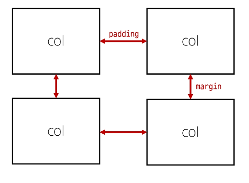

### Gutters - 실습
 01-grid system 참고

### The Grid system
 - CSS가 아닌 편집 디자인에서 나온 개념으로 구성 요소를 잘 배치해서 시각적으로 좋은 결과물을 만들기 위함
 - 기본적으로 안쪽에 있는 요소들의 오와 열을 맞추는 것에서 기인
 - 정보 구조와 배열을 체계적으로 작성하여 정보의 질서를 부여하는 시스템
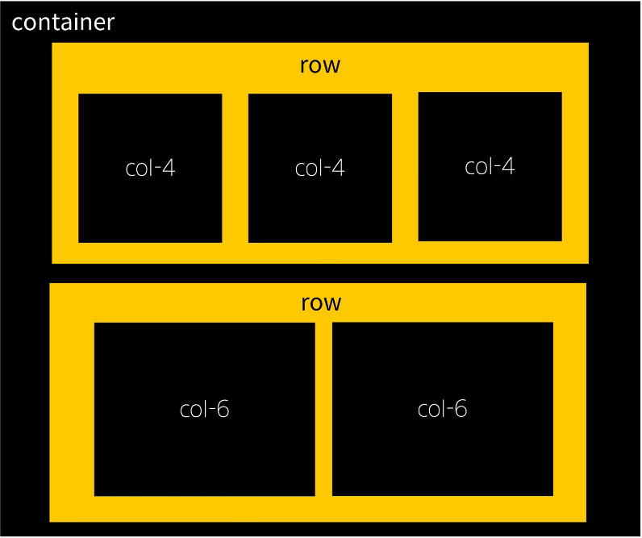

## Grod system for responsive web
### Responsive Web Design
 - 디바이스 종류와 화면 크기에 상관없이, 어디서든 일관된 레이아웃 및 사용자 경험을 제공하는 디자인 기술

 - Bootstrap grid system에서는 12개 column과 6개 breakpoints를 사용하여 반응형 웹 디자인을 구현
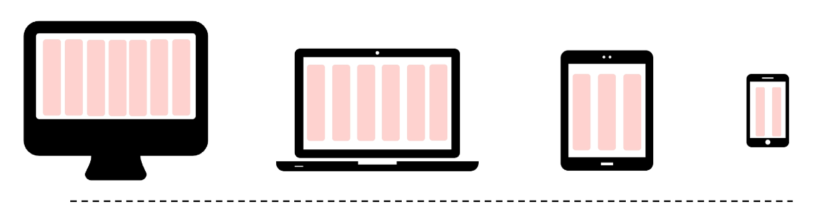

### Grid system breakpoints
 - 웹 페이지를 다양한 화면 크기에서 적절하게 배치하기 위한 분기점
   - 화면 너비에 따라 6개의 분기점 제공(xs, sm, md, lg, xl, xxl)

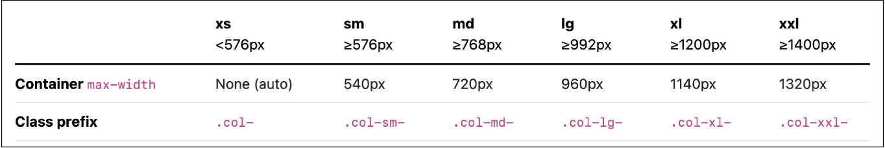
각 breakpoints마다 설정된 최대 너비 값 "이상으로" 화면이 커지면 grid system 동작이 변경됨

### Breakpoints 실습
01-breakpoints 참고
개발자 도구 F12에서 픽셀 크기 확인 가능
breakpoint 쓸 때 작은 크기에서 설정한 offset을 초기화하지 않으면 계속 적용된다.

### Media Query로 작성된 Grid system의 breakpoints
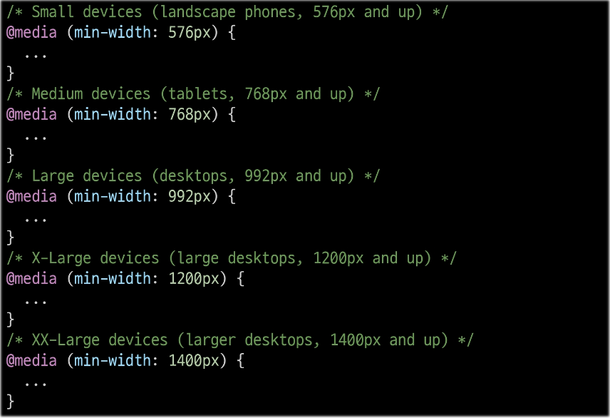

### Grid System은 화면 크기에 따라 12개의 칸을 각 요소에 나누어 주는 것

### CSS Layout 종합 정리
 - 어떤 레이아웃 기술이 사용됐는지 생각해보기
1. Grid system
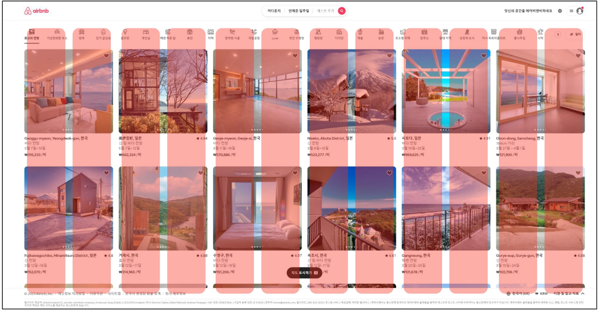
2. Flexbox
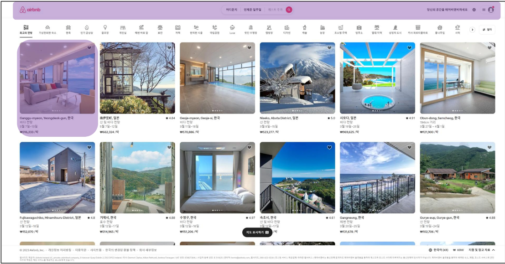
3. Position
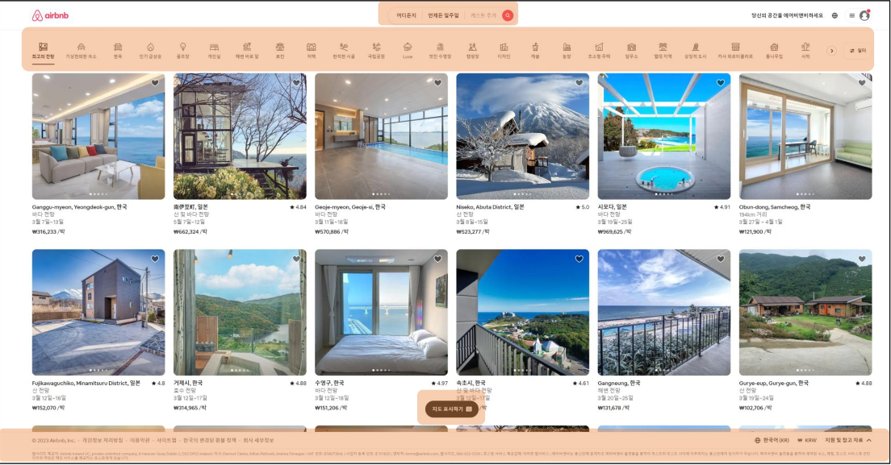

각각의 기술은 용도와 장단점이 있음
각 기술은 독립적인 용도를 가지지 않으며, 어떤 기술이 적합한 도구가 될 지는 특정 상황에 따라 다름
이를 파악하기 위해서는 충분한 개발 경험이 필요하다.

## 참고
### Grid cards
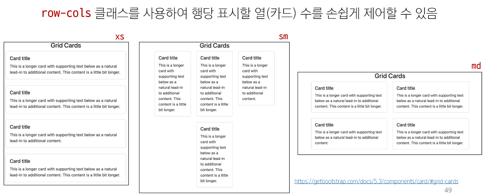
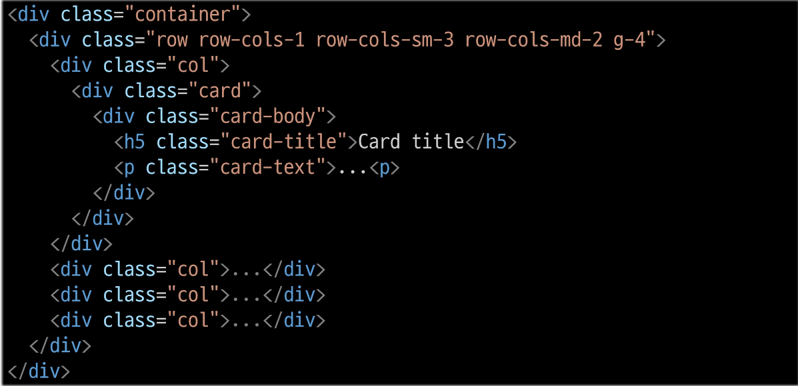

web.dev