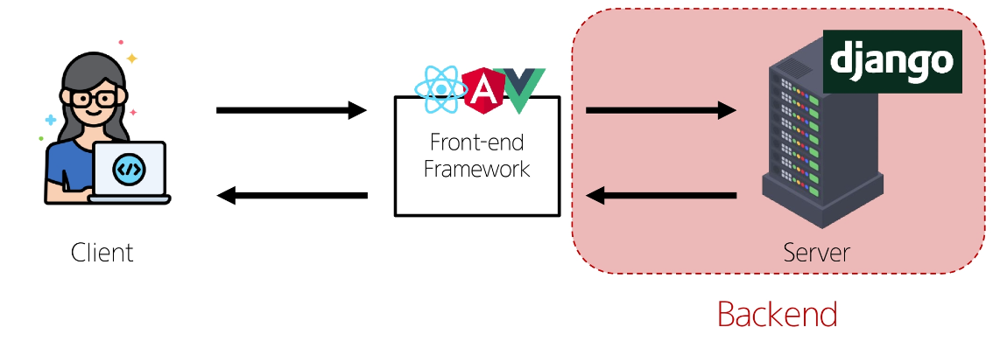

# Django 01

## Web application

### Web application(web service) 개발
 - 인터넷을 통해 사용자에게 제공되는 소프트웨어 프로그램을 구축하는 과정
 - 다양한 디바이스(모바일, 태블릿, PC 등)에서 웹 브라우저를 통해 접근하고 사용할 수 있음

## 클라이언트 서버
### 웹의 동작 방식
 - 우리가 컴퓨터 혹은 모바일 기기로 웹 페이지를 보게 될 때까지 무슨 일이 일어날까?

### Client
클라이언트
 - 서비스를 요청하는 주체
 (웹 사용자의 인터넷이 연결된 장치, 웹 브라우저)

### Server
서버
 - 클라이언트의 요청에 응답하는 주체
 (웹 페이지, 앱을 저장하는 컴퓨터)

### 우리가 웹 페이지를 보게 되는 과정

2번의 요청과 3번의 응답이 키 포인트!

### 웹 개발에서의 Frontend와 Backend
 - Frontend(프론트엔드)
   - 사용자 인터페이스(UI)를 구성하고 사용자가 애플리케이션과 상호작용할 수 있도록 함
   - HTML, CSS, Javascript, 프론트엔드 프레임워크 등

 - Backend(백엔드)
   - 서버 측에서 동작하며, 클라이언트의 요청에 대한 처리와 데이터베이스와의 상호작용 등을 담당
   - 서버 언어(Python, Java 등) 및 백엔드 프레임워크, 데이터베이스, API, 보안 등

### Frontend와 Backend

## Framework
### 웹 서비스 개발에는 무엇이 필요할까?

- 로그인, 로그아웃, 회원관리, 데이터베이스, 보안 등 너무 많은 기술들이 필요
- 하나부터 열까지 개발자가 모두 작성하는 것은 현실적으로 어려움
- 하지만 모든 것을 직접 만들 필요가 없음
- 잘 만들어진 것들을 가져와 좋은 환경에서 내 것으로 잘 사용하는 것도 능력인 시대
- 거인의 어깨 위에서 프로그래밍하기

### Web Framework
 - 웹 어플리케이션을 빠르게 개발할 수 있도록 도와주는 도구
 (개발에 필요한 기본 구조, 규칙, 라이브러리 등을 제공)

### django
- Python 기반의 대표적인 웹 프레임워크

### 왜 Django를 사용할까?
 - 다양성
   - Python 기반으로 소셜 미디어 및 빅데이터 관리 등 광범위한 서비스 개발에 적합
 - 확장성
   - 대량의 데이터에 대해 빠르고 유연하게 확장할 수 있는 기능을 제공
 - 보안
   - 취약점으로부터 보호하는 보안 기능이 기본적으로 내장되어 있음
 - 커뮤니티 지원
   - 개발자를 위한 지원, 문서 및 업데이트를 제공하는 활성화된 커뮤니티

### 검증된 웹 프레임워크

### 가장 인기 있는 Backend Framework(2023)
1. Laravel (php)
2. Django (python)
3. Spring (java)
4. Flask (python)
5. Express JS 

### Django를 사용해서 서버를 구현할 것

### 가상 환경
 - Python 애플리케이션과 그에 따른 패키지들을 격리하여 관리할 수 있는 독립적인 실행 환경

### 가상 환경이 필요한 시나리오 1
1. 한 개발자가 2개의 프로젝트(A와 B)를 진행해야 한다.
2. 프로젝트 A는 requests 패키지 버전 1을 사용해야 한다.
3. 프로젝트 B는 requests 패키지 버전 2를 사용해야 한다.
4. 하지만 파이썬 환경에서 패키지는 1개의 버전만 존재할 수 있다.
5. A와 B 프로젝트의 다른 패키지 버전 사용을 위한 독립적인 개발 환경이 필요하다.

### 가상 환경이 필요한 시나리오 2
1. 한 개발자가 2개의 프로젝트(A와 B)를 진행해야 한다.
2. 프로젝트 A는 water라는 패키지를 사용해야 한다.
3. 프로젝트 B는 fire라는 패키지를 사용해야 한다.
4. 하지만 파이썬 환경에서 water 패키지와 fire 패키지를 함께 사용하면 충돌이 발생하기 때문에 설치할 수 없다.
5. A와 B 프로젝트의 패키지 충돌을 피하기 위해 각각 독립적인 개발 환경이 필요하다.

### 환경 구조 예시

### 1. 가상 환경 venv 생성
"$ python -m venv venv" (python -m venv는 가상 환경 생성 / 마지막 venv는 이름)
venv = virtual environment

### 2. 가상 환경 활성화
"$ source venv/Scripts/activate"
계속 (venv)가 표기됨 (가상환경임을 표시)

### 3. 환경에 설치된 패키지 목록 확인
"$ pip list"

### 패키지 목록이 필요한 이유
 - 만약 2명(A와 B)의 개발자가 하나의 프로젝트를 함께 개발한다고 하자.
 - 팀원 A가 먼저 가상 환경을 생성 후 프로젝트를 설정하고 관련된 패키지를 설치하고 개발하다가 협업을 위해 github에 프로젝트를 push한다.
 - 팀원 B는 해당 프로젝트를 clone 받고 실행해보려 하지만 실행되지 않는다.
 - 팀원 A가 이 프로젝트를 위해 어떤 패키지를 설치했고, 어떤 버전을 설치했는지 A의 가상 환경 상황을 알 수 없다.
 - 가상 환경에 대한 정보 즉 패키지 목록이 공유되어야 한다.
 (가벼운 txt 파일로 목록 제공)

### 의존성 패키지
 - 한 소프트웨어 패키지가 다른 패키지의 긴으이나 코드를 사용하기 때문에 그 패키지가 존재해야만 제대로 작동하는 관계
 - 사용하려는 패키지가 설치되지 않았거나 호환되는 버전이 아니면 오류가 발생하거나 예상치 못한 동작을 보일 수 있음

### 의존성 패키지 예시
 - requests 설치 후 설치되는 패키지 목록 변화
 (단순히 1개만 설치되는 것이 아님)

### 4. 의존성 패키지 목록 생성
"$ pip freeze > requirements.txt"

### 의존성 패키지 관리의 중요성
 - 개발 환경에서는 각각의 프로젝트가 사용하는 패키지와 그 버전을 정확히 관리하는 것이 중요
 - 가상 환경 & 의존성 패키지 관리

### Django 프로젝트 생성 전 루틴

### Django 프로젝트 생성
"$ django-admin startproject firstpjt ."
firstpjt라는 이름의 프로젝트를 생성

### Django 서버 실행
"$ python manage.py runserver"
manage.py와 동일한 경로에서 진행

### 서버 확인
http://127.0.0.1:8000/ 접속 후 확인

## 참고
### Django 프로젝트 생성 루틴 정리 + git
1. 가상 환경 생성
2. 가상 환경 활성화
3. Django 설치
4. 의존성 파일 생성(패키지 설치시마다 진행)
5. .gitignore 파일 생성(첫 add 전)
6. git 저장소 생성
7. Django 프로젝트 생성

### 가상 환경을 사용하는 이유
 - 의존성 관리
   - 라이브러리 및 패키지를 각 프로젝트마다 독립적으로 사용 가능
 - 팀 프로젝트 협업
   - 모든 팀원이 동일한 환경과 의존성 위에서 작업하여 버전 간 충돌을 방지

### LTS (Long-Term Support)
 - 프레임워크나 라이브러리 등의 소프트웨어에서 장기간 지원되는 안정적인 버전을 의미할 때 사용
 - 기업이나 대규모 프로젝트에서는 소프트웨어 업글에ㅣ드에 많은 비용과 시간이 필요하기 때문에 안정적이고 장기간 지우너디는 버전이 필요
 - https://www.djangoproject.com/download/

### Django는 Full stack framework인가요?
 - 네
 - 하지만 Django가 제공하는 Frontend 기능은 다른 전문적인 Frontend Framework 들에 비해 매우 미흡함
 - 엄밀히 하자면 Full stack 영역에서 Backend에 속한다고 볼 수 있음
 - Full stack 혹은 Backend Framework라 부름

## Django Design Pattern
### 디자인 패턴
소프트웨어 설계에서 발생하는 문제를 해결하기 위한 일반적인 해결책
(공통적인 문제를 해결하는 데 쓰이는 형식화된 관행)
- "애플리케이션의 구조는 이렇게 구성하자"라는 관행

### MVC 디자인 패턴
(Model, View, Controller)

애플리케이션을 구조화하는 대표적인 패턴
("데이터" & "사용자 인터페이스" & "비즈니스 로직"을 분리)
 - 시각적 요소와 뒤에서 실행되는 로직을 서로 영향 없이, 독립적이고 쉽게 유지보수할 수 있는 애플리케이션을 만들기 위해

### MTV 디자인 패턴
(Model, Template, View)

Django에서 애플리케이션을 구조화하는 패턴
(기존 MVC 패턴과 동일하나 단순히 명칭을 다르게 정의한 것)

view -> template
controller -> view로 변경

### 프로젝트와 앱

### Django project
애플리케이션의 집합
(DB 설정, URL 연결, 전체 앱 설정 등을 처리)

### Django application
독립적으로 작동하는 기능 단위 모듈
각자 특정한 기능을 담당하며 다른 앱들과 함께 하나의 프로젝트를 구성

### 만약 온라인 커뮤니티 카페를 만든다면?

### 앱을 사용하기 위한 순서
1. 앱 생성
2. 앱 등록

### 1. 앱 생성
 - 앱의 이름은 '복수형'으로 지정하는 것을 권장
 "$ python manage.py startapp articles"

### 2. 앱 등록
 - 반드시 앱을 생성한 후에 등록해야 함
 (등록 후 생성은 불가능)

### 프로젝트 구조
settings.py
 - 프로젝트의 모든 설정을 관리

urls.py
 - 요청 들어오는 url에 따라 이에 해당하는 적절한 views를 연결

__init__.py
 - 해당 폴더를 패키지로 인식하도록 설정하는 파일

asgi.py
 - 비동기식 웹 서버와의 연결 관련 설정

wsgi.py
 - 웹 서버와의 연결 관련 설정

manage.py
- Django 프로젝트와 다양한 방법으로 상호작용하는 커맨드라인 유틸리티

### 앱 구조
admin.py
 - 관리자용 페이지 설정

models.py
 - DB와 관련된 Model을 정의
 - MTV 패턴의 M

views.py
 - HTTP 요청을 처리하고 해당 요청에 대한 응답을 반환(url, model, template과 연계)
 - MTV 패턴의 V

apps.py
 - 앱의 정보가 작성된 곳
 
tests.py
 - 프로젝트 테스트 코드를 작성하는 곳

## 요청과 응답
### Django와 요청 & 응답

view에서 함수들이 작성될 예정

### 1. URLs

### Django와 요청 & 응답

### 1. URLs

### 2. View

### 3. Template

### Django에서 template을 인식하는 경로 규칙
app 폴더 / templates / articles / index.html
app 폴더 / templates / example.html

요청 후 응답 페이지 확인
http://127.0.0.1:8000/articles/

### 데이터 흐름에 따른 코드 작성하기
URLs-> View -> Template

### 데이터 흐름에 따른 코드 작성

## 참고
### MTV 디자인 패턴 정리
 - Model
   - 데이터와 관련된 로직을 관리
   - 응용프로그램의 데이터 구조를 정의하고 데이터베이스의 기록을 관리
 - Template
   - 레이아웃과 화면을 처리
   - 화면상의 사용자 인터페이스 구조와 레이아웃을 정의
 - View
   - Model & Template과 관련한 로직을 처리해서 응답을 반환
   - 클라이언트의 요청에 대해 처리를 분기하는 역할
 - View 예시
   - 데이터가 필요하다면 model에 접근해서 데이터를 가져오고,
   - 가져온 데이터를 template로 보내 화면을 구성하고,
   - 구성된 화면을 응답으로 만들어 클라이언트에게 반환

### MTV 디자인 패턴 정리

### 왜 Django는 MTV라고 부를까?
https://docs.djangoproject.com/ko/4.2/faq/general/#faq-mtv

### render 함수

### 지금까지 나온 Django의 규칙

### 프레임워크의 규칙
 - 프레임워크를 사용할 때는 일정한 규칙을 따라야 하면 이는 저마다의 설계 철학이나 목표를 반영하고 있음
   - 일관성 유지, 보안 강화, 유지보수성 향상, 최적화 등과 같은 이유

 - 프레임워크는 개발자에게 도움을 주는 도구와 환경을 제공하기 위해 규칙을 정해 놓은 것이며 우리는 이를 잘 활용하여 특정 기능을 구현하는 방법을 표준화하고 개발 프로세스를 단순화할 수 있도록 해야 함

### Django의 설계 철학
https://docs.djangoproject.com/ko/4.2/misc/design-philosophies/