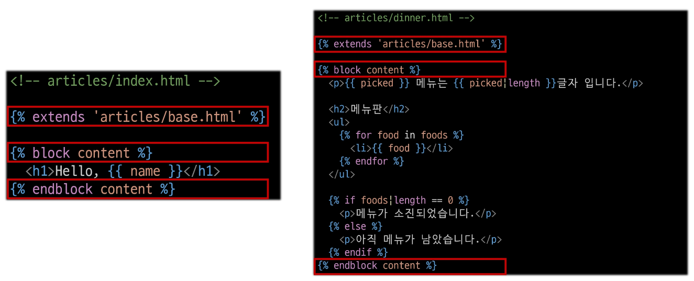
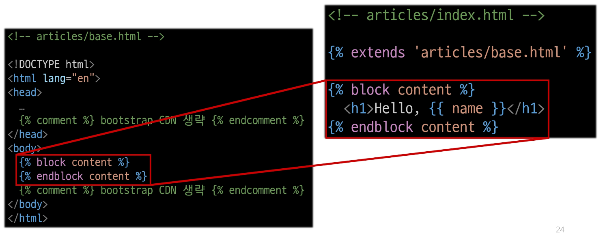

# Django 02 Template & URLs

## Template System
### Django Template system
데이터 표현을 제어하면서, 표현과 관련된 부분을 담당

### HTML의 콘텐츠를 변수 값에 따라 바꾸고 싶다면?

### Django Template Language (DTL)
Template에서 조건, 반복, 변수 등의 프로그래밍적 기능을 제공하는 시스템

### DTL Syntax
1. Variable
2. Filters
3. Tags
4. Comments

### 1. Variable
 - render 함수의 세 번째 인자로 딕셔너리 데이터를 사용
 - 딕셔너리 key에 해당하는 문자열이 template에서 사용 가능한 변수명이 됨
 - dot('.')를 사용하여 변수 속성에 접근할 수 있음(다중 데이터일 경우)

{{variable}}
{{variable.attribute}}

### 2, Fliters
 - 표시할 변수를 수정할 때 사용(변수 + '|' + 필터)
 - chained(연결)이 가능하며 일부 필터는 인자를 받기도 함
 - 약 60개의 built-in template filters를 제공

{{variable|filter}}
{{name|truncatewords:30}} - 100자 중 30자만 출력하고 싶을 때

### 3. Tags
 - 반복 또는 논리를 수행하여 제어 흐름을 만듦
 - 일부 태그는 시작과 종료 태그가 필요
 - 약 24개의 built-in template tags를 제공


 

### 4. comments
-DTL에서의 주석
{# name #} - 1개씩
 - 한 번에

### DTL 예시

## 템플릿 상속
### 기본 템플릿 구조의 한계
- 만약 모든 템플릿에 bootstrap을 적용하려면?
- 모든 템플릿에 bootstrap CDN을 작성해야 할까?

### 템플릿 상속
template inheritance
1. 페이지의 공통요소를 포함하고, 
2. 하위 템플릿이 재정의 할 수 있는 공간
을 정의하는 기본 'skeleton'템플릿을 작성하여 상속 구조를 구축

### 상속 구조 만들기
1. skeleton 역할을 하게 되는 상위 템플릿 작성

2. 기존 하위 템플릿의 변화

### 'extends' tag

자식(하위)템플릿이 부모 템플릿을 확장한다는 것을 알림
- 반드시 자식 템플릿 최상단에 작성되어야 함(2개 이상 사용 불가)

### 'block' tag

하위 템플릿에서 재정의할 수 있는 블록을 정의
(상위 템플릿에서 작성하며 하위 템플릿이 작성할 수 있는 공간을 지정하는 것)

### 하위 템플릿이 재정의할 수 있는 block 영역

## HTML form(요청과 응답)
### 데이터를 보내고 가져오기
sending and retrieving form data
HTML 'form' element를 통해 사용자와 애플리케이션 간의 상호작용 이해하기

### HTML 'form'은 HTTP 요청을 서버에 보내는 사장 편리한 방법

### 실제 웹 서비스에서 form이 사용되는 예시

### 'form' element
사용자로부터 할당된 데이터를 서버로 전송
 - 웹에서 사용자 정보를 입력하는 여러 방식
 (text, password, checkbox 등)을 제공

### fake Naver 실습
https://search.naver.com/search.naver?where=nexearch&sm=top_hty&fbm=0&ie=utf8&query=ssafy
https://search.naver.com/search.naver?query=ssafy
핵심은 'query=ssafy' 이것

### 'action' & 'method'
form의 핵심 속성 2가지
"데이터를 어디로 어떤 방식으로 요청할 지"

 - action
   - 입력 데이터가 전송될 url을 지정(목적지)
   - 만약 이 속성을 지정하지 않으면 데이터는 현재 form이 있는 페이지의 url로 보내짐

 - method
   - 데이터를 어떤 방식으로 보낼 것인지 정의
   - 데이터의 HTTP request methods (GET,POST)를 지정
  
### 'input' element
사용자의 데이터를 입력 받을 수 있는 요소
type 속성 값에 따라 다양한 유형의 입력 데이터를 받음

### 'name' attribute
input의 핵심 속성
입력한 데이터에 붙이는 이름(key)
 - 데이터를 제출했을 때 서버는 name 속성에 설정된 값을 통해서만 사용자가 입력한 데이터에 접근할 수 있음

### Query string Parameters
 - 사용자의 입력 데이터를 url 주소에 파라미터를 통해 서버로 보내는 방법
 - 문자열은 앰퍼샌드('&')로 연결된 key=value 쌍으로 구성되며, 기본 url과는 물음표('?')로 구분됨

 - 예시
   - http://host:port/path?key=value&key=value

### 사용자 입력 데이터를 받아 그대로 출력하는 서버 만들기
view 함수는 몇 개가 필요할까?

### 1. throw 로직 작성

### 2. catch 로직 작성
throw 페이지에서 요청한 사용자 입력 데이터는 어떻게 가져와야 할까?

### HTTP request 객체
form 으로 전송한 데이터 뿐만 아니라 모든 요청 관련 데이터가 담겨 있음
(view 함수의 첫 번째 인자)

### request 객체 살펴보기

### form 데이터를 가져오는 방법

### 3. catch 로직 마무리

## 참고
### 추가 템플릿 경로 지정
템플릿 기본 경로 외 커스텀 경로 추가하기

### BASE_DIR
settings에서 경로지정을 편하게 하기 위해 최상단 지점을 지정해놓은 변수

### DTL 주의사항
 - Python처럼 일부 프로그래밍 구조(if, for 등)을 사용할 수 있지만 명칭을 그렇게 설계했을 뿐이지 Python 코드로 실행되는 것이 아니며 Python과는 관련 없음
 - 프로그래밍적 로직이 아니라 표현을 위한 것임을 명심하기
 - 프로그래밍적 로직은 되도록 view 함수에서 작성 및 처리할 것
 - 공식문서를 참고해 다양한 태그와 필터 사용해보기
   - https://docs.djangoproject.com/en/4.2/ref/templates/builtins/
   