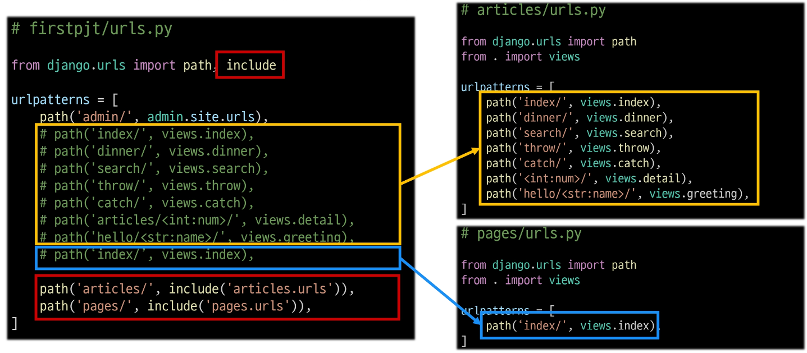
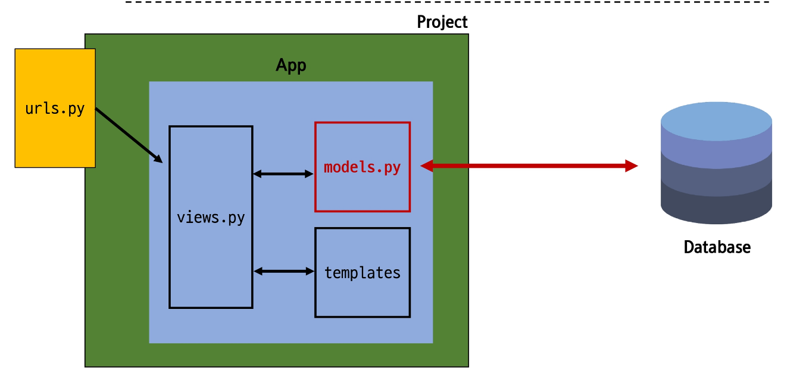

# 03 Django
## Django URLs
### 요청과 응답에서 Django URLs의 역할

### URL dispatcher
운항 관리자, 분배기
URL 패턴을 정의하고 해당 패턴이 일치하는 요청을 처리할 view 함수를 연결(매핑)

## App과 URL
### APP URL mapping
각 앱에 URL을 정의하는 것
- 프로젝트와 각 앱이 URL을 나누어 관리를 편하게 하기 위함

### 2번째 앱 pages 생성 후 발생할 수 있는 문제
 - view 함수 이름이 같거나 같은 패턴의 URL 주소를 사용하게 되는 경우
 - 아래 코드와 같이 해결해볼 수 있으나 더 좋은 방법이 필용
 - URL을 각자 app에서 관리하자

### 변경된 url 구조

### url 구조 변화

### include()
프로젝트 내부 앱들의 URL을 참조할 수 있도록 매핑하는 함수
 - URL의 일치하는 부분까지 잘라내고 남은 문자열 부분은 후속 처리를 위해 include된 URL로 전달

### include 적용
 - 변경된 프로젝트의 urls.py

## url 이름 지정
### url 구조 변경에 따른 문제점
기존 'articles/' 주소가 'articles/index/' 로 변경됨에 따라 해당 주소를 사용하는 모든 위치를 찾아가 변경해야함
URL에 이름을 지어주면 이름만 기억하면 되지 않을까?

path(주소, 보내는 곳, 이름)

### Naming URL patterns
URL에 이름을 지정하는 것
(path 함수의 name 인자를 정의해서 사용)

### Naming URL patterns 적용
path 함수의 name 키워드 인자 정의

### URL 표기 변화
- a 태그의 href 속성 값 뿐만 아니라 form의 action 속성처럼 url을 작성하는 모든 위치에서 변경

### 'url' tag

주어진 url 패턴의 이름과 일치하는 절대 경로 주소를 반환

### url tag 적용 후 브라우저 출력 확인

## URL 이름 공간
### URL 이름 지정 후 남은 문제
1. articles 앱의 url 이름과 pages 앱의 url 이름이 같은 상황
2. 단순히 이름만으로는 완벽하게 분리할 수 없음
3. 이름에 성을 붙이자

### 'app_name' 속성 지정
app_name 변수 값 설정

### URL tag의 최종 변화
마지막으로 url 태그가 사용하는 모든 곳의 표기 변경하기

## Model
### Model을 통한 DB(데이터베이스) 관리

모델을 통해 database를 관리

### Django Model
DB의 테이블을 정의하고 데이터를 조작할 수 있는 기능들을 제공
 - 테이블 구조를 설계하는 '청사진(blueprint)'

### Model 클래스 작성

### model 클래스 살펴보기
작성한 모델 클래스는 최종적으로 DB에 다음과 같은 테이블 구조를 만듦

django.db.models 모듈의 model이라는 부모 클래스를 상속받음
Model은 model에 관련된 모든 코드가 이미 작성되어있는 클래스
 - https://github.com/django/django/blob/main/django/db/models/base.py#L460
개발자는 가장 중요한 테이블 구조를 어떻게 설계할 지에 대한 코드만 작성하도록 하기 위한 것(상속을 활용한 프레임워크의 기능 제공)

1. 클래스 변수명
 - 테이블의 각 "필드(열) 이름"
 

2. model Field 클래스
 - 테이블 필드의 "데이터 타입"
 - https://docs.djangoproject.com/en/4.2/ref/models/fields
  

3. model Field 클래스의 키워드 인자(필드 옵션)
 - 테이블 필드의 "제약조건" 관련 설정
 - https://docs.djangoproject.com/en/4.2/ref/models/fields/#field-options
  

### 제약 조건
데이터가 올바르게 저장되고 관리되도록 하기 위한 규칙
 - ex) 숫자만 저장되도록, 문자가 100자까지만 저장되도록 하는 등

## Migrations
### Migrations
model 클래스의 변경사항 (필드 생성, 수정 삭제 등)을 DB에 최종 반영하는 방법

### Migrations 과정
  

### Migrations 핵심 명령어 2가지
  

### migrate 후 DB 내에 생성된 테이블 확인
Article 모델 클래스로 만들어진 articles_article 테이블
  

### 이미 생성된 테이블에 필드를 추가해야 한다면?
  

### 추가 모델 필드 작성
  
  
  이미 데이터가 있는 곳에 빈 필드를 추가할 수 없음
  
  
  

### model class에 변경사항(1)이 생겼다면, 반드시 새로운 설계도를 생성(2)하고, 이를 DB에 반영(3)해야 한다.

1. model class 변경
2. makemigration
3. migrate

### Model field
BD 테이블의 필드(열)을 정의하며, 해당 필드에 저장되는 데이터 타입과 제약조건을 정의

### CharField()
길이의 제한이 있는 문자열을 넣을 때 사용
(필드의 최대 길이를 결정하는 max_length는 필수 인자)

### TextField()
글자의 수가 많을 때 사용

### DateTimeField()
날짜와 시간을 넣을 때 사용

### DateTimeField의 선택 인자
  

## Admin site
### Automatic admin interface
Django는 추가 설치 및 설정 없이 자동으로 관리자 인터페이스를 제공
 - 데이터 확인 및 테스트 등을 진행하는 데 매우 유용

### 1. admin 계정 생성
 - email은 선택사항이기 떄문에 입력하지 않고 진행 가능
 - 비밀번호 입력 시 보안상 터미널에 출력되지 않으니 무시하고 입력 이어가기
 $ python manage.py createsuperuser

### 2. DB에 생성된 admin 계정 확인
  

### 3. admin에 모델 클래스 등록
admin.py에 작성한 모델 클래스를 등록해야만 admin site에서 확인 가능
  

### 4. admin site 로그인 후 등록된 모델 클래스 확인
  

### 5. 데이터 생성, 수정, 삭제 리스트
  

### 6. 테이블 확인
  

## 참고
### 데이터베이스 초기화
  

### Migrations 기타 명령어
  

### 첫 migrate 시 출력 내용이 많은 이유는?
  

### SQLite
데이터베이스 관리 시스템 중 하나이며
Django의 기본 데이터베이스로 사용됨
(파일로 존재, 가볍고 호환성이 좋음)

