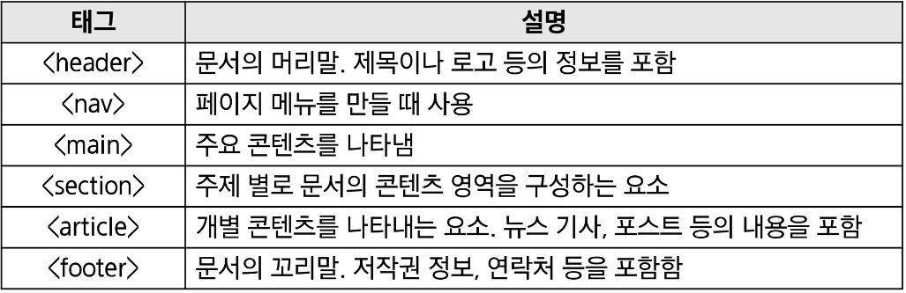
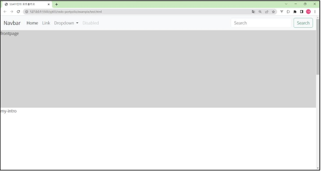

# 반응형 Portfolio 웹사이트 구현

## 목표
### 프로젝트 목표
 - 나만의 사이트 구현하기

### 중요한 미션: 반응형으로 만들기

### 진행 순서
 - 강사와 함께 Bootstrap으로 사이트 기본 구조를 구현합니다.
   - 네비게이션 바, 전체 프로젝트 구조 등

 - 도전 과제를 스스로 진행

### 기본 구조 만들기
 1. 파일 생성
 2. 전체 구조 만들기
 3. 구글 폰트 추가하기
 4. 네비게이션 바 추가하기

### 1. 파일 생성
 - index.html과 style.css를 생성합니다.
   - emmet을 활용해 html 기본 템플릿을 자동완성합니다.
   - style.css를 사용할 수 있도록 link 요소를 추가합니다.
  
### 2. 전체 구조 만들기
 - 시맨틱 태그를 적절히 활용하여 영역을 구분합니다.
 - 자주 사용하는 시맨틱 태그는 다음과 같습니다.

 - 포트폴리오 사이트에 다음과 같은 내용이 포함되어 있다고 가정하겠습니다.
   - 메뉴
   - 메인 콘텐츠
   - 자기소개
   - 나의 기술 스택 소개
   - 진행한 프로젝트
   - 연락처 남기기
   - 꼬리말

 - 구글 폰트 추가하기
   - 구글 폰트 사이트에서 원하는 폰트를 검색합니다.
   - 수업에선 Noto Sans 폰트를 검색합니다.

   - 우측 하단 <link> 부분의 링크를 복사하여 head 태그에 추가합니다.
    

   - style.cssdp font-family를 적용합니다.
    

### 네이게이션 바 추가하기
 - 네비게이션 바는 Bootstrap에서 가져옵니다.
 - Bootstrap 사용을 위해 CDN을 추가합니다.

 - 공식 문서에 Navbar를 검색하여 복사합니다.
 - nav 영역을 복사한 코드로 대체합니다.
 - 화면 예시
     

 - 우리만의 네비게이션 바를 만들기 위해 코드를 수정합니다.
   - 하나의 Link를 제외한 다른 부분을 모두 없애줍니다.

 - 클릭하고자 하는 링크들을 우측에 배치하기 위해 코드를 수정합니다.
   - Link를 포함하고 있는 ul 요소의 좌측에 있는 공간을 모두 margin으로 사용하면 됩니다.
     

 - 스크롤을 내려도 상단에 고정하기 위해 "fixed-top" 클래스를 추가합니다.
 - 이 때, position:fixed 속성 추가 시 화면이 잘리는 현상이 발생합니다.
   - 이를 해결하기 위해 각 구역에 padding-top을 적절하게 추가합니다.
     

 - 페이지의 각 영역으로 이동하기 위한 메뉴를 추가합니다.
   - a 태그의 href 속성에 각 영역의 id를 작성합니다.
        

# 도전과제
## 관통 ver1 - 반응형 포트폴리오 웹사이트 구현 (금융)
 - 프로젝트명: 반응형 포트폴리오 웹사이트 구현
 - 목표
   - 본인만의 반응형 웹 포트폴리오 사이트 만들기
 - 특징
   - UI 설계부터 구현까지 스스로 도전!
   - 본인을 소개할 수 있는 포트폴리오 사이트 구현

### 관통 ver2 - PJT 도전과제
 - 프로젝트명: 반응형 웹 페이지 구현
 - 목표
   - 영화 데이터를 활용한 반응형 웹 페이지 구현
 - 특징
   - 커뮤니티 웹 서비스 개발을 위한 화면구성 단계
   - CSS와 Bootstrap을 활용한 반응형 웹 페이지 구현 연습

## cf) emmet 활용하기
section#project.project -> "<"section id="project" class="project"></section">"

