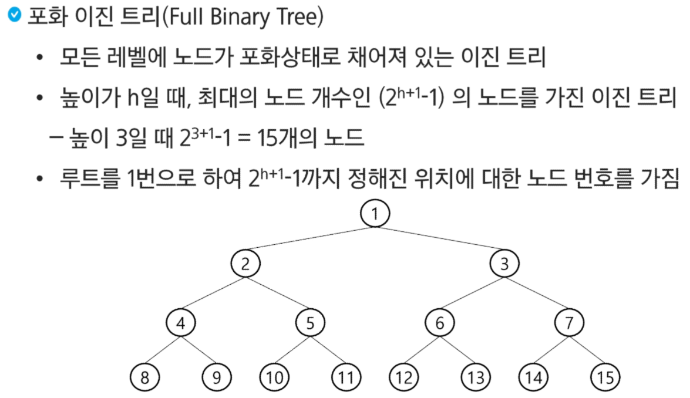
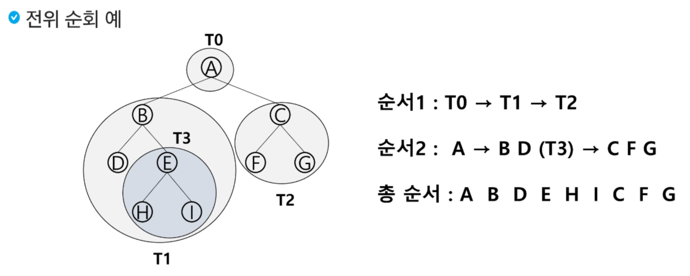

# 백트래킹 응용
## 문제 제시: N-Queen 문제
### n X n 체스판에서 배치한 queen들이 서로 위협하지 않도록 n개의 queen을 배치하는 문제
 - 어떤 두 queen도 서로를 위협하지 않아야 한다.
 - queen을 배치한 n개의 위치는?

### 여러 가지 선택지(옵션)들이 존재하는 상황에서 한 가지를 선택한다.
### 선택이 이루어지면 새로운 선택지들의 집합이 생성된다.
### 이런 선택을 반복하면서 최종 상태에 도달한다.
   - 올바른 선택을 계속하면 목표 상태(goal state)에 도달한다.

## 백트래킹(Backtracking) 개념
### 당첨 리프 노드 찾기
 - 루트에서 갈 수 있는 노드를 선택한다.
 - 꽝 노드까지 도달하면 최근의 선택으로 되돌아와서 다시 시작한다.
 - 더 이상의 선택지가 없다면 이전의 선택지로 돌아가서 다른 선택을 한다.
 - 루트까지 들어갔을 경우 더 이상 선택지가 없다면 찾는 답이 없다.

### 백트래킹과 깊이 우선 탐색(DFS)과의 차이
 - 어떤 노드에서 출발하는 경로가 해결책으로 이어질 것 같지 않으면 더 이상 그 경로를 따라가지 않음으로써 시도의 횟수를 줄임(Prunning 가지치기)
 - 깊이 우선 탐색의 경우 모든 경로를 추적하는 데 비해 백트래킹은 불편한 경로를 조기에 차단
 - 깊이 우선 탐색을 가하기에는 경우의 수가 너무나 많음. 즉 N! 가지의 경우의 수를 가진 문제에 대해 깊이 우선 탐색을 가하면 당연히 처리 불가능한 문제
 - 백트래킹 알고리즘을 적용하면 일반적으로 경우의 수가 줄어들지만 이 역시 최악의 경우에는 여전히 지수함수 시간(Exponential Time)을 요하므로 처리 불가능

### 8-queens 문제
퀸 8개를 크기의 체스판 안에 서로를 공격할 수 없도록 배치하는 모든 경우의 수

후보 해의 수: 64C8 = 4,426,165,368
실제 해의 수: 92개
즉, 44억개가 넘는 해의 수 중 92개를 최대한 효율적으로 찾아내는 게 관건

### 4-Queens 문제로 축소해서 생각해보자
 - 같은 행에 위치할 수 없다.
 - 모든 경우의 수 4 * 4 * 4 * 4 = 256

### 루프 노드에서 리프 노드까지의 경로는 해답후보가 되는데, 깊이 우선 검색을 하여 그 해답후보 중에 해답을 찾을 수 있다.

### 그러나 이 방법을 사용하면 해답이 될 가능성이 전혀 없는 노드의 후손 노드들도 모두 검색해야 하므로 비효율적이다.

### 모든 후보를 검사? No!

### 백트래킹 기법
 - 어떤 노드의 유망성을 점검한 후에 유망하지 않다고 결정되면 그 노드의 부모로 되돌아가 다음 자식 노드로 감
 - 어떤 노드를 방문하였을 때 그 노드를 포함한 경로가 해답이 될 수 없으면 그 노드는 유망하지 않다고 하며, 반대로 해답의 가능성이 있으면 유망하다고 한다.
 - 가지치기(prunning): 유망하지 않는 노드가 포함되는 경로는 더 이상 고려하지 않는다.

### 백트래킹을 이용한 알고리즘은 다음과 같은 절차로 진행된다.
1) 상태 공간 트리의 깊이 우선 검색을 실시한다.
2) 각 노드가 유망한지를 점검한다.
3) 만일 그 노드가 유망하지 않으면 그 노드의 부모 노드로 들어가서 검색을 계속한다.

### 일반 백트래킹 알고리즘

### 상태 공간 트리

### 깊이 우선 검색 vs 백트래킹
 - 순수한 깊이 우선 검색 = 155노드
 - 백트래킹 = 27노드

## 상태공간트리를 구축하여 문제를 해결

## 연습문제 2
### {1,2,3,4,5,6,7,8,9,10}의 부분집합 중 원소의 합이 10인 부분집합을 모두 출력하시오.

## 문제 제시: 계산기
### 수식 2+3*4를 다음과 같은 그래프로 표현하고 그래프를 순회하여 수식을 계산하시오

## 트리
### 트리는 사이클이 없는 무향 연결 그래프이다.
 - 두 노드(or 정점) 사이에는 유일한 경로가 존재한다.
 - 각 노드는 최대 하나의 부모 노드가 존재할 수 있다.
 - 각 노드는 자식 노드가 없거나 하나 이상이 존재할 수 있다.

### 비선형 구조
 - 원소들 간에 1:n 관계를 가지는 자료구조
 - 원소들 간에 계층관계를 가지는 계층형 자료구조

## 트리 정의
### 한 개 이상의 노드로 이루어진 유한 집합이며 다음 조건을 만족한다.
 1. 노드 중 부모가 없는 노드를 루트(root)라 한다.
 2. 나머지 노드들은 n! >= 0 개의 분리 집합 T1, ... , TN으로 분리될 수 있다.

### 이들 T1, ..., TN은 각각 하나의 트리가 되며(재귀적 정의) 루트의 서브 트리(subtree)라 한다.

### 노드(node): 트리의 원소이고, 정점(vertex)이라고도 한다.
 - 트리 T의 노드: A, B, C, D, E, F, G, H, I, J, K
### 간선(edge): 노드를 연결하는 선
 - 부모 노드와 자식 노드를 연결
### 루트 노드(root node): 트리의 시작 노드
 - 트리 T의 루트 노드: A

### 형제 노드(sibling node): 같은 부모 노드의 자식 노드들
  - B,C,D는 형제 노드
### 조상 노드: 간선을 따라 루트 노드까지 이르는 경로에 있는 모든 노드들
 - K의 조상 노드: F,B,A
### 서브 트리(subtree): 부모 노드와 연결된 간선을 끊었을 때 생성되는 트리

### 자손 노드: 서브 트리에 있는 하위 레벨의 노드들
 - B의 자손 노드: E,F,K

### 차수(degree):
노드의 차수 - 노드에 연결된 자식 노드의 수
 - B의 차수 : 2, C의 차수: 1
트리의 차수: 트리에 있는 노드의 차수 중 가장 큰 값
 - 트리 T의 차수: 3
단말 노드(리프 노드): 차수가 0인 노드, 자식 노드가 없는 노드

## 이진 트리(Binary Tree)

## 순회
### 순회(traversal)란 트리의 각 노드를 중복되지 않게 전부 방문(visit)하는 것을 말하는데 트리는 비선형구조이기 때문에 선형구조에서와 같이 선후 연결 관계를 알 수 없다.

### 따라서 특별한 방법이 필요하다.

### 배열을 이용한 이진 트리 표현의 단점
 - 편향 이진 트리의 경우 사용하지 않는 배열 원소에 대한 메모리 공간 낭비 발생
 - 트리의 중간에 새로운 노드를 삽입하거나 기존의 노드를 삭제할 경우 배열의 크기 변경 어려워 비효율적

## 트리의 표현: 연결리스트
### 배열을 이용한 이진 트리의 표현의 단점을 보완하기 위해 연결리스트를 이용하여 트리를 표현할 수 있다.

### 연결리스트를 이용한 이진 트리의 표현
 - 이진 트리의 모든 노드는 최대 2개의 자식 노드를 가지고 있으므로 일정한 구조의 단순 연결 리스트 노드를 사용하여 구현
 left / 데이터 / right

### 연습문제 3 - 트리 순회
1. 첫 줄에는 트리의 노드가 총 수 V가 주어진다. 
2. 그 다음 줄에는 v-1개 간선이 나열된다.
3. 간선은 그것을 이루는 두 정점으로 표기된다.
4. 간선은 항상 부모 - 자식 순으로 표기된다.
V = 12
arr = [1, 2, 1, 3, 2, 4, 3, 5, 3, 6, 4, 7, 5, 8, 5, 9, 6, 10, 6, 11, 7, 12, 11, 13]

이진 트리를 전/중/후위 순회하고 방문한 노드의 번호를 출력하시오.

## 이진탐색트리(BST)

## 힙(heap)

## 연산 - 삭제
### 힙에서는 루트 노드의 원소만을 삭제할 수 있다.
### 루트 노드의 원소를 삭제하여 반환한다.
### 힙의 종류에 따라 최댓값 또는 최솟값을 구할 수 있다.
 - 우선순위 큐와 비교

