# 그래프 & 백트래킹
## 그래프 기본
그래프란? 노드와 간선으로 이루어진 자료구조
(데이터 간 관계를 표시하기 위해)

## 문제 제시: 친구관계
A의 친구는 B다.
C의 친구는 E,F이다.
D-E / F-G / N - B,I,L / G - A,C,D,H / I-J,H / B - D,K,L / M- I,J / E - A,H / C - B,I,L / B - I / J - A,G

A의 친구 중에 친구가 가장 많은 친구는 누구인가?

## 그래프
 - 그래프는 아이템(사물 또는 추상적 개념)들과 이들 사이의 연결 관계를 표현한다.
 - 그래프는 정점(Vertex)들의 집합과 이들을 연결하는 간선(Edge)들의 집합으로 구성된 자료 구조
 - IVI: 정점의 개수. IEI: 그래프에 포함된 간선의 개수
 - IVI 개의 정점을 가지는 그래프는 최대 IVI(IVI-1)/2 간선이 가능
 - 예) 5개 정점이 있는 그래프의 최대 간선 수는 5*4/2 = 10개이다.
 - 선형 자료구조나 트리 자료구조롤 표현하기 어려운 N:N 관계를 가지는 원소들을 표현하기에 용이하다.

## 그래프 유형
 - 무향 그래프(Undirected Graph)
 - 유향 그래프(Directed Graph)
 - 가중치 그래프(Weighted Graph)
 - 사이클 없는 방향 그래프(DAG, Directed Acyclic Graph)
 

 - 완전 그래프
   - 정점들에 대해 가능한 모든 간선들을 가진 그래프
    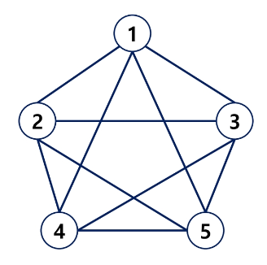

 - 부분 그래프
   - 원래 그래프에서 일부의 정점이나 간선을 제외한 그래프

 - 인접(Adjacency)
   - 두 개의 정점에 간선이 존재(연결됨)하면 서로 인접해 있다고 한다.
   - 완전 그래프에 속한 임의의 두 정점들은 모두 인접해 있다.
     

 - 경로란 간선들을 순서대로 나열한 것
   - 간선들: 0,2 / 2,4 / 4,6
   - 정점들: 0-2-4-6
 - 경로 중 한 정점을 최대한 한 번만 지나는 경로를 단순경로라 한다.
   - 0-2-4-6, 0-1-6
 - 시작한 정점에서 끝나는 경로를 사이클(Cycle)이라고 한다.
   - 1-3-5-1
    

 - 간선의 정보를 저장하는 방식, 메모리나 성능을 고려해서 결정
 - 인접 행렬(Adjacent matrix)
   - IVI * IVI 크기의 2차원 배열을 이용해서 간선 정보를 저장
   - 배열의 배열(포인터 배열)

 - 인접 리스트(Adjacent List)
   - 각 정점마다 해당 정점으로 나가는 간선의 정보를 저장

 - 간선의 배열
   - 간선(시작 정점, 끝 정점)을 배열에 연속적으로 저장

## 인접 행렬
 - 두 정점을 연결하는 간선의 유무를 행렬로 표현
   - M * M 정방 행렬
   - 행 번호와 열 번호는 그래프의 정점에 대응
   - 두 정점이 인접되어 있으면 1, 아니면 0
   - 무향 그래프
     - i번째 행의 합 = i번째 열의 합 = Vi의 차수
   - 유향 그래프
     - 행 i의 합 = Vi의 진출 차수
     - 열 i의 합 = Vi의 진입 차수
  

 - 인접 행렬의 단점은?
   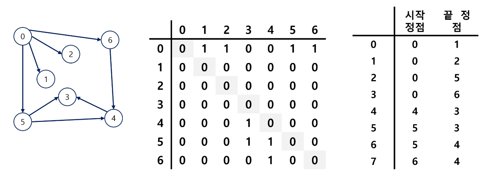

## 인접 리스트
 - 각 정점에 대한 인접 정점들을 순차적으로 표현

 - 하나의 정점에 대한 인접 정점들을 각각 노드로 하는 연결 리스트로 저장
    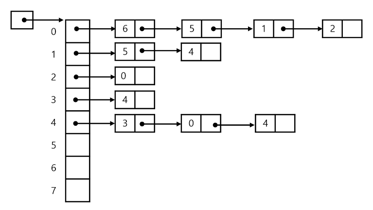
    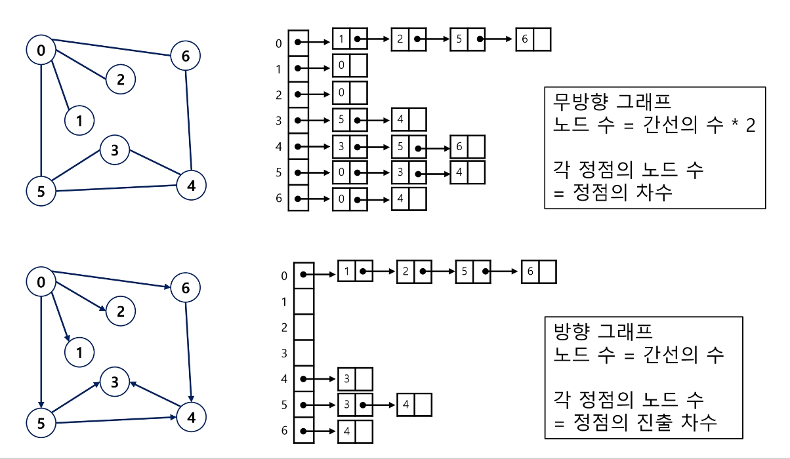

## DFS
## 문제 제시: 친구 관계
 - 다음과 같이 친구 관계를 그래프로 표현하였다.
 - A로부터 시작해서 한 명의 친구에게만 소식을 전달, 전달할 수 있다면 최대 몇 명의 친구가 소식을 전달받을 수 있을까? (단 소식을 전달받은 친구한테는 소식을 재전달할 수 없다.)
 - A로부터 시작해서 친구들에게 동시에 소식을 전달할 수 있다고 할 때, 가장 늦게 전달받는 사람은 누구일까? (단, 친구에게 소식을 전달하는 속도는 동일하다.)

### 그래프 순회는 비선형구조인 그래프로 표현된 모든 자료(정점)을 빠짐없이 탐색하는 것을 의미한다.

 - 두 가지 방법
   1. 깊이 우선 탐색(Depth, DFS)
   2. 너비 우선 탐색(Breadth, BFS)

## 1. DFS(깊이우선탐색)
   - 시작 정점의 한 방향으로 갈 수 있는 경로가 있는 곳까지 깊이 탐색해 가다가 더 이상 갈 곳이 없게 되면, 가장 마지막에 만났던 갈림길 간선이 있는 정점으로 되돌아와서 다른 방향의 정점으로 탐색을 계속 반복하여 결국 모든 정점을 방문하는 순회방법
  
   - 가장 마지막에 만났던 갈림길의 정점으로 되돌아가서 다시 깊이 우선 탐색을 반복해야 하므로 후입선출 구조의 스택 사용

 - DFS 알고리즘: 재귀
  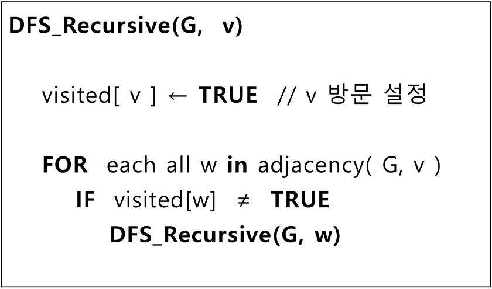

 - DFS 알고리즘: 반복
  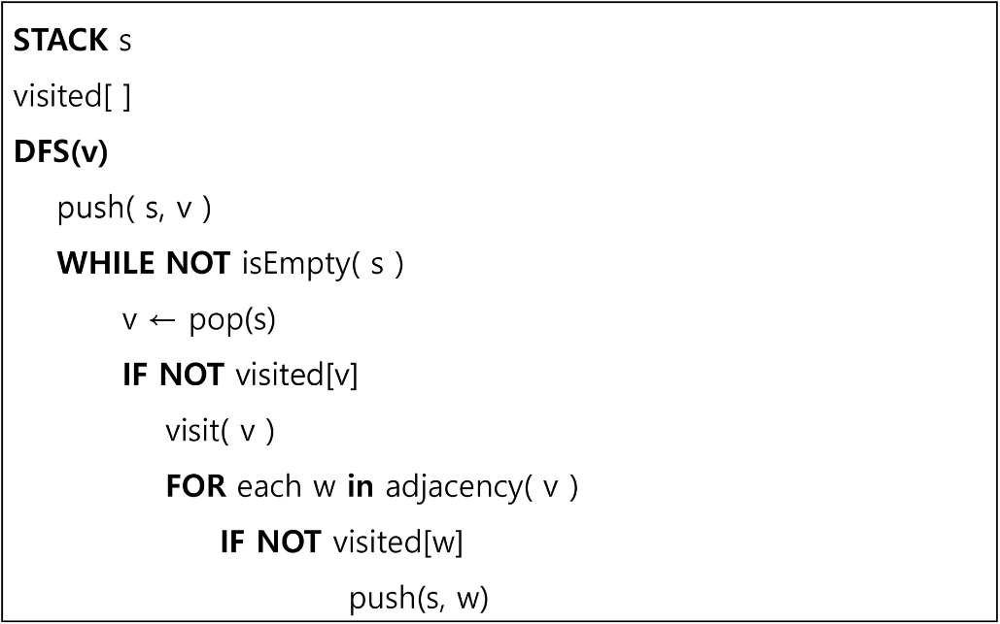

## DFS 예
  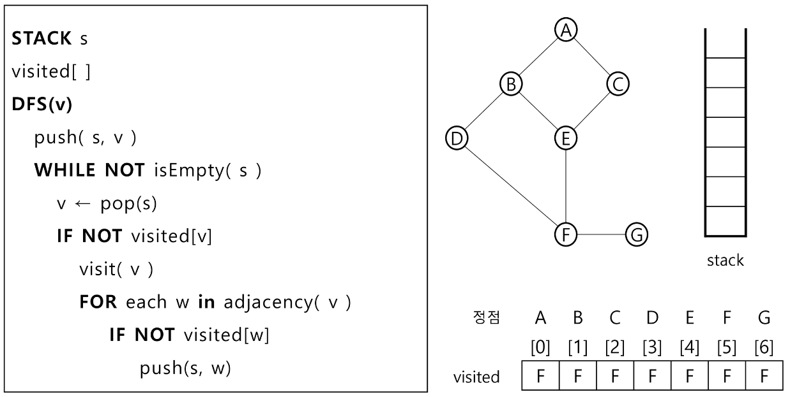
  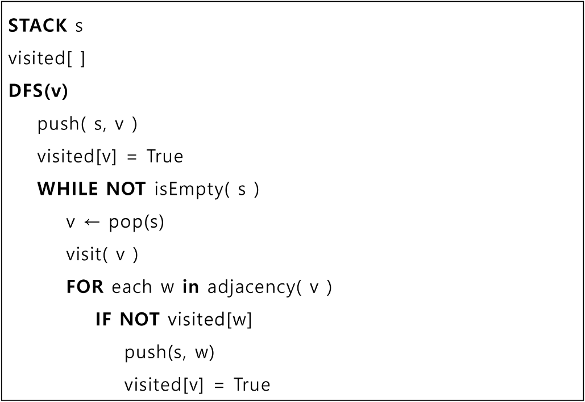

## 연습문제 1 - DFS
 - 다음은 연결되어 있는 두 개의 정점 사이의 간선을 순서대로 나열해 놓은 것이다. 모든 정점을 깊이 우선 탐색하여 화면에 깊이 우선 탐색 경로를 출력하시오. 시작 정점을 1로 시작하시오.
 - 1 2 1 3 2 4 2 5 4 6 5 6 6 7 3 7

 - 출력 결과의 예는 다음과 같다
 - 1-2-4-6-5-7-3
 - 1-3-7-6-5-2-4
  

## BFS(Breath First Search)
- 너비우선탐색은 탐색 시작점의 인접한 정점들을 먼저 모두 차례로 방문한 후에, 방문했던 정점을 시작점으로 하여 다시 인접한 정점들을 차례로 방문하는 방식

- 인접한 정점들에 대해 탐색을 한 후, 차례로 다시 너비우선탐색을 진행해야 하므로, 선입선출 형태의 자료구조인 큐를 활용함

- BFS는 예제 그래프를 붙여진 번호 순서로 탐색함
  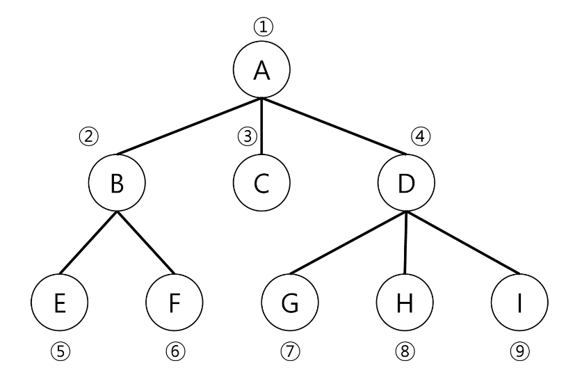

- 입력 파라미터: 그래프 G와 탐색 시작점 v
  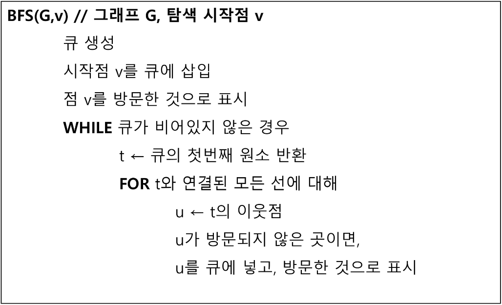

## BFS 예
  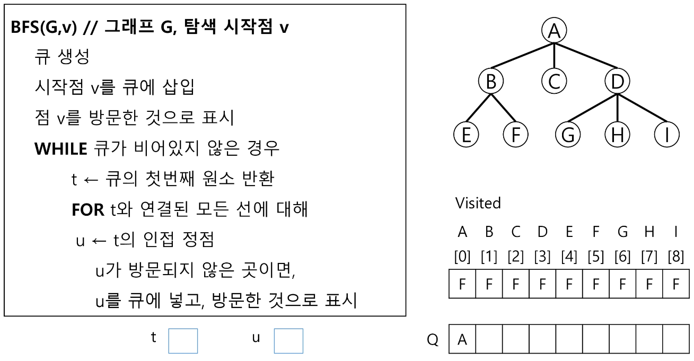

## 연습문제2 - BFS
 - 다음은 연결되어 있는 두 개의 정점 사이의 간선을 순서대로 나열해놓은 것이다. 모든 정점을 너비 우선 탐색하여 화면에 너비 우선탐색 경로를 출력하시오. 시작 정점은 1로 시작하시오.
   - 1 2 1 3 2 4 2 5 4 6 5 6 6 7 3 7

   - 출력 결과의 예는 다음과 같다.
   - 1 2 3 4 5 7 6

## Union-Find(서로소 집합)
 - Disjoint-sets
 - 서로소 또는 상호배타 집합들은 서로 중복 포함된 원소가 없는 집합들이다. 다시 말해 교집합이 없다.
 - 집합에 속한 하나의 특정 멤버를 통해 각 집합들을 구분한다. 이를 대표자(representative)라 한다.

## 서로소 집합(Disjoint-sets)
 - 상호배타 집합을 표현하는 방법
   - 연결 리스트
   - 트리
 - 상호배타 집합 연산
   - Make-set(x)
   - Find-set(x)
   - Union(x, y)

 - 상호배타 집합 예
  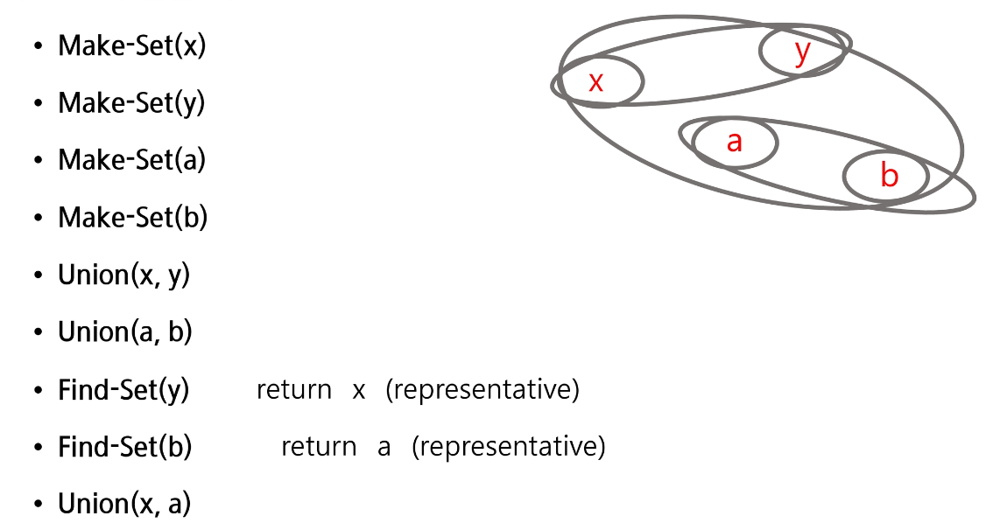

## 상호 배타 집합 표현: 연결리스트
 - 같은 집합의 원소들은 하나의 연결리스트로 관리한다.
 - 연결리스트의 맨 앞의 원소를 집합의 대표 원소로 삼는다.
 - 각 원소는 집합의 대표원소를 가리키는 링크를 갖는다.
  

 - 연결리스트 연산 예
  

 - 하나의 집합(a disjoint set)을 하나의 트리로 표현한다.
 - 자식 노드가 부모 노드를 가리키며 루트 노드가 대표자가 된다.
  

 - 연산 예
  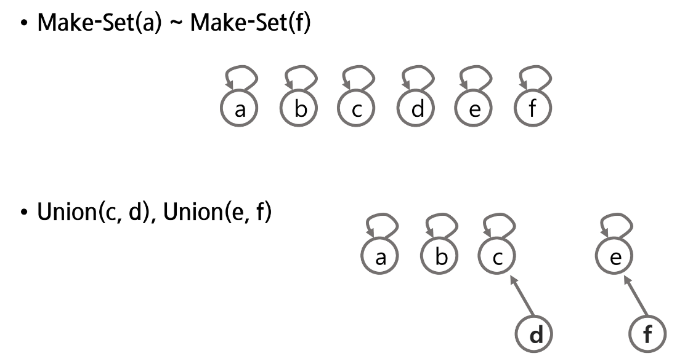
  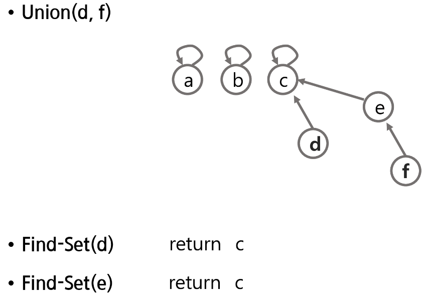
  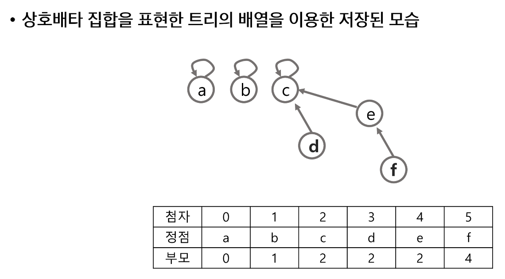
  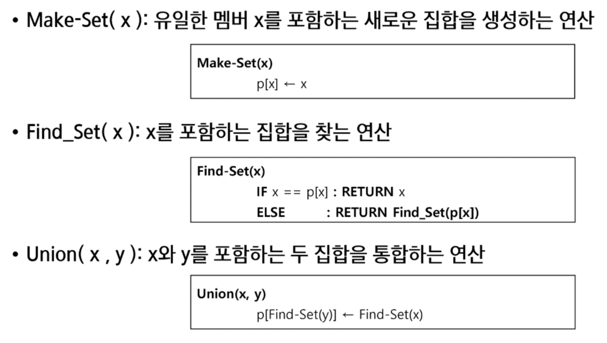
  
  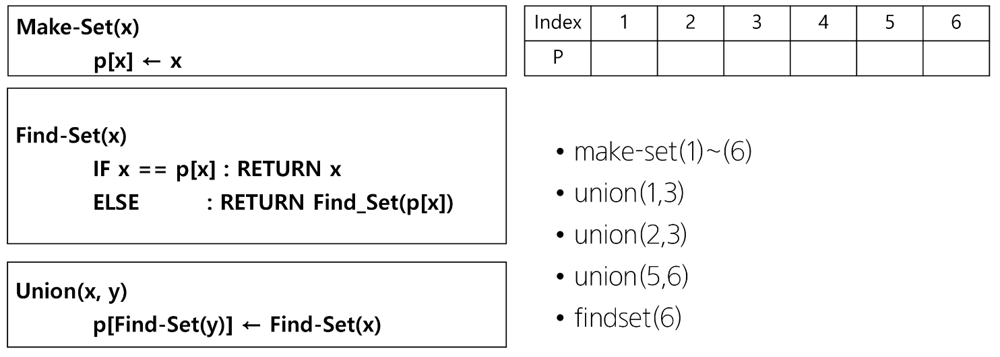
  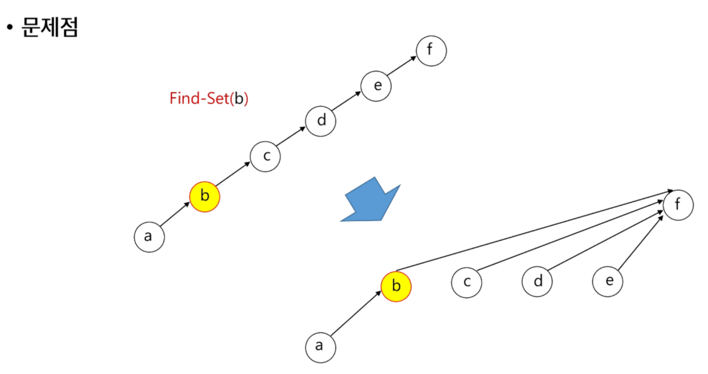

 - 연산의 효율을 높이는 방법
   - Rank를 이용한 Union
     - 각 노드는 자신을 루트로 하는 subtree의 높이를 랭크Rank라는 이름을 저장한다.
     - 두 집합을 합칠 때 rank가 낮은 집합을 rank가 높은 집합에 붙인다.
   - Path compression
     - Find-set을 행하는 과정에서 만나는 모든 노드들이 직접 root를 가리키도록 포인터를 바꾸어 준다.
  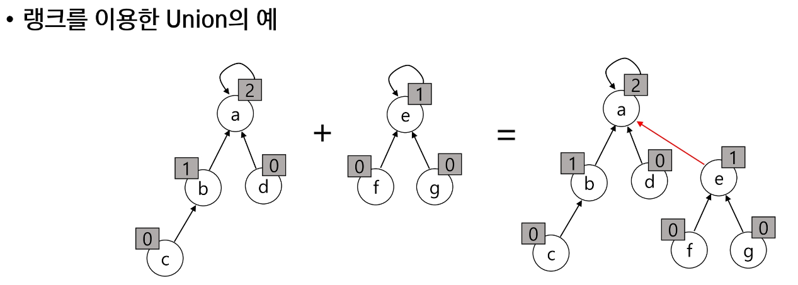
  
  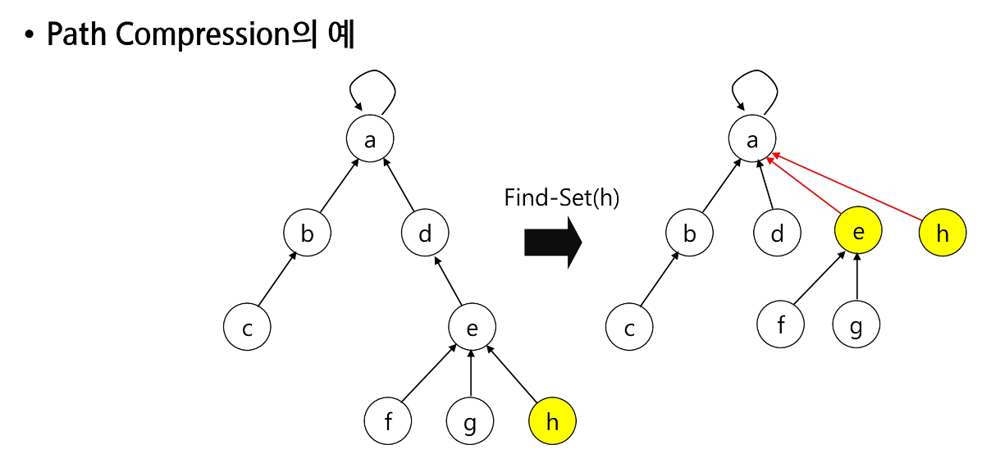

 - Make_set() 연산
   - Make_set(x): 유일한 멤버 x를 포함하는 새로운 집합을 생성하는 연산
     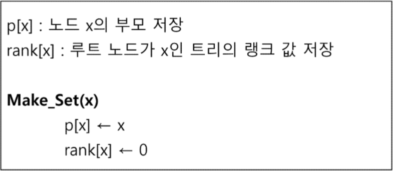
 - Find_set 연산
   - Find_set(x): x를 포함하는 집합을 찾는 오퍼레이션
        
   - Find_set 연산은 특정 노드에서 루트까지의 경로를 찾아가면서 노드의 부모 정보를 갱신한다.
 - Union 연산
   - Union(x, y): x와 y를 포함하는 두 집합을 통합하는 오퍼레이션
     

