# Django ORM with view
Django shell에서 연습했던 QuerySet API를 직접 view 함수에서 사용하기

## Read
### 2가지 READ(조회) 진행
 1. 전체 게시글 조회
 2. 단일 게시글 조회

### 1. 전체 게시글 조회
   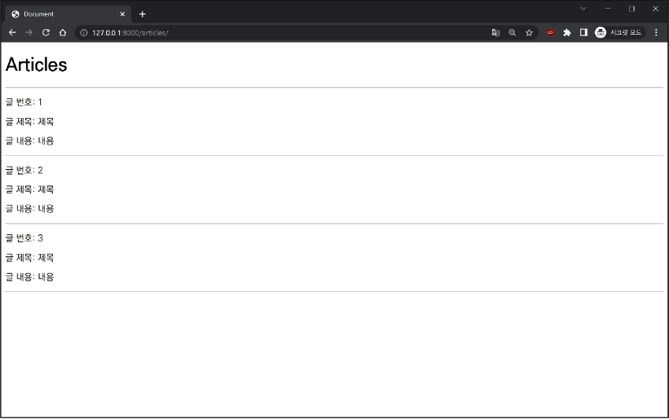
   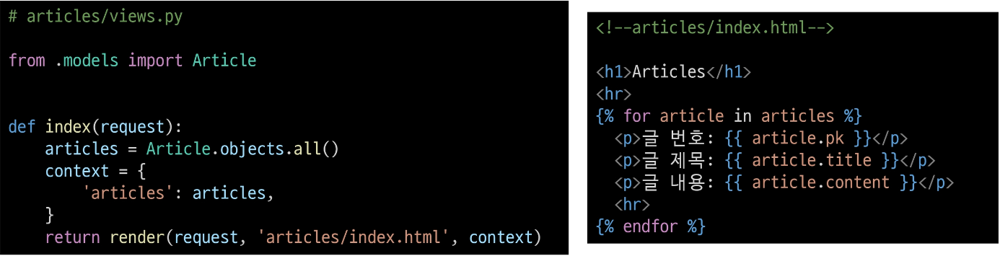

### 2. 단일 게시글 조회
   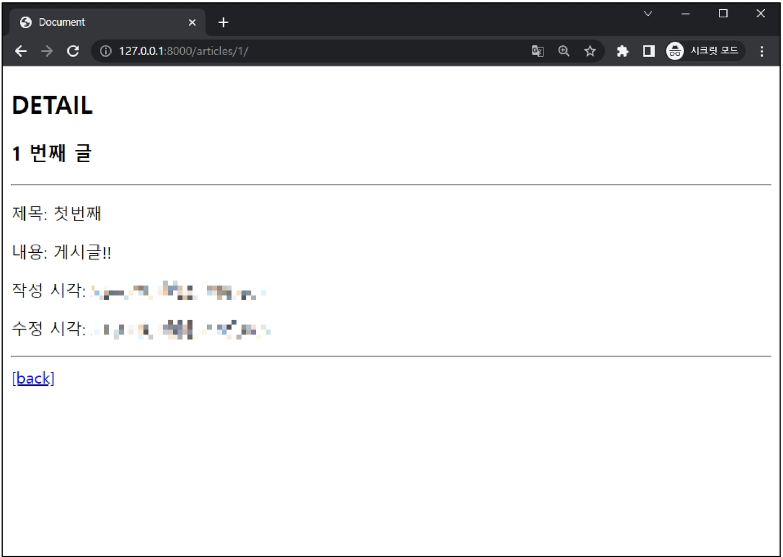
   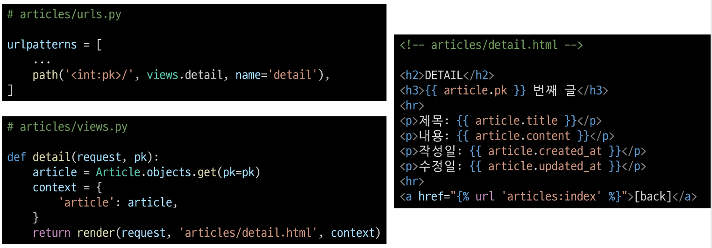

### 단일 게시글 페이지 링크 작성
   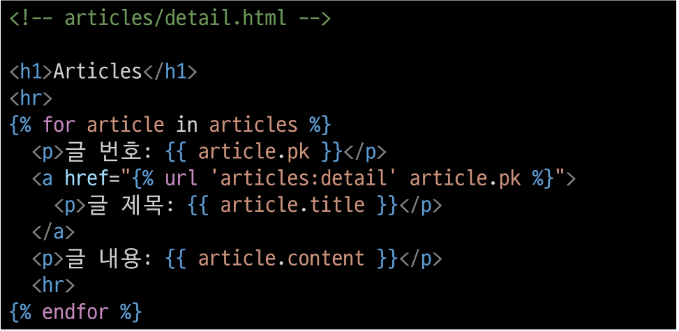

## Create
### Create 로직을 구현하기 위해 필요한 view 함수의 개수는?
사용자 입력 데이터를 받을 페이지를 렌더링 new
사용자가 입력한 데이터를 받아 DB에 저장 create

### new 기능 구현
   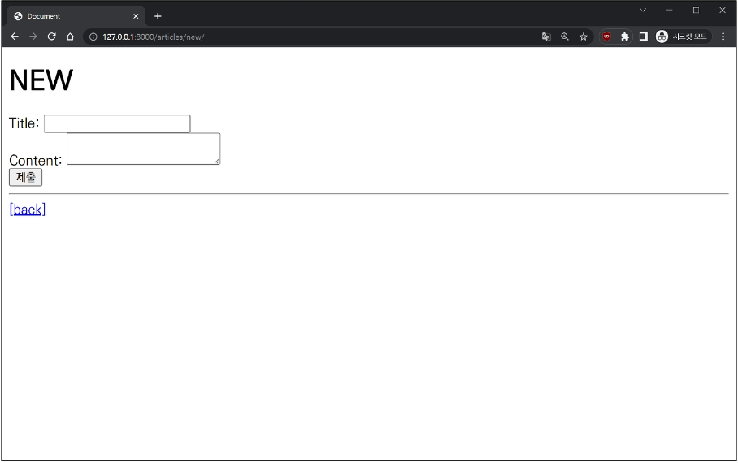
   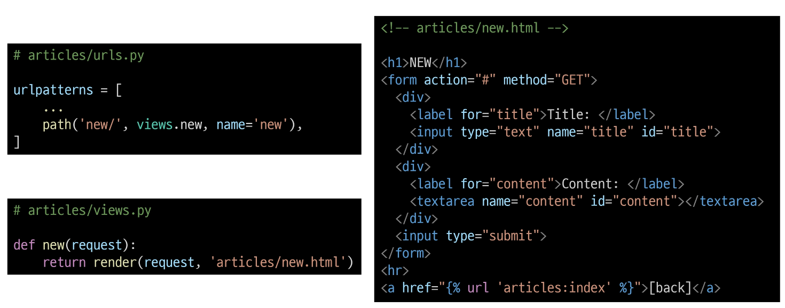
   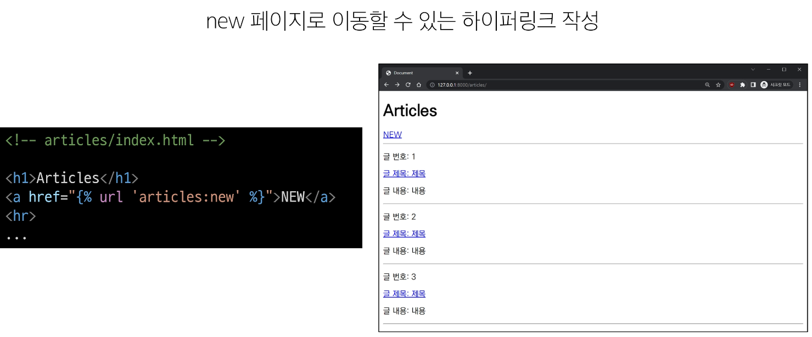

### create 기능 구현
   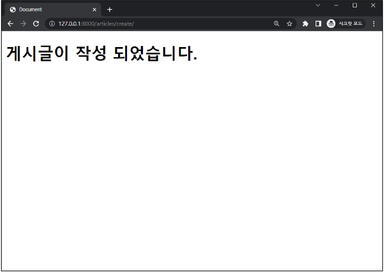
   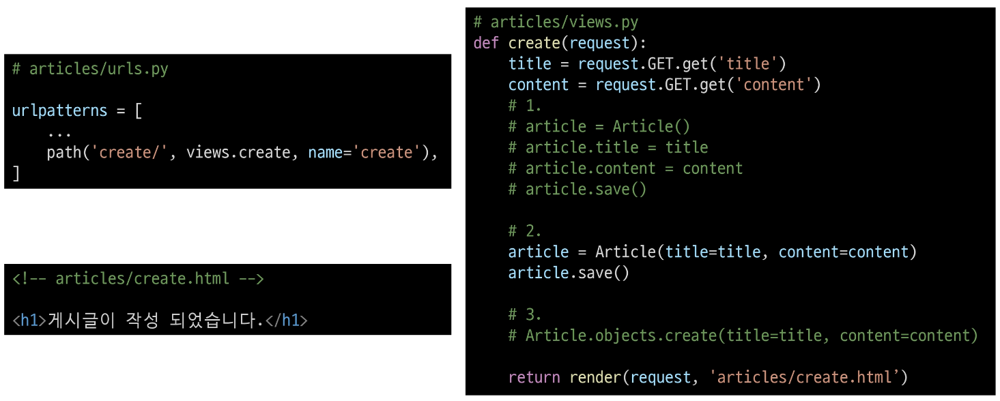
   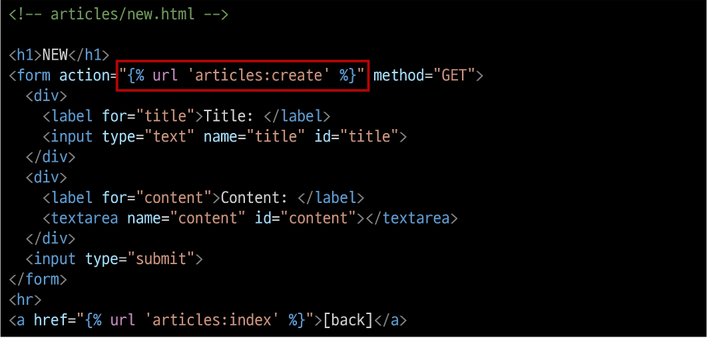

## HTTP
### 네트워크 상에서 데이터를 주고 받기 위한 약속

## HTTP request methods
데이터(리소스)에 어떤 요청(행동)을 원하는 지를 나타내는 것
GET & POST

## 'GET' Method
특정 리소스를 조회하는 요청
(데이터를 전달할 때 URL에서 Query String 형식으로 보내짐)
http://127.0.0.1:8000/articles/create/?title=제목&content=내용

## 'POST' Method
특정 리소스에 변경(생성, 수정,삭제)을 요구하는 요청
(데이터는 전달할 때 HTTP Body에 담겨 보내짐)

## POST method 적용
   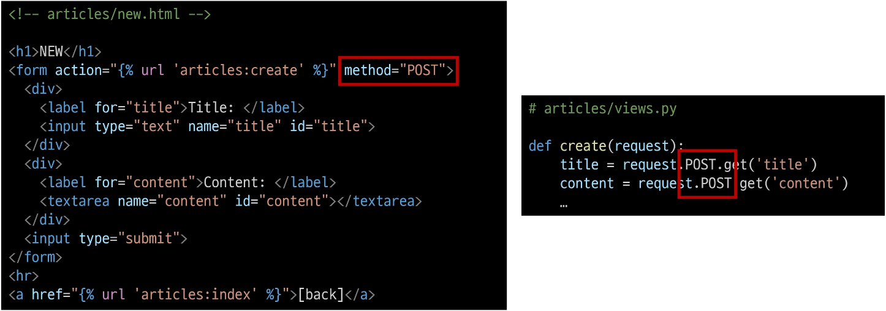

## 게시길 작성 후 403 응답 확인
   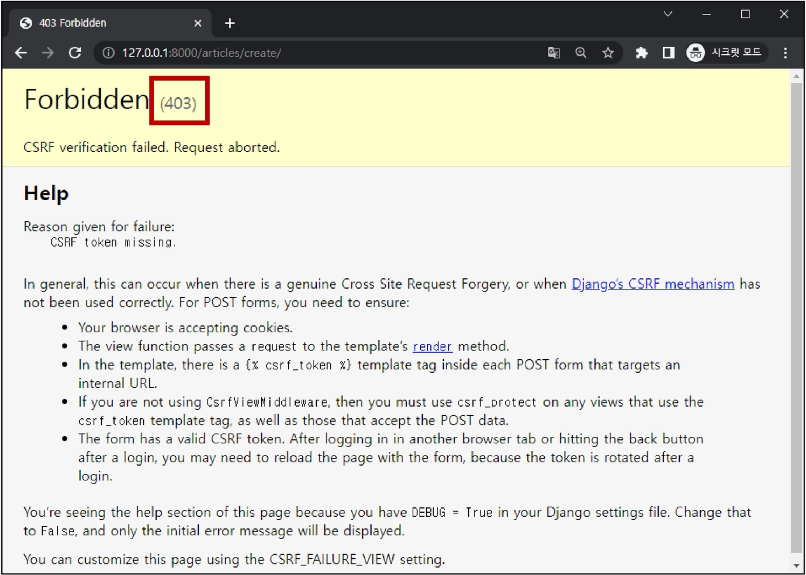

### HTTP response status code
특정 HTTP 요청이 성공적으로 완료되었는지를 3자리 숫자로 표현하기로 약속한 것

### 403 Forbidden
서버에 요청이 전달되었지만, 권한 때문에 거절되었다는 것을 의미

### 거절된 이유
"CSRF token이 누락되었다"라는 응답

### CSRF
Cross-Site-Request-Forgery
"사이트 간 요청 위조"
- 사용자가 자신의 의지와 무관하게 공격자가 의도한 행동을 하여 특정 웹 페이지를 보안에 취약하게 하거나 수정, 삭제 등의 작업을 하게 만드는 공격 방법

### CSRF Token 적용
DTL의 csrf_token 태그를 사용해 손쉽게 사용자에게 토큰 값 부여 가능
요청 시 토큰 값도 함께 서버로 전송될 수 있도록 하는 것
   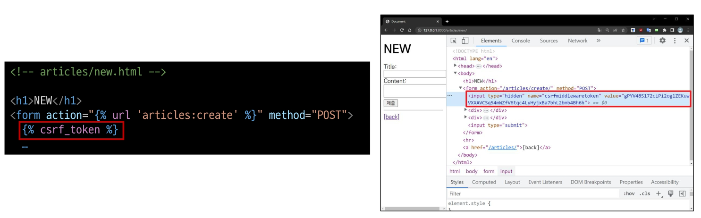

### 요청 시 CSRF Token을 함께 보내야 하는 이유
Django 서버는 해당 요청이 DB에 데이터를 하나 생성하는(DB에 영향을 주는) 요청에 대해 "django가 직접 제공한 페이지에서 요청을 보낸 것인지"에 대한 확인 수단이 필요한 것

겉모습이 똑같은 위조 사이트나 정상적이지 않은 요청에 대한 방어 수단

기존
 - 요청 데이터 -> 게시글 작성
변경
 - 요청 데이터 + 인증 토큰 -> 게시글 작성

### 그런데 왜 POST일 때만 Token을 확인할까?
- POST는 단순 조회를 위한 GET과 달리 특정 리소스에 변경(생성, 수정, 삭제)을 요구하는 의미와 기술적인 부분을 가지고 있기 때문
- DB에 조작을 가하는 요청은 반드시 인증 수단이 필요
- 데이터베이스에 대한 변경사항을 만드는 요청이기 때문에 토큰을 사용해 최소한의 신원 확인을 하는 것

### 게시글 작성 결과
게시글 생성 후 개발자 도구를 사용해 Form Data가 전송되는 것 확인
더 이상 URL에 Query String 형태로 보냈던 데이터가 표기되지 않음

## Redirect
### 게시글 작성 후 완료를 알리는 페이지를 응답하는 것
게시글을 "조회해줘!"라는 요청이 아닌 "작성해줘!"라는 요청이기 때문에
게시글 저장 후 페이지를 응답하는 것은 POST요청에 대한 적절한 응답이 아님

### 데이터 저장 후 페이지를 주는 것이 아닌 다른 페이지로 사용자를 보내야 한다.
"사용자를 보낸다." == "사용자가 GET 요청을 한 번 더 보내도록 해야 한다."

### redirect()
클라이언트가 인자에 작성된 주소로 다시 요청을 보내도록 하는 함수

### redirect() 함수 적용
create view 함수 개선
   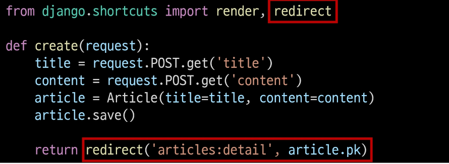

### redirect 특징
해당 redirect에서 클라리언트는 detail url로 요청을 다시 보내게 됨
결과적으로 detail view 함수가 호출되어 detail view 함수의 반환 결과인 detail 페이지를 응답 받음
결국 사용자는 게시글 작성 후 작성된 detail 페이지로 이동하는 것으로 느끼게 되는 것
   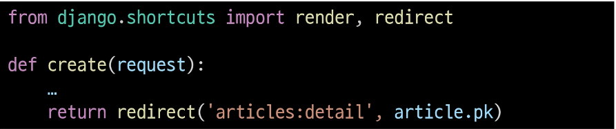

### 게시글 작성 결과
게시글 작성 후 생성된 게시글의 detail 페이지로 redirect 되엇는지 확인
create 요청 이후에 detail로 다시 요청을 보냈다는 것을 알 수 있음
   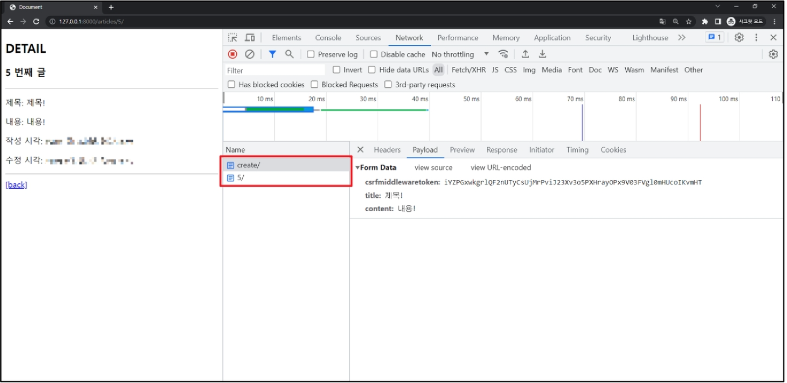

## Delete
### Delete 기능 구현
   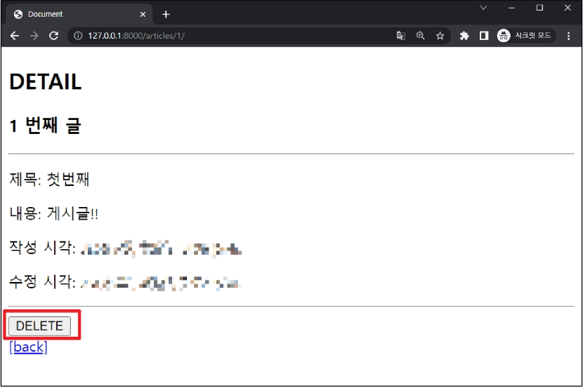
   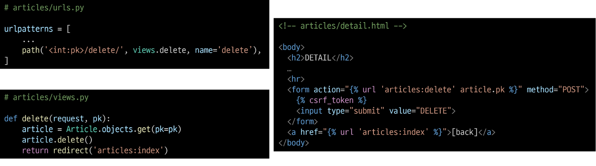

## update
### Update 로직을 구현하기 위해 필요한 view 함수의 개수는?
사용자 입력 데이터를 받을 페이지를 렌더링 edit
사용자가 입력한 데이터를 받아 DB에 저장 update

### edit 기능 구현
   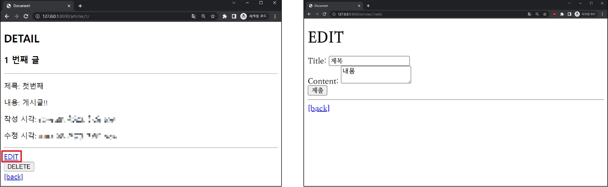
   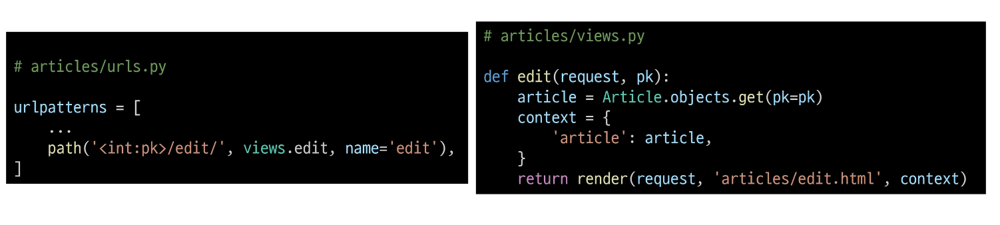
   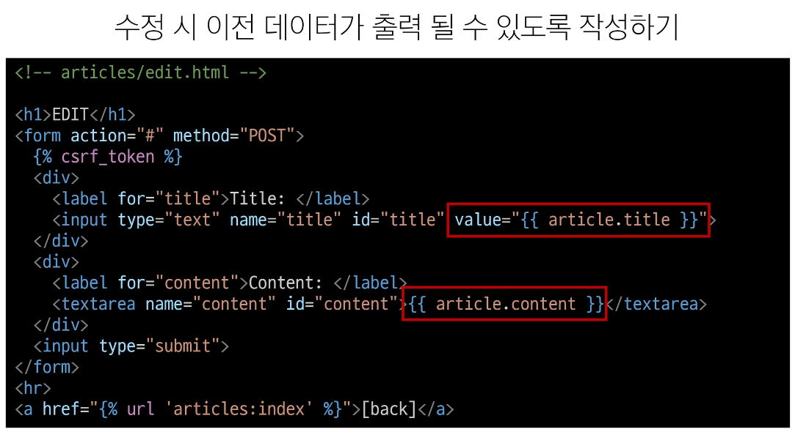
   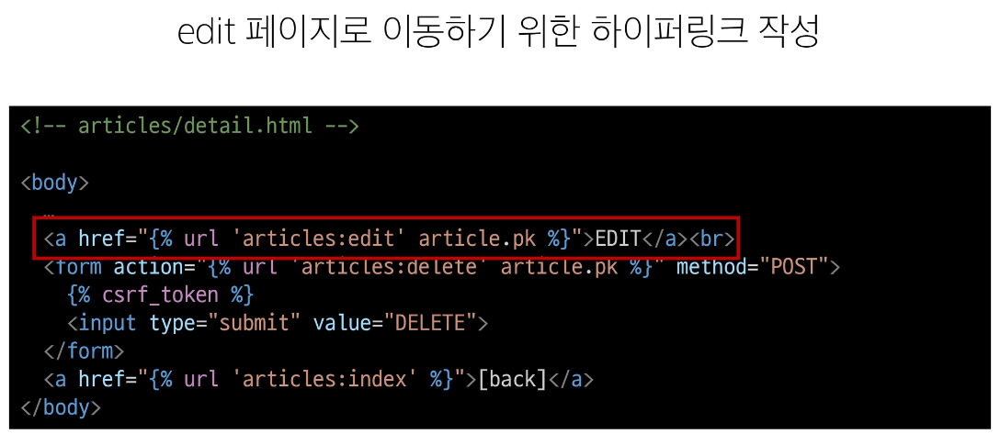

### update 기능 구현
   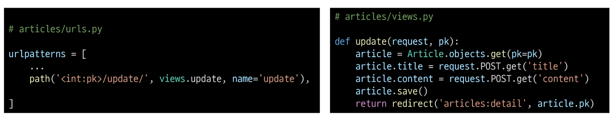
   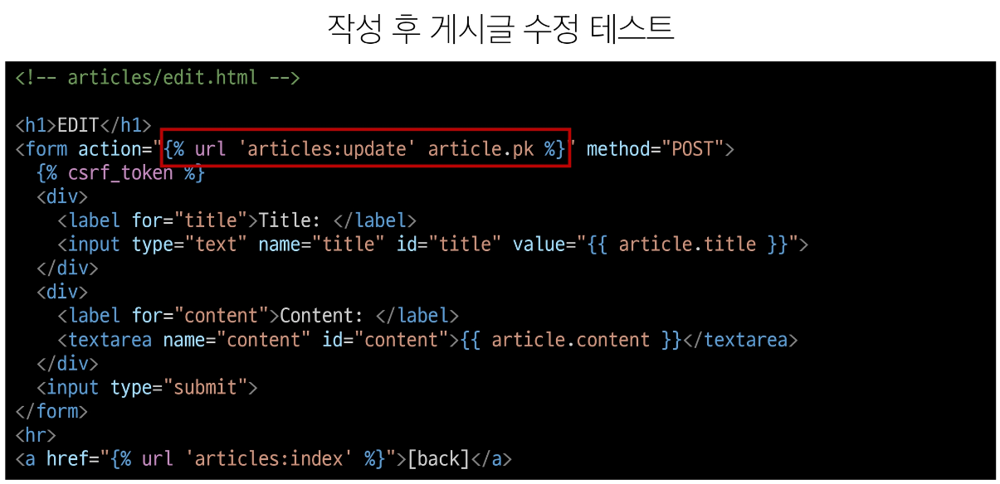

## 참고
### GET과 POST
   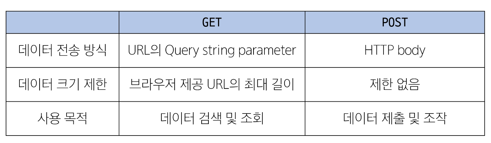

### GET 요청이 필요한 경우
 - 캐싱 및 성능
     - GET 요청은 캐시(Cache)될 수 있고, 이전에 요청한 정보를 새로 요청하지 않고 사용할 수 있음
 - 특히, 동일한 검색 결과를 여러 번 요청하는 경우 GET 요청은 캐시를 활용하여 더 빠르게 응답할 수 있음

 - 가시성 공유
     - GET 요청은 URL에 데이터가 노출되어 있기 떄문에 사용자가 해당 URL을 북마크하거나 다른 사람과 공유하기 용이
 
 - RESTful API 설계
     - HTTP 메서드의 의미에 따라 동작하도록 디자인된 API의 일관성을 유지할 수 있음

### 캐시 (Cache)
 - 데이터나 정보를 임시로 저장해두는 메모리나 디스크 공간
 - 이전에 접근한 데이터를 빠르게 검색하고 접근할 수 있도록 함

### HTTP request methods를 활용한 효율적인 URL 구성
 - 동일한 URL 한 개로 method에 따라 서버에 요구하는 행동을 다르게 요구
 - Django 후반기 RESTful API 시간에 다룰 예정
    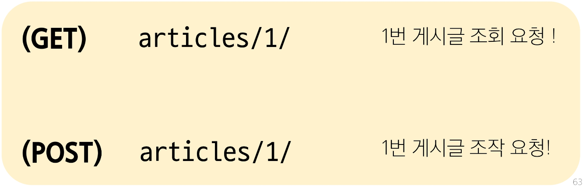

### HTTP request methods 사용 예시

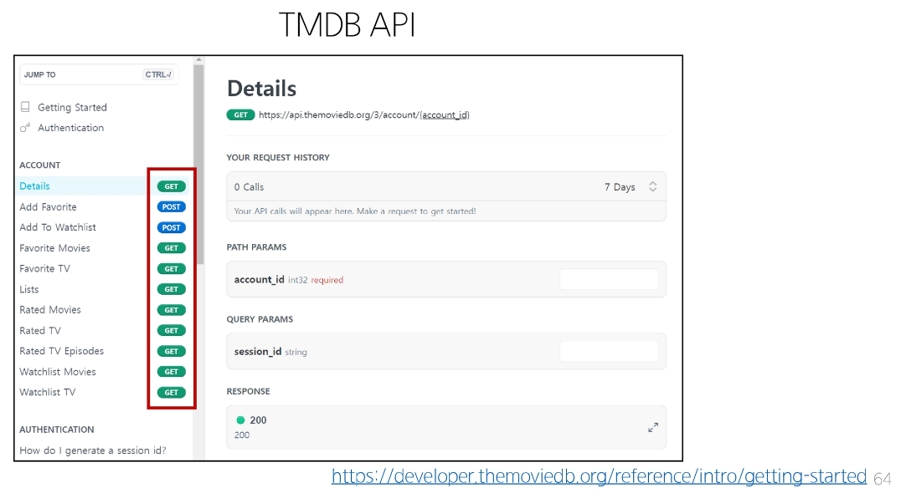
