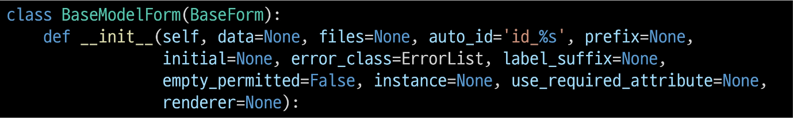

# Django Form

## 개요
### HTML 'form'
지금까지 사용자로부터 데이터를 받기 위해 활용한 방법
그러나 비정상적 혹은 악의적인 요청을 필터링할 수 없음
 - 유효한 데이터인지에 대한 확인이 필요

### 유효성 검사
수집한 데이터가 정확하고 유효한지 확인하는 과정

### 유효성 검사 구현
 - 유효성 검사를 구현하기 위해서는 입력 값, 형식, 중복, 범위, 보안 등 많은 것들을 고려해야 함
 - 이런 과정과 기능을 직접 개발하는 것이 아닌 Django가 제공하는 Form을 사용

## Form class
### Django Form
사용자 입력 데이터를 수집하고, 처리 및 유효성 검사를 수행하기 위한 도구
- 유효성 검사를 단순화하고 자동화할 수 있는 기능을 제공

### Form class 정의
   

### Form class를 적용한 new 과정 변화
   
   
   

### Form rendering options
label, iput 쌍을 특정 HTML 태그로 감싸는 옵션
   
   

### Widgets
HTML 'input' element의 '표현'을 담당

### Widget 사용
 - Widget은 단순히 input요소의 속성 및 출력되는 부분을 변경하는 것
    

## Django ModelForm
### Form
사용자 입력 데이터를 DB에 저장하지 않을 때 (ex. 로그인)
### ModelForm
사용자 입력 데이터를 DB에 저장해야 할 때
(ex. 게시글 작성, 회원가입)

### ModelForm
Model과 연결된 Form을 자동으로 생성해주는 기능을 제공
 - Form + Model

### ModelForm class 정의
기존 ArticleForm 클래스 수정
    
    

### Meta class
ModelForm의 정보를 작성하는 곳

### 'fields' 및 'exclude' 속성
exclude 속성을 사용하여 모델에서 포함하지 않을 필드를 지정할 수도 있음
    

### ModelForm을 적용한 create 로직

제목 input에 공백을 입력 후 에러 메시지 출력 확인 -> 유효성 검사의 결과

### is_vaild()
여러 유효성 검사를 실행하고, 데이터가 유효한지 여부를 Boolean으로 반환

### 공백 데이터가 유효하지 않은 이유와 에러 메시지가 출력되는 과정

### ModelForm을 적용한 edit 로직

### save()
데이터베이스 객체를 만들고 저장

### save() 메서드가 생성과 수정을 구분하는 법
키워드 인자 instance 여부를 통해 생성할 지, 수정할 지를 결정

### Django Form 정리
사용자로부터 데이터를 수집하고 처리하기 위한 강력하고 유연한 도구
HTML form의 생성, 데이터 유효성 검사 및 처리를 쉽게할 수 있도록 도움

## Handling HTTP requests
### view 함수 구조 변화
new & create view 함수간 공통점과 차이점
공통점 : 데이터 생성을 구현하기 위함
차이점 : new는 GET method 요청만을, create는 POST method 요청만을 처리

HTTP request method 차이점을 활용해 동일한 목적을 가지는 2개의 view 함수를 하나로 구조화

### new & create 함수 결합

### 새로운 create view 함수
new와 create view 함수의 공통점과 차이점을 기반으로 하나의 함수로 결합

두 함수의 유일한 차이점이었던 request method에 따른 분기

POST일 때는 과거 create 함수 구조였던 객체 생성 및 저장 로직 처리

POST가 아닐 때는 과거 단순히 form 인스턴스 생성

form은 아래 2가지 중 하나로 context에 넘겨짐
1. is_valid()를 통과하지 못해 에러 메시지를 담은 form 인스턴스
2. else문의 form 인스턴스

### 기존 new 관련 코드 수정(1/3)
사용하지 않은 new url 제거

new url을 create url로 변경

new 템플릿을 create 템플릿으로 변경

### request method에 따른 요청의 변화

### 새로운 update view 함수
기존 edit과 update view 함수 결합

### 기존 edit 관련 코드 수정
사용하지 않는 edit url 제거

edit 템플릿을 update 템플릿으로 변경

## 참고
### ModelForm 키워드 인자와 data와 instance 살펴보기
ModelForm의 부모 클래스인 BaseModelForm의 생성자 함수 예시

### widget 응용

### 필드를 수동으로 렌더링 하기

