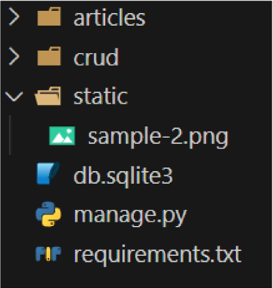
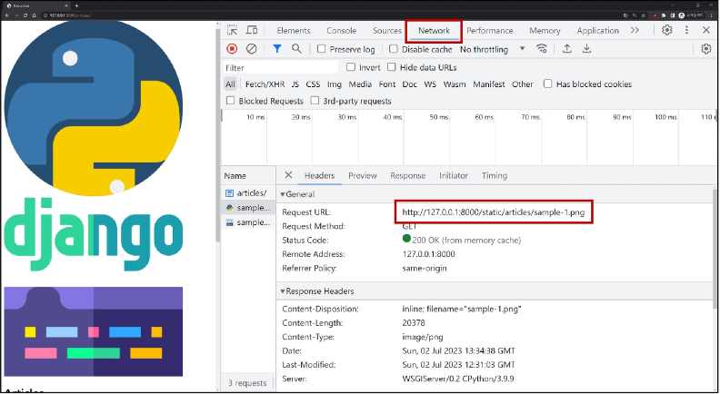
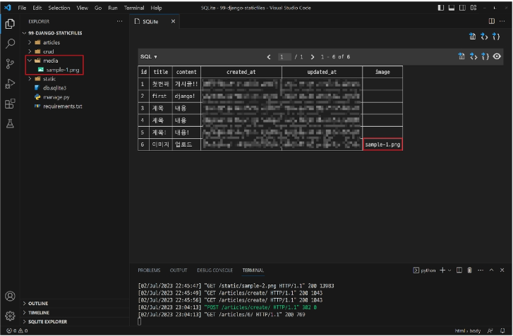
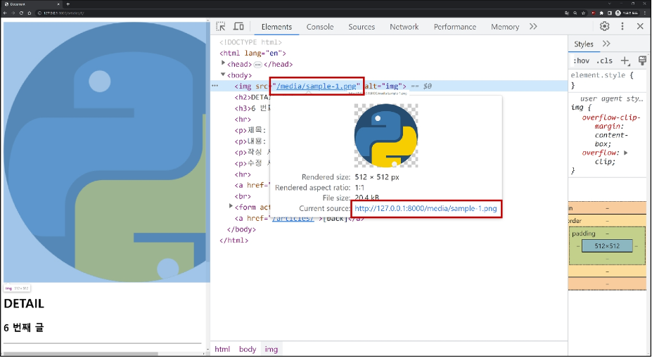
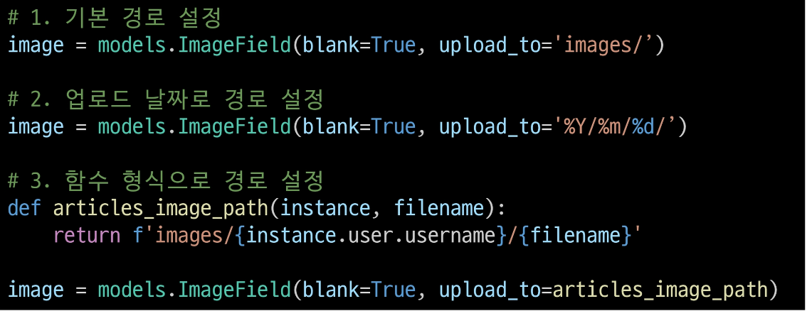

# django static file

## static files
### static files
정적 파일
서버 측에서 변경되지 않고 고정적으로 제공되는 파일
(이미지, JS, CSS 파일 등)

### 웹 서버와 정적 파일
- 웹 서버의 기본 동작은
특정 위치(URL)에 있는 자원을 요청(HTTP request)받아서 응답(HTTP response)을 처리하고 제공하는 것


- 이는 "자원에 접근 가능한 주소가 있다."라는 의미
- 웹 서버는 요청받은 URL로 서버에 존재하는 정적 자원을 제공함
- 정적 파일을 제공하기 위한 경로(URL)가 있어야 함

### Static files 제공하기
1. 기본 경로에서 제공하기
2. 추가 경로에서 제공하기
cf) static은 bulit-in function이 아니라서 load로 불러와야함

### Static files 기본 경로
app폴더/static/

### 기본 경로 static file 제공하기
 - articles/static/articles/ 경로에 이미지 파일 배치


 - static tag를 사용해 이미지 파일에 대한 경로 제공


 - static_url 확인


### STATIC_URL
 - 기본 경로 및 추가 경로에 위치한 정적 파일을 참조하기 위한 URL
     - 실제 파일이나 디렉토리가 아니며, URL로만 존재

### Static_url
```
# settings.py
# 거의 맨 아래에 있음

STATIC_URL = 'static/'
```

### URL + STATIC_URL + 정적 파일 경로
http://127.0.0.1:8000/static/articles/sample-1.png

### Static files 추가 경로
STATICFILES_DIRS에 문자열 값으로 추가 경로 설정

### Staticfiles_DIRS
정적 파일의 기본 경로 외에 추가적인 경로 목록을 정의하는 리스트

### 추가 경로 static file 제공하기
 - 임의로 추가 경로 설정
```
# settings.py
STATICFILES_DIRS = [
    BASE_DIR / 'static',
]
```

 - 추가 경로에 이미지 파일 배치


 - static tag를 사용해 이미지 파일에 대한 경로 제공


 - 이미지를 제공받기 위해 요청하는 Request URL 확인


### 정적 파일을 제공하려면 요청에 응답하기 위한 URL이 필요

cf)  주의사항
1. 가장 위에 있어야함
2. 하나만 존재해야함
따라서 static은 extends 아래에 있어야 한다.
3. static은 부모에서 load하면 자식에서 load되지 않는다.
일일이 해줘야 한다.
## Media files
### Media files
사용자가 웹에서 업로드하는 정적 파일(user-uploaded)

### ImageField()
이미지 업로드에 사용하는 모델 필드
 - 이미지 객체가 직접 저장되는 것이 아닌 '이미지 파일의 경로'가 문자열로 db에 저장

### 미디어 파일 제공을 위한 사전 준비
1. settings.py에 MEDIA_ROOI, MEDIA_URL 설정
2. 작성한 MEDIA_ROOT와 MEDIA_URL에 대한 url 지정

### MEDIA_ROOT
실제 미디어 파일들이 위치하는 디렉토리의 절대 경로
```
# settings.py
MEDIA_ROOT = BASE_DIR / 'media'
```

### MEDIA_URL
MEDIA_ROOT에서 제공되는 미디어 파일에 대한 주소를 생성
(STATIC_URL과 동일한 역할)

```
# settings.py
MEDIA_URL = 'media/'
```

### MEDIA_ROOT와 MEDIA_URL에 대한 url 지정
업로드 된 파일을 제공하는 URL == settings.MEDIA_URL
위 URL을 통해 참조하는 파일의 실제 위치 == settings.MEDIA_ROOT


### 이미지 업로드
- blank = True 속성을 작성해 빈 문자열이 저장될 수 있도록 제약 조건 설정
- 게시글 작성 시 이미지 없이 작성할 수 있도록
- 기존 필드 사이에 작성해도 실제 테이블 생성 시에는 가장 우측(뒤)에 추가됨


- migration 진행


- form 요소의 enctype 속성 추가
form은 기본적으로 text 데이터만 action으로 보내줌


- view 함수에서 업로드 파일에 대한 추가 코드 작성


- 이미지 업로드 입력 양식 확인


- 이미지 업로드 결과 확인


### 업로드 이미지 제공하기
 - url 속성을 통해 업로드 파일의 경로 값을 얻을 수 있음
 - article.image.url
     - 업로드 파일의 경로
 - article.image
     - 업로드 파일의 파일 이름


 - 업로드 이미지 출력 확인 및 MEDIA_URL 확인

 - 이미지를 업로드하지 않은 게시물은 detail 템플릿을 렌더링할 수 없음
 - 이미지 데이터가 있는 경우만 이미지를 출력할 수 있도록 처리하기


### 업로드 이미지 수정
 - 수정 페이지 form 요소에 enctype 속성 추가

 - update view 함수에서 업로드 파일에 대한 추가 코드 작성


## 참고
### 'upload_to' argument
 - ImageField()의 upload_to 인자를 사용해 미디어 파일 추가 경로 설정


### request.FILES가 두 번째 위치 인자인 이유
 - ModelForm 상위 클래스에서 BaseMoelForm의 생성자 함수 키워드 인자 참고

