# authentication system 2
## 회원 가입
User 객체를 create하는 과정

### UserCreationForm()
회원 가입 시 사용자 입력 데이터를 받는 built-in ModelForm

### 회원 가입 페이지 작성
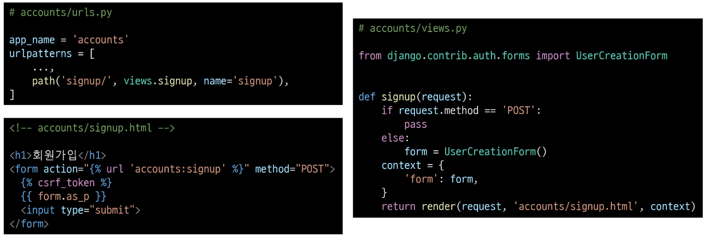
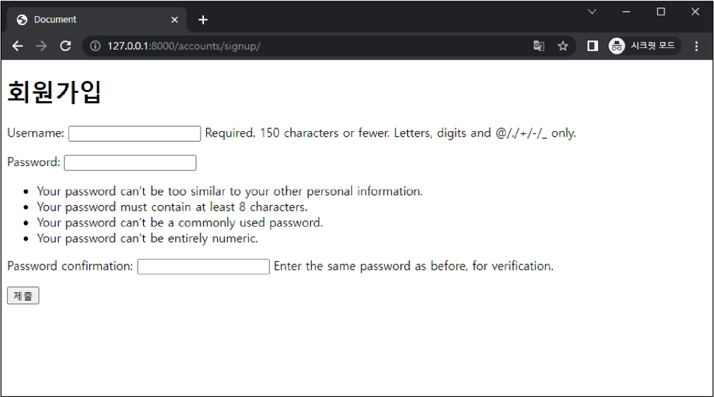

### 회원 가입 로직 작성
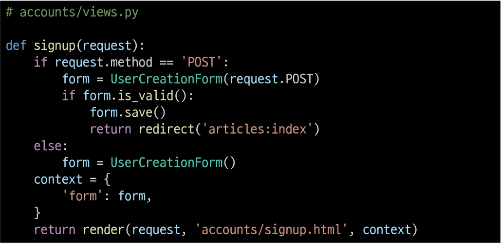

### 회원 가입 로직 에러
 - 회원가입 진행 후 에러 페이지 확인
     - Manager isn't available; 'auth.User' has benn swapped for 'accounts.User'

 - 회원가입에 사용하는 UserCreationForm이 기존 유저 모델로 인해 작성된 클래스이기 때문
 - 대체한 유저 모델로 변경 필요
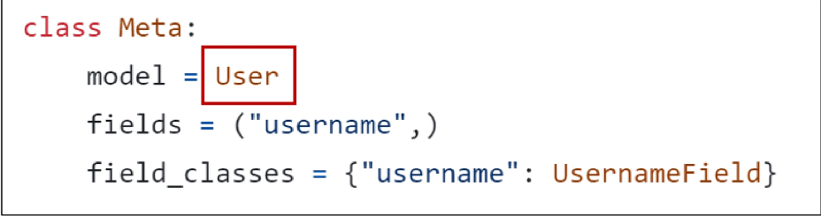

### 커스텀 유저 모델을 사용하려면 다시 작성해야 하는 Form
1. UserCreationForm
2. UserChangeForm

 - 두 Form 모두 class Meta: model = user가 작성된 Form

### UserCreationForm과 UserChangeForm 커스텀
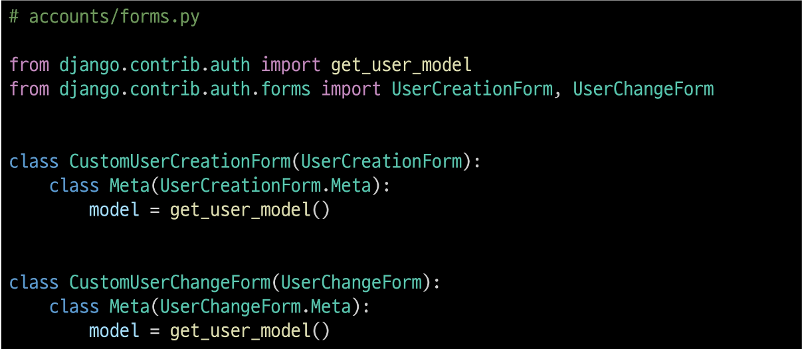

### get_user_model()
 - 현재 프로젝트에서 활성화된 사용자 모델(active user model)을 반환하는 함수

### User 모델을 직접 참조하지 않는 이유
 - get_user_model()을 사용해 User모델을 참조하면 커스텀 User모델을 자동으로 반환해주기 때문
 - Django는 필수적으로 User 클래스를 직접 참조하는 대신 get_user_model()을 사용해 참조해야 한다고 강조하고 있음

 - Usermodel 참조에 대한 자세한 내용은 추후 모델 관계에서 다룰 예정

### 회원 가입 로직 작성
 - 커스텀 form 적용
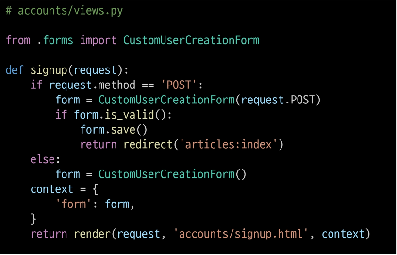

## 회원 탈퇴
User 객체를 Delete하는 과정

### 회원 탈퇴 로직 작성
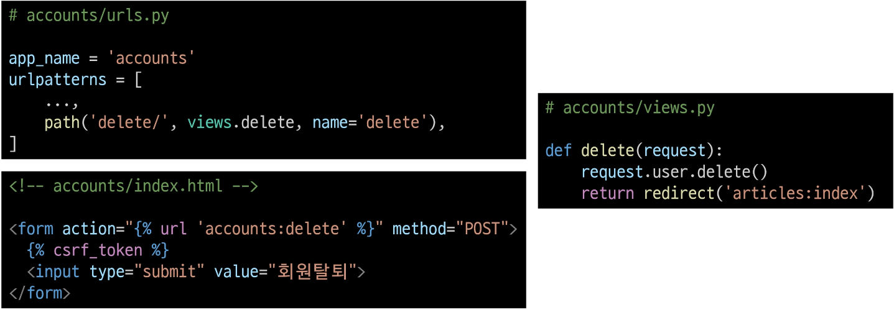
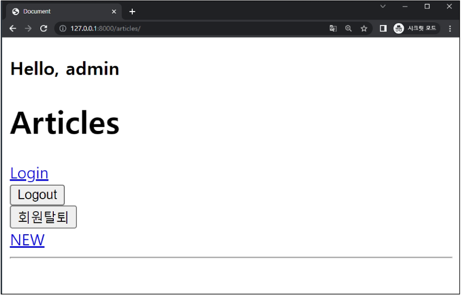
로그인 후 회원 탈퇴하고 db.sqlite3의 accounts_user에서 사라진 것을 확인 가능

## 회원정보 수정
User 객체를 Update하는 과정

### UserChangeForm()
회원정보 수정 시 사용자 입력 데이터를 받는 built-in ModelForm

### 회원정보 수정 페이지 작성
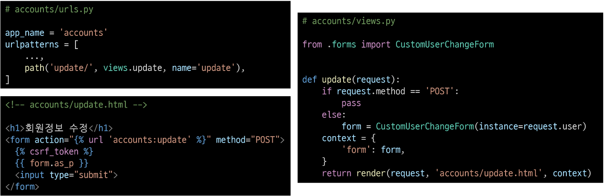
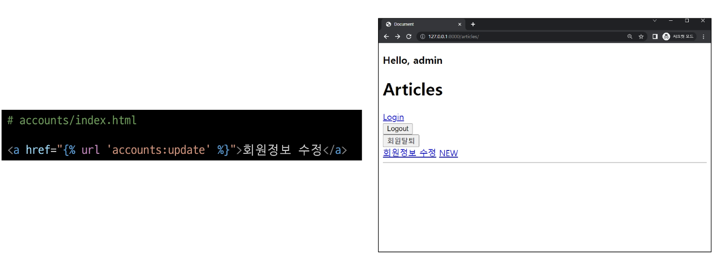
cf) #accounts/index.html 아니고 #articles다(오타인 듯)
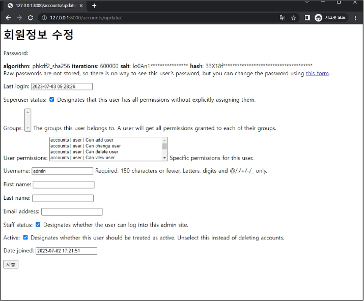

### UserChangeForm 사용 시 문제점
 - User모델의 모든 정보들(fields)까지 모두 출력되어 수정이 가능하기 때문에 일반 사용자들이 접근해서는 안 되는 정보는 출력하지 않도록 해야함

 - CustomUserChangeForm에서 접근 가능한 필드를 다시 조정

### CustomUserChangeForm 출력 필드 재정의
 - User Model의 필드 목록 확인
 - https://docs.djangoproject.com/en/4.2/ref/contrib/auth/
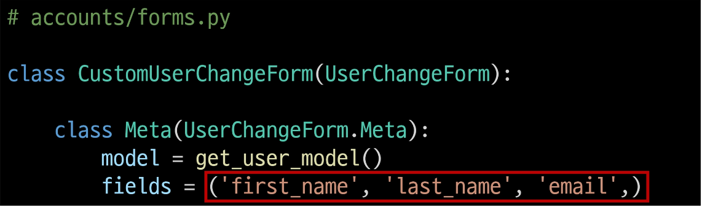
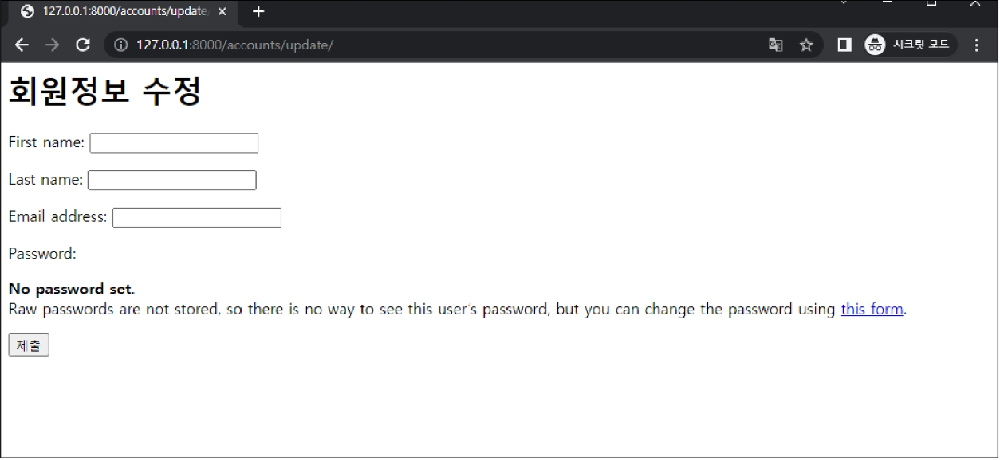

### 회원정보 수정 로직 작성
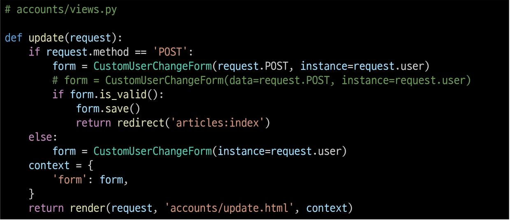

## 비밀번호 변경
인증된 사용자의 Session 데이터를 Update하는 과정

### PasswordChangeForm()
비밀번호 변경 시 사용자 입력 데이터를 받는 built-in Form

### 비밀번호 변경 페이지 작성
django는 비밀번호 변경 페이지를 회원정보 수정 form에서 별도 주소를 안내
 - /user_pk/password/
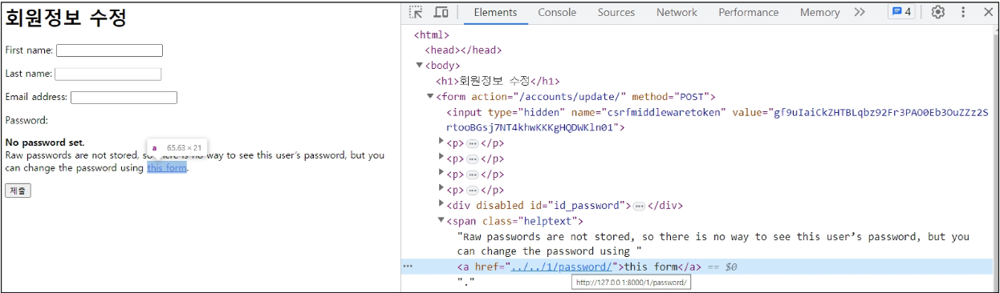
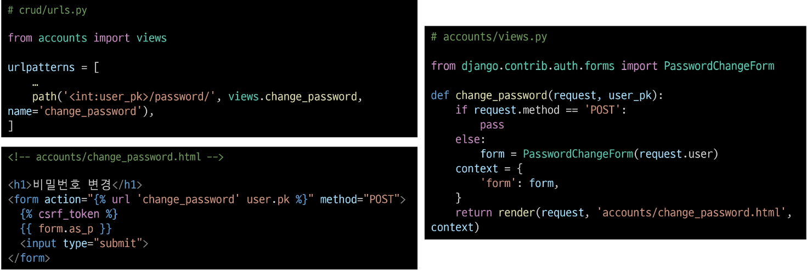
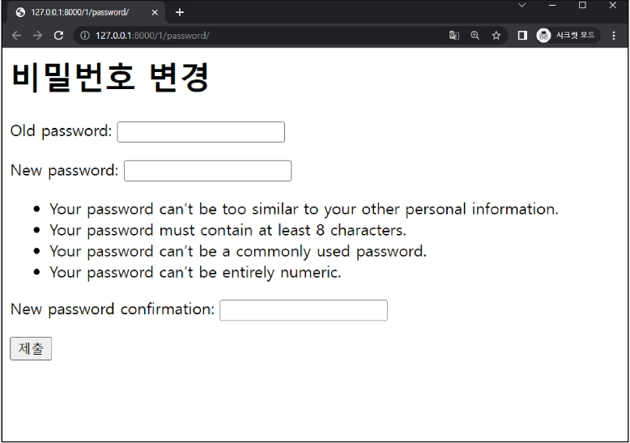

### 비밀번호 변경 로직 작성
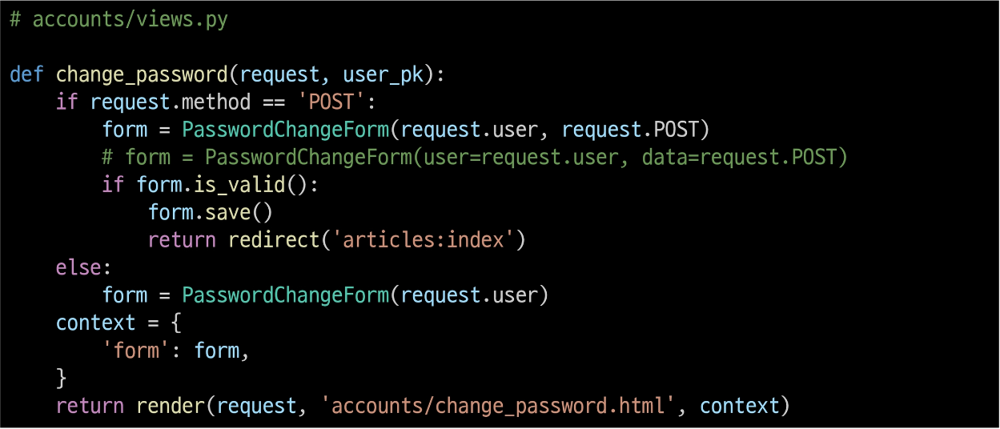

## 세션 무효화 방지하기
### 암호 변경 시 세션 무효화
 - 비밀번호가 변경되면 기존 세션과의 회원 인증 정보가 일치하지 않게 되어버려 로그인 상태가 유지되지 못하고 로그아웃 처리됨
 - 비밀번호가 변경되면서 기존 세션과의 회원 인증 정보가 일치하지 않기 때문

### update_session_auth_hash(request, user)
 - 암호 변경 시 세션 무효화를 막아주는 함수
 - 암호가 변경되면 새로운 password의 Session Data로 기존 session을 자동으로 갱신

### update_session_auth_hash 적용
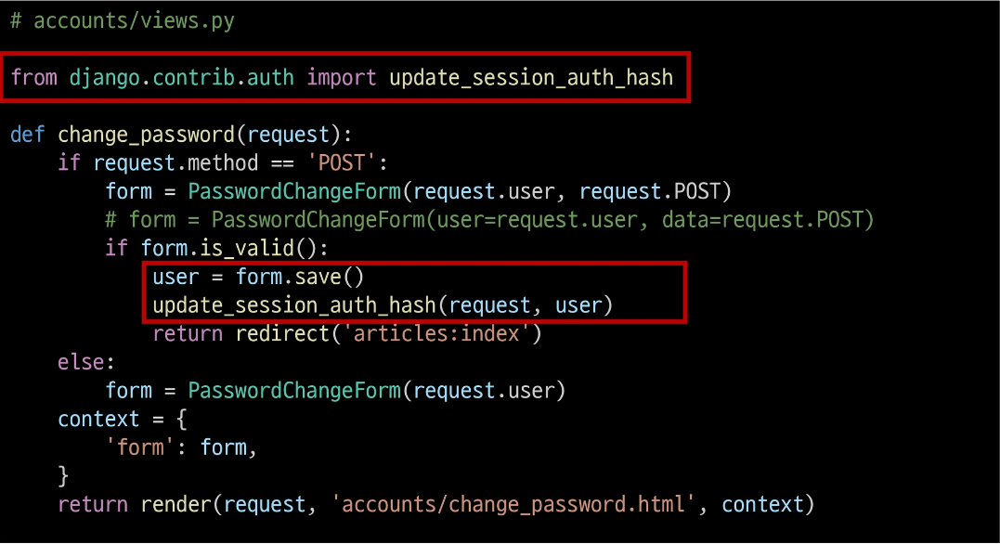

## 인증된 사용자에 대한 접근 제한
### 로그인 사용자에 대해 접근을 제한하는 2가지 방법
 1. is_authenticated 속성(attribute)
 2. login_required 데코레이터(decorator)

### is_authenticated
사용자가 인증되었는지 여부를 알 수 있는 User model의 속성
 - 모든 User 인스턴스에 대해 항상 True인 읽기 전용 속성이며, 비인증 사용자에 대해서는 항상 False

### is_authenticated 적용하기
로그인과 비로그인 상태에서 화면에 출력되는 링크를 다르게 설정하기
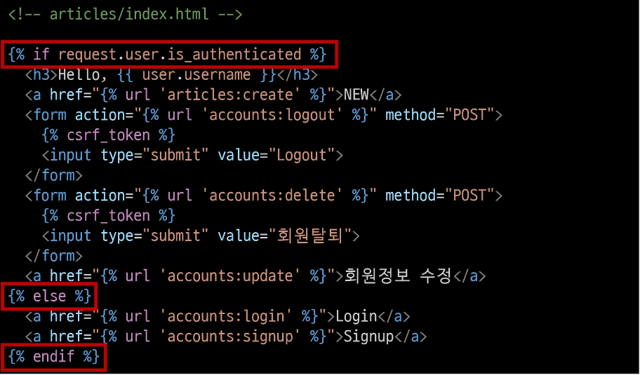
인증된 사용자라면 로그인/회원가입 로직을 수행할 수 없도록 하기
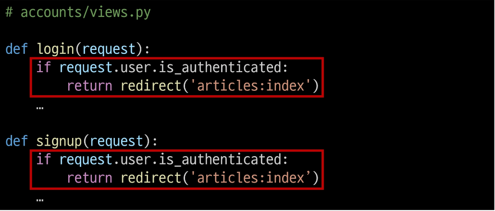

### login_required
인증된 사용자에 대해서만 view 함수를 실행시키는 데코레이터
 - 비인증 사용자의 경우 /accounts/login/ 주소로 redirect 시킴

### login_required 적용하기
인증된 사용자만 게시글을 작성/수정/삭제할 수 있도록 수정
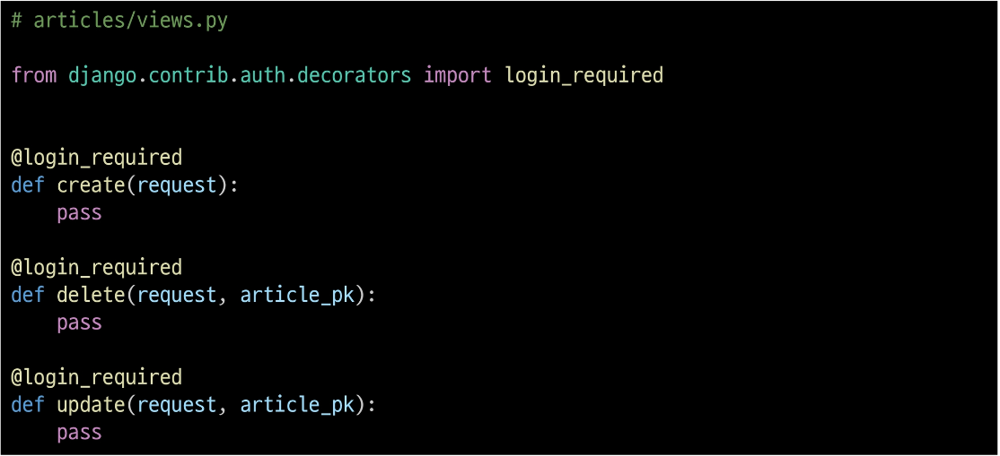
인증된 사용자만 로그아웃/탈퇴/수정/비밀번호 변경할 수 있도록 수정
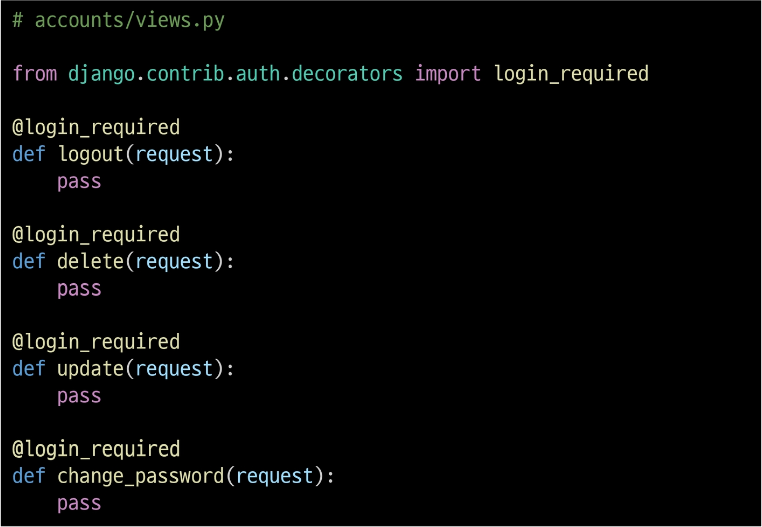

## 참고
### is_authenticated 속성
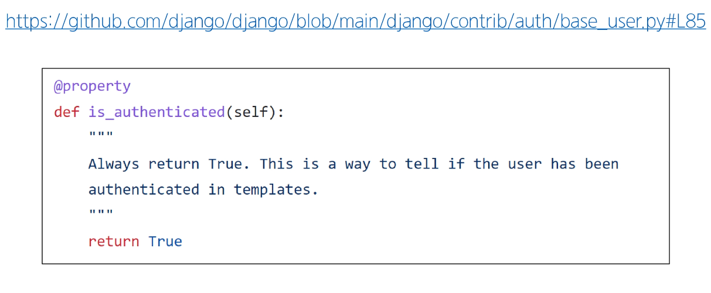

### 회원가입 후 로그인까지 이어서 진행하려면?
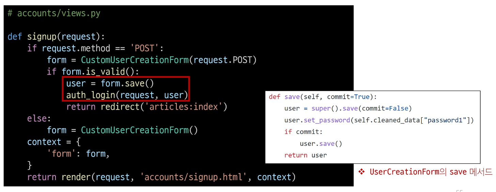

### 탈퇴와 함께 기존 사용자의 Session Data 삭제 방법
 - 사용자 객체 삭제 이후 로그아웃 함수 호출
 - 단, "탈퇴(1) 후 로그아웃(2)"의 순서가 바뀌면 안됨
 - 먼저 로그아웃이 진행되면 해당 요청 객체 정보가 없어지기 때문에 탈퇴에 필요한 유저 정보 또한 없어지기 때문
 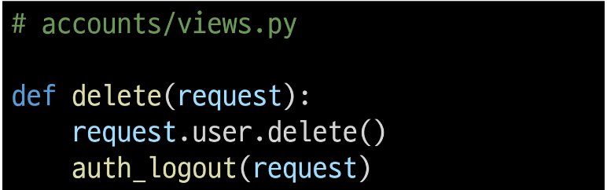

### PasswordChangeForm의 인자 순서
 - PasswordChangeForm이 다른 Form과 달리 user 객체를 첫 번째 인자로 받는 이유
 - 부모 클래스인 SetPasswordForm의 생성자 함수 구성을 따르기 때문
 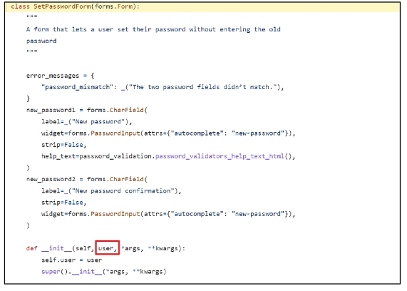

### auth built-in form 코드 참고
 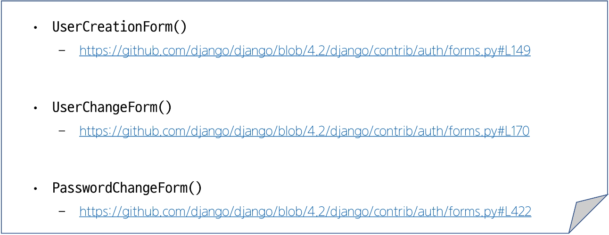
