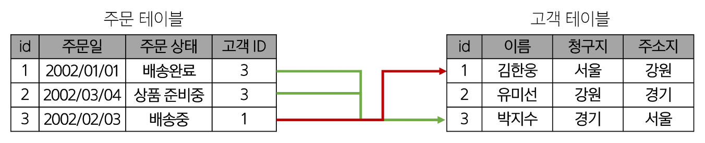
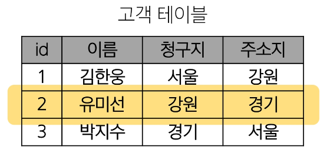
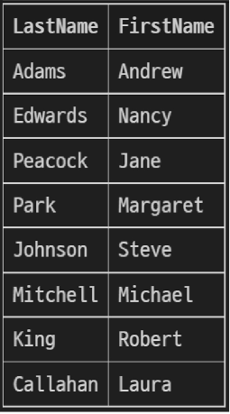
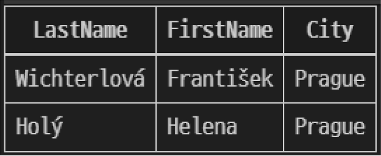

# SQL
## Database
### 데이터베이스
체계적인 데이터 모음
### 데이터
저장이나 처리에 효율적인 형태로 변환된 정보
### 증가하는 데이터 사용량
 - 배달의 민족 국내 주문 건수 6억 8천만 건 (2020)
 - 구독자 2억 3840만명이 1000억 시간 넷플릭스 시청(2023년 1~6월)
 - 전세계 모든 데이터의 약 90%는 2015년 이후 생산된 것 (IBM)

### 데이터 센터의 성장
 - 네이버: 제2데이터센터에 6500억 투자(2020)
 - 카카오: 제1데이터센터와 제2데이터센터에 1.5조 투자(2022)
 - 전세계 데이터 센터 시장 2022년부터 2026년까지 연평균 20% 이상 성장 예상

### 데이터를 저장하고 잘 관리하여 활용할 수 있는 기술이 중요해짐
 - 우리가 알고 있는 데이터 저장 방식은 어떤 것이 있을까?

### 기존의 데이터 저장 방식
1. 파일(File) 이용
2. 스프레드시트(Spreadsheet) 이용

### 1. 파일을 이용한 데이터 관리
 - 어디에서나 쉽게 사용 가능
 - 데이터를 구조적으로 관리하기 어려움


### 2. 스프레드시트를 이용한 데이터 관리
 - 테이블의 열과 행을 사용해 데이터를 구조적으로 관리 가능


### 스프레드시트의 한계
 - 크기
     - 일반적으로 약 100만 행까지만 저장 가능
 - 보안
     - 단순히 파일이나 링크 소유 여부에 따른 단순한 접근 권한 기능 제공

 - 정확성
     - 만약 공식적으로 "강원"의 지명이 "강언"으로 바뀌었다고 가정한다면?
     - 이 변경으로 인해 테이블 모든 위치에서 해당 값을 업데이트 해야함
     - 찾기 및 바꾸기 기능을 사용해 바꿀 수 있지만 만약 데이트가 여러 시트에 분산되어 있다면 변경에 누락이 생기거나 추가 문제가 발생할 수 있음


### 데이터베이스 역할
 - 데이터를 저장하고 조작(CRUD)

## Relational Database
### 데이터베이스 역할
 - 데이터를 '저장'하고 '조작'(구조적 저장 / CRUD)

### 관계형 데이터베이스
 - 데이터 간에 '관계'가 있는 데이터 항목들의 모임

 - 테이블, 행, 열의 정보를 구조화하는 방식
 - 서로 관련된 데이터 포인터를 저장하고 이에 대한 액세스를 제공


 - 서로 관련된 데이터 포인터를 저장하고 이에 대한 액세스를 제공


### 관계
 - 여러 테이블 간의 (논리적) 연결

### 관계로 할 수 있는 것
 - 이 관계로 인해 두 테이블을 사용하여 데이터를 다양한 형식으로 조회할 수 있음
     - 특정 날짜에 구매한 모든 고객 조회
     - 지난 달에 배송일이 지연된 고객 조회 등

### 관계형 데이터베이스 예시
 - 다음과 같이 고객 데이터가 테이블에 저장되어 있다고 가정
 - 고객 데이터 간 비교를 위해서는 어떤 값을 활용해야 할까?
     - 이름? 주소? 만약 동명이인이나 같은 주소지가 있다면?
     

     - 각 데이터에 고유한 식별 값을 부여하기(기본 키, Primary Key)
     
 - 누가 어떤 주문을 했는지 어떻게 식별할 수 있을까?
     - 고객 이름? 마찬가지로 동명이인이 있다면?
     

     - 주문 정보에 고객의 고유한 식별 값을 저장하기(외래 키, Foreign Key)
     

### 관계형 데이터베이스 관련 키워드
 1. Table (aka Relation)
     - 데이터를 기록하는 곳
     
 2. Field (aka Column, Attribute)
     - 각 필드에는 고유한 데이터 형식(타입)이 지정됨
     
 3. Record (aka Row, Tuple)
     - 각 레코드에는 구체적인 데이터 값이 저장됨
     
 4. Database (aka Schema)
     - 테이블의 집합
     
 5. Primary Key (기본 키, PK)
     - 각 레코드의 고유한 값
     - 관계형 데이터베이스에서 레코드의 식별자로 활용
     
 6. Foreign Key (외래 키, FK)
     - 테이블의 필드 중 다른 테이블의 레코드를 식별할 수 있는 키
     - 다른 테이블의 기본 키를 참조
     - 각 레코드에서 서로 다른 테이블 간의 관계를 만드는 데 사용
     

## RDBMS
### DBMS
Database Management System
데이터베이스를 관리하는 소프트웨어 프로그램

 - 데이터 저장 및 관리를 용이하게 하는 시스템
 - 데이터베이스와 사용자 간의 인터페이스 역할
 - 사용자가 데이터 구성, 업데이트, 모니터링, 백업, 복구 등을 할 수 있도록 도움

### RDBMS
Relational Database Management System
관계형 데이터베이스를 관리하는 소프트웨어 프로그램

### RDBMS 서비스 종류
 - SQLite
 - MySQL
 - PostgreSQL
 - Oracle Database ...

### SQLite
경량의 오픈 소스 데이터베이스 관리 시스템
 - 컴퓨터나 모바일 기기에 내장되어 간단하고 효율적인 데이터 저장 및 관리를 제공

### 데이터베이스 정리
 - Table은 데이터가 기록되는 곳
 - Table에는 행에서 고유하게 식별 가능한 기본 키라는 속성이 있으며, 외래 키를 사용하여 각 행에서 서로 다른 테이블 간의 관계를 만들 수 있음
 - 데이터는 기본 키 또는 외래 키를 통해 결합(join)될 수 있는 여러 테이블에 걸쳐 구조화 됨

## SQL
### 사전 준비
 - Public Documents 문서 진행
     - Django & DB 사전 준비사항
     - SQLite 설치
     - VSCode SQLite3 사용 가이드
    
### SQL
Structure Query Language
데이터베이스에 정보를 저장하고 처리하기 위한 프로그래밍 언어
테이블의 형태로 '구조화'된 관계형 데이터베이스에게 요청을 '질의(요청)'

### SQL Syntax
SELECT column_name FROM table_name;

 1. SQL 키워드는 대소문자를 구분하지 않음
     - 하지만 대문자로 작성하는 것을 권장(명시적 구분)

 2. 각 SQL Statements의 끝에는 세미콜론(';')dl vlfdy
     - 세미콜론은 각 SQL Statements을 구분하는 방법(명령어의 마침표)

### SQL Statements
SQL을 구성하는 가장 기본적인 코드 블록

### SQL statements 예시
SELECT column_name FROM table_name;
 - 해당 예시 코드는 SELECT statement라고 부름
 - 이 Statement는 SELECT, FROM 2개의 keyword로 구성됨

### 수행 목적에 따른 SQL Statements 4가지 유형
 1. DDL - 데이터 정의
 2. DQL - 데이터 검색
 3. DML - 데이터 조작
 4. DCL - 데이터 제어


### SQL 학습 방향
 - 단순히 SQL 문법을 암기하고 상황에 따라 실행만 하는 것이 아닌 SQL을 통해 관계형 데이터베이스를 잘 이해하고 다루는 방법을 학습

## 참고
### Query
 - 데이터베이스로부터 정보를 요청하는 것
 - 일반적으로 SQL로 작성하는 코드를 쿼리문(SQL문)이라 함

### SQL 표준
 - SQL은 미국 국립 표준 협회(ANSI)와 국제 표준화 기구(ISO)에 의해 표준이 채택됨
 - 모든 RDBMS에서 SQL 표준을 지원
 - 다만 각 RDBMS마다 독자적인 기능에 따라 표준을 벗어나는 문법이 존재하니 주의

## Single Table Queries
### SQL Statements 유형


## Querying data
### SELECT statement
테이블에서 데이터를 조회

### SELECT syntax
SELECT
    select_list
FROM
    table_name;

 - SELECT 키워드 이후 데이터를 선택하려는 필드를 하나 이상 지정
 - FROM 키워드 이후 데이터를 선택하려는 테이블의 이름을 지정

### SELECT 활용 1
테이블 employees에서 LastName 필드의 모든 데이터를 조회
```
SELECT
    LastName
FROM
    employees;
```


### SELECT 활용 2
테이블 employees에서 LastName, FirstName 필드의 모든 데이터를 조회
```
SELECT
    LastName, FirstName
FROM
    employees;
```


### SELECT 활용 3
테이블 employees에서 모든 필드 데이터를 조회
```
SELECT
    *
FROM
    employees;
```


### SELECT 활용 4
테이블 employees에서 FirstName 필드의 모든 데이터를 조회
(단, 조회 시 FirstName이 아닌 '이름'으로 출력될 수 있도록 변경)
```
SELECT
    FirstName AS '이름'
FORM
    employees;
```


### SELECT 활용 5
 - 테이블 tracks에서 Name, MIlliseconds 필드의 모든 데이터를 조회
 (단, MIlliseconds 필드는 60000으로 나눠 분 단위의 값으로 출력)
```
SELECT
 Name,
 Milliseconds / 60000 AS '재생 시간(분)'
FROM
 tracks;
```


### SELECT 정리
 - 테이블의 데이터를 조회 및 반환
 - '*'(asterisk)를 사용하여 모든 필드 선택

### Sorting data
ORDER BY statement
조회 결과의 레코드를 정렬

### ORDER BY syntax
 - FROM clause 뒤에 위치
 - 하나 이상의 컬럼을 기준으로 결과를 오름차순(ASC, 기본 값), 내림차순(DESC)으로 정렬


### ORDER BY 활용 1
테이블 employees에서 FirstName 필드의 모든 데이터를 오름차순으로 조회
```
SELECT
 FirstName
FROM
 employees
ORDER BY
 FirstName;
```


### ORDER BY 활용 2
테이블 employees에서 FirstName 필드의 모든 데이터를 내림차순으로 조회
```
SELECT
 FirstName
FROM
 employees
ORDER BY
 FirstName DESC;
```


### ORDER BY 활용 3
테이블 customers에서 country 필드를 기준으로 내림차순 정렬한 다음 City 필드 기준으로 오름차순 정렬하여 조회
```
SELECT
 Country, City
FROM
 customers
ORDER BY
 Country DESC,
 City ASC;
```


### ORDER BY 활용 4
테이블 tracks에서 Milliseconds 필드를 기준으로 내림차순 정렬한 다음 Name, Milliseconds 필드의 모든 데이터를 조회
(단, Milliseconds 필드는 60,000으로 나눠 분 단위 값으로 출력)


### 정렬에서의 NULL
NULL 값이 존재할 경우 오름차순 정렬 시 결과에 NULL이 먼저 출력
```
SELECT
 ReportsTo
FROM
 employees
ORDER BY
 ReportsTo;
```


### SELECT statement 실행 순서
FROM -> SELECT -> ORDER BY
1. 테이블에서 (FROM)
2. 조회하여 (SELECT)
3. 정렬 (ORDER BY)

## Filtering data
### Filtering data 관련 Keywords
 - Clause
     - **DISTINCT**
     - **WHERE**
     - **LIMIT**
 - Operator
     - **BETWEEN**
     - **IN**
     - **LIKE**
     - Comparison
     - Logical

### DISTINCT statement
조회 결과에서 중복된 레코드를 제거

### DISTINCT syntax
```
SELECT DISTINCT
 select_list
FROM
 table_name;
```
 - SELECT 키워드 바로 뒤에 작성해야함
 - SELECT DISTINCT 키워드 다음에 고유한 값을 선택하려는 하나 이상의 필드를 지정

### DISTINCT 활용
테이블 customers에서 Country 필드의 모든 데이터를 중복없이 오름차순 조희
```
SELECT DISTINCT
 Country
FROM
 customers
ORDER BY
 Country;
```


### WHERE statement
조회 시 특정 검색 조건을 지정

### WHERE syntax
```
SELECT
 select_list
FROM
 table_name
WHERE
 search_condition;
```
- FROM clause 뒤에 위치
- serach_condition은 비교연산자 및 논리연산자(AND, OR, NOT 등)를 사용하는 구문이 사용됨

### WHERE 활용 1
테이블 customers에서 City 필드값이 'Prague'인 데이터의 LastName, FirstName, City 조회
```
SELECT
 LastName, FirstName, City
FROM
 customers
WHERE
 City = 'Prague';
```


### WHERE 활용 2
테이블 customers에서 City 필드 값이 'Prague'가 아닌 데이터의 LastName, FirstName, City 조회

```
SELECT
 LastName, FirstName, City
FROM
 customers
WHERE
 City != 'Prague';
```


### WHERE 활용 3
테이블 customers에서 Company 필드 값이 NULL이고 Country 필드 값이 'USA'인 데이터의 LastName, FirstName, Company, Country 조회

```
SELECT
 LastName, FirstName, Company, Country
FROM
 customers
WHERE
 Company IS NULL
 AND Country = 'USA';
```


### WHERE 활용 4
테이블 customers에서 Company 필드 값이 NULL이거나 Country 필드 값이 'USA'인 데이터의 LastName, FirstName, Company, Country 조회

```
SELECT
 LastName, FirstName, Company, Country
FROM
 customers
WHERE
 Company IS NULL
 OR Country = 'USA';
```


### WHERE 활용 5
테이블 tracks에서 Bytes 필드 값이 100,000이상 500,000 이하인 데이터의 Name, Bytes 조회
```
SELECT
 Name, Bytes
FROM
 tracks
WHERE
 Bytes BETWEEN 100000 AND 500000;
```


### WHERE 활용 6
테이블 tracks에서 Bytes 필드 값이 100,000이상 500,000 이하의 데이터의 Name, Bytes 기준으로 오름차순 조회
```
SELECT
 Name, Bytes
FROM
 tracks
WHERE
 Bytes BETWEEN 100000 AND 500000
ORDER BY Bytes;
```


### WHERE 활용 7
테이블 customers에서 Country 필드 값이 'Canada' 또는 'Germany' 또는 'France'인 데이터의 LastName, FirstName, Country 조회

```
SELECT
 LastName, FirstName, Country
FROM
 customers
WHERE
 Country IN ('Canada', 'Germany', 'France');

<!-- WHERE
 Country = 'Canada'
 OR Country = 'Germany'
 OR Country = 'France'; -->

```


### WHERE 활용 8
테이블 customders에서 Country 필드 값이 'Canada' 또는 'Germany' 또는 'France'가 아닌 데이터의 LastName, FirstName, Country 조회

```
SELECT
 LastName, FirstName, Country
FROM
 customers
WHERE
 Country NOT IN ('Canada', 'Germany', 'France');
```


### WHERE 활용 9
테이블 customers에서 LastName 필드 값이 'son'으로 끝나는 데이터의 LastName, FirstName 조회

```
SELECT
 LastName, FirstName
FROM
 customers
WHERE
 LastName LIKE '%son';
```


### WHERE 활용 10
테이블 customers에서 FirstName 필드 값이 4자리면서 'a'로 끝나는 데이터의 LastName, FirstName 조회

```
SELECT
 LastName, FirstName
FROM
 customers
WHERE
 FirstNAme LIKE '___a';
```


### Comparison Operators
비교 연산자
=, >=, <=, !=, IS, LIKE, IN, BETWEEN, ... AND

### Logical Operators
논리 연산자
AND(&&), OR(||), NOT(!)

### 'In' Operator
값이 특정 목록 안에 있는 지 확인

### 'Like' Operator
값이 특정 패턴에 일치하는 지 확인
(Wildcards와 함께 사용)

### Wildcard Characters
'%' : 0개 이상의 문자열과 일치하는 지 확인
'_' : 단일 문자와 일치하는 지 확인

### 'LIMIT' clause
조회하는 레코드 수를 제한

```
SELECT
 select_list
FROM
 table_name
LIMIT [offset,] row_count;
```

 - 하나 또는 두 개의 인자를 사용(0 또는 양의 정수)
 - row_count는 조회하는 최대 레코드 수를 지정

### 'LIMIT' & 'OFFSET' 예시


### 'LIMIT' 활용 1
테이블 tracks 에서 TrackId, Name, Bytes 필드 데이터를 Bytes 기준 내림차순으로 7개만 조회
```
SELECT
 TrackId, Name, Bytes
FROM
 tracks
ORDER BY Bytes DESC
LIMIT 7;
```


### 'LIMIT' 활용 2
테이블 tracks에서 TrackId, Name, Bytes 필드 데이터를 Bytes 기준 내림차순으로 4번째부터 7번째 데이터만 조회
```
SELECT
 TrackId, Name, Bytes
FROM
 tracks
ORDER BY
 Bytes DESC
LIMIT 3, 4;
-- LIMIT 4 OFFSET 3;
```
