## Grouping data
### 'GROUP BY' clause
레코드를 그룹화하여 요약본 생성
('집계 함수'와 함께 사용)

### Aggregation Fuctions
집계 함수
값에 대한 계산을 수행하고 단일한 값을 반환하는 함수
SUM, AVG, MAX, MIN, COUNT

### GROUP BY syntax
```
SELECT
 c1, c2, ... , cn, aggregate_fuction(ci)
FROM
 table_name
GROUP BY
 c1, c2, ... ,cn;
```
 - FROM 및 WHERE 절 뒤에 배치
 - GROUP BY 절 뒤에 그룹화 할 필드 목록을 작성

### GROUP BY 예시
1. Country 필드를 그룹화
```
SELECT
 Country
FROM
 customers
GROUP BY
 Country;
```


2. COUNT 함수가 각 그룹에 대한 집계된 값을 계산
```
SELECT
 Country, COUNT(*)
FROM
 customers
GROUP BY
 Country;
```
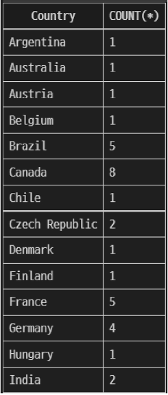

### GROUP BY 활용 1
테이블 tracks에서 Composer 필드를 그룹화하여 각 그룹에 대한 Bytes의 평균 값을 내림차순 조회

```
SELECT
 Composer, 
 Avg(Bytes)
FROM
 tracks
GROUP BY
 Composer
ORDER BY
 AVG(Bytes) DESC;
```
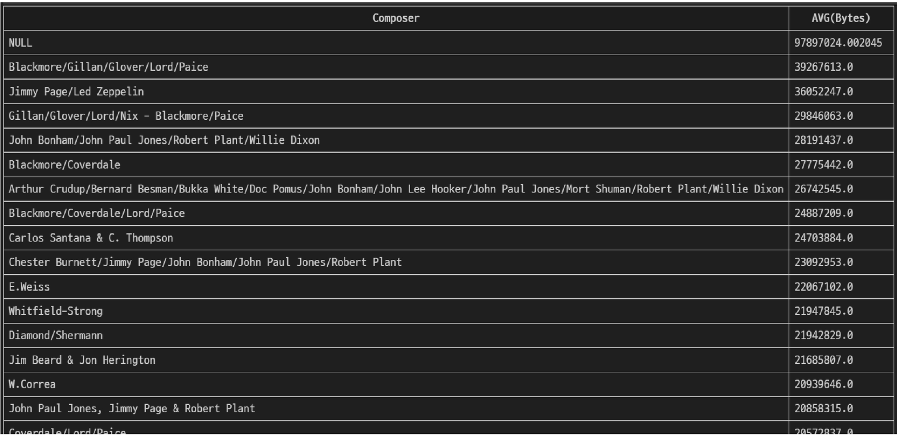

```
SELECT
 Composer, 
 Avg(Bytes) AS avg0fBytes
FROM
 tracks
GROUP BY
 Composer
ORDER BY
 avg0fBytes DESC;
```

### GROUP BY 활용 2
테이블 tracks에서 Composer 필드를 그룹화하여 각 그룹에 대한 Milliseconds의 평균 값이 10 미만인 데이터 조회
(단, Milliseconds 필드는 60,000으로 나눠 분 단위 값의 평균으로 계산)
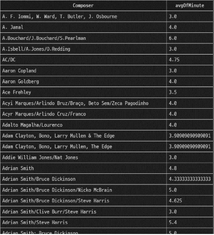
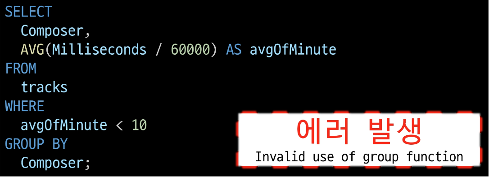

 - 'HAVING' clause
     - 집계 항목에 대한 세부 조건을 지정
     - 주로 GROUP BY와 함께 사용되며 GROUP BY가 없다면 WHERE처럼 동작

```
SELECT
 Composer,
 AVG(Milliseconds / 60000) AS avg0fMinute
FROM
 tracks
GROUP BY
 Composer
HAVING
 avg0fMinute < 10;
```

### SELECT statement 실행 순서
FROM -> WHERE -> GROUP BY -> HAVING -> SELECT -> ORDER BY -> LIMIT
 1. 테이블에서 FROM
 2. 특정 조건에 맞추어 WHERE
 3. 그룹화하고 GROUP BY
 4. 만약 그룹화 조건이 있다면 맞추고 HAVING
 5. 조회하여 SELECT
 6. 정렬하고 ORDER BY
 7. 특정 위치의 값을 가져옴 LIMIT

### Managing Tables
### SQL statements 유형
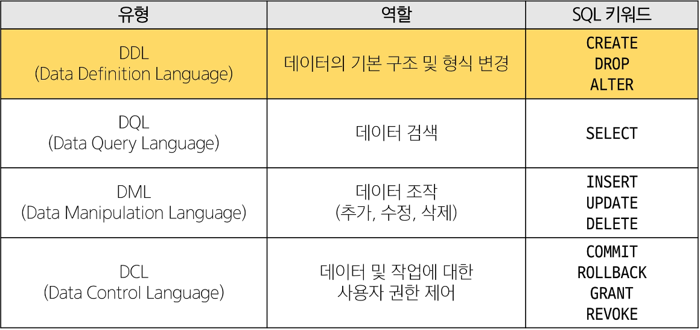

### CREATE TABLE statement
테이블 생성

### CREATE TABLE syntax
```
CREATE TABLE table_name (
    column_1 data_type contraints,
    column_2 data_type contraints,
    ...,
);
```
 - 각 필드에 적용할 데이터 타입 작성
 - 테이블 및 필드에 대한 제약조건(constraints) 작성

### CREATE TABLE 활용
 - examples 테이블 생성 및 확인

```
CREATE TABLE examples(
    ExamId INTEGER PRIMARY KEY AUTOINCREMENT,
    LastName VARCHAR(50) NOT NULL,
    FirstName VARCHAR(50) NOT NULL,
);
```
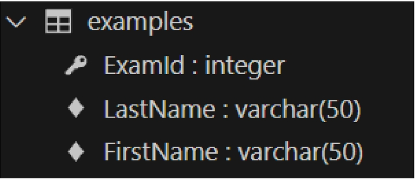

### PRAGMA
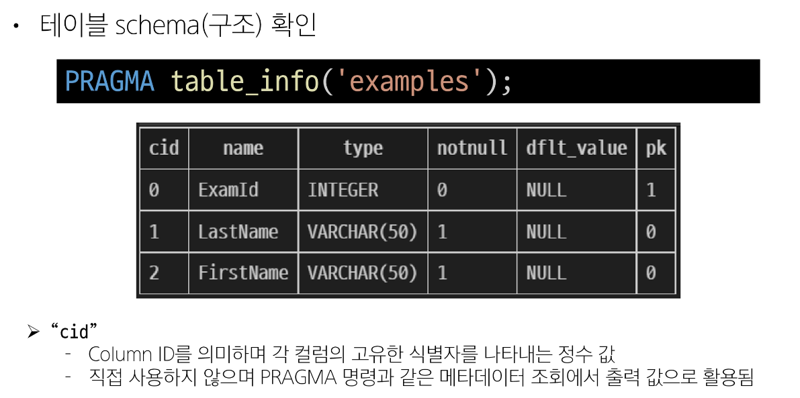

### 데이터 타입


### 제약 조건
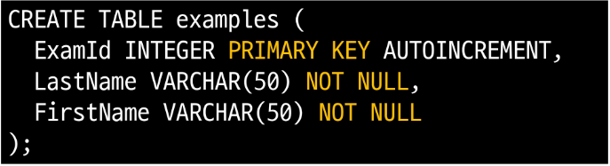

### AUTOINCREMENT 키워드
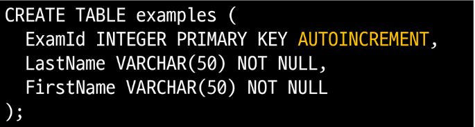

### SQLite 데이터 타입
1. NULL: 아무런 값도 포함하지 않음을 나타냄
2. INTEGER: 정수
3. REAL: 부동 소수점
4. TEXT: 문자열
5. BLOB: 이미지, 동영상, 문서 등의 바이너리 데이터

### Constraints
제약 조건
테이블의 필드에 적용되는 규칙 또는 제한 사항
 - 데이터의 무결성을 유지하고 데이터베이스의 일관성을 보장

### 대표 제약 3가지
 1. PRIMARY KEY
  - 해당 필드를 기본 키로 지정
  - INTEGER 타입에만 적용되며 INT, BIGINT 등과 같은 다른 정수 유형은 적용되지 않음
 2. NOT NULL
  - 해당 필드에 NULL 값을 허용하지 않도록 지정
 3. FOREIGN KEY
  - 다른 테이블과의 외래 키 관계를 정의

### AUTOINCREMENT keyword
자동으로 고유한 정수 값을 생성하고 할당하는 필드 속성

### AUTOINCREMENT 특징
 - 필드의 자동 증가를 나타내는 특수한 키워드
 - 주로 primary key 필드에 적용
 - INTEGER PRIMARY KEY AUTOINCREMENT가 작성된 필드는 항상 새로운 레코드에 대해 이전 최대 값보다 큰 값을 할당
 - 삭제된 값은 무시되며 재사용할 수 없게 됨

## Modifying table fields
### 'ALTER TABLE' statement
테이블 및 필드 조작

### ALTER TABLE 역할
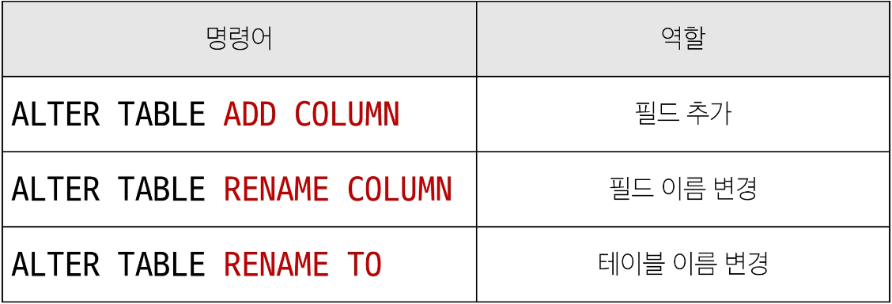

### 1. ALTER TABLE ADD COLUMN syntax
```
ALTER TABLE
 table_name
ADD COLUMN
 column_definition;
```
 - ADD COLUMN 키워드 이후 추가하고자 하는 새 필드 이름과 데이터 타입 및 제약 조건 작성
 - 단, 추가하고자 하는 필드에 NOT NULL 제약조건이 있을 경우 NULL이 아닌 기본 값 설정 필요

### ALTER TABLE ADD COLUMN 활용 1
 - examples 테이블에 다음 조건에 맞는 Country 필드 추가
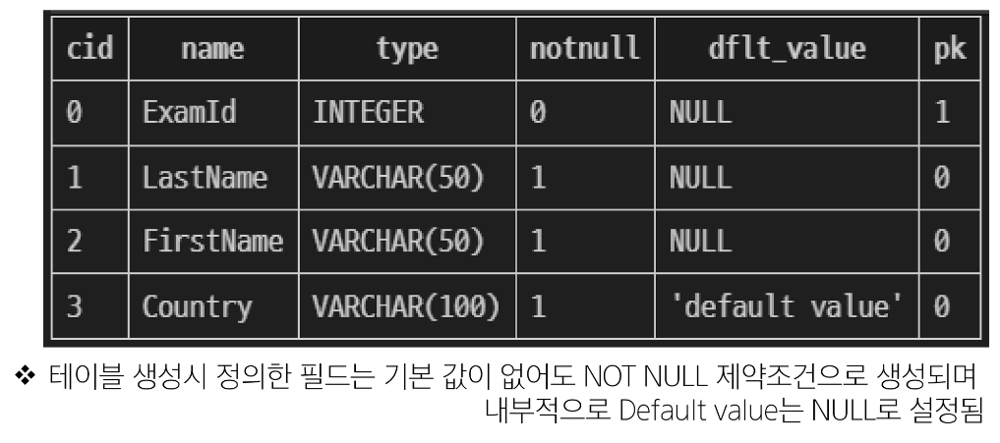


### ALTER TABLE ADD COLUMN 활용 2
 - examples 테이블에 다음 조건에 맞는 Age, Address 필드 추가
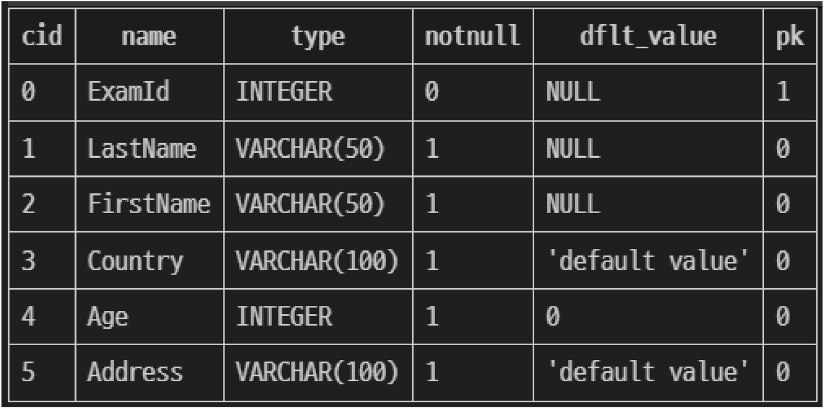
 - SQLite는 단일 문을 사용하여 한 번에 여러 필드를 추가할 수 없음
```
ALTER TABLE examples
ADD COLUMN Age INTEGER NOT NULL DEFAULT 0;

ALTER TABLE examples
ADD COLUMN Address VARCHAR(100) NOT NULL DEFAULT 'default value';
```

### 2. ALTER TABLE RENAME COLUMN syntax
```
ALTER TABLE
 table_name
RENAME COLUMN
 current_name TO new_name
```
 - RENAME COLUMN 키워드 뒤에 이름을 바꾸려는 필드의 이름을 지정하고 TO 키워드 뒤에 새 이름을 지정

### ALTER TABLE RENAME COLUMN 활용 1
 - examples 테이블 Address 필드의 이름을 PostCode로 변경
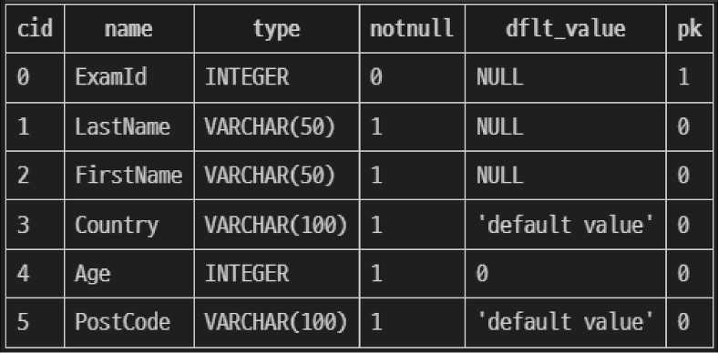

```
ALTER TABLE examples
RENAME COLUMN Address To PostCode;
```

### 3. ALTER TABLE RENAME TO syntax
```
ALTER TABLE
 table_name
RENAME TO
 new_table_name
```
 - RENAME TO 키워드 뒤에 새로운 테이블 이름 지정

### ALTER TABLE RENAME TO 활용 1
 - examples 테이블 이름을 new_examples로 변경
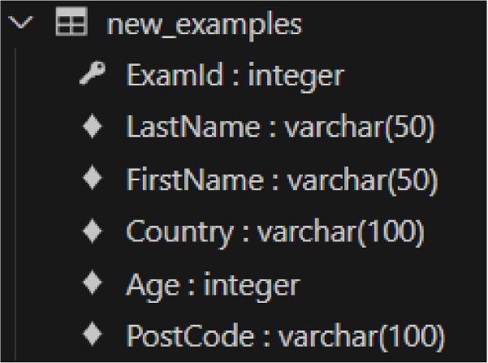
```
ALTER TABLE examples
RENAME TO new_examples;
```

## Delete a table
### 'DROP TABLE' statement
테이블 삭제
### DROP TABLE syntax
```
DROP TABLE table_name;
```
 - DROP TABLE statement 이후 삭제할 테이블 이름 작성

### DROP TABLE 활용
 - new_examples 테이블 삭제
 DROP TABLE new_examples;

## 참고
### 타입 선호도(Type Affinity)
컬럼에 데이터 타입이 명시적으로 지정되지 않았거나 지원하지 않을 때 SQLite가 자동으로 데이터 타입을 추론하는 것


### SQLite 타입 선호도의 목적
 1. 유연한 데이터 타입 지원
     - 데이터 타입을 명시적으로 지정하지 않고도 데이터를 저장하고 조회할 수 있음
     - 컬럼에 저장되는 값의 특성을 기반으로 데이터 타입을 유추
 2. 간편한 데이터 처리
     - INTEGER Type Affinity를 가진 열에 문자열 데이터를 저장해도 SQLite는 자동으로 숫자로 변환하여 처리
 3. SQL 호환성
     - 다른 데이터베이스 시스템과 호환성을 유지

### 반드시 NOT NULL 제약을 사용해야 할까?
 - "NO"
 - 하지만 데이터베이스를 사용하는 프로그램에 따라 NULL을 저장할 필요가 없는 경우가 많으므로 대부분 NOT NULL을 정의
 - "값이 없다."라는 표현을 테이블에 기록하는 것은 "0"이나 "빈 문자열"등을 사용하는 것으로 대체하는 것을 권장

## Modifying Data
### SQL Statements 유형
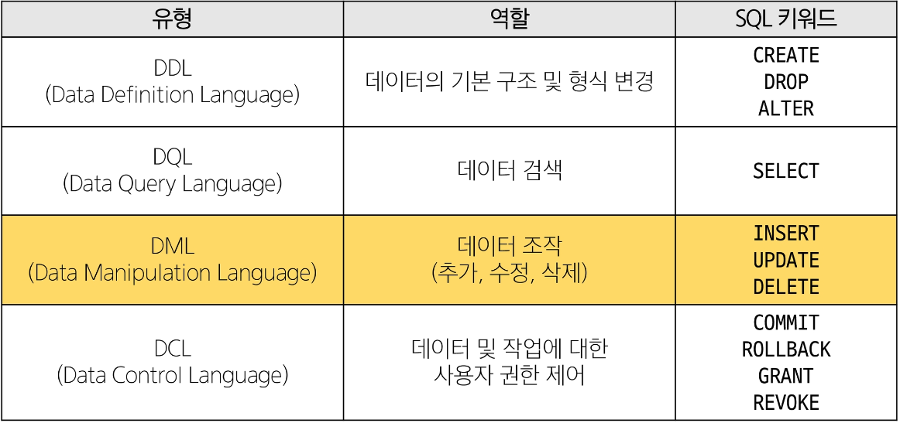

## Insert data
### 사전 준비
 - 실습 테이블 생성

```
CREATE TABLE articles (
    id INTEGER PRIMARY KEY AUTOINCREMENT,
    title VARCHAR(100) NOT NULL,
    content VARCHAR(200) NOT NULL,
    createdAt DATE NOT NULL
);
```

### 'INSERT' statement
테이블 레코드 삽입

### INSERT syntax
```
INSERT INTO table_name (c1, c2, ...)
VALUES (v1, v2 ...);
```
 - INSERT INTO 절 다음에 테이블 이름과 괄호 안에 필드 목록 작성
 - VALUES 키워드 다음 괄호 안에 해당 필드에 삽입할 값 목록 작성

### INSERT 활용 1
 - articles 테이블에 다음과 같은 데이터 입력
 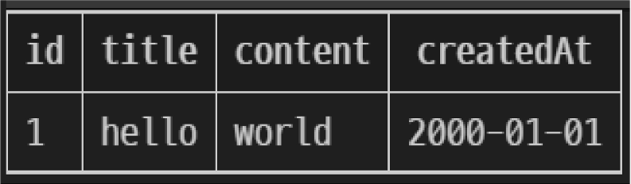

```
INSERT INTO
 articles (title, content, createdAt)
VALUES
 ('hello', 'world', '2000-01-01');
```

### INSERT 활용 2
 - articles 테이블에 다음과 같은 데이터 추가 입력
 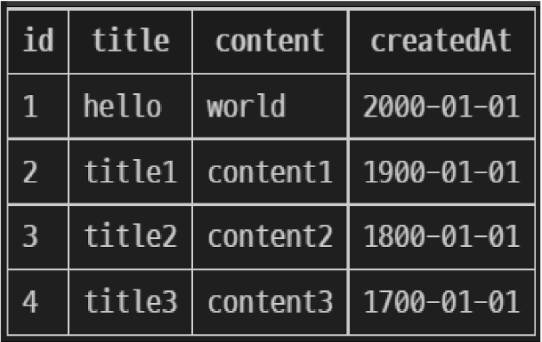

```
INSERT INTO
 artilces(title, content, createdAt)
VALUES
 ('title1', 'content1', '1900-01-01'),
 ('title2', 'content2', '1800-01-01'),
 ('title3', 'content3', '1700-01-01');
```

### INSERT 활용 3
 - DATE 함수를 사용해 articles 테이블에 다음과 같은 데이터 추가 입력
 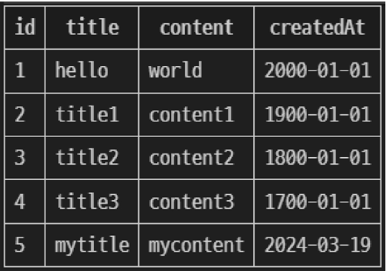

```
INSERT INTO
 articles(title, content, createAt)
VALUES
 ('mytitle', 'mycontent', DATE());
```

## Update data
### 'UPDATE' statement
테이블 레코드 수정
### UPDATE syntax
```
UPDATE table_name
SET column_name = expression,
[WHERE
 condition];
```

SET 절 다음에 수정할 필드와 새 값을 지정
WHERE 절에서 수정할 레코드를 지정하는 조건 작성
WHERE 절을 작성하지 않으면 모든 레코드를 수정

### UPDATE 활용 1
 - articles 테이블 1번 레코드의 title 필드 값을 'update Title'로 변경
 - articles 테이블 1번 레코드의 title 필드 값을 'update Title'로 변경
```
UPDATE
 articles
SET
 title = 'update Title'
WHERE
 id = 1;
```

### UPDATE 활용 2
 - articles 테이블 2번 레코드의 title, content 필드 값을 각각 'update Title', 'update Content'로 변경

 - articles 테이블 2번 레코드의 title, content 필드 값을 각각 'update Title', 'update Content'로 변경

```
UPDATE
 articles
SET
 title = 'update Title'
 content = 'update Content'
WHERE
 id = 2;
```

## DELETE data
### 'DELETE' statement
테이블 레코드 삭제

### DELETE syntax
```
DELETE FROM table_name
[WHERE
 condition];
```

 DELETE FROM 절 다음에 테이블 이름 작성
 WHERE 절에서 삭제할 레코드를 지정하는 조건 작성
 WHERE 절을 작성하지 않으면 모든 레코드를 삭제

### DELETE 활용 1
 - articles 테이블의 1번 레코드 삭제
 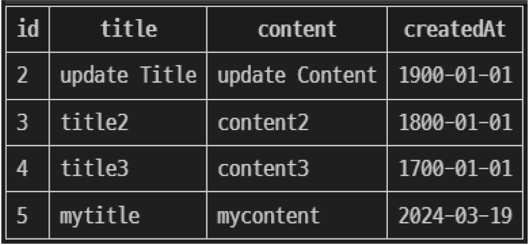

```
DELETE FROM
 articles
WHERE
 id = 1;
```

### DELETE 활용 2
 - articles 테이블에서 작성일이 오래된 순으로 레코드 2개 삭제
 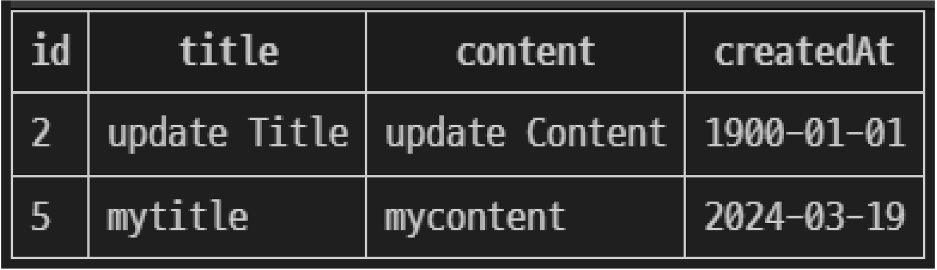

```
DELETE FROM articles
WHERE id = ??;
```
+
```
SELECT id, createdAt
FROM articles
ORDER BY createdAt;
```
 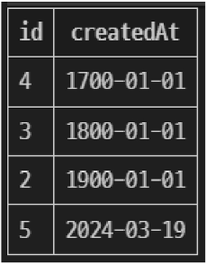

```
DELETE FROM
 articles
WHERE id IN(
 SELECT id FROM articles
 ORDER BY createdAt
 LIMIT 2
)
```

## 참고
### SQLite의 날짜와 시간
 - SQLite에는 날짜 및 / 또는 시간을 저장하기 위한 별도 데이터 타입이 없음
 - 대신 날짜 및 시간에 대한 함수를 사용해 표기 형식에 따라 TEXT, REAL, INTEGER 값으로 저장
 - https://www.sqlite.org/datatype3.html

# Multi table queries
## Join
### 관계
여러 테이블 간의 (논리적) 연결

### 관계의 필요성
 - 커뮤니티 게시판에 필요한 데이터 생각해보기
 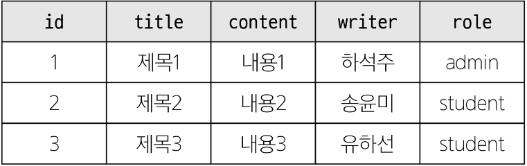

 - '하석주'가 작성한 모든 게시글을 조회하기
 - 어떤 문제점이 있을까?
     - 동명이인이 있다면 혹은 특정 데이터가 수정된다면?

SELECT * FROM 테이블 WHERE writer = '하석주';
 - 테이블을 나누어서 분류하자
 
 - 각 게시글은 누가 작성했는지 알 수 있을까?
 - 작성자들의 역할은 무엇일까?

 - articles와 users 테이블에 각각 userId, roleId 외래 키 필드 작성
 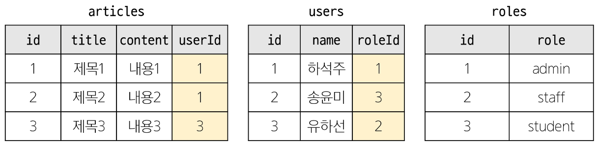
 - 관리자인 사람만 보고싶다면? -> roleId가 1인 데이터 조회
 - 하석주라는 사람이 권미숙으로 개명한다면? -> users에서 한 번만 변경하면 자동으로 모두 변경

### JOIN이 필요한 순간
 - 테이블을 분리하면 데이터 관리는 용이해질 수 있으나 출력 시에는 문제가 있음
 - 테이블 한 개만을 출력할 수밖에 없어 다른 테이블과 겨합하여 출력하는 것이 필요해짐
 - 이 때 사용하는 것이 'JOIN'

## Joining tables
### 'JOIN' clause
둘 이상의 테이블에서 데이터를 검색하는 방법

### JOIN 종류
1. INNER JOIN
2. LEFT JOIN

### 사전 준비
users 및 articles 테이블 생성
```
CREATE TABLE users(
    id INTEGER PRIMARY KEY AUTOINCREMENT,
    name VARCHAR(50) NOT NULL
);
```

```
CREATE TABLE articles(
    id INTEGER PRIMARY KEY AUTOINCREMENT,
    title VARCHAR(50) NOT NULL,
    content VARCHAR(100) NOT NULL,
    userId INTEGER NOT NULL,
    FOREIGN KEY (userId)
    REFERENCES user(id)
);
```

각 테이블에 실습 데이터 입력
```
INSERT INTO
 users (name)
VALUES
 ('하석주'),
 ('송윤미'),
 ('유하선');
INSERT INTO
 articles (title, content, userId)
VALUES
 ('제목1', '내용1', 1),
 ('제목2', '내용2', 2),
 ('제목3', '내용3', 1),
 ('제목4', '내용4', 4),
 ('제목5', '내용5', 1);
```
 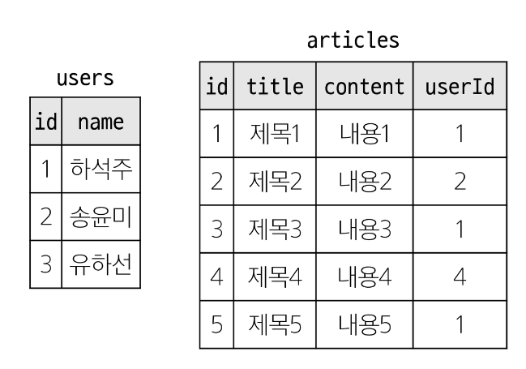

### 'INNER JOIN' clause
두 테이블에서 값이 일치하는 레코드에 대해서만 결과를 반환

### INNER JOIN syntax
SELECT
 select_list
FROM
 table_a
INNER JOIN table_b
 ON table_b.fk = table_a.pk;

 - FROM 절 이후 메인 테이블 지정(table_a)
 - INNER JOIN 절 이후 메인 테이블과 조인할 테이블을 지정(table_b)
 - ON 키워드 이후 조인 조건을 작성
 - 조인 조건은 table_a와 table_b 간의 레코드를 일치시키는 규칙을 지정

### INNER JOIN 예시
 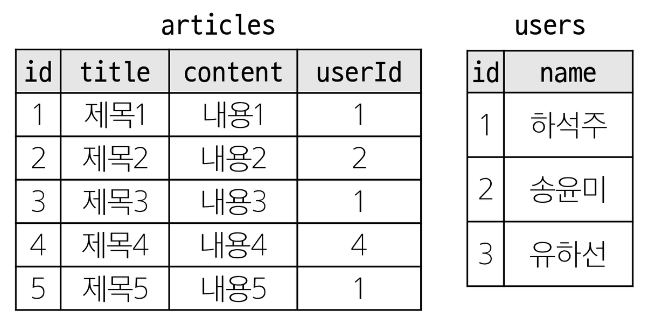
작성자가 있는 (존재하는 회원) 모든 게시글을 작성자 정보와 함께 조회
 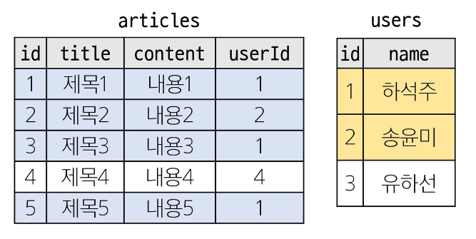
 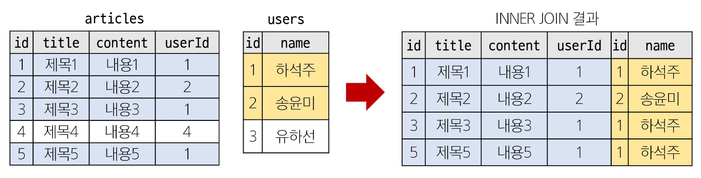

```
SELECT * FROM articles
INNER JOIN users
 ON users.id = articles.userId;
```

### INNER JOIN 활용 1
 - 1번 회원(하석주)가 작성한 모든 게시글의 제목과 작성자명을 조회
 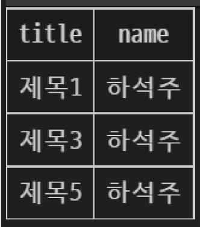

```
SELECT articles.title, users.name
FROM articles
INNER JOIN users
 ON users.id = articles.userId
WHERE users.id = 1;
```

### 'LEFT JOIN' clause
오른쪽 테이블의 일치하는 레코드와 함께 왼쪽 테이블의 모든 레코드 반환

### LEFT JOIN syntax
```
SELECT
 select_list
FROM
 table_a
LEFT JOIN table_b
 ON table_b .kf = table_a.pk;
```
 - FROM절 이후 왼쪽 테이블 지정(table_a)
 - LEFT JOIN 절 이후 오른쪽 테이블 지정(table_b)
 - ON 키워드 이후 조인 조건을 작성
     - 왼쪽 테이블의 각 레코드를 오른쪽 테이블의 모든 레코드와 일치시킴

### LEFT JOIN 예시
 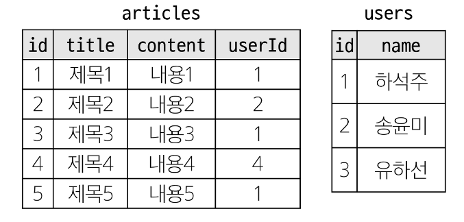
     - 모든 게시글을 작성자 정보와 함께 조회
 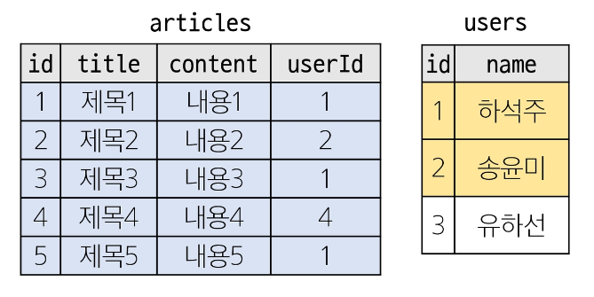
 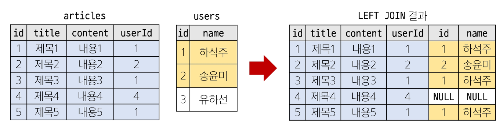

```
SELECT * FROM articles
LEFT JOIN users
 ON users.id = articles.userId;
```

### LEFT JOIN 특징
 - 왼쪽 테입즐의 모든 레코드를 표기
 - 오른쪽 테이블과 매칭되는 레코드가 없으면 NULL을 표시

### LEFT JOIN 활용 1
 - 게시글을 작성한 이력이 없는 회원 정보 조회
 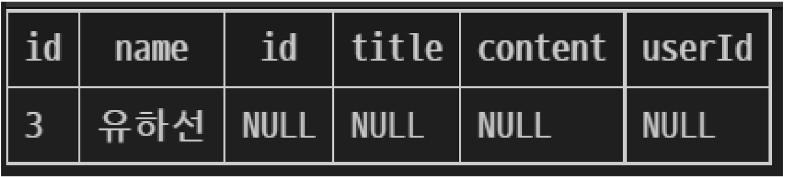

```
SELECT *
FROM users
LEFT JOIN articles
 ON articles.userId = user.id
WHERE articles.userId IS NULL;
```