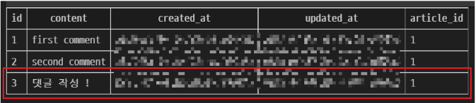

# 240403

## Many to one relationships
N:1 or 1:N
한 테이블의 0개 이상의 레코드가 다른 테이블의 레코드 한 개와 관련된 관계

### Comment - Article
0개 이상의 댓글은 1개의 게시글에 작성될 수 있다.

### Comment(N) - Article(1)
0개 이상의 댓글은 1개의 게시글에 작성될 수 있다.

### 테이블 관계
 
외래 키는 어디로 들어가야 하는가?
N대 1 관계에서는 N에 외래 키가 붙어야 한다.
즉, Comment에 Article에 대한 외래 키가 붙어야 한다.

## 댓글 모델
### ForeignKey()
N:1 관계 설정 모델 필드

### 댓글 모델 정의
 - ForeignKey 클래스의 인스턴스 이름은 참조하는 모델 클래스 이름의 '단수형'으로 작성하는 것을 권장

 - 외래 키는 ForeignKEY 클래스를 작성하는 위치와 관계없이 테이블 필드 마지막에 생성됨

```
# articles/models.py

class Comment(models.Model):
    article = models.ForeignKey(Article, on_delete = models.CASCADE)
    content = models.CharField(max_length=200)
    created_at = models.DateTimeField(auto_now_add = True)
    updated_at = models. DateTimeField(auto_now = True)
```

### ForeignKey('to', on_delete)
참조하는 모델 class 이름

### ForeignKey(to, 'on_delete')
외래 키가 참조하는 객체(1)이 사라졌을 때, 외래 키를 가진 객체(N)를 어떻게 처리할 지를 정의하는 설정
(데이터 무결성)

### on_delete의 'CASCADE'
 - 부모 객체(참조된 객체)가 삭제됐을 때 이를 참조하는 객체도 삭제
 - 기타 설정 값 참고
     - https://docs.djangoproject.com/en/4.2/ref/models/fields/#arguments

### Migration 이후 댓글 테이블 확인
 - 댓글 테이블의 article_id 필드 확인
 - 참조 대상 클래스 이름 + '_' + 클래스 이름
     - 참조하는 클래스 이름의 소문자(단수형)로 작성하는 것이 권장되었던 이유

### 댓글 생성 연습
shell_plus 실행 및 게시글 작성

```
$ python manage.py shell_plus

# 게시글 생성
Article.objects.create(title = 'title', content = 'content')
```

댓글 생성
 

shell_plus 실행 및 게시글 작성
 

comment 인스턴스를 통한 article 값 참조하기
 
 

두 번째 댓글 생성
 
작성된 댓글 데이터 확인
 

## 관계 모델 참조
### 역참조
N:1 관계에서 1에서 N을 참조하거나 조회하는 것
1 -> N

 - N은 외래 키를 가지고 있어 물리적으로 참조가 가능하지만 1은 N에 대한 참조 방법이 존재하지 않아 별도의 역참조 기능이 필요

### 역참조 사용 예시
article.'comment_set'.all()
모델 인스턴스 / 'related manager(역참조 이름)' / QuerySet API

 - 특정 게시글에 작성된 댓글 전체를 조회하는 명령
 - <QuerySet [<Comment: Comment object (1)>, <Comment: Comment object (2)>]> 이런 식으로 나온다.

### related manager
N:1 혹은 M:N 관계에서 역참조 시에 사용하는 매니저
 - 'objects' 매니절르 통해 QuerySet API를 사용했던 것처럼 related manager를 통해 QuerySet API를 사용할 수 있게 됨

### related manager 이름 규칙
 - N:1 관계에서 생성되는 Related manager의 이름은 참조하는 '모델명_set'이름 규칙으로 만들어짐

 - 특정 댓글의 게시글 참조(Comment -> Article)
     - comment.article
 - 특정 게시글의 댓글 목록 참조(Article -> Comment)
     - article.comment_set.all()

### related manager 연습
 - shell_plus 실행 및 1번 게시글 조회
```
$ python manage.py shell_plus

article = Article.objects.get(pk=1)
```

1번 게시글에 작성된 모든 댓글 조회하기(역참조)
```
>>> article.comment_set.all()
<QuerySet [<Comment: Comment object (1)>]>,
<Comment: Comment object (2)>
```

1번 게시글에 작성된 모든 댓글의 내용 출력
```
comments = article.comment_set.all()

for comment in comments:
    print(comment.content)

# 결과 
# first comment
# second comment
```

## 댓글 구현
### 댓글 CREATE 구현
 - 사용자로부터 댓글 데이터를 입력받기 위한 CommentForm 정의
 

 - detail view 함수에서 CommentForm을 사용하여 detail 페이지에 렌더링
 

 - Comment 클래스의 외래 키 필드 article 또한 데이터 입력이 필요한 필드이기 때문에 출력되고 있는 것
 - 하지만 외래 키 필드 데이터는 사용자로부터 입력받는 값이 아닌 view 함수 내에서 다른 방법으로 전달받아 저장되어야 함
 

 - CommentForm의 출력 필드 조정하여 외래 키 필드가 출력되지 않도록 함
 

 - 출력에서 제회된 외래 키 데이터는 어디서 받아와야 할까?
 - detail 페이지의 URL을 살펴보면 path('<ink:pk>/'m views.detail, name = 'detail')에서 해당 게시글의 pk 값이 사용되고 있음
 - 댓글의 외래 키 데이터에 필요한 정보가 바로 게시글의 pk 값

 - url 작성 및 action 작성
 

 - comments_create view 함수 정의
     - url에서 넘겨받은 pk인자를 게시글을 조회하는 데 사용
 

 - if context에 article을 쓰지 않아 rendering 하지 않는다면?
    NoReverseMatch 오류가 뜬다.
    why? detail.html에 article.pk와 같이 article 정보를 받고 있으므로
    NoReverseMatch - 현재 페이지의 url 태그만 보면 된다.

 - article 객체는 어떻게/언제 저장할 수 있을까?
 

### save(commit=False)
DB에 저장하지 않고 인스턴스만 반환
(Create, but don't save the new instance)

 - save의 commit 인자를 활용해 외래 키 데이터 추가 입력
 

 - 댓글 작성 후 테이블 확인
 

## READ
### 댓글 READ 구현
 - detail view 함수에서 전체 댓글 데이터를 조회
 

 - 전체 댓글 출력 및 확인
 

## DELETE
### 댓글 DELETE 구현
 - 댓글 삭제 url 작성
 

 - 댓글 삭제 view 함수 정의
 

 - 댓글 삭제 버튼 작성
 

 - 댓글 삭제 버튼 출력 확인 및 삭제 테스트
 

## 참고
### admin stie 등록
 - Comment 모델을 admin site에 등록해 CRUD 동작 확인하기

### 댓글이 없는 경우 대체 콘텐츠 출력
 - DTL의 'for empty' 태그 활용
 

### 댓글 개수 출력하기
 - DTL filter -'length' 사용
 - QuerySet API - 'count()' 사용
 
