# Many_to_one_relationship_2

## User와 다른 모델 간의 모델 관계 설정
 1. User & Article (1 : N) -> 외래 키는 N에 작성하게 된다
 2. User & comment (1 : N)

### Article(N) - User(1)
0개 이상의 게시글은 1명의 회원에 의해 작성될 수 있다.

### Comment(N) - User(1)
0개 이상의 댓글은 1명의 회원에 의해 작성될 수 있다.

## Article & User
### Article - User 모델 관계 설정
 - user 외래 키 정의
 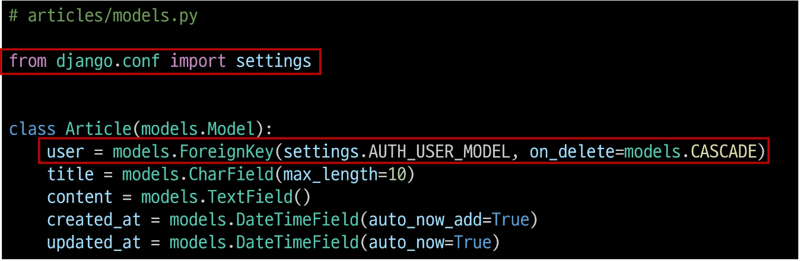

### User 모델을 참조하는 2가지 방법
 1. get_user_model()
 2. settings.AUTH_USER_MODEL

 - django 프로젝트 '내부적인 구동 순서'와 '반환 값'에 따른 이유
     - 기억할 것은 User 모델은 직접 참조하지 않는다는 것
 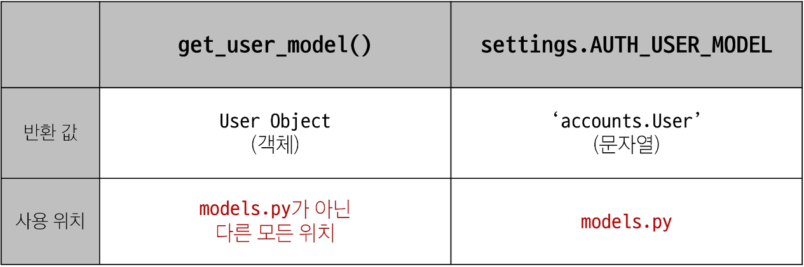
 - models.py에 변경이 있었으므로 migration 다시 해야함

### Migration
 - 기존에 테이블이 있는 상황에서 필드를 추가하려 하기 때문에 발생하는 과정
 - 기본적으로 모든 필드에는 NOT NULL 제약조건이 있기 때문에 데이터가 없이는 새로운 필드가 추가되지 못함
 - '1'을 입력하고 Enter 진행(다음 화면에서 직접 기본 값 입력)

 - 추가하는 외래 키 필드에 어떤 데이터를 넣을 것인지 직접 입력해야 함
 - 마찬가지로 '1'을 입력하고 Enter 진행
 - 기존에 작성된 게시글이 있다면 모두 1번 회원이 작성한 것으로 처리됨
 - migrations 파일 생성 후 migrate 진행

 - articles_article 테이블에 user_id 필드 생성 확인

### 게시글 CREATE
 - 기존 ArticleForm 출력 변화 확인
 - User 모델에 대한 외래 키 데이터 입력을 받기 위해 불필요한 input이 출력
 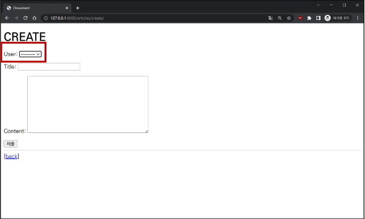

 - ArticleForm 출력 필드 수정
 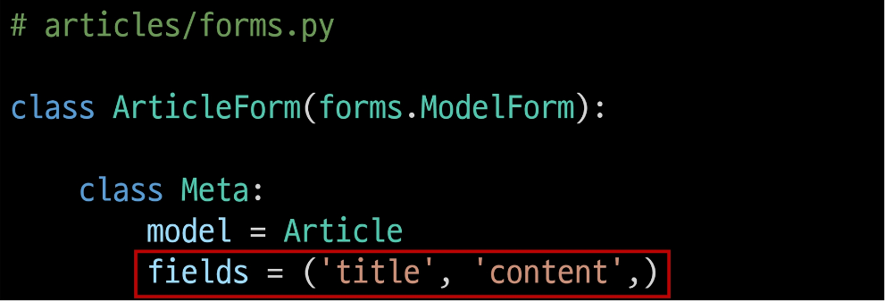

 - 게시글 작성 시 에러 발생
 - user_id 필드 데이터가 누락되었기 때문
 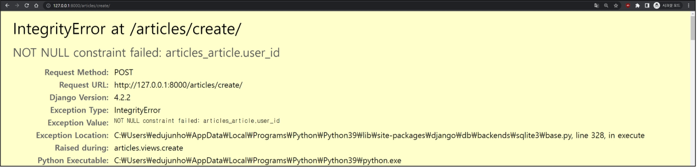

 - 게시글 작성 시 작성자 정보와 함께 저장될 수 있도록 save의 commit 옵션 활용
 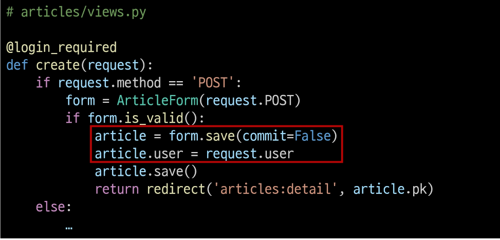

 - 게시글 작성 후 테이블 확인
 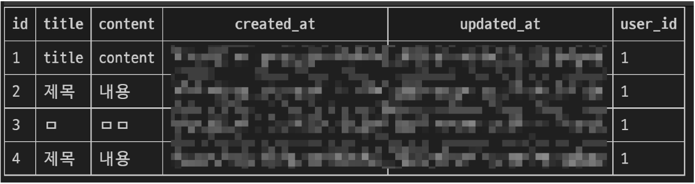

### 게시글 READ
 - 각 게시글의 작성자 이름 출력
 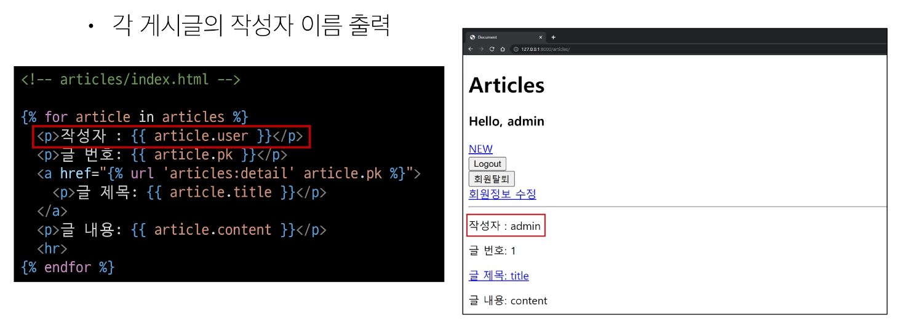
 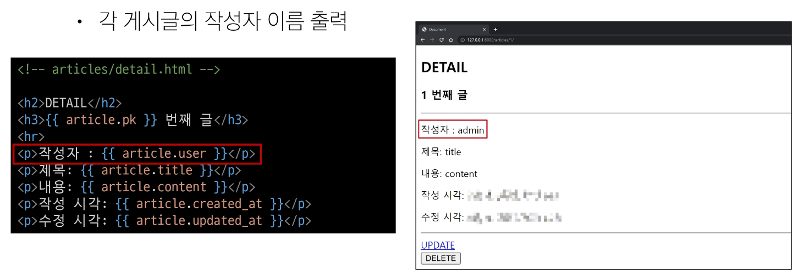

### 게시글 UPDATE
 - 본인의 게시글만 수정할 수 있도록 하기
     - 게시글 수정 요청 사용자와 게시글 작성 사용자를 비교
 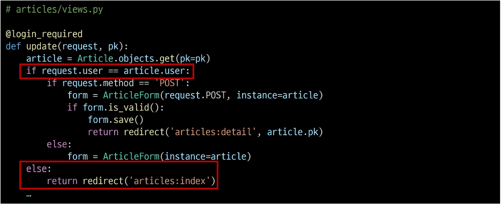

 - 해당 게시글의 작성자가 아니라면, 수정/삭제 버튼을 출력하지 않도록 하기
 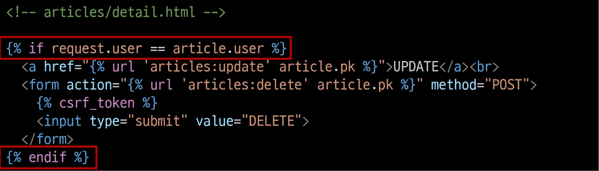

### 게시글 DELETE
 - 본인의 게시글만 삭제할 수 있도록 하기
     - 삭제를 요청하려는 사용자와 게시글을 작성한 사용자를 비교
 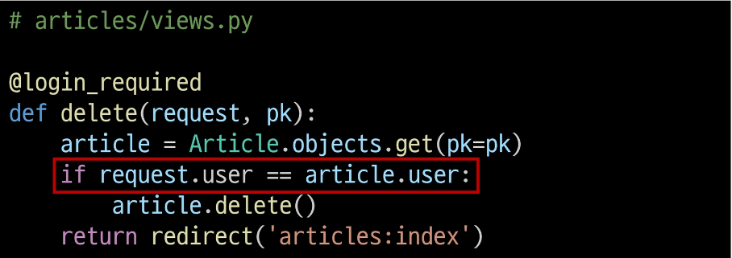

## Comment & User
### Comment - User 모델 관계 설정
 - user 외래 키 정의
 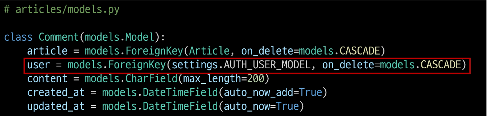

### Migration
 - 이전에 Article와 User 모델 관계 설정 때와 동일한 상황
 - 기존 Comment 테이블에 새로운 필드가 빈 값으로 추가될 수 없기 때문에 기본 값 설정 과정이 필요
 

 - Migration 후 comment 테이블에 생성된 user_id 필드 확인
 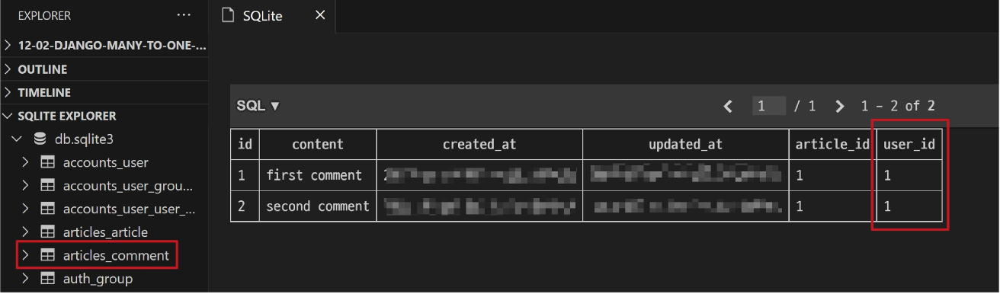

### 댓글 CREATE
 - 댓글 작성 시 이전에 게시글 작성할 때와 동일한 에러 발생
 - 댓글의 user_id 필드 데이터가 누락되었기 때문
 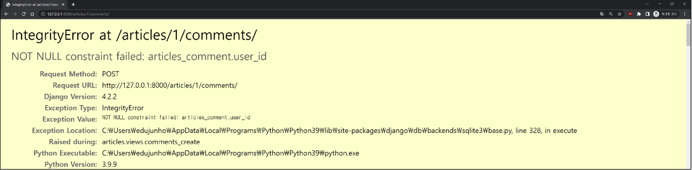

 - 댓글 작성 시 작성자 정보가 함께 저장할 수 있도록 작성

 - 댓글 작성 후 테이블 확인
 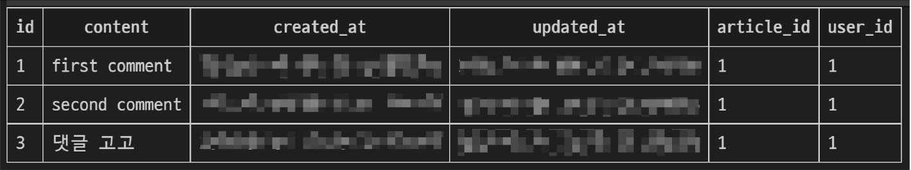

### 댓글 READ
 - 댓글 출력 시 댓글 작성자와 함께 출력
 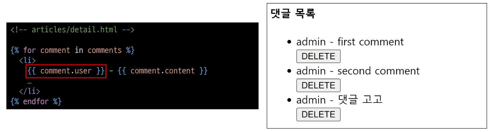

### 댓글 DELETE
 - 본인의 댓글만 삭제할 수 있도록 하기
     - 댓글 삭제 요청 사용자와 댓글 작성 사용자를 비교
 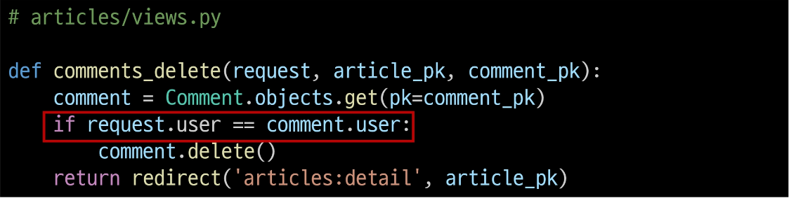

 - 해당 댓글의 작성자가 아니라면, 댓글 삭제 버튼을 출력하지 않도록 함
 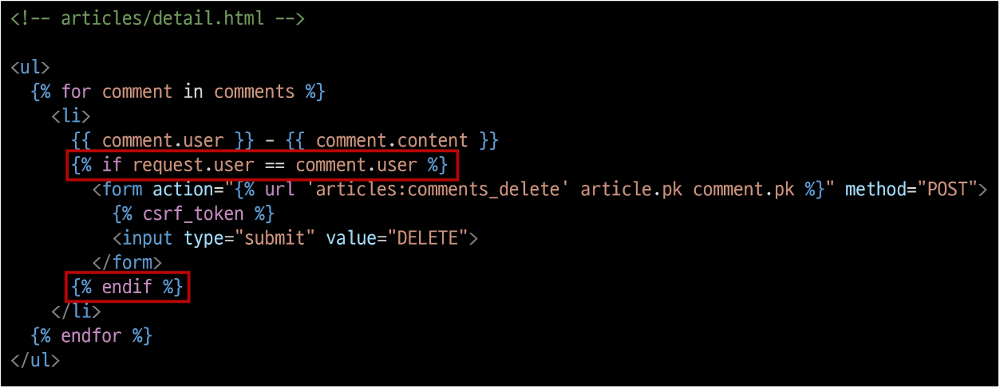

## 참고
### 인증된 사용자만 댓글 작성 및 삭제
 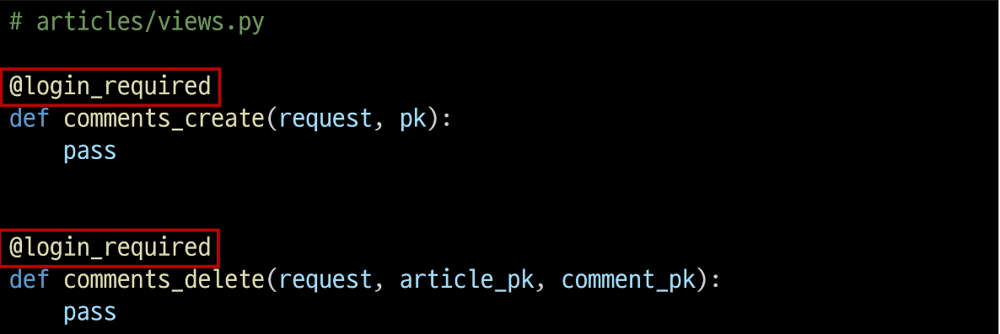

