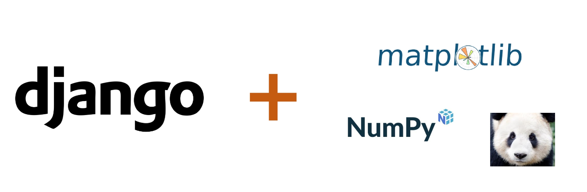
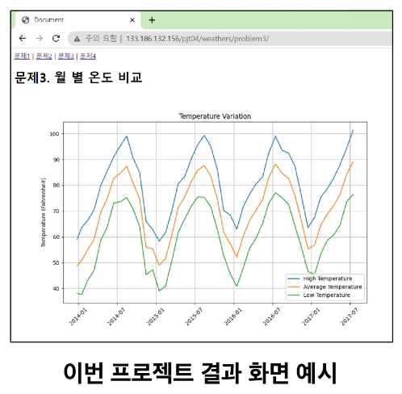
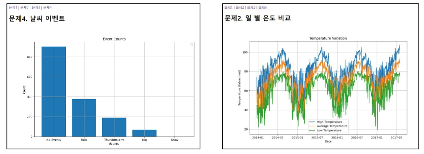
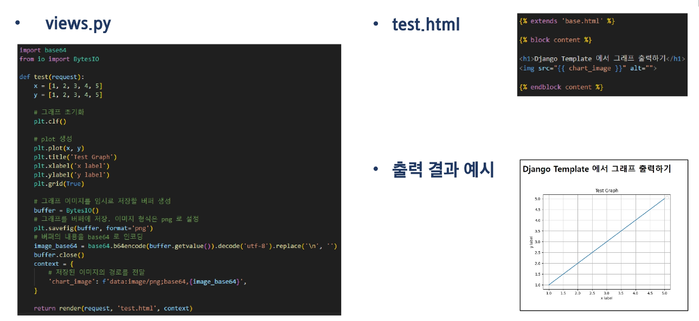

# 04 PJT
## Django에서 Data Science 활용하기
### 목표
 - Django에서 데이터 사이언스 패키지 사용하기
 

### 이전 데이터 사이언스 프로젝트와의 차이점
 - 이전 프로젝트
     - Matplotlib, Pandas, Numpy를 주피터 노트북에서 구동함
 - 이번 프로젝트 실습
     - Matplotlib, Pandas, Numpy를 Django에서 구동함

### Django에서 데이터 사이언스 패키지를 사용하는 이유
 - 결과를 웹 페이지에서 보여주기 위함
 

### Django에서 데이터 사이언스 패키지를 사용하기 위해 알아야할 내용
 - 데이터 사이언스 3종 패키지 사용 방법
 - Django 기본 사용 방법
     - 웹 페이지 구성(template)
     - 데이터 전달(View -> Template)
 - 파이썬 BytesIO 패키지(곧, 학습 예정)

### 프로젝트 목표 3가지
 1. Numpy, Pandas, Matplotlib 복습
 2. Django Web Framework 복습
 3. Django로 데이터 사이언스 패키지 활용 방법 학습
 

### 학습 순서
 1. 강사와 함께 Pandas와 Matplotlib를 Django에서 구현해본다.
 2. 도전 과제 진행

### 준비 사항
 - 개발 도구
     - Visual Studio Code
     - Google Chrome
     - Python 3.9+

### 필수 라이브러리
 - 가상환경을 설정하여 아래 라이브러리 설치 후 요구사항을 구현합니다.
     - Django 4.2+
     - Pandas
     - Numpy
     - Matplotlib

### View에서 Template으로 이미지 전달하기
 - View에서 Template으로 이미지 형식의 데이터를 직접 전달할 수 없습니다.
 - 저장된 이미지의 경로를 전달하여 Template에서 출력해야 합니다.
 - matplotlib의 그래프를 버퍼에 이미지 형식으로 저장 후 저장된 경로를 전달합니다.
     - 버퍼(buffer): 임시로 데이터를 저장하는 공간
 - Python "BytesIO" 클래스
     - 파이썬의 내장 모듈인 "io" 모듈에 포함된 클래스
     - 메모리 내에 데이터를 저장 및 조작할 수 있는 기능 제공
 

### 관통 Ver1
 - 프로젝트명: Django에서 Data science 활용하기
 - 목표
     - 데이터 사이언스 패키지를 Django에서 활용하는 방법 익히기
 - 특징
     - 웹 페이지에서 결과를 확인할 수 있다.
     - 캐글에서 데이터 다운로드
    
### 관통 Ver2
 - Django Authentication System 이해하기
     - 공식 문서 살펴보기
     - Django 오픈 소스 분석

 - 커뮤니티 웹 서비스의 데이터 구성 및 인증 시스템 구성
 - 특징
     - 영화 데이터 CRUD가 가능한 애플리케이션 완성
     - 로그인, 로그아웃 등 회원 관리 기능 구현