# Many to many relationships

## Many to many relationships
한 테이블의 0개 이상의 레코드가 다른 테이블의 0개 이상의 레코드와 관련된 경우
 - 양쪽 모두에서 n:1 관계를 가짐

### M:N 관계의 역할과 필요성 이해하기
 - '병원 진료 시스템 모델 관계'를 만들며 M:N 관계의 역할과 필요성 이해하기
 - 환자와 의사 2개의 모델을 사용하여 모델 구조 구상하기

 - 제공된'99-mtm-practice'프로젝트를 기반으로 진행

## N:1의 한계
### 의사와 환자 간 모델 관계 설정
 - 한 명이 의사에게 여러 환자가 예약할 수 있도록 설계

 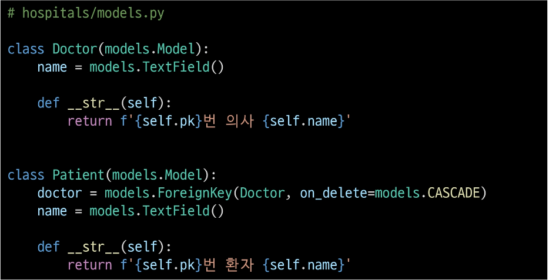

### 의사와 환자 데이터 생성
 

### N:1의 한계 상황
 - 1번 환자(carol)가 두 의사 모두에게 진료를 받고자 한다면 환자 테이블에 1번 환자 데이터가 중복으로 입력될 수밖에 없음

 - 동시에 예약을 남길 수 없을까?
 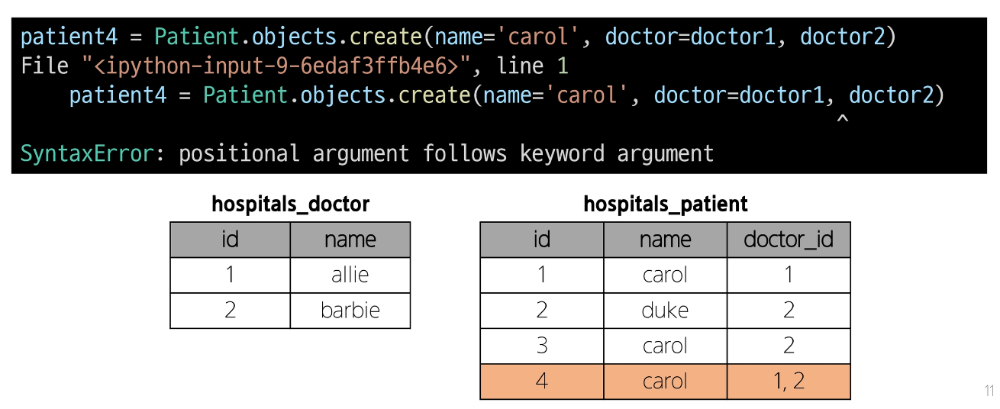

 - 동일한 환자지만 다른 의사에게도 진료받기 위해 예약하기 위해서는 객체를 하나 더 만들어 진행해야 함
 - 외래 키 컬럼에 '1, 2'형태로 저장하는 것은 DB 타입 문제로 불가능

 - 예약 테이블을 따로 만들자.

## 중개 모델
### 1. 예약 모델 생성
 - 환자 모델 외래 키를 삭제하고 별도의 예약 모델을 새로 생성
 - 예약 모델은 의사와 환자에 각각 N:1 관계를 가짐
 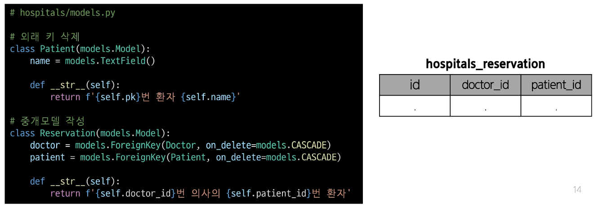

### 2. 예약 데이터 생성
 - 데이터베이스 초기화 후 Migration 진행 및 shell_plus 실행\
 - 의사와 환자 생성 후 예약 만들기
 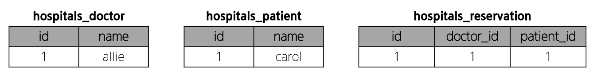

### 3. 예약 정보 조회
 - 의사와 환자가 예약 모델을 통해 각각 본인의 진료 내역 확인
 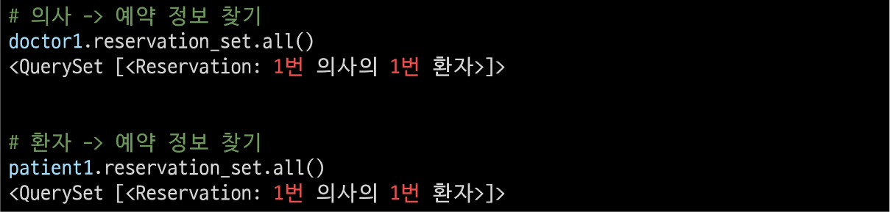
 - 의사 쪽에서도, 환자 쪽에서도 모두 역참조
     - 둘 다 Reservation의 외래 키를 찾기 때문에

### 4. 추가 예약 생성
 - 1번 의사에게 새로운 환자 예약 생성
 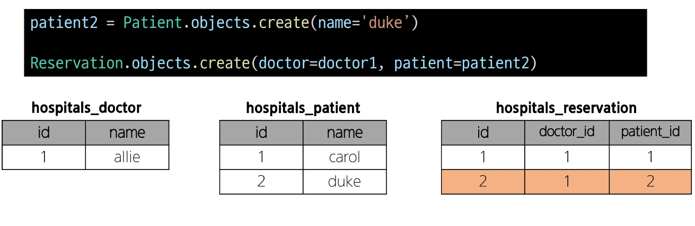

### 5. 예약 정보 조회
 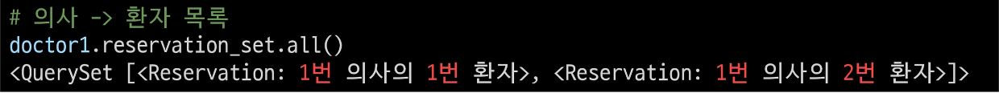

### Django에서는 'ManyToManyField'로 중개모델을 자동으로 생성

## ManyToManyField()
 - M:N 관계 설정 모델 필드

### Django ManyToManyField
 - 환자 모델에 ManyToManyField 작성
     - 의사 모델에 작성해도 상관 없으며 참조/역참조 관계만 잘 기억할 것
     - 어디에 작성하느냐에 따라 참조/역참조 관계만 바뀔 뿐
    
 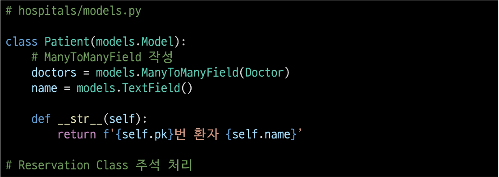

 - 데이터베이스 초기화 후 Migration 진행 및 shell_plus 실행
 - 생성된 중개 테이블 hopstials_patient_doctors 확인
 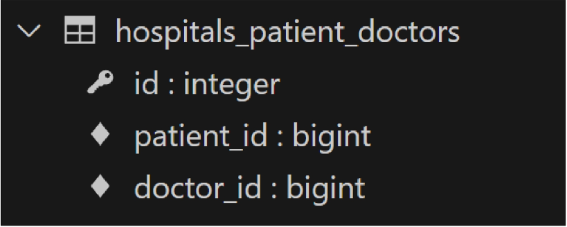

 - 의사 1명과 환자 2명 생성
 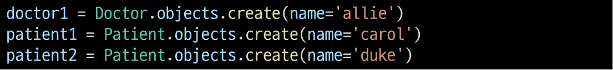

 - 예약 생성(환자가 예약)
 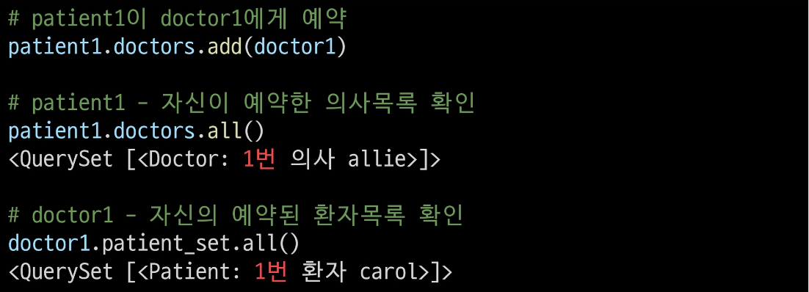

 - 예약 생성(의사가 예약)
 

 - 중개 테이블에서 예약 현황 확인
 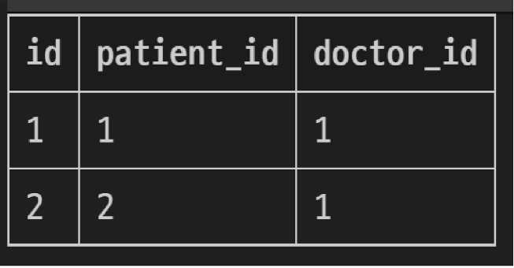

 - 예약 취소하기(삭제)
 - 이전에는 Reservation을 찾아서 지워야 했다면 이제는 .remove()로 삭제 가능
 

### 만약 예약 정보에 병의 증상, 예약일 등 추가 정보가 포함되어야 한다면?

## 'through' argument
 - 중개 테이블에 '추가 데이터'를 사용해 M:N 관계를 형성하려는 경우에 사용

### 'through' argument
 - Reservation Class 재작성 및 through 설정
     - 이제는 예약 정보에 "증상"과 "예약일"이라는 추가 데이터가 생김
 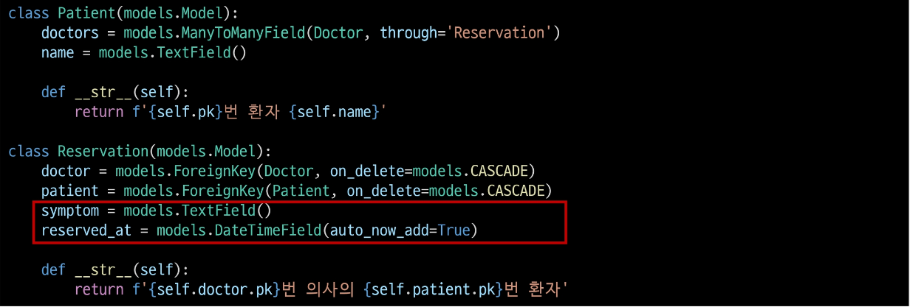

 - 데이터베이스 초기화 후 Migration 진행 및 Shell_plus 실행
 - 의사 1명과 환자 2명 생성
 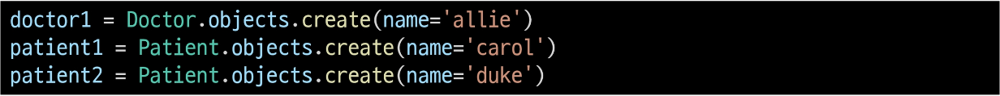

 - 예약 생성 방법 - 1
     - Reservation class를 통한 예약 생성

 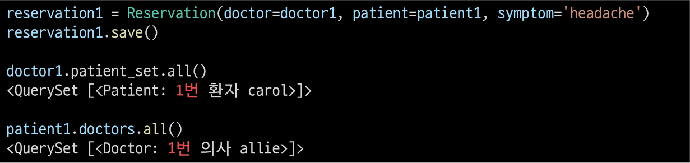

 - 예약 생성 방법 - 2
     - Patient 또는 Doctor의 인스턴스를 통한 예약 생성(through_defaults)
 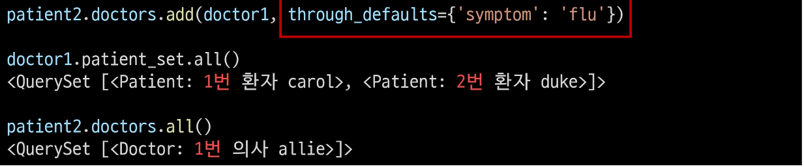

 - 생성된 예약 확인
 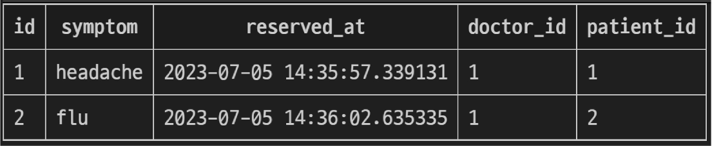

 - 생성과 마찬가지로 의사와 환자 모두 각각 예약 삭제 가능
 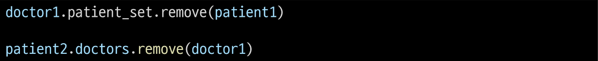

 - cf) 
    doctors = models.ManyToManyField(Doctor, related_name='patients', through='Reservation')
    related_name='patients'
    related_name을 붙일 경우 둘 다 역참조처럼 쓸 수 있음

### M:N 관계 주요 사항
 - M:N 관계로 맺어진 두 테이블에는 물리적인 변화가 없음
 - ManyToManyField는 중개 테이블을 자동으로 생성
 - ManyToManyField는 M:N 관계를 맺는 두 모델 어디에 위치해도 상관 없음
     - 대신 필드 작성 위치에 따라 참조와 역참조 방향을 주의할 것
 - N:1은 완전한 종속의 관계였지만 M:N은 종속적인 관계가 아니며, '의사에게 진찰받는 환자 & 환자를 진찰하는 의사' 이렇게 2가지 형태 모두 표현 가능

## ManyToManyField(to, **options)
 - M:N 관계 설정 시 사용하는 모델 필드

### ManyToManyField의 대표 인자 3가지
 1. related_name
 2. symmertrical
 3. through

### 1. related_name arguments
 - 역참조 시 사용하는 manager name을 변경
 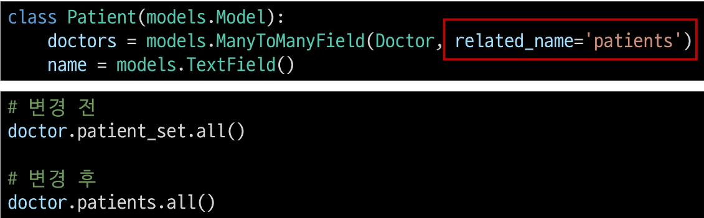

### 2. 'symmetrical' arguments
 - 관계 설정 시 대칭 유무 설정
 - ManyToManyField가 동일한 모델을 가리키는 정의에서만 사용
 - 기본 값: True
 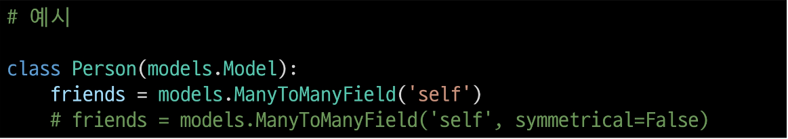

 - True일 경우
     - Source 모델의 인스턴스가 target 모델의 인스턴스를 참조하면 자동으로 target 모델 인스턴스도 source 모델 인스턴스를 자동으로 참조하도록 함(대칭)
     - 즉, 내가 당신의 친구라면 자동으로 당신도 내 친구가 됨
    
 - False일 경우
     - True와 반대(대칭되지 않음)
 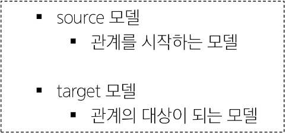

### 3. 'through' arguments
 - 사용하고자 하는 중개모델을 지정
 - 일반적으로 추가 데이터를 M:N 관계와 연결하려는 경우에 활용
 

### M:N에서의 대표 methods
 - add()
     - 지정된 객체를 관련 객체 집합에 추가
     (이미 존재하는 관계에 사용하면 관계가 복제되지 않음)
 - remove()
     - 관련 객체 집합에서 지정된 모델 객체를 제거

## 좋아요 기능 구현
### Article(M) - User(N)
 0개 이상의 게시글은 0명 이상의 회원과 관련

 - 게시글은 회원으로부터 0개 이상의 좋아요를 받을 수 있고, 회원은 0개 이상의 게시글에 좋아요를 누를 수 있음

### 모델 관계 설정
 - Article 클래스에 ManyToManyField 작성
 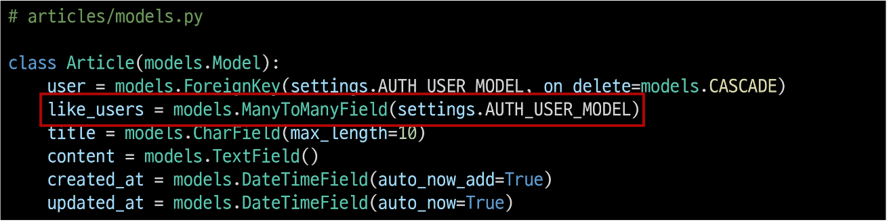

 - Migration 진행 후 에러 발생
 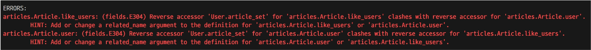
 - like_users와 user이 충돌 발생

### 역참조 매니저 충돌
 - N:1
     - 유저가 작성한 게시글
     - user.article_set.all()

 - M:N
     - 유저가 좋아요 한 게시글
     - user.article_set.all()

 - like_users 필드 생성 시 자동으로 역참조 매니저 .article_set가 생성됨
 - 그러나 이전 N:1 (Article-User) 관계에서 이미 같은 이름의 매니저를 사용 중
     - user.article.set.all() -> 해당 유저가 작성한 모든 게시글 조회
 - 'user'가 작성한 글(user.article_set)과 'user'가 좋아요를 누른 글(user.article_set)'을 구분할 수 없게 됨
 - user와 관계된 ForeignKey 혹은 ManyToManyField 둘 중 하나에 related_name 작성 필요

### 모델 관계 설정
 - related_name 작성 후 Migration 재진행
 - 겹치는 경우 보통 M:N에서 바꿔준다. => user.like_articles
 - user.article_set 자체가 N:1에서의 역참조를 의미함
 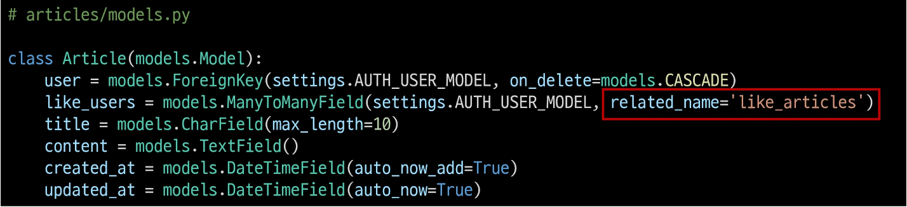

 - 생성된 중계 테이블 확인
 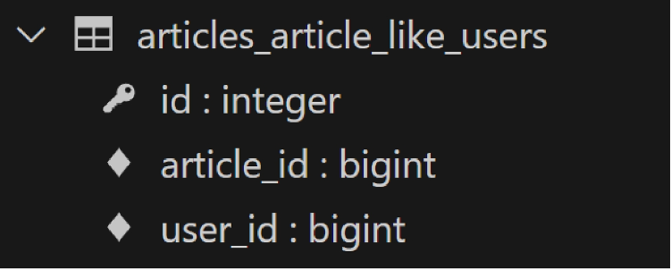

### User-Article 간 사용 가능한 전체 related manager
 - article.user
     - 게시글을 작성한 유저 - N:1
 - user.article_set
     - 유저가 작성한 게시글(역참조) - N:1
 - article.like_users
     - 게시글을 좋아요 한 유저 - M:N
 - user.like_articles
     - 유저가 좋아요 한 게시글(역참조) - M:N

### 기능 구현
 - url 작성
 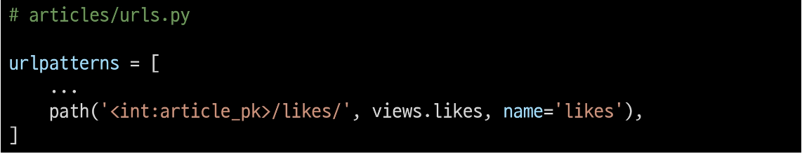

 - view 함수 작성
 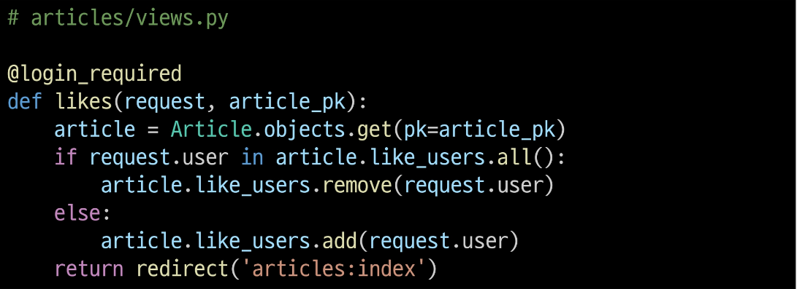

 - index 템플릿에서 각 게시글에 좋아요 버튼 출력
 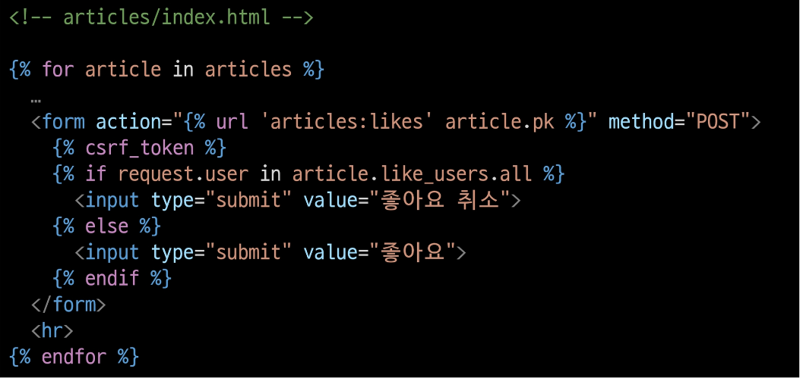

 - 좋아요 버튼 출력 확인
 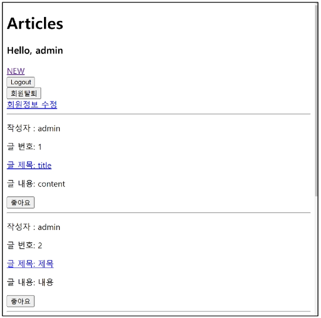

 - 좋아요 버튼 클릭 후 테이블 확인
 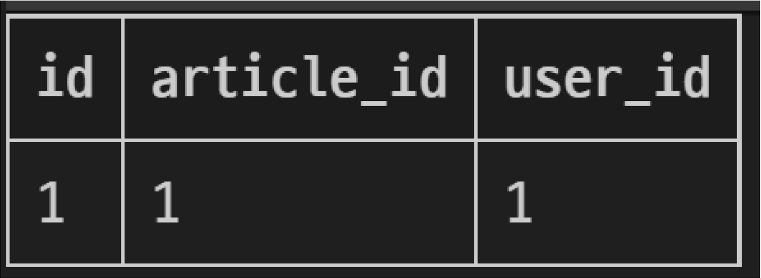
