# 240409 many to many
## 팔로우 기능 구현
### 프로필 페이지
 - 각 회원의 개인 프로필 페이지에 팔로우 기능을 구현하기 위해 프로필 페이지를 먼저 구현하기

### 프로필 구현
 1. url 작성
 

 2. view 함수 작성
 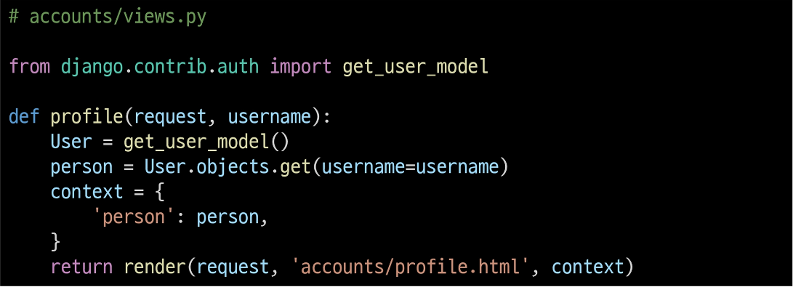
    첫 번째 path 조건에 모든 조건을 맞추기 때문에 가장 뒤쪽에 작성한다.
    교재에서는 profile을 추가적으로 붙여주었다.

 3. profile 템플릿 작성
 

 4. 프로필 페이지로 이동할 수 있는 링크 작성
 

 5. 프로필 페이지 결과 확인
 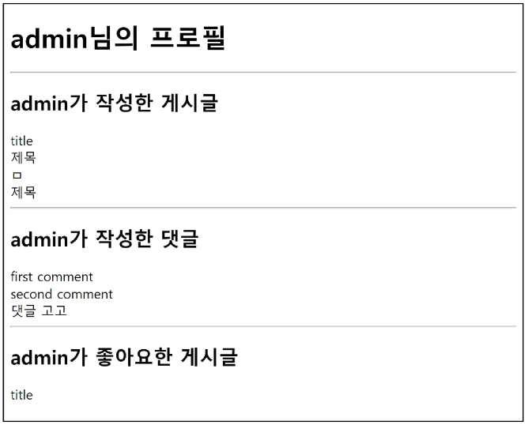

## 팔로우 기능 구현

### User(M) - User(N)
0명 이상의 회원은 0명 이상의 회원과 관련
 - 회원은 0명 이상의 팔로워를 가질 수 있고, 0명 이상의 다른 회원들을 팔로잉할 수 있음

### 기능 구현
 1. ManyToManyField 작성
 
     - 참조
         - 내가 팔로우하는 사람들(팔로잉, followings)
     - 역참조
         - 상대방 입장에서 나는 팔로워 중 한 명(팔로워, followers)
     - 바뀌어도 상관 없으나 관계 조회 시 생각하기 편한 방향으로 정한 것

 2. Migrations 진행 후 중개 테이블 확인
 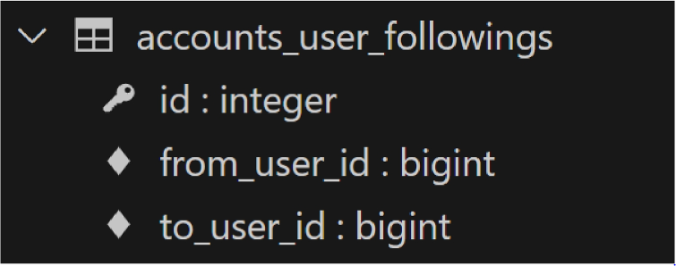

 3. url 작성
 

 4. view 함수 작성
 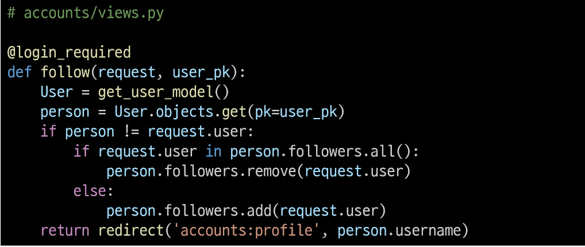

 5. 프로필 유저의 팔로잉, 팔로워 수 & 팔로우, 언팔로우 버튼 작성
 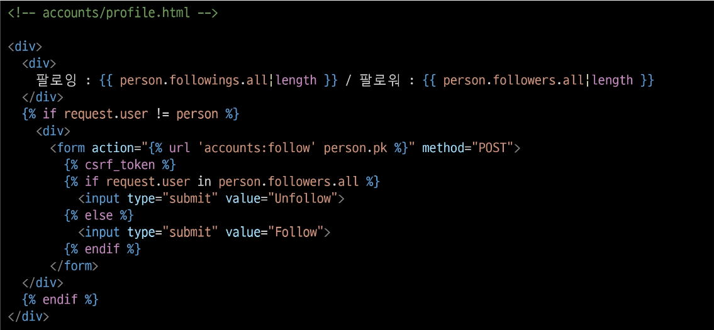

 6. 팔로우 버튼 클릭 -> 팔로우 버튼 변화 및 중개 테이블 데이터 확인
 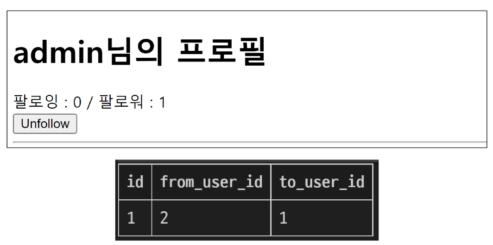

## 참고
### .exists()
 - QuerySet에 결과가 포함되어 있으면 True를 반환하고
 - 결과가 포함되어 있지 않으면 False를 반환
     - 큰 QuerySet에 있는 특정 객체 검색에 유용

### exist 적용 예시
 

## Fixtures
Django가 데이터베이스로 가져오는 방법을 알고 있는 데이터 모음
     - 데이터는 데이터베이스 구조에 맞추어 작성되어있음

초기 데이터 제공
 - Fixtures의 사용 목적

### 초기 데이터의 필요성
 1. 협업하는 유저 A, B가 있다고 생각해보기
    1) A가 먼저 프로젝트를 작업 후 원격 저장소에 push 진행
         - gitignore로 인해 DB는 업로드하지 않기 때문에 A가 생성한 데이터도 업로드 X
    2) B가 원격 저장소에서 A가 push한 프로젝트를 pull(혹은 clone)
         - 결과적으로 B는 DB가 없는 프로젝트를 받게 됨

 2. 이처럼 프로젝트의 앱을 처음 설정할 때 동일하게 준비된 데이터로 데이터베이스를 미리 채우는 것이 필요한 순간이 있음
     - Django에서는 fixtures를 사용해 앱에 초기 데이터(initial data)를 제공

## Fixtures 활용
### 사전준비
 - M:N까지 모두 작성된 Django 프로젝트에서 유저, 게시글, 댓글 등 각 데이터를 최소 2~3개 이상 생성해두기

### fixtures 관련 명령어
dumpdata - 생성(데이터 추출)
loaddata - 로드(데이터 입력)

### dumpdata
데이터베이스의 모든 데이터를 추출
 

### dumpdata 활용
 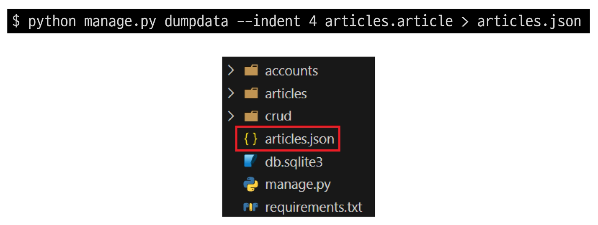
 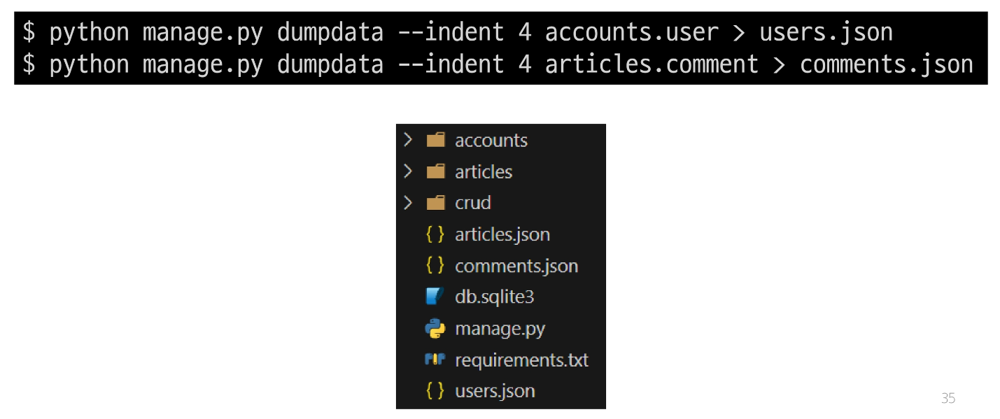

### loaddata
Fixtures 데이터를 데이터베이스로 불러오기

### Fixtures 파일 기본 경로
app_name/fixtures/
- Django는 설치된 모든 app의 디렉토리에서 fixtures 폴더 이후의 경로로 fixtures 파일을 찾아 load

### loaddata 활용
 - db.sqlite3 파일 삭제 후 migrate 진행
 

 - load 진행 후 데이터가 잘 입력되었는지 확인
 python manage.py loaddata articles.json users.json comments.json

### loaddata 순서 주의사항
 - 만약 loaddata를 한 번에 실행하지 않고 별도로 실행한다면 모델 관계에 따라 load 순서가 중요할 수 있음
     - comment는 article에 대한 key 및 user에 대한 eky가 필요
     - article은 user에 대한 key가 필요

 - 즉, 현재 모델 관계에서는 user->article->comment 순으로 data를 load해야 오류가 발생하지 않음
 

## 참고
### 모든 모델을 한 번에 dump 하기
 

### loaddata 시 encoding codec 관련 에러가 발생하는 경우
 - 2가지 방법 중 택1
 1. dumpdata 시 추가 옵션 작성
  $ python -Xutf8 manage.py dumpdata [생략]

 2. 메모장 활용
     1. 메모장으로 json 파일 열기
     2. 다른 이름으로 저장
     3. 인코딩을 UTF8로 선택 후 저장

### Fixtures 파일을 직접 만들지 말 것
반드시 dumpdata 명령어를 사용하여 생성

## Improve query
"query 개선하기"
같은 결과를 얻기 위해 DB 측에 보내는 query 개수를 점차 줄여 조회하기

### 사전 준비
 - fixtures 데이터
     - 게시글 10개 / 댓글 100개 / 유저 5개

 - 모델 관계
     - N:1 - Article:User / Comment: Article / Comment: Article
     - N:M - Article:User

 $ python manage.py migrate
 $ python manage.py loaddata users.json articles.json comments.json

 Installed 115 object(s) from 3 fixture(s)

 - 서버 실행 후 확인

## annotate
SQL의 GROUP BY를 사용

### 문제 상황
 - http://127.0.0.1:8000/articles/index-1/
 - "11 queries including 10 similar"
 

 - 문제 원인
     - 각 게시글마다 댓글 개수를 반복 평가

 <!-- index_1.html -->
 
댓글 개수: {{article.comment_set.count}}

### annotate 적용
 - 문제 해결
     - 게시글을 조회하면서 댓글 개수까지 한 번에 조회해서 가져오기
 

 - "11 queries including 10 similar" -> "1 query"
 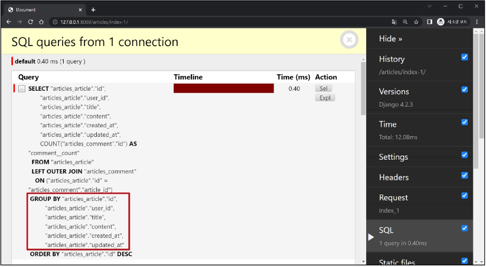

## select_related
SQL의 INNER JOIN를 사용
 - 1:1 또는 N:1 참조 관계에서 사용

### 문제 상황
 - http://127.0.0.1:8000/articles/index-2/
 - "11 queries including 10 similar and 8 duplicates"
 

 - 문제 원인
     - 각 게시글마다 작성한 유저명까지 반복 평가

 

### select_related 적용
 - 문제 해결
     - 게시글을 조회하면서 유저 정보까지 한 번에 조회해서 가져오기
 

 - "11 queries including 10 similar and 8 duplicates" -> "1 query"
 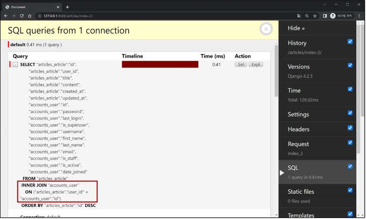

## prefetch_related
M:N 또는 N:1 역참조 관계에서 사용
 - SQL이 아닌 Python을 사용한 JOIN을 진행

### 문제 상황
 - http://127.0.0.1:8000/articles/index-3/
 - "11 queries including 10 similar"
 

 - 문제 원인
     - 각 게시글 출력 후 각 게시글의 댓글 목록까지 개별적으로 모두 평가

 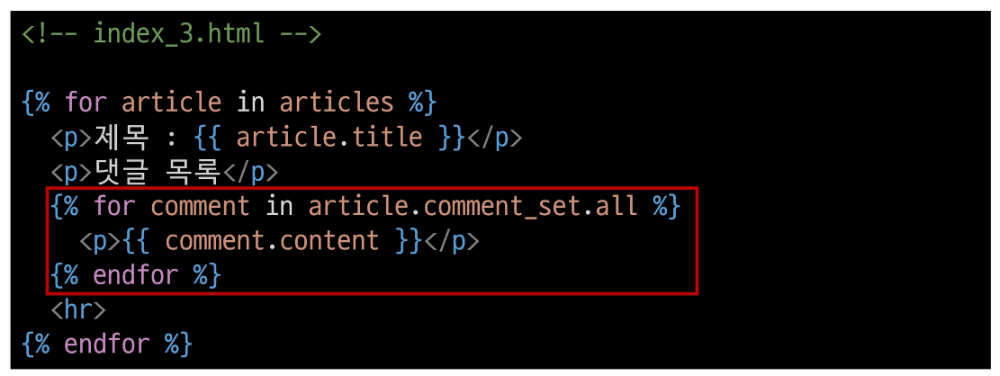

### select_related 적용
 - 문제 해결
     - 게시글을 조회하면서 참조된 댓글까지 한 번에 조회해서 가져오기
 

 - "11 queries including 10 similar and 8 duplicates" -> "1 query"
 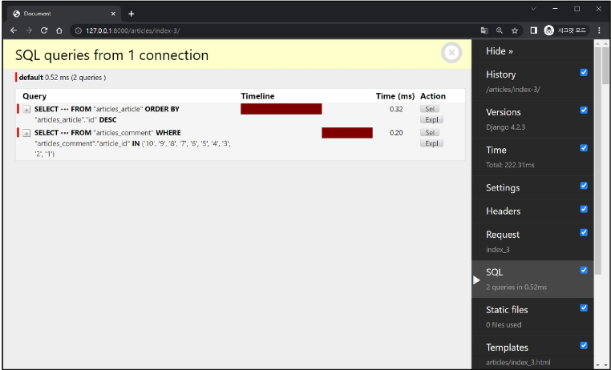

## select_related & prefectch_related

### 문제 상황
http://127.0.0.1:8000/articles/index-4/
 - 111 queries including 110 similar and 100 duplicates
 

 - 문제 원인
     - 게시글 + 각 게시글의 댓글 목록 + 댓글의 작성자를 단계적으로 평가
 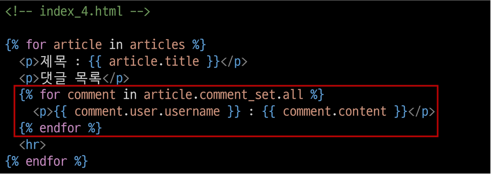

### prefetch_related 적용
 - 문제 해결 1단계
     - 게시글을 조회하면서 참조된 댓글까지 한 번에 조회
 

 - 111 quries including 110 similar and 100 duplicates
  -> 102 queries including 100 similar and 100 duplicates
 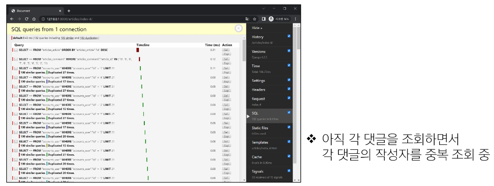

 - 문제 해결 2단계
     - 게시글 + 각 게시글의 댓글 목록 + 댓글의 작성자를 한 번에 조회
 

 - 102 queries including 100 similar and 100 duplicates
  -> 2 queries
 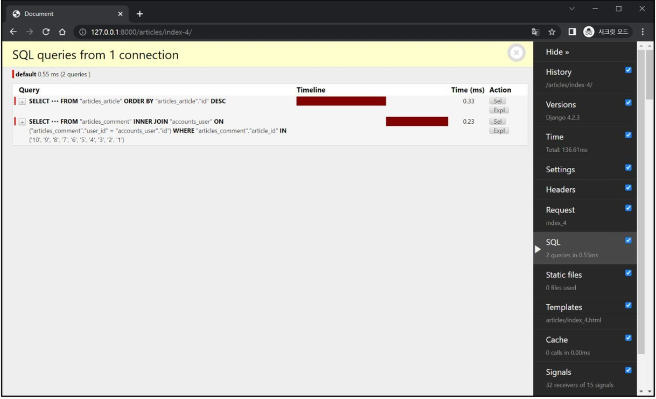
