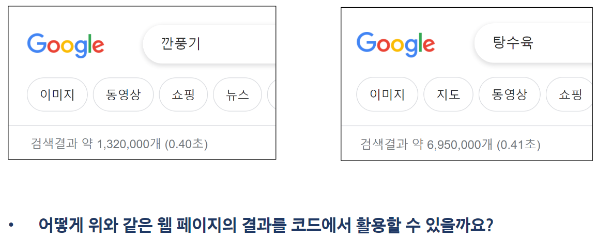
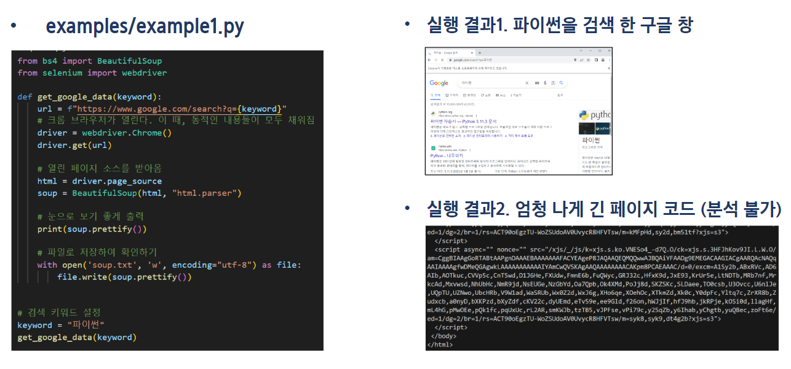
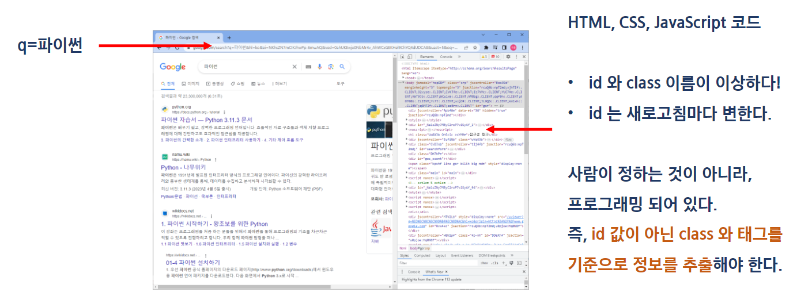
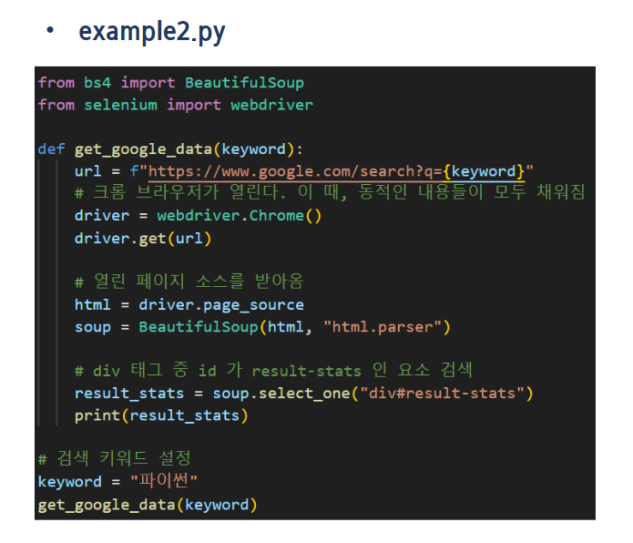
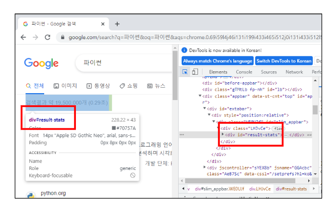
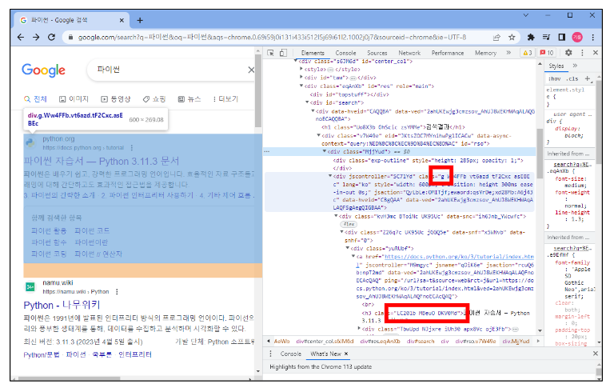
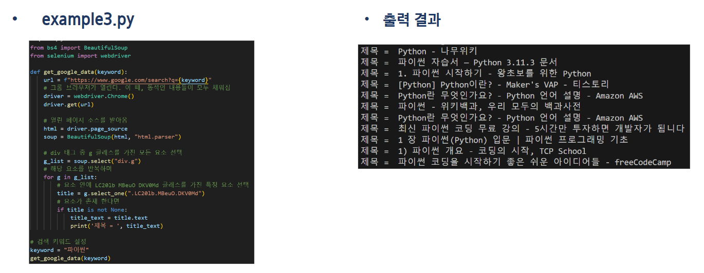
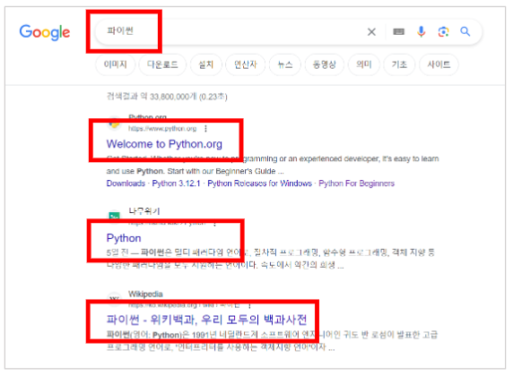

# 05pjt

## 웹 크롤링
### 프로젝트 파악하기
 - 친구들끼리 같이 먹을 음식을 주문하기로 했다.
 - 갑자기 궁금해졌다.
 - 사람들이 깐풍기를 더 선호할까? 탕수육을 더 선호할까?

 - 구글에 검색해보고 어떤 메뉴가 더 많이 검색되는 지로 판별해보고자 한다.
 

### 파이썬으로 웹 페이지에 있는 정보를 가져오는 방법
 - 크게 세 가지 방법으로 가져올 수 있습니다.
     1. 누군가 업로드해둔 데이터를 다운로드 받기(ex. 캐글)
     2. 누군가 만들어 둔 API server를 활용하여 정보를 받아오기
         - 아마, 깐풍기와 탕수욕 API server는 아무도 만들어두지 않았을 것 같다.
     3. 사람이 검색하는 것처럼 파이썬이 자동으로 검색 후 결과를 수집하는 방법
         - 이러한 기술을 크롤링(Crawling)이라고 한다.
         - 이번 프로젝트에서 사용할 기술이다.

### 프로젝트 목표
 1. Django 없이 크롤링하는 방법 학습
 2. 구글 검색 수를 크롤링하여 어떤 키워드가 더 많이 검색되는 지 조사하기

### 웹 크롤링 이해하기
 - 필요한 정보를 추출하는 5가지 단계
     1. 문제 정의: 해결하고자 하는 문제 정의
     2. 데이터 수집: 문제 해결에 필요한 데이터 수집
     3. 데이터 전처리(정제): 실질적인 분석을 수행하기 위해 데이터를 가공하는 단계
         - 수집한 데이터의 오류 제거(결측치, 이상치), 데이터 형식 변환 등
     4. 데이터 분석: 전처리가 완료된 데이터에서 필요한 정보를 추출하는 단계
     5. 결과 해석 및 공유: 의사 결정에 활용하기 위해 결과를 해석하고 시각화 후 공유하는 단계

 - 웹 크롤링이란?
     - 여러 웹 페이지를 돌아다니며 원하는 정보를 모으는 기술
     - 원하는 정보를 추출하는 스크래핑(Scraping)과 여러 웹 페이지를 자동으로 탐색하는 크롤링(Crawling)의 개념을 합쳐 웹 크롤링이라고 부름
     - 즉, 웹 사이트들을 돌아다니며 필요한 데이터를 추출하여 활용할 수 있도록 자동화된 프로세스

 - 웹 페이지 다운로드
     - 해당 웹 페이지의 HTML, CSS, JavaScript 등의 코드를 가져오는 단계
 
 - 페이지 파싱
     - 다운로드 받은 코드를 분석하고 필요한 데이터를 추출하는 단계

 - 링크 추출 및 다른 페이지 탐색
     - 다른 링크를 추출하고, 다음 단계로 이동하여 원하는 데이터를 추출하는 단계

 - 데이터 추출 및 저장
     - 분석 및 시각화에 사용하기 위해 데이터를 처리하고 저장하는 단계

### 웹 크롤링 실습
 - 준비 단계
     - 실습 및 도전 과제에는 구글 검색 결과 펭지ㅣ를 크롤링합니다.
     - 아래 필수 라이브러리를 설치 후 진행합니다.
         - requests: HTTP 요청을 보내고 응답을 받을 수 있는 모듈
         - BeautifulSoup: HTML 문서에서 원하는 데이터를 추출하는 데 사용되는 파이썬 라이브러리
         - Selenium: 웹 애플리케이션을 테스트하고 자동화하기 위한 파이썬 라이브러리
             - 웹 페이지의 동적인 컨텐츠를 가져오기 위해 사용할(검색 결과 등)
     - $ pip install requests beautifulsoup4 selenium

 - 기본 예제 실습
     - Quotes to Scrape 사이트를 활용합니다.
         - 여러 가지 주제에 관한 명언들을 모아 둔 데모 사이트
    
     - requests 및 BeautifulSoup 라이브러리 활용 연습
         - examples/example.py

### 구글 기본 예제
 

### 구글 검색 결과 분석
 - "F12" 혹은 "우측클릭 - 검사"로 크롬 개발자 도구를 열어 활용합니다.
 

 - 예시 1. 검색 결과 개수 출력
 - div 태그이면서 id가 "result-stats"이다.

 
 

 - 예시2. 검색 결과 페이지들의 제목 가져오기
 - 공통적으로 결과를 감싸는 div에는 "g" 클래스, 제목에는 "LC20lb MBeuO DKV0Md" 클래스를 가지고 있습니다.
 
 

### [참고] BeautifulSoup4 요소 선택 메서드 종류
 - find()
     - 태그를 사용하여 요소를 검색. 첫 번째로 일치하는 요소를 반환
 - find_all()
     - 태그를 사용하여 요소를 검색. 모든 일치하는 요소를 리스트로 반환
 - select()
     - CSS 선택자를 사용하여 요소를 검색. 모든 일치하는 요소를 리스트로 반환
 - select_one()
     - CSS 선택자를 사용하여 요소를 검색. 첫 번재로 일치하는 요소를 반환
 - find_parent() / find_next_sibling() / find_previous_sibiling()
     - 태그를 사용하여 요소를 검색. 각각 일치하는 요소의 부모/다음 형제 요소/ 이전 형제 요소를 반환
 - 공식 문서 참고

## Django에서 활용하기

### 크롤링 결과 저장하기
 - Django에서 크롤링을 진행 후 아래 데이터를 데이터베이스에 저장합니다.
 - 검색어와 게시글 제목을 DB에 저장합니다.
 

 - 저장하고 싶은 데이터: 검색어, 게시글 제목들
 - models.py를 어떻게 작성해야할까

### 관통 ver1 - PJT05 도전 과제
 - 프로젝트명: 키워드 검색량 분석을 위한 데이터 수집
 - 목표
     - 크롤링을 통한 데이터 수집
     - 수집한 데이터를 DB에 저장하고, 저장한 데이터 활용하기
 - 특징
     - 데이터 사이언스 패키지 사용
     - 수집한 데이터를 저장하고 활용할 수 있도록 DB 설계

### 관통 ver2 - PJT05 도전 과제
 - 프로젝트명: DB를 활용한 웹 페이지 구현
 - 목표
     - 영화, 회원, 댓글 간의 모델 관계가 형성된 애플리케이션 완성
 - 특징
     - 1:N 관계 이해 및 응용

     