# REST_API 2

## DRF with N:1 relation

## 사전 준비
### Comment 모델 정의
 - Comment 클래스 정의 및 데이터베이스 초기화
 - Migration 및 fixtures 데이터 로드
 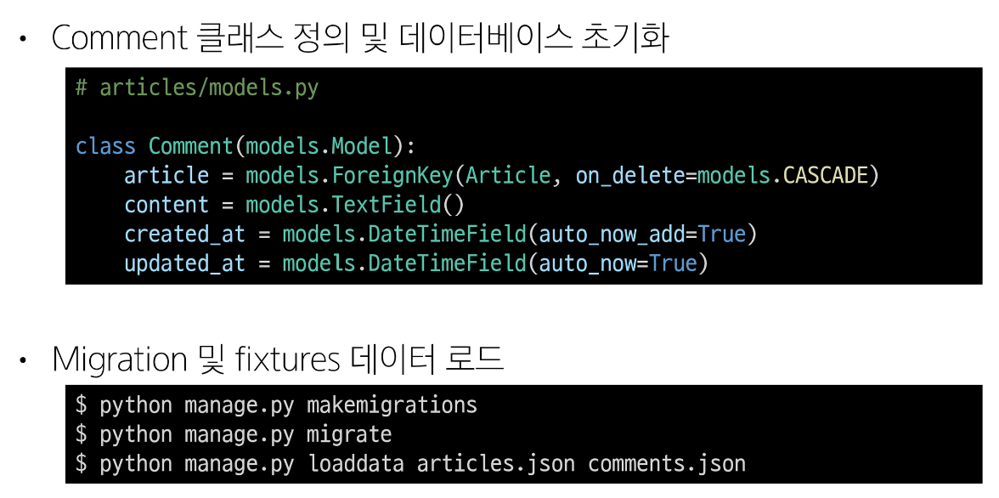

### URL 및 HTTP request method 구성
 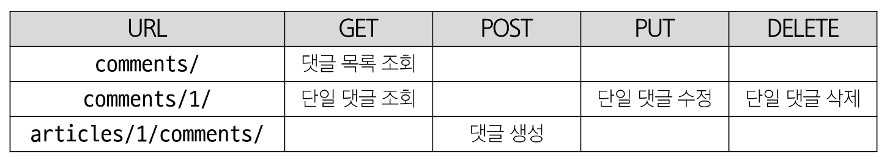

### GET - List
 1. 댓글 목록 조회를 위한 CommentSerializer 정의
 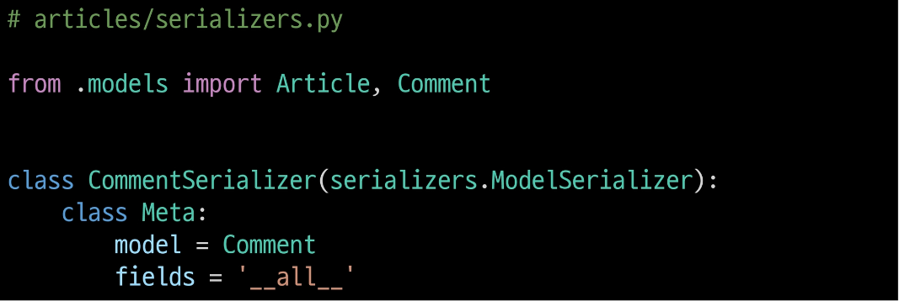

 2. url 작성
 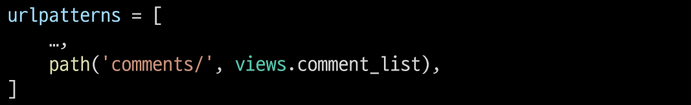

 3. view 함수 작성
 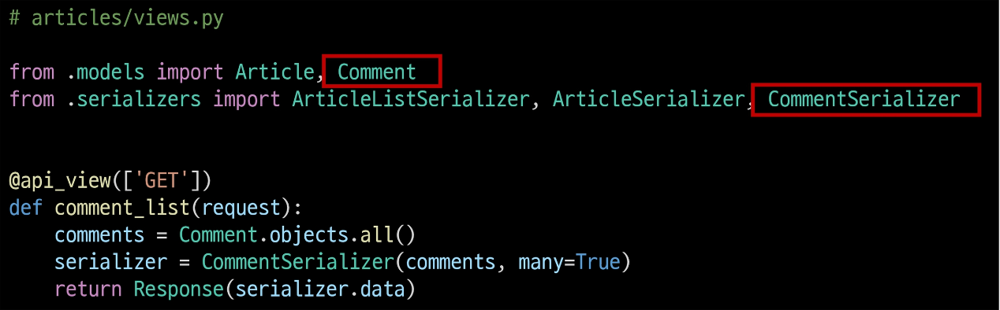

 4. GET http://127.0.0.1:8000/api/v1/comments/ 응답 확인
 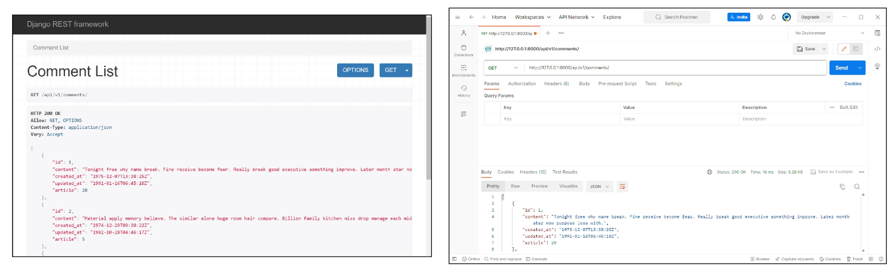
 - JSON data로 큰 대괄호로 묶여있는 걸 확인할 수 있음
 - id : 1, article : 20으로 보아 1번 댓글은 20번째 게시물에 작성되어있음을 알 수 있다

### GET - Detail
 1. 단일 댓글 조회를 위한 url 및 view 함수 작성
 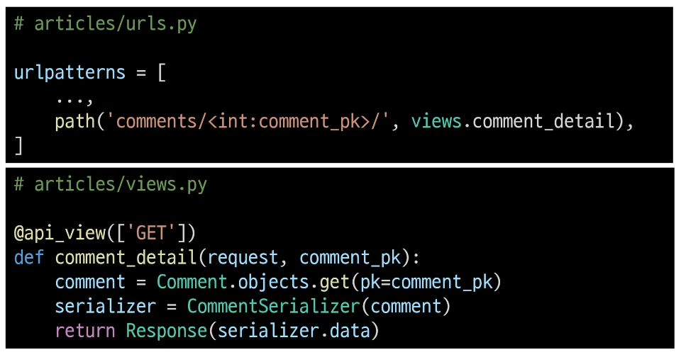

 2. GET http://127.0.0.1:8000/api/v1/comments/1 응답 확인
 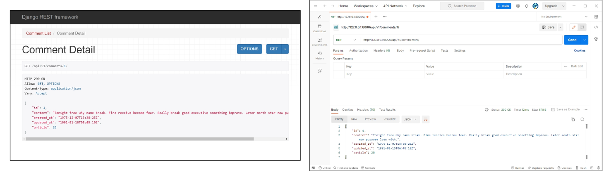

### POST
 1. 단일 댓글 생성을 위한 url 및 view 함수 작성
 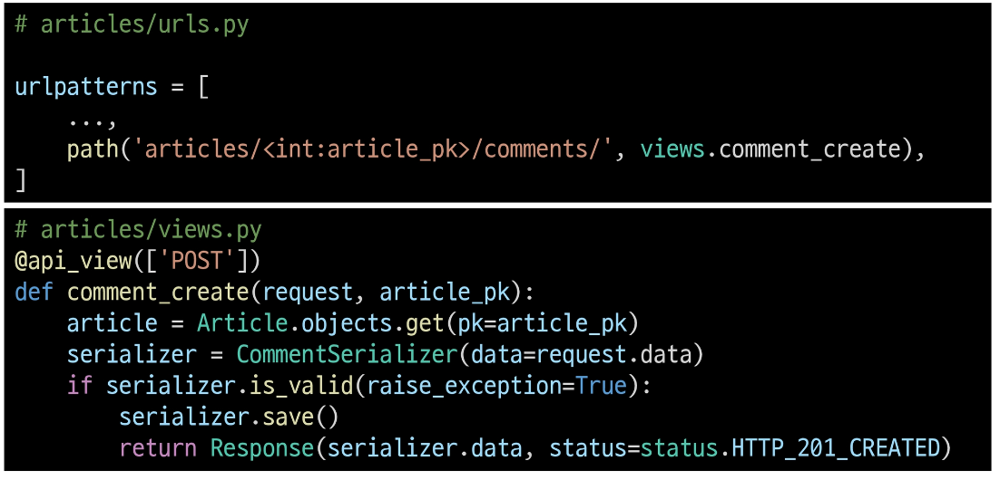

 2. serializer 인스턴스의 save() 메서드는 특정 Serializer 인스턴스를 저장하는 과정에서 추가 데이터를 받을 수 있음
 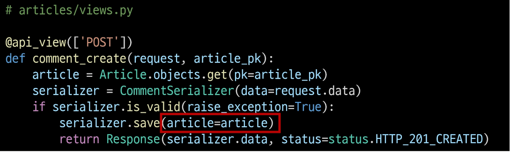

 3. POST http://127.0.0.1:8000/api/v1/articles/1/comments/ 응답 확인
     - 상태코드 400 응답 확인
     - CommentSerializer에서 외래 키에 해당하는 article field 또한 사용자로부터 입력받도록 설정되어있기 때문에 서버 측에서는 누락되었다고 판단한 것
     - 유효성 검사 목록에서 제외 필요
     - article field를 읽기 전용 필드로 설정하기

### 읽기 전용 필드(read_only_fields)
 - 데이터를 전송받은 시점에 "**유효성 검사에서 제외**시키고, **데이터 조회 시에는 출력**"하는 필드
 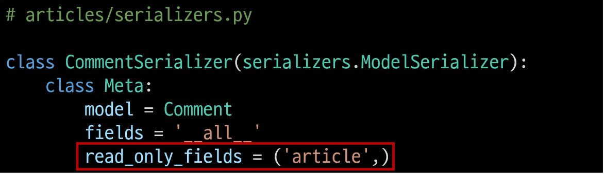

 - POST http://127.0.0.1:8000/api/v1/articles/1/comments/ 응답 재요청
 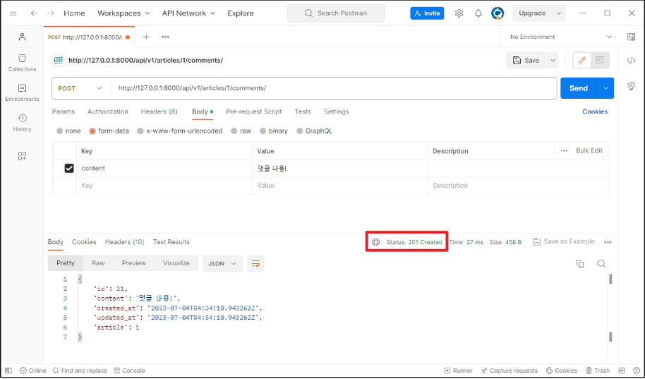

### DELETE & PUT
 1. 단일 댓글 삭제 및 수정을 위한 view 함수 작성
 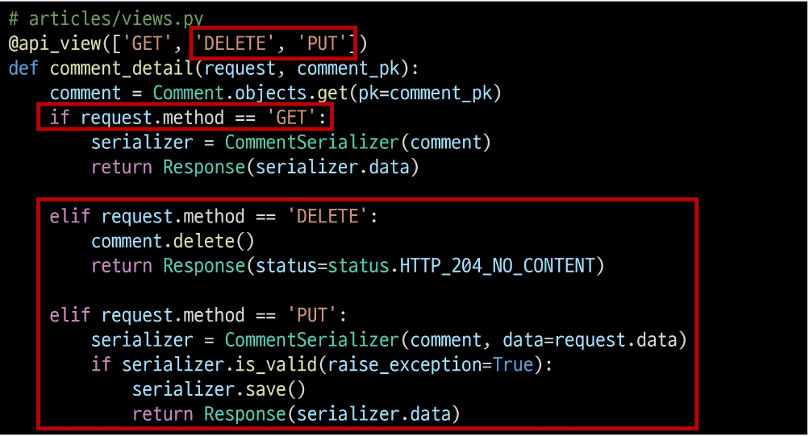

 2. DELETE http://127.0.0.1:8000/api/v1/comments/21/ 응답 확인
 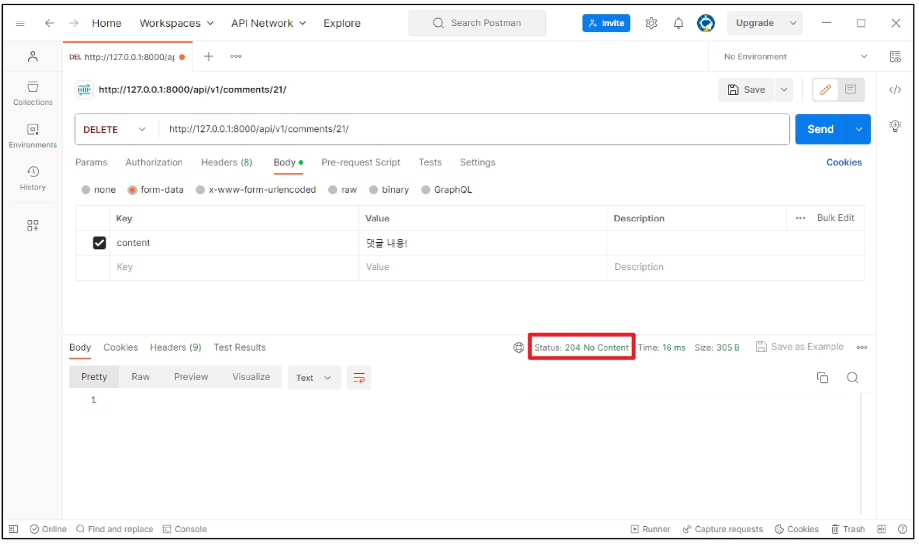

 3. PUT http://127.0.0.1:8000/api/v1/comments/1/ 응답 확인
 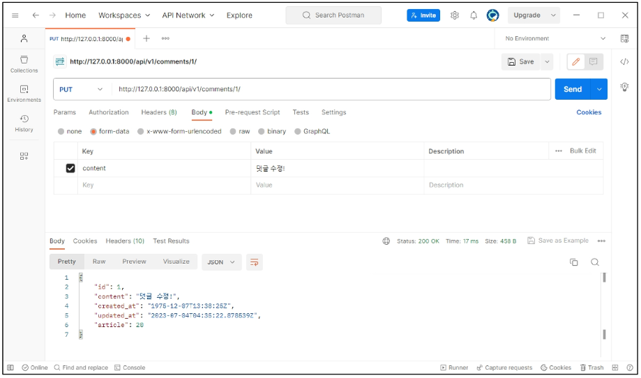

## 응답 데이터 재구성
### 댓글 조회 시 게시글 출력 내역 변경
 1. 댓글 조회 시 게시글 번호만 제공해주는 것이 아닌 '게시글의 제목'까지 제공하기
 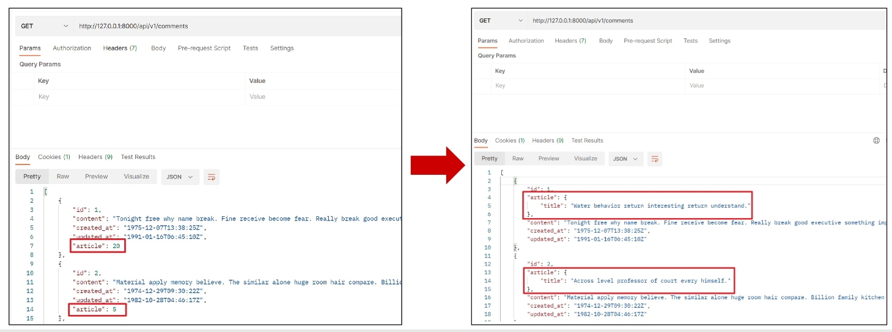

 2. 필요한 데이터를 만들기 위한 Serializer는 내부에서 추가 선언이 가능
 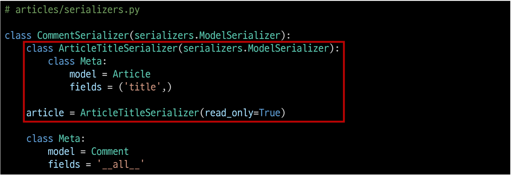

 3. GET http://127.0.0.1:8000/api/v1/comments/1/ 응답 확인
 

### 역참조 데이터 구성
Article -> Comment 간 역참조 관계를 활용한 JSON 데이터 재구성
 - 아래 2가지 사항에 대한 데이터 구성하기
     1. 단일 게시글 조회 시 **해당 게시글에 작성된 댓글 목록**도 함께 붙여서 응답
     2. 단일 게시글 조회 시 **해당 게시글에 작성된 댓글 개수**도 함께 붙여서 응답

### 1. 단일 게시글 + 댓글 목록
 - Nested relationships (역참조 매니저 활용)
     - 모델 관계 상으로 참조하는 대상은 참조되는 대상의 표현에 포함되거나 중첩될 수 있음
     - 이러한 중첩된 관계는 serializers를 필드로 사용하여 표현 가능
 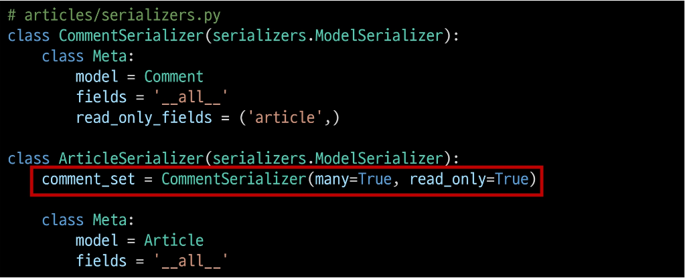

 - GET http://127.0.0.1:8000/api/v1/articles/2/ 응답 확인
 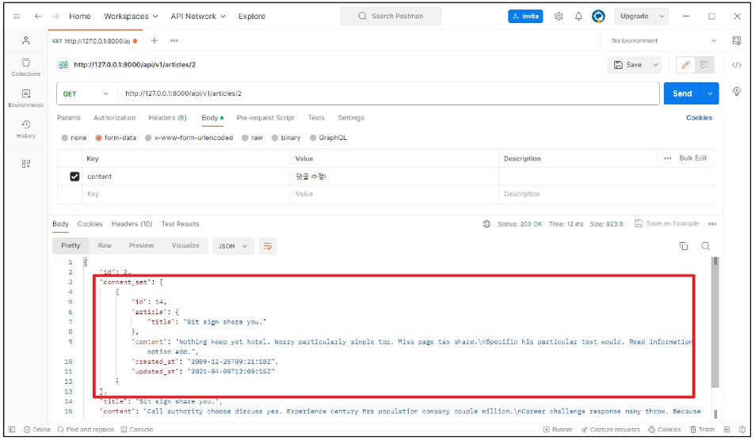

### 2. 단일 게시글 + 댓글 개수
 - 댓글 개수에 해당하는 새로운 필드 생성
 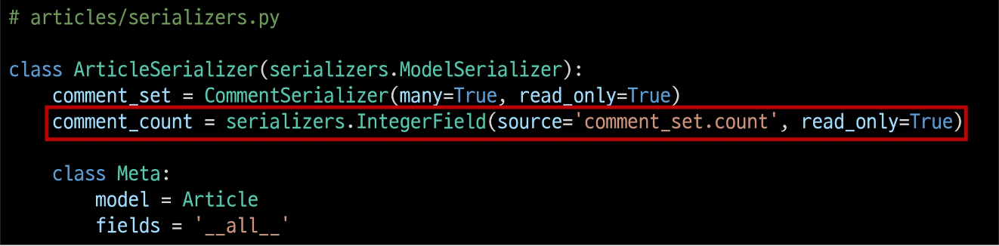

 - GET http://127.0.0.1:8000/api/v1/articles/3/ 응답 확인
 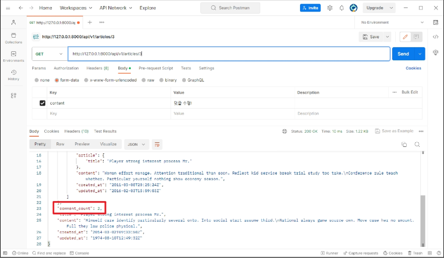

### 'source' arguments
 - 필드를 채우는 데 사용할 속성의 이름
 - 점 표기법(dotted notation)을 사용하여 속성을 탐색할 수 있음
 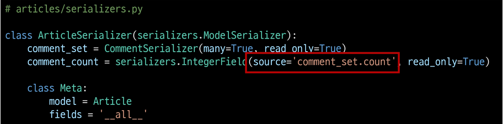

### **주의** 읽기 전용 필드 지정 이슈
 - 특정 필드를 override 혹은 추가한 경우 read_only_fields는 동작하지 않음
     - 이런 경우 새로운 필드에 read_only 키워드 인자로 작성해야 함
 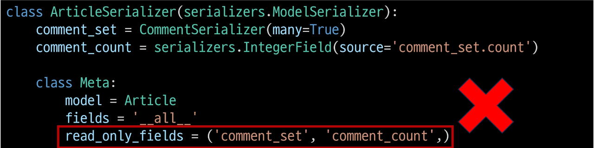

 article = ArticleSerializer(read_only=True)
 이런 식으로 작성해야 한다는 뜻

## API 문서화
### OpenAPI Specification OAS
RESTful API를 설명하고 시각화하는 표준화된 방법
 - API에 대한 세부사항을 기술할 수 있는 공식 표준
 

Swagger  / Redoc
OAS 기반 API에 대한 문서를 생성하는 데 도움을 주는 오픈소스 프레임워크

### drf-spectacular 라이브러리
 - DRF 위한 OpenAPI 3.0 구조 생성을 도와주는 라이브러리
 - 설치 및 등록
 

 - 관련 설정 코드 입력 (OpenAPI 구조 자동 생성 코드)
 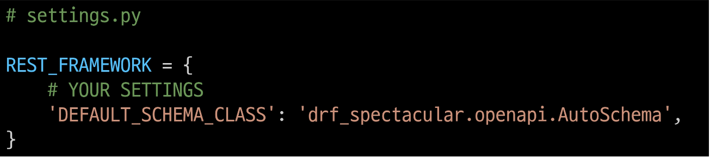

 - swagger, redoc 페이지 제공을 위한 url 작성
 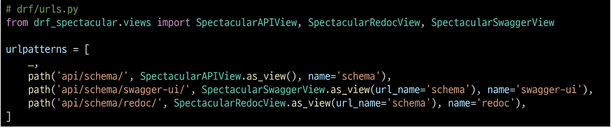

 - http://127.0.0.1:8000/api/schema/swagger-ui/ 페이지 확인
 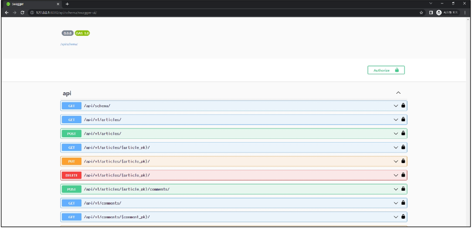

 - http://127.0.0.1:8000/api/schema/redoc/ 페이지 확인
 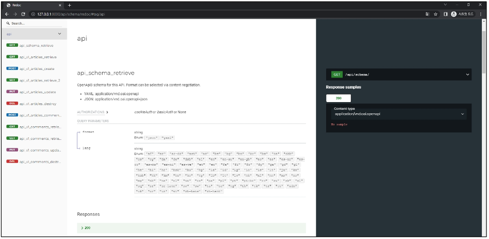

### "설계 우선" 접근법
 - OAS의 핵심 이점
 - API를 먼저 설계하고 명세를 작성한 후, 이를 기반으로 코드를 구현하는 방식
 - API의 일관성을 유지하고, API 사용자는 더 쉽게 API를 이해하고 사용할 수 있음
 - 또한, OAS를 사용하면 API가 어떻게 작동하는 지를 시각적으로 보여주는 문서를 생성할 수 있으며, 이는 API를 이해하고 테스트하는 데 매우 유용
 - 이런 목적으로 사용되는 도구가 Swagger-UI 또는 ReDoc

## 참고
### Django shortcuts functions
 - render()
 - redirect()
 - get_object_or_404()
 - get_list_or_404()

### get_object_or_404()
 - 모델 manager objects에서 get()을 호출하지만, 해당 객체가 없을 땐 기존 DoesNotExist 예외 대신 Http404를 raise함

### get_object_or_404 적용
 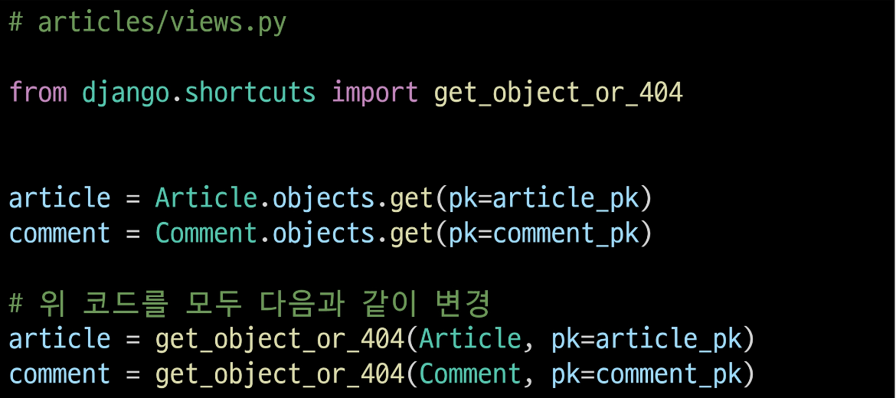

### get_list_or_404()
 - 모델 manager objects에서 filter()의 결과를 반환하고, 해당 객체 목록이 없을 땐 Http404를 raise함

### get_list_or_404 적용
 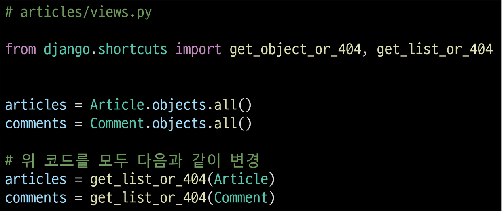

### 적용 전/후 비교
 - 존재하지 않는 게시글 조회 시 이전에는 상태 코드 500을 응답했지만 현재는 404를 응답

### 왜 사용해야 할까?
 - 클라이언트에게 "서버에 오류가 발생하여 요청을 수행할 수 없다(500)"라는 원인이 정확하지 않은 에러를 제공하기 보다는
 - 적절한 예외 처리를 통해 클라이언트에게 보다 정확한 에러 현황을 전달하는 것도 매우 중요한 개발 요소 중 하나이기 때문