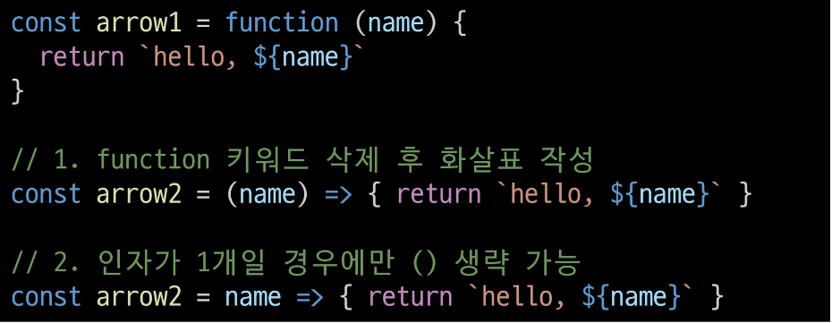
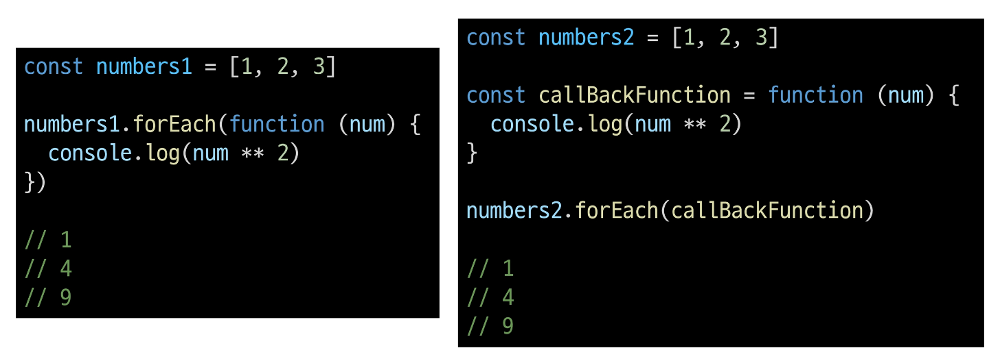
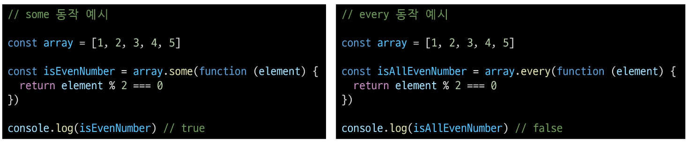

# reference type
## 함수
### Function
참조 자료형에 속하며 모든 함수는 Fuction object

데이터 타입
참조 자료형
objects
(object, Array, Function)
객체의 주소가 저장되는 자료형
(가변, 주소가 복사)

### 함수 구조
 

 - function 키워드
 - 함수의 이름
 - 함수의 매개변수
 - 함수의 body를 구성하는 statements
 - return 값이 없다면 undefined를 반환

### 함수 정의 2가지 방법
 - 선언식(function declaration)
 - 표현식(function expression)
 
 

### 함수 표현식 특징
 - 함수 이름이 없는 '익명 함수'를 사용할 수 있음
 - 선언식과 달리 표현식으로 정의한 함수는 호이스팅 되지 않으므로
 - 함수를 정의하기 전에 먼저 사용할 수 없음

### 함수 선언식과 표현식 종합
 

### 매개변수 정의 방법
 1. 기본 함수 매개변수
 2. 나머지 매개변수

### 1. 기본 함수 매개변수 (Default function parameter)
 - 전달하는 인자가 없거나 undefined가 전달될 경우 이름 붙은 매개변수를 기본값으로 초기화
 

### 2. 나머지 매개변수 (Rest parameters)
 - 임의의 수의 인자를 '배열'로 허용하여 가변 인자를 나타내는 방법
 - 작성 규칙
     - 함수 정의 시 나머지 매개변수는 하나만 작성할 수 있음
     - 나머지 매개변수는 함수 정의에서 매개변수 마지막에 위치해야 함
 

### 매개변수와 인자 개수가 불일치할 때
 - 매개변수 개수 > 인자 개수
 - 누락된 인자는 undefined로 할당
 

 - 매개변수 개수 < 인자 개수
 - 초과 입력한 인자는 사용하지 않음
 

### Spread Syntax '...'
전개 구문

### 전개 구문
 - 배열이나 문자열과 같이 반복 가능한 항목을 펼치는 것 (확장, 전개)
 - 전개 대상에 따라 역할이 다름
     - 배열이나 객체의 요소를 개별적인 값으로 분리하거나
     - 다른 배열이나 객체의 요소를 현재 배열이나 객체에 추가하는 등

### 전개 구문 활용처
 1. 함수와의 사용
     - 함수 호출 시 인자 확장
     - 나머지 매개변수 (압축)
 2. 객체와의 사용 (객체 파트에서 진행)
 3. 배열과의 활용 (배열 파트에서 진행)

### 전개 구문 활용
 - 함수와의 사용
     1. 함수 호출 시 인자 확장
 

     2. 나머지 매개변수 (압축)
 

### 화살표 함수 표현식 (Arrow Function Expressions)
 함수 표현식의 간결한 표현법

### 화살표 함수 작성 결과
 

### 화살표 함수 작성 과정
 1. function 키워드 제거 후 매개변수와 중괄호 사이에 화살표 (=>) 작성
 

 2. 함수의 매개변수가 하나뿐이라면, 매개변수의 '()' 제거 가능
 (단, 생략하지 않는 것을 권장 - 매개변수의 명시도와 관련)
 

 3. 함수 본문의 표현식이 한 줄이라면, '{}'와 'return' 제거 가능
 

## 참고
### 화살표 함수 심화
 

## 객체
### Object
키로 구분된 데이터 집합을 저장하는 자료형
(data collection)

### 객체 구조
 - 중괄호 '{}'를 이용해 작성
 - 중괄호 안에는 key: value 쌍으로 구성된 속성을 여러 개 작성 가능
 - key는 문자형만 허용
 - value는 모든 자료형 허용
 

### 속성 참조
 - 점('.', chaining operator) 또는 대괄호('[]')로 객체 요소 접근
 - key 이름에 띄어쓰기 같은 구분자가 있으면 대괄호 접근만 가능
 
 

### 'in' 연산자
 - 속성이 객체에 존재하는 지 여부를 확인
 

### Method
객체 속성에 정의된 함수
 - 'this' 키워드를 사용해 객체에 댛나 특정한 작업을 수행할 수 있음

### Method 사용 예시
 - object.method() 방식으로 호출
 - 메서드는 객체를 '행동'할 수 있게 함

### 'this' keyword
 함수나 메서드를 호출한 객체를 가리키는 키워드
     - 함수 내에서 객체의 속성 및 메서드에 접근하기 위해 사용

### Method & this 사용 예시
 

### Javascript에서 this는 함수를 "**호출하는 방법**"에 따라 가리키는 대상이 다름
 

### 1. 단순 호출 시 this
 - 가리키는 대상 => 전역 객체
 

### 2. 메서드 호출 시 this
 - 가리키는 대상 => 메서드를 호출한 객체
 

### 중첩된 함수에서 this 문제점과 해결책
 

### JavaScript 'this' 정리
 - JavaScript의 함수는 호출될 때 this를 암묵적으로 전달받음
 - JavaScript에서 this는 함수가 "호출되는 방식"에 따라 결정되는 현재 객체를 나타냄
 - Python의 self와 Java의 this가 선언 시 이미 값이 정해지는 것에 비해 JavaScript의 this는 함수가 호출되기 전까지 값이 할당되지 않고 호출 시에 결정됨 (동적 할당)

 - this가 미리 정해지지 않고 호출 방식에 의해 결정되는 것은
 - 장점
     - 함수(메서드)를 하나만 만들어 여러 객체에서 재사용할 수 있다는 것
 - 단점
     - 이런 유연함이 실수로 이어질 수 있다는 것

 - 개발자는 this의 동작 방식을 충분히 이해하고 장점을 취하면서 실수를 피하는 데 집중

## 추가 객체 문법
### 1. 단축 속성
 - 키 이름과 값으로 쓰이는 변수의 이름이 같은 경우 단축 구문을 사용할 수 있음
 

### 2. 단축 메서드
 - 메서드 선언 시 function 키워드 생략 가능
 

### 3. 계산된 속성 (computed property name)
 - 키가 대괄호([])로 둘러싸여 있는 속성
     - 고정된 값이 아닌 변수 값을 사용할 수 있음
 

### 4. 구조 분해 할당 (destructing assignment)
 - 배열 또는 객체를 분해하여 객체 속성을 변수에 쉽게 할당할 수 있는 문법
 

 - '함수의 매개변수'로 객체 구조 분해 할당 활용 가능
 

### 5. Object with '전개 구문'
 - 객체 복사
     - 객체 내부에서 객체 전개

 - 얕은 복사에 활용 가능
 

### 6. 유용한 객체 메서드
 - Object.keys()
 - Object.values()
 

### 7. Optional chaining ('?.')
 - 속성이 없는 중첩 객체를 에러 없이 접근할 수 있는 방법
 - 만약 참조 대상이 null 또는 undefined라면 에러가 발생하는 것 대신 평가를 멈추고 undefined를 반환
 

 - 만약 Optional chaining을 사용하지 않는다면 다음과 같이 '&&' 연산자를 사용해야 함
 

### 7. Optional chaining 장점
 - 참조가 누락될 가능성이 있는 경우 연결된 속성으로 접근할 때 더 짧고 간단한 표현식을 작성할 수 있음
 - 어떤 속성이 필요한 지에 따라 보증이 확실하지 않는 경우 객체의 내용을 보다 편리하게 탐색할 수 있음

### 7. Optional chaining 주의사항
 1. Optional chaining은 존재하지 않아도 괜찮은 대상에만 사용해야 함(남용 X)
  - 왼쪽 평가대상이 없어도 괜찮은 경우에만 선택적으로 사용
  - 중첩 객체를 에러 없이 접근하는 것이 사용 목적이기 때문
 

 2. Optional chaining 앞의 변수는 반드시 선언되어 있어야 함
 

### 7. Optional chaining 정리
 1. obj?.prop
     - obj가 존재하면 obj.prop을 반환하고, 그렇지 않으면 undefined를 반환

 2. obj?.[prop]
     - obj가 존재하면 obj[prop]을 반환하고, 그렇지 않으면 undefined를 반환
 3. obj?.method()
     - obj가 존재하면 obj.method()를 호출하고, 그렇지 않으면 undefined를 반환

### JSON
 - "JavaScirpt Object Notation"
 - Key-Value 형태로 이루어진 자료 표기법
 - JavaScript의 Object와 유사한 구조를 가지고 있지만 JSON은 형식이 있는 "문자열"
 - JavaScript에서 JSON을 사용하기 위해서는 Object 자료형으로 변경해야 함

### Object <-> JSON 변환하기
 

## 참고
### 'new' 연산자
 - JS에서 객체를 하나 생성한다고 한다면?
     - 하나의 객체를 선언하여 생성

 - 동일한 형태의 객체를 또 만든다면?
     - 또 다른 객체를 선언하여 생성해야 함

 - 불편한데.. 좋은 방법이 없을까?
 

### 'new' 연산자 예시
 

### 'new' 연산자
 

## 배열
### Object
키로 구분된 데이터 집합(data collection)을 저장하는 자료형
 - 이제는 순서가 있는 collection이 필요

### Array
순서가 있는 데이터 집합을 저장하는 자료 구조

### 배열 구조
 - 대괄호('[]')를 이용해 작성
 - 요소 자료형: 제약 없음
 - legnth 속성을 사용해 배열에 담긴 요소가 몇 개인지 알 수 있음
 

## 배열 메서드
### 주요 메서드
 

### push()
 - 배열 끝에 요소를 추가
 

### pop()
 - 배열 끝 요소를 제거하고, 제거한 요소를 반환
 

### unshift()
 - 배열 앞에 요소를 추가
 

### shift()
 - 배열 앞 요소를 제거하고, 제거한 요소를 반환
 

### Array helper methods
 - 배열 조작을 보다 쉽게 수행할 수 있는 특별한 메서드 모음
 - ES6에 도입
 - 배열의 각 요소를 순회하며 각 요소에 대해 함수(콜백함수)를 호출
     - forEach(), map(), fliter(), every(), some(), reduce()

 - 메서드 호출 시 인자로 함수(콜백함수)를 받는 것이 특징

### 콜백 함수(callback function)
 - 다른 함수에 인자로 전달되는 함수
     - 외부 함수 내에서 호출되어 일종의 루틴이나 특정 작업을 진행

### 콜백 함수 예시
 

### 주요 Array Helper Methods
 

### forEach()
배열의 각 요소를 반복하며 모든 요소에 대해 함수(콜백함수)를 호출

### forEach 구조
 
 

### forEach 예시
 
 

### forEach 활용
 
 

### map()
 - 배열의 모든 요소에 대해 함수(콜백함수)를 호출하고, 
 - 반환된 호출 결과 값을 모아 새로운 배열을 반환

### map 구조
 
 

### map 예시
 - 배열을 순회하며 각 객체의 name 속성 값을 추출하기 (for ... of 와 비교)
 

### map 활용
 
 

### python에서의 map 함수와 비교
 

### 배열 순회 종합
 

### 기타 Array Helper Methods
 - MDN 문서를 참고해 사용해보기
 

## 추가 문법 배열
### Array with '전개 구문'
 - 배열 복사
 

## 참고
### 콜백함수 구조를 사용하는 이유
 1. 함수의 재사용성 측면
 2. 비동기적 처리 측면

### 1. 함수의 재사용성 측면
 - 함수를 호출하는 코드에서 콜백함수의 동작을 자유롭게 변경할 수 있음
 - 예를 들어, map 함수는 콜백함수를 인자로 받아 배열의 각 요소를 순회하며 콜백 함수를 실행
 - 이 때, 콜백 함수는 각 요소를 변환하는 로직을 담당하므로, map 함수는 호출하는 코드를 간결하고 가독성이 높아짐

### 2. 비동기적 측면
 - setTimeout 함수는 콜백함수를 인자로 받아 일정 시간이 지난 후에 실행됨
 - 이 때, setTimeout 함수는 비동기적으로 콜백 함수를 실행하므로, 다른 코드의 실행을 방해하지 않음(비동기 JavaScript에서 자세히 진행 예정)
 

### forEach에서 break하는 대안
 - forEach에서는 break 키워드를 사용할 수 없음
 - 대신 some과 every의 특징을 활용해 마치 break를 사용하는 것처럼 활용할 수 있음
 

 - some을 활용한 예시
     - 콜백함수가 true를 반환하면 즉시 순회를 중단하는 특징을 활용
 

 - every를 활용한 예시
     - 콜백 함수가 false를 반환하면 즉시 순회를 중단하는 특징을 활용
 

### "배열은 객체다"
 - 배열도 키와 속성들을 담고 있는 참조 타입의 객체
 - 배열의 요소를 대괄호 접근법을 사용해 접근하는 건 객체 문법과 같음
     - 배열의 키는 숫자
 - 숫자형 키를 사용함으로써 배열은 객체 기본 기능 이외에도 "순서가 있는 컬렉션"을 제어하게 해 주는 특별한 메서드를 제공하는 것

 - 배열은 인덱스를 키로 가지며 length 속성을 갖는 특수한 객체
 

