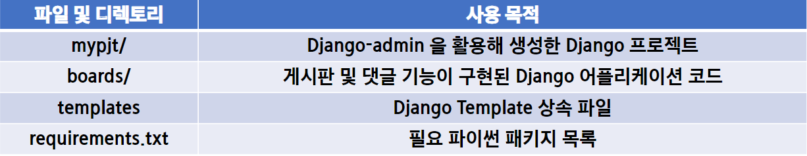
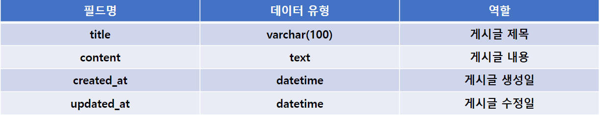
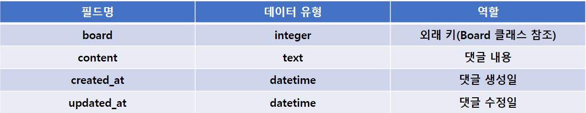
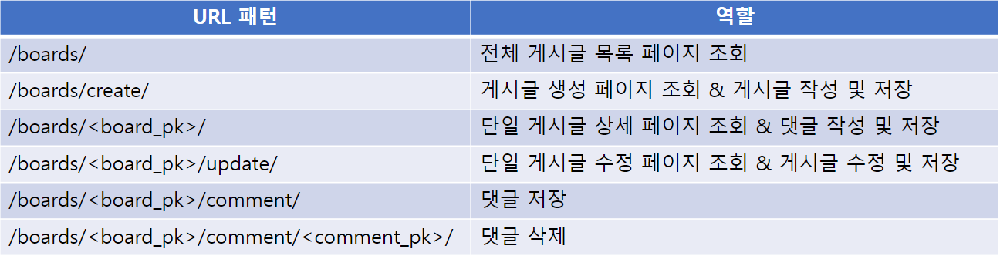
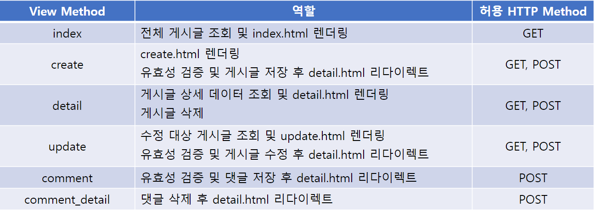

# 06 PJT
## 프로젝트 목표
 - 수업 시간에 했던 회원제 게시판 구현
     - CRUD, 회원가입 및 로그인

## 게시판 코드 분석
### 요약
 - 제공된 코드를 아래 기능들이 구현되어 있습니다.
     - 회원 기능을 제외한 기본적인 게시판 + 댓글 기능이 구현되어 있습니다.
     - Django 프로젝트의 이름은 mypjt입니다.
     - 등록된 앱 이름은 boards입니다.
 - 폴더 구조
 

### Model
 - 사용하는 모델 클래스 목록은 다음과 같다.
     - A. Board
     - B. Comment

### A. Board
 - 모델 클래스 이름은 Board 이며, 다음과 같은 정보를 저장합니다.
 

### B. Comment
 - 모델 클래스 이름은 Comment이며, 다음과 같은 정보를 저장합니다.
 

### URL
 - boards 앱은 다음 URL 요청에 맞는 역할을 가집니다.
 

### View
 - boards 앱은 다음 역할을 가지는 view 함수를 가집니다.
 

### Form
 - Board 모델과 Comment 모델의 데이터 검증, 저장, 에러 메세지, HTML을 모두 관리하기 위해 적절한 ModelForm을 사용합니다.