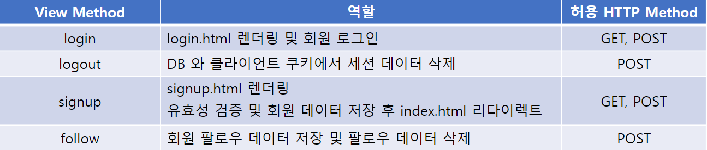

# 06_pjt

## 회원제 커뮤니티 게시판 구현
### 공통 요구사항
 1. 추가 구현될 회원 관리 앱의 이름은 accounts로 지정합니다.
 2. .gitignore 파일을 추가하여 불필요한 파일 및 폴더를 제출하지 않도록 합니다.
 3. 명시된 요구사항 이외에는 자유롭게 작성해도 무관합니다.
 4. 커뮤니티 웹 서비스에 회원 기능을 추가합니다.
     1) 게시글 생성, 조회, 수정, 삭제 및 댓글 생성, 삭제 기능을 제공합니다.
     2) 로그인, 로그아웃, 회원가입이 가능한 애플리케이션을 완성합니다.
     3) 로그인 여부에 따라 다른 동작이 가능한 애플리케이션을 완성합니다.
 5. 메서드 구현 시 @require_http_methods를 활용하여 필요한 HTTP 메서드만 허용하도록 구현합니다.
 6. **제공된 코드**와 프로젝트 예시를 참고하여 직접 회원 어플리케이션을 설계하고 완성합니다.

### Model
 - 수정할 모델 클래스 목록
     - Board
     - Comment
 - 새로 정의할 모델 클래스 목록
     - User

### A. Board
 - Board 모델에 다음과 같은 정보를 추가합니다.
 

### B. Comment
 - Comment 모델에 다음과 같은 정보를 추가합니다.
 

### C. User
 - Django에서 제공하는 AbstractUser를 상속받는 User 클래스를 추가합니다.
 - 수정할 모델 클래스 이름은 User이며, 아래 필드를 추가합니다.
 

### ERD (Entity-Relationship Diagram)
 

### URL
 - boards 앱은 다음 URL 요청에 맞는 역할을 가집니다.
 

 - accounts 앱은 다음 URL 요청에 맞는 역할을 가집니다.
 

### View
 - boards 앱은 다음 역할을 가지는 view 함수를 가집니다.
 

 - accounts 앱은 다음 역할을 가지는 view 함수를 가집니다.
 

### Admin
 - 모델 Board, Comment, User를 Admin site에 등록합니다.
 - Admin site에서 데이터의 생성, 조회, 수정, 삭제가 가능해야 합니다.

### Form
 - Board 모델과 Comment 모델의 데이터 검증, 저장, 에러 메세지, HTML을 모두 관리하기 위해 적절한 ModelForm을 사용합니다.

 - User 모델의 데이터 검증, 저장, 에러 메세지, HTML을 모두 관리하기 위해 적절한 Form과 ModelForm 그리고 커스텀 ModelForm을 사용합니다.

### 세부 요구사항
 A. 회원 관리 기능
    1. 회원 가입
    2. 로그인 & 로그아웃
 B. Boards 앱 기능
    1. 게시글 CRUD(생성, 조회, 수정, 삭제) 기능
    2. 댓글 생성, 삭제 기능

 C. 프로필 페이지
 D. 유저 팔로우 기능
 E. 게시글 좋아요 기능 (선택 사항)

### A. 유저 기능
 1. 회원 가입
     - Django의 UserCreationForm을 적절히 수정하여 커스텀 ModelForm을 구현합니다.
     - 가입 정보를 입력할 수 있는 적절한 UI를 제공합니다.
     - 회원 가입 버튼 클릭 시 입력한 회원 정보로 DB에 저장될 수 있도록 구현합니다.
 2. 로그인 & 로그아웃
     - 비로그인 시 로그인 버튼을, 로그인된 사용자에게는 로그아웃 버튼을 제공합니다.
     - 로그인 버튼 클릭 시 로그인을 할 수 있는 페이지를 제공합니다.
         - Django가 제공하는 로그인 Form과 메서드를 활용합니다.
     - 로그아웃 버튼 클릭 시 DB와 클라이언트 쿠키에서 세션 데이터를 삭제할 수 있도록 구현합니다.
         - Django가 제공하는 로그아웃 메서드를 활용합니다.

### B. Boards 앱 기능
 1. 게시글 CRUD(생성, 조회, 수정, 삭제) 기능
     - 생성, 조회 기능
         - 사용자의 인증 여부와 관계없이 전체 영화 및 단일 영화 조회 페이지에서 적절한 UI를 활용하여 영화 목록을 제공합니다.
     - 수정, 삭제 기능
         - 본인이 작성한 게시글만 수정 및 삭제가 가능하도록 UI와 로직을 구현합니다.
         - 수정 페이지에서 내용 작성 및 수정이 가능하도록 적절한 UI를 제공합니다.
 2. 댓글 생성, 삭제 기능
     - 생성 기능
         - 인증된 사용자에게만 댓글 작성이 가능하도록 UI와 로직을 구현합니다.
     - 삭제 기능
         - 본인이 작성한 댓글만 삭제가 가능하도록 UI와 로직을 구현합니다.

### B. Boards 앱 기능 예시 화면
 - 전체 게시글 조회 페이지
 

 - 상세 게시글 조회 페이지
     - 내가 작성한 댓글만 삭제 가능하도록 구현합니다.
 
 

 - 게시글 생성 페이지
 

 - 수정 페이지
 

### C. 프로필 페이지
 - 기본적인 회원 정보(회원번호, 회원 ID, 가입 날짜 등)를 출력합니다.
 - 적절한 UI를 활용하여 해당 회원이 작성한 게시글 목록을 제공합니다.
     - 각 게시글의 글 번호, 글 제목을 출력합니다.
     - 게시글 제목 클릭 시 해당 게시글 상세 페이지로 이동합니다.
 - 적절한 UI를 활용하여 해당 회원이 작성한 댓글 목록을 제공합니다.
     - 각 댓글이 작성된 게시글 제목, 댓글 내용을 출력합니다.
     - 게시글 제목 클릭 시 해당 게시글 상세 페이지로 이동합니다.

### C. 프로필 페이지 예시 화면
 

### D. 유저 팔로우 기능
 - 프로필 페이지에 팔로워 수와 팔로잉 수를 표시합니다.
 - 프로필 페이지에 해당 사용자를 팔로우할 수 있는 버튼을 표시합니다.
 - 인증된 사용자만 다른 사용자를 팔로우할 수 있으며, 사용자는 자기 자신을 팔로우할 수 없습니다.
 - 팔로우 버튼을 클릭하는 경우, DB에 팔로우 정보를 저장한 후 리다이렉션을 활용하여 해당 프로필 페이지에서 변경된 팔로우 수를 확인할 수 있도록 구현합니다.

### D. 유저 팔로우 기능 예시 화면
 

### E. 게시글 좋아요 기능(선택사항)
 - 단일 상세 게시글 조회 페이지에 좋아요 버튼과 좋아요 개수를 표시합니다.
 - 이미 좋아요 버튼을 누른 경우 좋아요 취소 버튼을 표시합니다.
 - 인증된 사용자만 좋아요 기능을 사용할 수 있습니다.
 - 좋아요 버튼을 클릭하는 경우 리다이렉션을 이용하여 새로고침 후 변경된 좋아요 개수를 확인할 수 있도록 구현합니다.
 - 프로필 페이지에서 좋아요를 누른 게시글 목록을 확인할 수 있도록 구현합니다.
