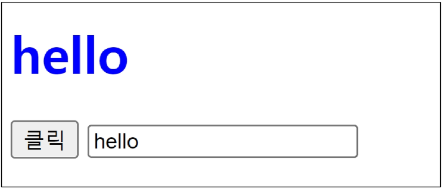

# Controlling Event
## 일상 속의 이벤트
 - 컴퓨터 키보드를 눌러 텍스트를 입력하는 것
 - 전화벨이 울려 전화가 왔음을 알리는 것
 - 손을 흔들어 인사하는 것
 - 전화기의 버튼을 눌러서 통화를 시작하는 것
 - 리모컨을 사용하여 채널을 변경하는 것

## 웹에서의 이벤트
 - 화면을 스크롤하는 것
 - 버튼을 클릭했을 때 팝업창이 출력되는 것
 - 마우스 커서의 위치에 따라 드래그 앤 드롭하는 것
 - 사용자의 키보드 입력 값에 따라 새로운 요소를 생성하는 것
 - 웹에서의 모든 동작은 이벤트 발생과 함께 한다.

## 이벤트
### event
 - 무언가 일어났다는 신호, 사건
 - 모든 DOM 요소는 이러한 event를 만들어 냄

### 'event' object
 - DOM에서 이벤트가 발생했을 때 생성되는 객체
 - 이벤트 종류
     - mouse, input, keyboard, touch ...
     - https://developer.mozilla.org/en-US/docs/Web/API/Event

### DOM 요소는 event를 받고 받은 event를 '처리'할 수 있음
event handler(이벤트 처리기)

### event handler
 - 이벤트가 발생했을 때 실행되는 함수
     - 사용자의 행동에 어떻게 반응할 지를 JavaScript 코드로 표현한 것

### .addEventListener()
 - 대표적인 이벤트 핸들러 중 하나
 - 특정 이벤트를 DOM 요소가 수신할 때마다 콜백 함수를 호출

 

### addEventListener의 인자
 - type
     - 수신할 이벤트 이름
     - 문자열로 작성(ex.'click')

 - handler
     - 발생한 이벤트 객체를 수신하는 콜백 함수
     - 콜백 함수는 발생한 even object를 유일한 매개변수로 받음

### addEventListener 활용
 - 버튼을 클릭하면 버튼 요소 출력하기
     - 버튼에 이벤트 처리기를 부착하여 클릭 이벤트가 발생하면 이벤트가 발생한 버튼 정보를 출력

 - 요소에 addEventListner를 부착하게 되면 내부의 this 값은 대상 요소를 가리키게 됨 (event 객체의 currentTarget 속성 값과 동일)

### addEventListener의 콜백 함수 특징
 - 발생한 이벤트를 나타내는 event 객체를 유일한 매개변수로 받음
 - 반환 값 없음

 

## 버블링
### 버블링 개요
 - form > div > p 형태의 중첩된 구조에 각각 이벤트 핸들러가 있을 때 만약 p 요소를 클릭하면 어떻게 될까?
 

 - p 요소만 클릭했는데도 불구하고 모든 핸들러가 동작함
 - 왜 p를 클릭했는데 div와 form에 할당된 핸들러까지 동작할까?
 

### 버블링(Bubbling)
 - 한 요소에 이벤트가 발생하면, 이 요소에 할당된 핸들러가 동작하고, 이어서 부모 요소의 핸들러가 동작하는 현상
 
 - 가장 최상단의 조상 요소(document)를 만날 때까지 이 과정이 반복되면서 요소 각각에 할당된 핸들러가 동작

 - 이벤트가 제일 깊은 곳에 있는 요소에서 시작해 부모 요소를 거슬러 올라가며 발생하는 것처럼 마치 물속 거품과 닮았기 때문

 - 가장 안쪽의 p 요소를 클릭하면 p->div->form 순서로 3개의 이벤트 핸들러가 모두 동작했던 것
 

### 'currentTarget' & 'target' 속성
 - 'currentTarget' 속성
     - 현재 요소
     - 항상 이벤트 핸들러가 연결된 요소만을 참조하는 속성
     - 'this'와 같음

 - 'target' 속성
     - 이벤트가 발생한 가장 안쪽의 요소(target)를 참조하는 속성
     - 실제 이벤트가 시작된 요소
     - 버블링이 진행되어도 변하지 않음

### 'target' & 'currentTarget' 예시
 - 세 요소 중 가장 최상위 요소인 outerouter 요소에만 핸들러가 부착
 - 각 요소를 클릭했을 때 event의 target과 currentTarget의 차이 비교

 

 - 'currentTarget'
    - 핸들러가 연결된 outerouter 요소만을 가리킴

 - 'target'
     - 실제 이벤트가 발생하는 요소를 가리킴

 - 핸들러는 outerouter에만 할당되어 있지만 하위 요소 outer와 inner를 클릭해도 해당 핸들러가 동작함
 - 클릭 이벤트가 어디서 발생했든 상관없이 outerouter 이벤트가 버블링되어 핸들러를 실행시키기 때문

 

### 캡처링(capturing)
 - 이벤트가 하위 요소로 전파되는 단계(버블링과 반대)

 

### 캡처링과 버블링
 - tabale 안에 td를 클릭하면 이벤트는 최상위 요소부터 아래로 전파
 - 실제 이벤트가 발생한 지점(event.target)에서 실행된 후 다시 위로 전파
     - 이 과정에서 상위 요소에 할당된 이벤트 핸들러가 호출되는 것
 - 캡처링은 실제 다루는 경우가 거의 없으므로 버블링에 집중하기

### 버블링이 필요한 이유
 - 만약 다음과 같이 각자 다른 동작을 수행하는 버튼이 여러 개가 있다고 가정
 - 그렇다면 각 버튼마다 서로 다른 이벤트 핸들러를 할당해야 할까?
 

     - 각 버튼의 공통 조상인 div 요소에 이벤트 핸들러 단 하나만을 할당하기

 - 요소의 공통 조상에 이벤트 핸들러를 단 하나만 할당하면 여러 요소를 한꺼번에 다룰 수 있음
 - 공통 조상에 할당한 핸들러에서 event.target을 이용하면 실제 어떤 버튼에서 이벤트가 발생했는 지 알 수 있기 때문
 

### event handler 활용 실습
 1. 버튼을 클릭하면 숫자를 1씩 증가해서 출력하기
 2. 사용자의 입력 값을 실시간으로 출력하기
 3. 사용자의 입력 값을 실시간으로 출력
     '+' 버튼을 클릭하면 출력한 값의 CSS 스타일을 변경하기
 4. todo 프로그램 구현
 5. 로또 번호 생성기 구현

### 1. click 이벤트 실습
 - 버튼을 클릭하면 숫자를 1씩 증가
 
 

### 2. input 이벤트 실습
 - 사용자의 입력 값을 실시간으로 출력하기
 
 

### 'currentTarget' 주의사항
 - console.log()로 event 객체를 출력할 경우 currentTarget 키의 값은 null을 가짐
 - currentTarget은 이벤트가 처리되는 동안에만 사용할 수 있기 때문
 - 대신 console.log(event.currentTarget)을 사용하여 콘솔에서 확인 가능
 - currentTarget 이후의 속성 값들을 'target'을 참고해서 사용하기

 

### 3. click & input 이벤트 실습
 - 사용자의 입력 값을 실시간으로 출력
     - '+' 버튼을 클릭하면 출력한 값의 CSS 스타일을 변경하기
 
 

### 4. todo 실습
 
 
 - todo 추가 기능 구현
     1. 빈 문자열 입력 방지
     2. 입력이 없을 경우 경고 대화상자를 띄움

 

### 5. 로또 번호 생성기 실습
 
 

### lodash
 - 모듈성, 성능 및 추가 기능을 제공하는 JavaScript 유틸리티 라이브러리
 - array, object 등 자료구조를 다룰 때 사용하는 유용하고 간편한 함수들을 제공
 - https://lodash.com/

### 이벤트의 기본 동작 취소하기
 - HTML의 각 요소가 기본적으로 가지고 있는 이벤트가 때로는 방해가 되는 경우가 있어 이벤트의 기본 동작을 취소할 필요가 있음

 - 예시
     - form 요소의 제출 이벤트를 취소하여 페이지 새로고침을 막을 수 있음
     - a 요소를 클릭할 때 페이지 이동을 막고 추가 로직을 수행할 수 있음

### .preventDefault()
해당 이벤트에 대한 기본 동작을 실행하지 않도록 지정

### 이벤트 동작 취소 실습
 - copy 이벤트 동작 취소
     - 콘텐츠를 복사하는 것을 방지
 
 

 - form 제출 시 페이지 새로고침 동작 취소
    - form 요소의 submit 동작(Action 값으로 요청)을 취소 시킴
 

## 참고
### addEventListener에서의 화살표 함수 주의사항
 - 화살표 함수는 자신만의 this를 가지지 않기 때문에 자신을 포함하고 있는 함수의 this를 상속받음
     -  this를 사용해야 하느 ㄴ경우 addEventListener에서는 일반 함수로 사용하기
 
