## 지난 시간
### Ajax
Asynchronous JavaScript and XML
비동기적인 웹 애플리케이션 개발에 사용하는 기술

### Ajax를 활용한 클라이언트 서버 간 동작
 

## Ajax with follow
### 사전 준비
1. M:N까지 진행한 Django 프로젝트 준비
2. 가상 환경 생성 및 활성화, 패키지 설치

### Ajax 적용
 - 프로필 페이지에 axios CDN 작성
 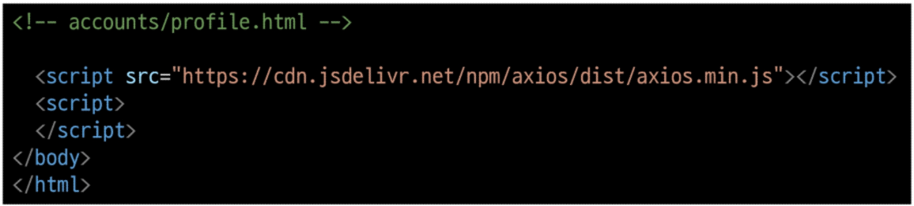

 - form 요소 선택을 위해 id 속성 지정 및 선택
 - action과 method 속성은 삭제
     - 요청은 axios로 대체되기 때문
 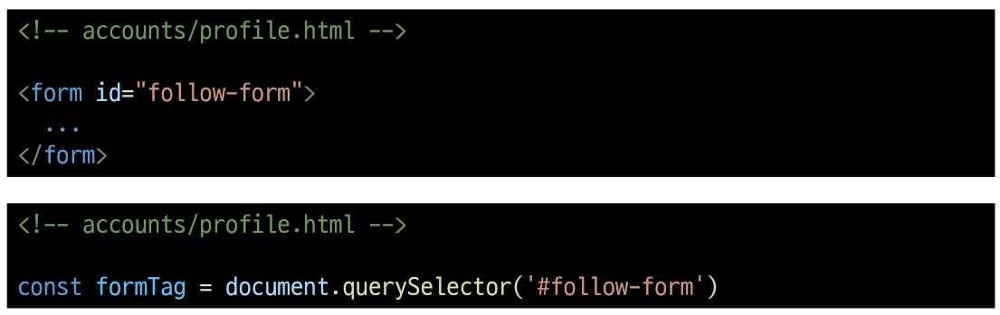

 - form 요소에 이벤트 핸들러 할당
 - submit 이벤트의 기본 동작 취소

 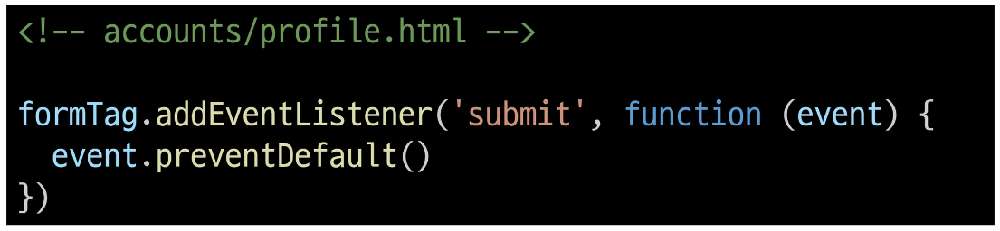

 - axios 요청 작성
     1. url에 작성할 user pk는 어떻게 작성해야 할까?
     2. csrftoken은 어떻게 보내야 할까?
 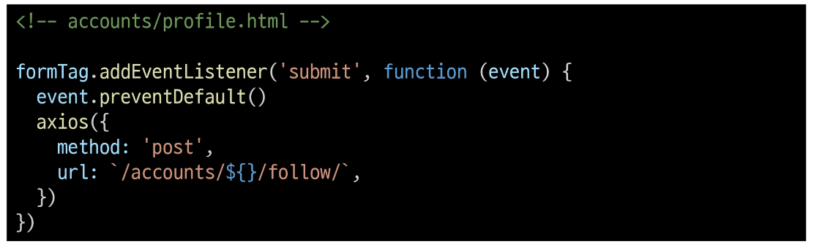

 - url에 작성항ㄹ user pk 가져오기 (HTML -> JavaScript)
 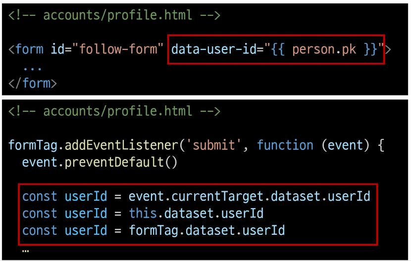

### 'data-*' 속성
사용자 지정 데이터 특성을 만들어 임의의 데이터를 HTML과 DOM 사이에서 교환할 수 있는 방법

### data-* 사용 예시
 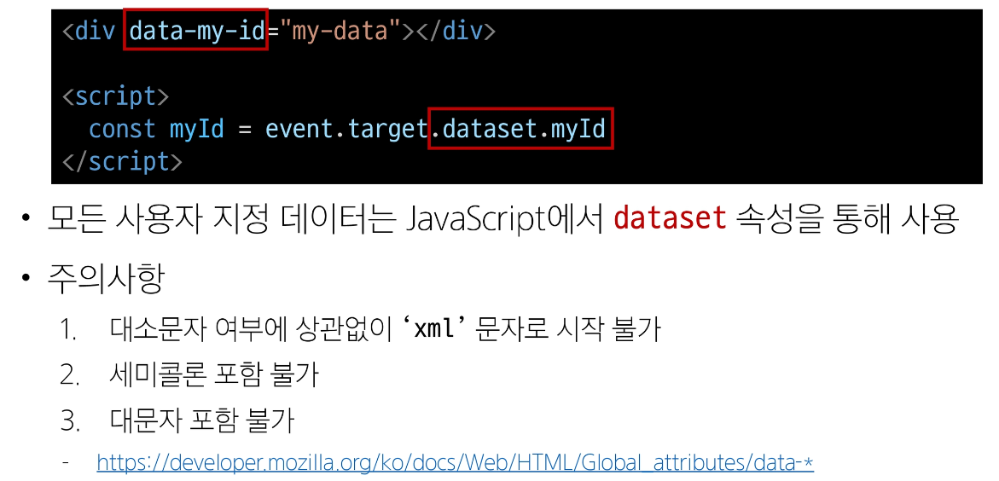

### Ajax 적용(이어서)
 - 요청 url 작성 마무리
 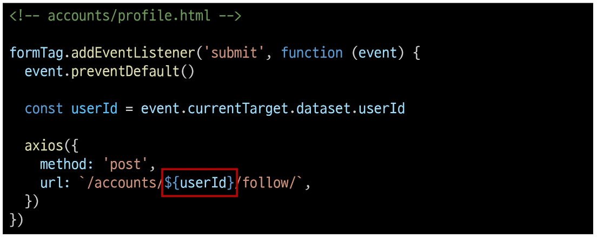

 - 문서상 input hidden 타입으로 존재하는 csrf token 데이터를 이제는 axios로 전송해야 함
 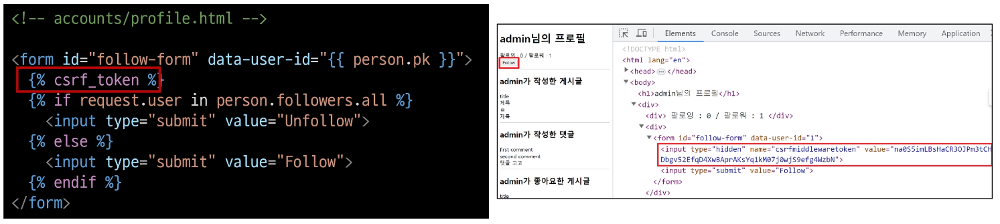

 - csrf 값을 가진 input 요소를 직접 선택 후 axios에 작성하기
 - https://docs.djangoproejct.com/en/4.2/howto/csrf/
 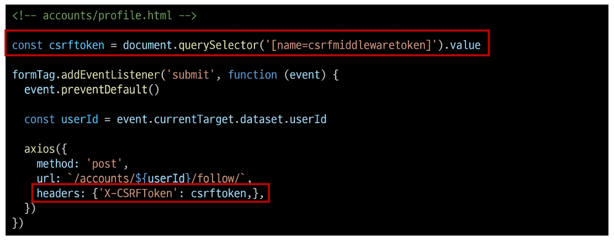

 - 팔로우 버튼을 토글하기 위해서는 현재 팔로우 상태인지 언팔로우 상태인지에 대한 상태 확인이 필요

 - Django의 view 함수에서 팔로우 여부를 파악할 수 있는 변수를 추가로 생성해 JSON 타입으로 응답하기
 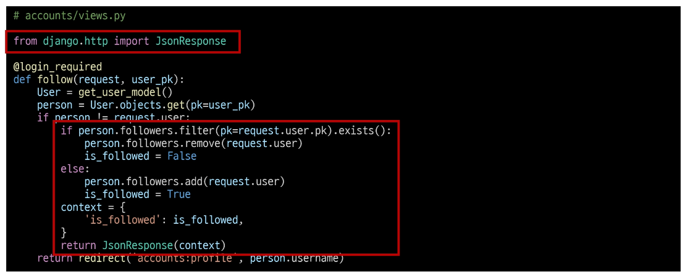

 - 팔로우 요청 후 Django 서버로부터 받은 데이터 확인하기
 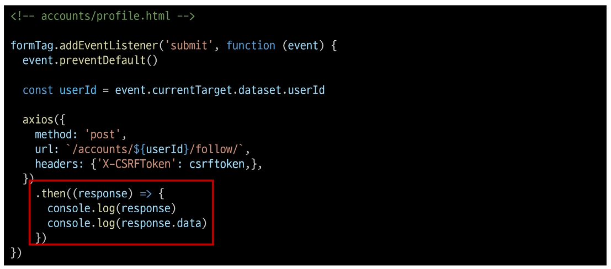

 - 응답 데이터 is_followed에 따라 팔로우 버튼을 토글하기
 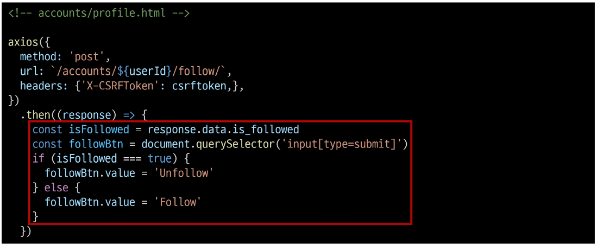

 - 클라이언트와 서버 간 XHR 객체를 주고 받는 것을 확인하기
 - 개발자 도구 - Network
 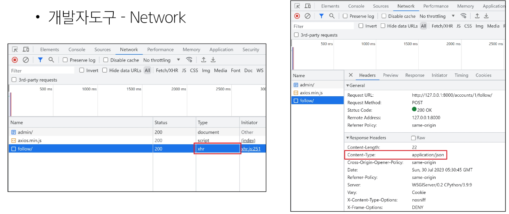

 - 팔로잉 수와 팔로워 수 비동기 적용
 - 해당 요소를 선택할 수 있도록 span 태그와 id 속성 작성
 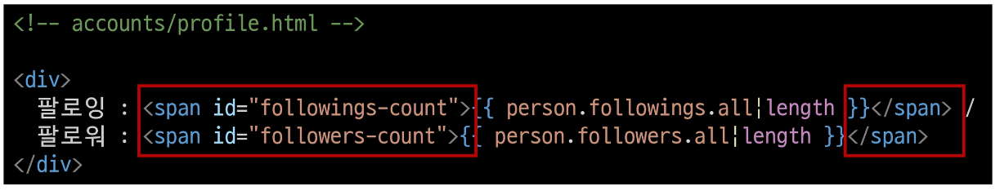

 - 각 span 태그를 선택
 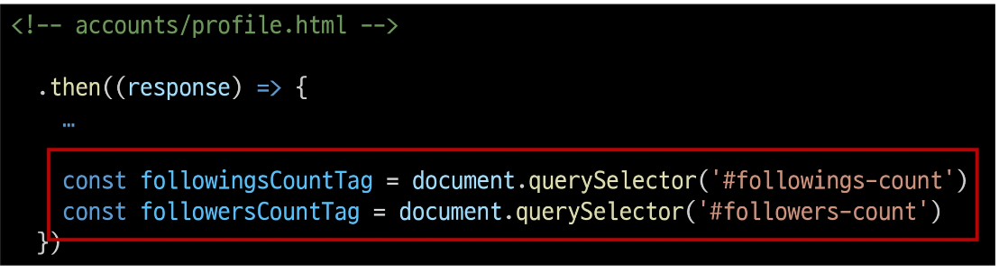

 - Django view 함수에서 팔로워, 팔로잉 인원 수 연산을 진행하여 결과를 응답 데이터로 전달
 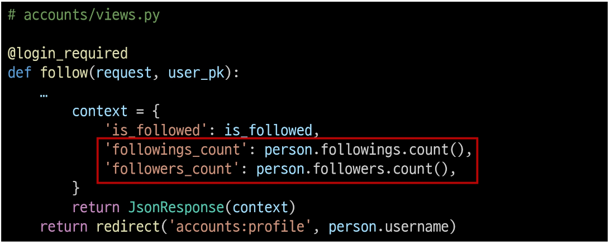

 - 응답 데이터를 받아 각 태그의 인원 수 값 변경에 적용
 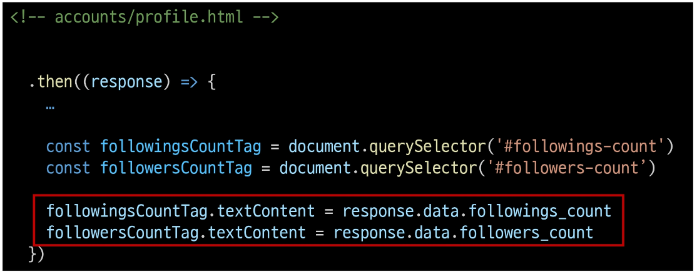

## Ajax with likes
### Ajax 좋아요 적용 시 유의사항
 - 전반적인 Ajax 적용은 팔로우 구현 과정과 모두 동일
 - 단 팔로우와 달리 좋아요 버튼은 한 페이지에 여러 개가 존재
     - 모든 좋아요 버튼에 이벤트 리스너를 할당해야 할까?

### [복습] 버블링
 - 한 요소에 이벤트가 발생하면, 이 요소에 할당된 핸들러가 동작하고, 이어서 부모 요소의 핸들러가 동작하는 현상
 - 가장 최상단의 조상 요소(document)를 만날 때까지 이 과정이 반복되면서 요소 각각에 할당된 핸들러가 동작

### [복습] 버블링이 필요한 이유
 - 만약 다음과 같이 각자 다른 동작을 수행하는 버튼이 여러 개 있다고 가정
 - 그렇다면 각 버튼마다 이벤트 핸들러를 할당해야할까?
     - 각 버튼의 공통 조상인 div 요소에 이벤트 핸들러 단 하나만 할당하기

### Ajax 적용
 - 모든 좋아요 form 요소를 포함하는 최상위 요소 작성
 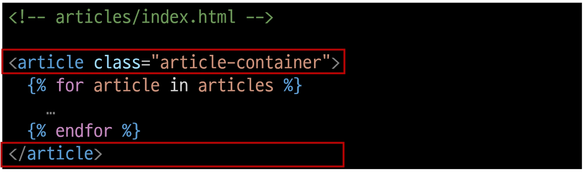

 - 최상위 요소 선택
 - 이벤트 핸들러 할당
 - 하위 요소들의 usbmit 이벤트를 감지하고 submit 기본 이벤트를 취소
 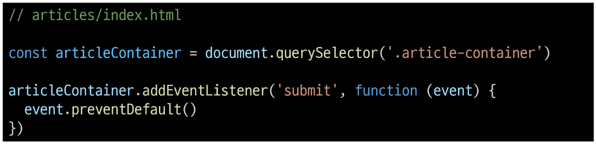

 - axios 작성
     - url에 작성해야 하는 article pk는 어떻게 작성해야 할까?
 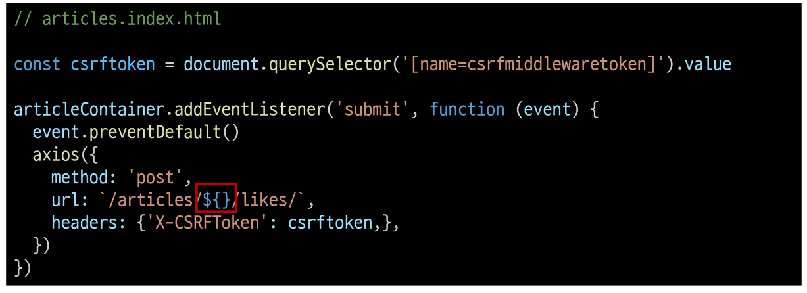

 - 각 좋아요 form에 article.pk를 부여 후 HTML의 article.pk 값을 JavaScript에서 참조하기
 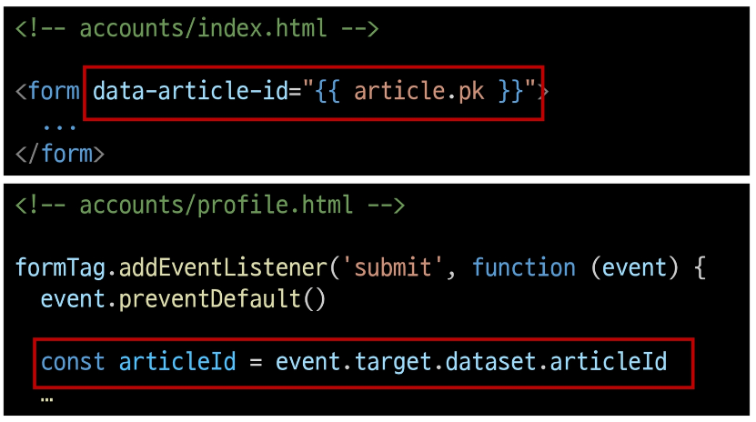

### [복습] 'currentTarget' & 'target'
 - 'currentTarget' 속성
     - 현재 요소
     - 항상 이벤트 핸들러가 연결된 요소만을 참조하는 속성
     - 'this'와 같음

 - 'target' 속성
     - 이벤트가 발생한 가장 안쪽의 요소(target)를 참조하는 속성
     - 실제 이벤트가 시작된 요소
     - 버블링이 진행되어도 변하지 않음

### Ajax 적용 (이어서)
 - url 완성 후 요청 및 응답 확인
 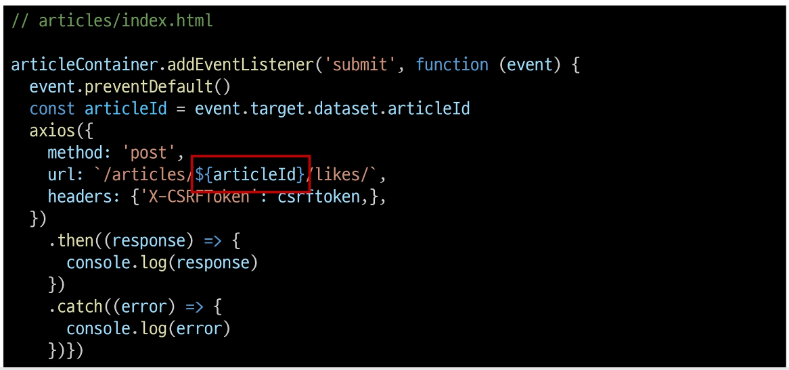

 - 좋아요 버튼을 토글하기 위해서는 현재 사용자가 좋아요를 누른 상태인지 좋아요를 누르지 않은 상태인지에 대한 상태 확인이 필요
     - Django의 view 함수에서 좋아요 여부를 파악할 수 있는 변수 추가 생성
     - JSON 타입으로 응답하기

 - 좋아요 상태 여부를 JavaScript에게 전달할 데이터 작성 및 JSON 데이터 응답
 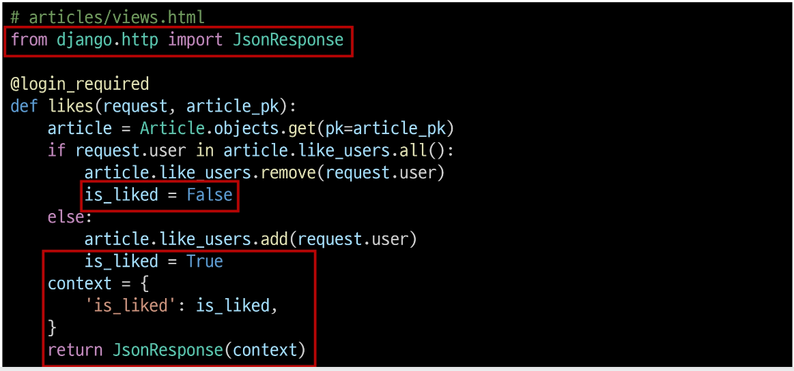

 - 응답 데이터 is_liked를 받아 isLiked 변수에 할당
 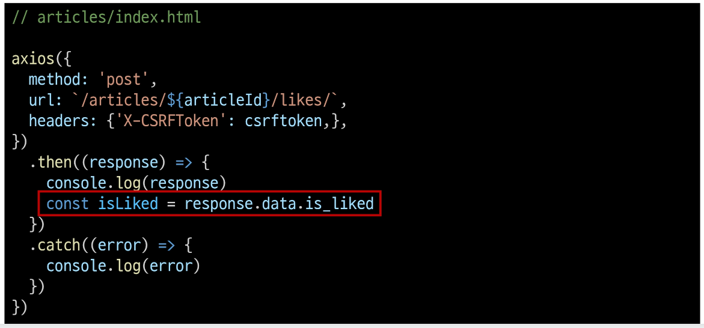

 - isLiked에 따라 좋아요 버튼을 토글하기
     - 그런데 어떤 좋아요 버튼을 선택했는지 확인하기 위한 값이 필요
 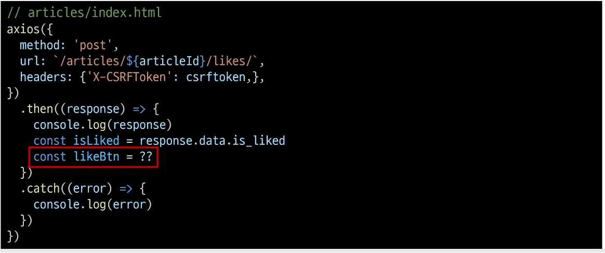

 - 문자와 article의 pk 값을 혼합하여 id 속성 값을 설정
 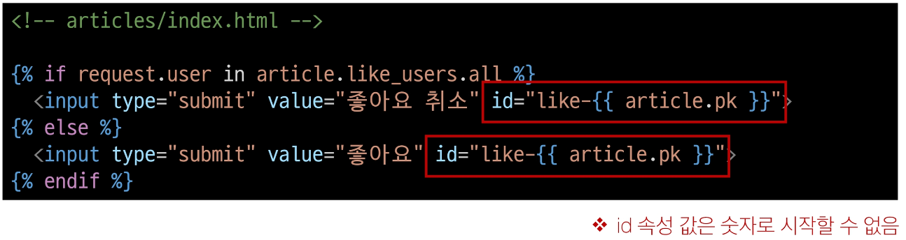

 - 각 좋아요 버튼을 선택 후 isLiked에 따라 버튼을 토글
  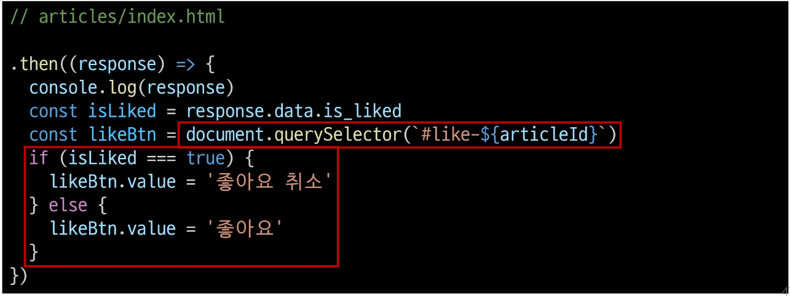

### 버블링을 활용하지 않은 경우
 1. querySelectorAll()을 사용해 전체 좋아요 버튼을 선택
 2. forEach()를 사용해 전체 좋아요 버튼을 순회하면서 진행

 - querySelectorAll() 선택을 위한 class 적용
  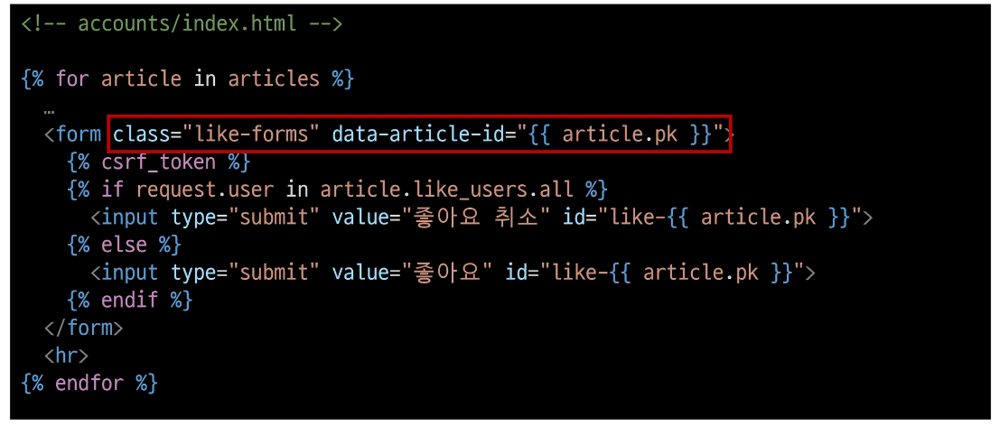
  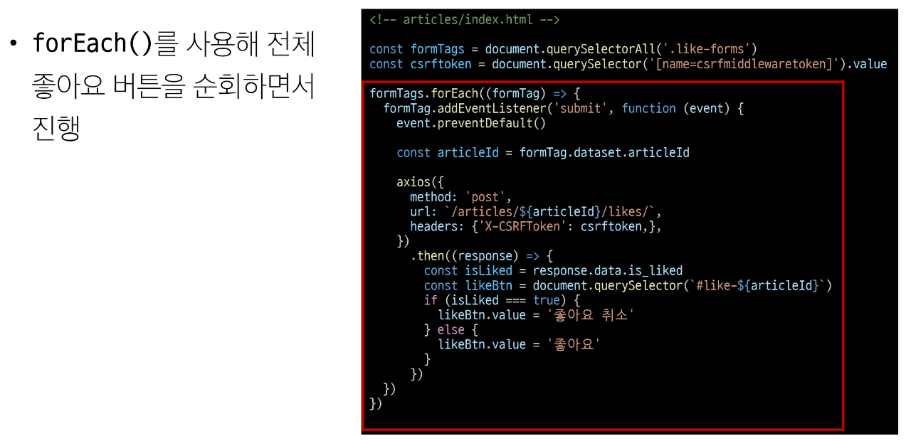
