# 07pjt

## API 서버 제작

### 프로젝트 목표
 - REST API 서버를 직접 구현합니다.
 - 우리는 그 동안 OpenWeatherMap API와 같이 누군가 만들어준 REST API Server를 사용하는 클라이언트였습니다.
 - 이제는 직접 서버를 구축해볼 차례입니다.

### 무슨 서버를 구축할까?
 - 클라이언트에게 날씨 정보를 제공해주는 서버를 구축합니다.

 - 사실 우리는 날씨 정보가 없습니다.
 - 그래서 원본 데이터를 OpenWeatherMap API를 통해 가져올 것입니다.

### 완성된 작품 예시
 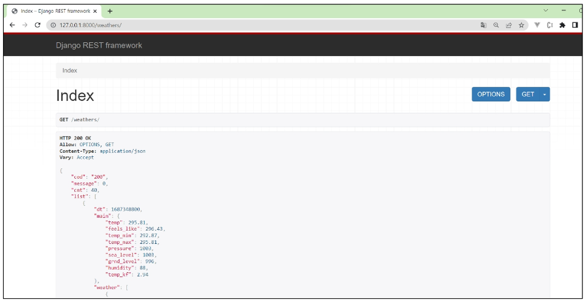

### 참고
 - 백엔드 개발 vs 프론트엔드 개발

 - 백엔드 개발
     - REST API 서버 개발
 - 프론트엔드 개발
     - REST API를 사용하여, 결과를 받아 화면 구성
     - Django로 백엔드를 개발하고, 차후 Vue.js를 학습하여 프론트엔드를 개발하여 하나의 완성된 웹 Application을 개발할 예정입니다.

 - REST API
     - REST (Representational State Transfer)
         1. HTTP URI를 통해 자원을 명시하고
         2. HTTP Method(POST, GET, PUT, DELETE, PATCH 등)를 통해
         3. 해당 자원(URI)에 대한 CRUD Operation을 적용하는 것을 의미합니다.

     - URI에는 데이터의 위치
     - 데이터의 행동: HTTP Method로 구분하자

### 정리
 - 함께 개발하는 것
     - 날씨 정보를 제공하는 REST API 서버 개발
     - OpenWeatherMap API를 활용하여 데이터를 가져옵니다.
     - DB를 구축하여 날씨 정보를 DB에 저장 후 활용합니다.

### 준비사항 - API KEY 발급
 Quiz : 왜 API KEY를 발급받아야 하나
 Ans : 인증된 사용자임을 증명하기 위해

### OpenWeatherMap API - KEY 발급
 - 사이트 접속 및 회원가입 진행
 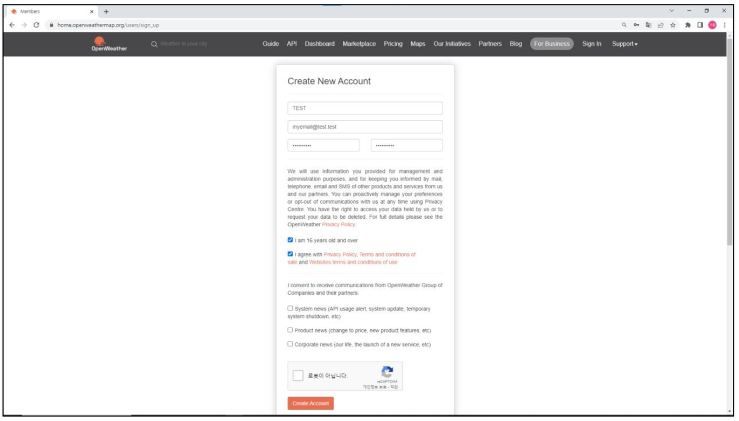

 - API Keys 탭으로 이동
 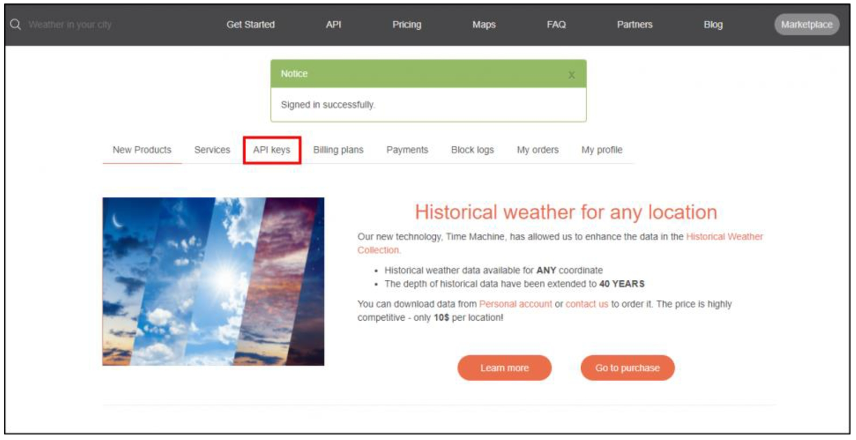

 - API Key 복사
     - API Key를 복사하여 콛에서 활용합니다.
 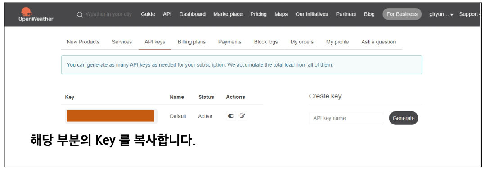

## 구현하기
### 참고 - 프로젝트 구조
 - 외부 API를 활용하여 데이터를 다운로드 받아 DB에 저장합니다.
 - 왜 DB에 저장하나요?
     - DB에 저장하여 여러 번 외부로부터 데이터를 다운로드 받지 않도록 구성할 수 있습니다.
     - 네트워크 연결이 불안정하거나 API 서비스가 일시적으로 중단된 경우에도 애플리케이션이 작동할 수 있습니다.

 

### 구현 목표
 - 구현하고자 하는 기능 목록은 다음과 같습니다.
     A. 서울의 5일 치 예보 데이터 확인
     B. 예보 데이터 중 원하는 데이터만 DB에 저장
     C. 저장된 전체 데이터 조회
     D. 특정 조건의 데이터 확인하기: 섭씨 30도가 넘는 시간대만 조회

 - API docs: https://openweathermap.org/forecast5

 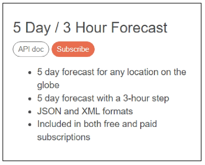

### A. 서울의 5일 치 예보 데이터 확인
 - API에 요청을 보내고 데이터를 확인합니다.
     - DB에 저장하기 전 데이터를 확인하기 위한 과정입니다.

 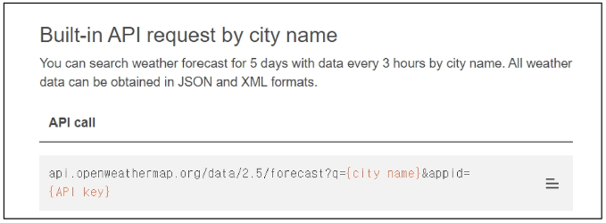

 - views.py 작성 예시
 - 결과 예시

 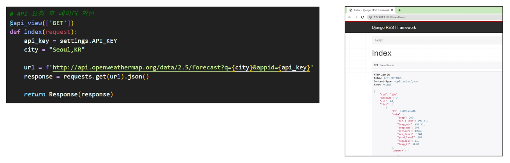

### B. 예보 데이터 중 원하는 데이터만 DB에 저장
 - A번에서 받은 데이터 중 "시간, 온도, 체감온도" 3가지만 사용합니다.
     - dt_txt: 시간
     - temp: 온도
     - feels_like: 체감 온도

 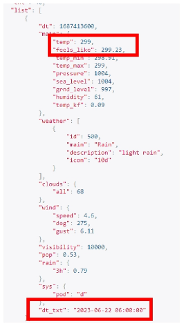

 - 3가지 필드를 DB에 저장하기 위해 다음과 같이 models.py를 작성합니다.
 - 마이그레이션 파일을 생성하고 DB에 반영합니다.

 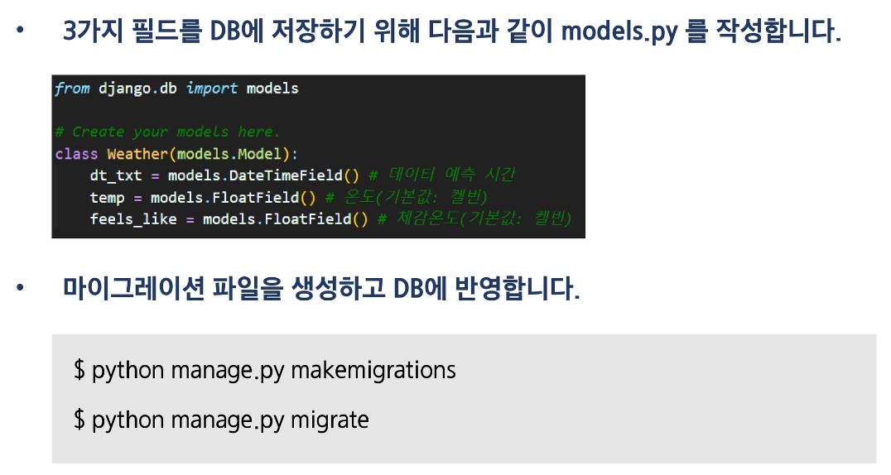

 - 받아온 데이터 중 3가지 데이터만 추출하여 저장해야 한다.
     - key 값이 "list"인 데이터를 반복하며 확인합니다.
     - 시간은 UTC로 저장되어 있어 코드와 같이 한국 시간으로 변경하여 줍니다.
     - 추출한 데이터를 Serializer에 넣어줍니다.
     - 데이터 유효성 검증 후 저장합니다.

 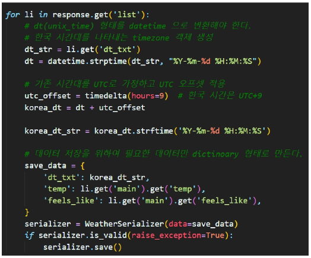

 - 저장된 데이터는 vscode의 sqlite extension을 통해 확인합니다.
     - 저장 후 화면
     - 저장 결과 확인

 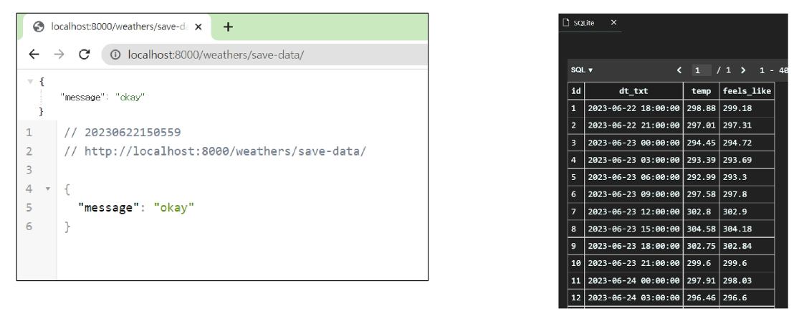

### C. 저장된 전체 데이터 조회
 - ORM을 활용해 전체 데이터를 확인합니다.

 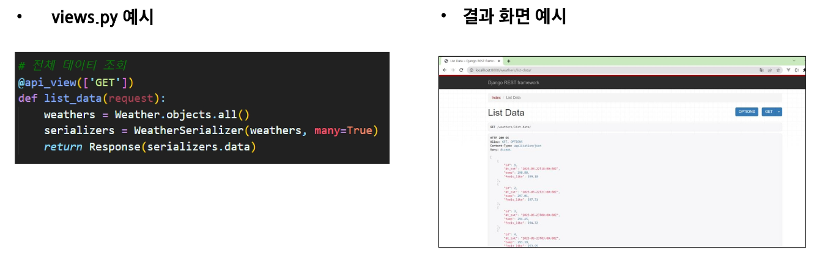

### D. 특정 조건의 데이터 확인하기: 섭씨 30도가 넘는 시간대만 조회
 - 저장한 데이터 중 조건에 맞는 데이터만 반환해줍니다.
     - 전체 데이터를 반복하여 섭씨 30도가 넘는 데이터만 새로운 리스트로 만들어줍니다.
     - 새로운 리스트를 serializer를 통해 사용자에게 반환해줍니다.

 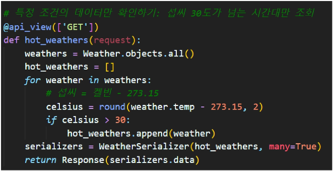
 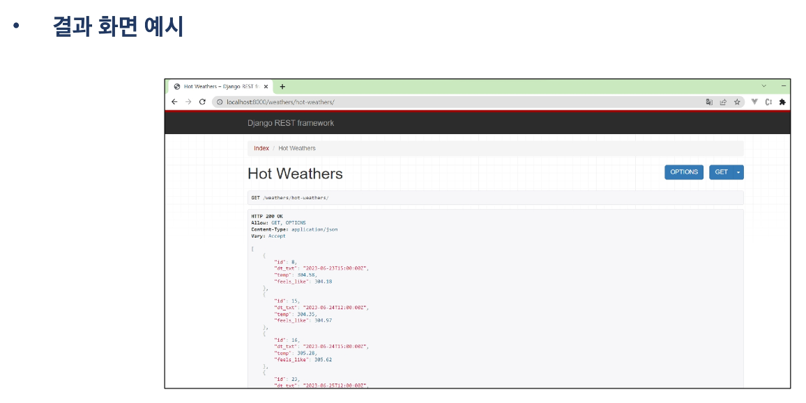

### 관통 Ver1 - PJT07 도전 과제
 - 프로젝트명: 금융 상품 데이터를 활용한 REST API Server 구축
 - 목표
     - 정기예금 데이터를 활용한 REST API Server 구축하기
 - 특징
     - 금융감독원 API를 활용한 데이터 수집