# Vue 02
## Template Syntax
### Template Syntax
DOM을 기본 구성 요소 인스턴스의 데이터에 선언적으로 바인딩(Vue Instance와 DOM을 연결)할 수 있는 HTML 기반 템플릿 구문(확장된 문법 제공)을 사용

### Template Syntax 종류
 1. Text Interpolation
 2. Raw HTML
 3. Attribute Binding
 4. JavaScript Expressions

### 1. Text Interpolation
 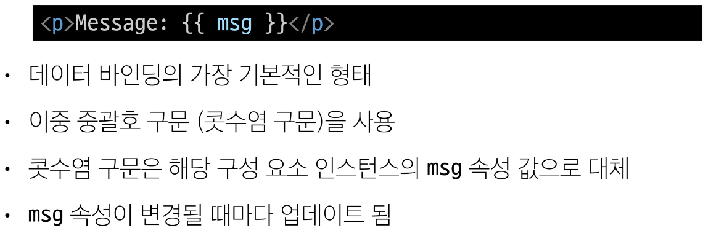
 - 여기서는 msg = 'Message'와 같이 인스턴스가 존재함을 가정함
 - 일반 텍스트로 해석된다.

### 2. Raw HTML
 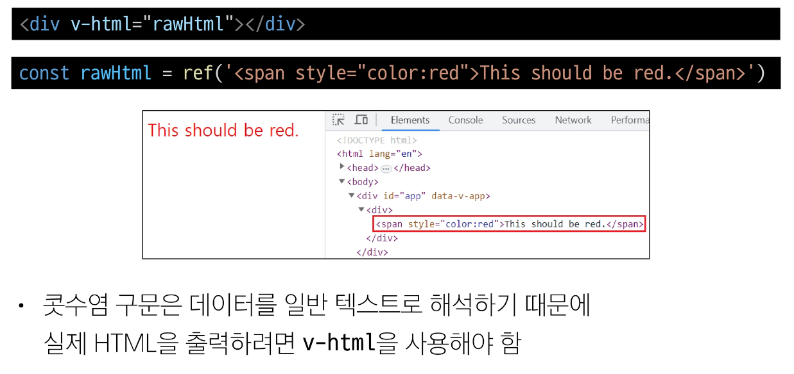

### 3. Attribute Bindings
 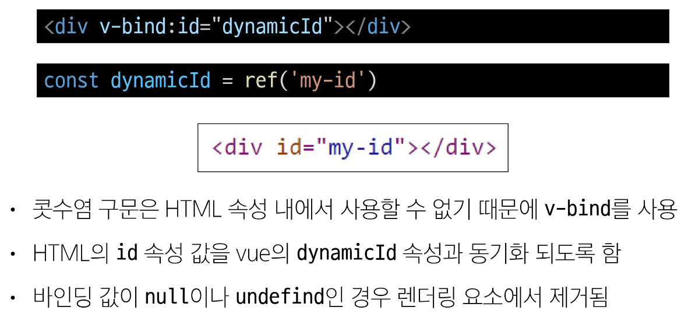

### 4. JavaScript Expressions
 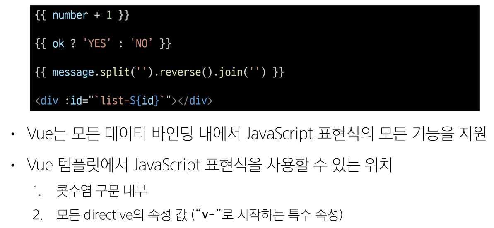

### Expressions 주의사항
 - 각 바인딩에는 하나의 단일 표현식만 포함될 수 있음
     - 표현식은 값으로 평가할 수 있는 코드 조각 (return 뒤에 사용할 수 있는 코드여야 함)

 - 작동하지 않는 경우
 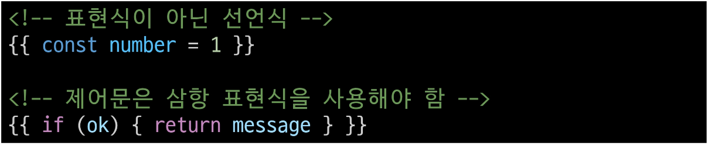

### Directive
'v-' 접두사가 있는 특수 속성

### Directive 특징
 - Directive의 속성 값은 단일 JavaScript 표현식이어야 함
 (v-for, v -on 제외)
 - 표현식 값이 변경될 때 DOM에 반응적으로 업데이트를 적용
 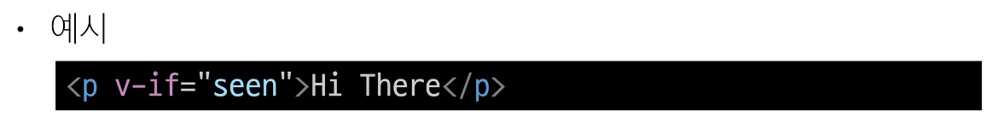

### Directive 전체 구문
 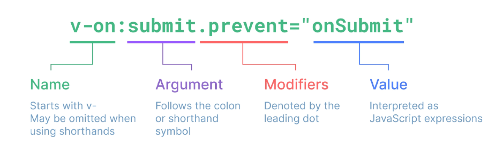

### Directive - "Arguments"
 - 일부 directive는 directive 뒤에 콜론(":")으로 표시되는 인자를 사용할 수 있음
 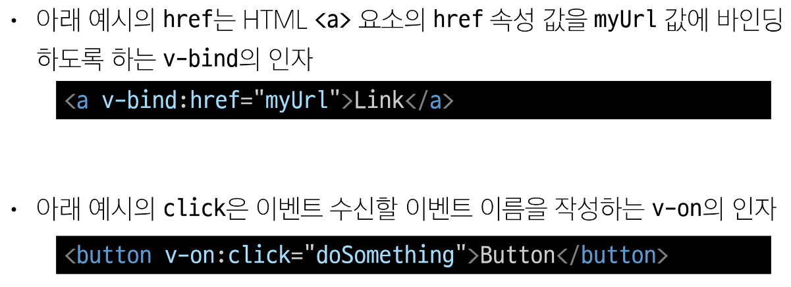

### Directive - "Modifiers"
 - ". (dot)"로 표시되는 특수 접미사로, directive가 특별한 방식으로 바인딩되어야 함을 나타냄
 - 아래 예시의 .prevent는 발생한 이벤트에서 event.preventDefault()를 호출하도록 v-on에 지시하는 modifier
 

### Built-in Directives
 - v-text
 - v-show
 - v-if
 - v-for
 - ...
 - https://vuejs.org/api/built-in-directives.html

## Dynamically data binding
### v-bind
 하나 이상의 속성 또는 컴포넌트 데이터를 표현식에 동적으로 바인딩

### v-bind 사용처
 1. Attribute Bindings
 2. Class and Style Bindings

### Attribute Bindings
 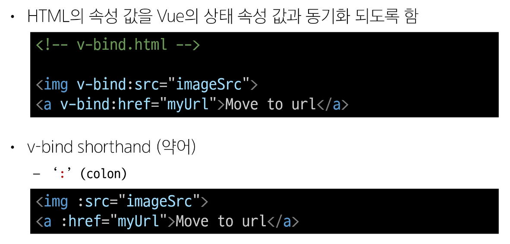
 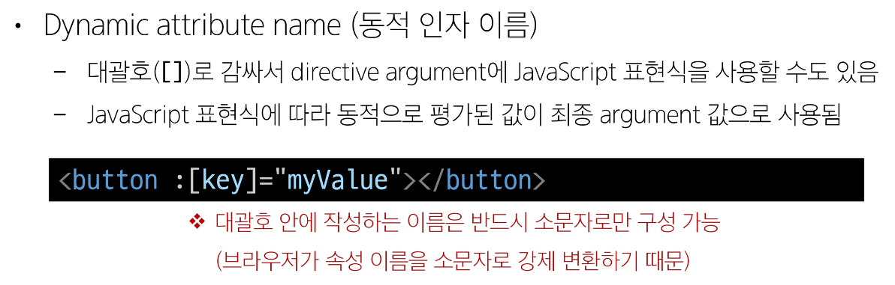

### Attribute Bindings 예시
 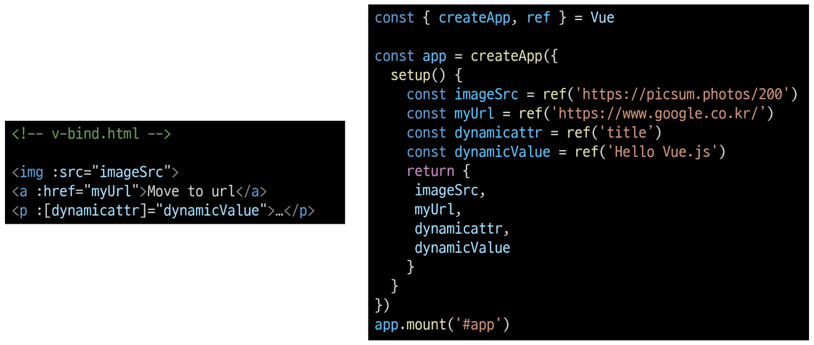
 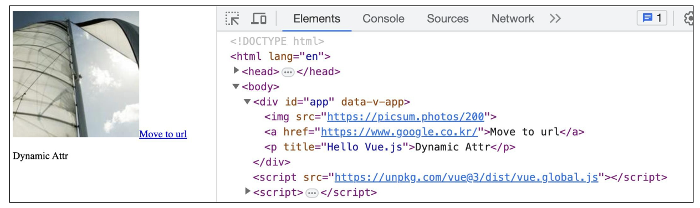

### Class and Style Bindings
 - class와 style 모두 HTML 속성이므로 다른 속성과 마찬가지로 v-bind를 사용하여 동적으로 문자열 값을 할당할 수 있음
 - Vue는 class 및 style 속성 값을 v-bind로 사용할 때 '객체' 또는 '배열'을 활용하여 작성할 수 있도록 함
     - 단순히 문자열 연결을 사용하여 이러한 값을 생성하는 것을 번거롭고 오류가 발생하기가 쉽기 때문

### Class and Style Bindings가 가능한 경우
 1. Binding HTML Classes
     1) Binding to Objects
     2) Binding to Arrays

 2. Binding Inline Styles
     1) Binding to Objects
     2) Binding to Arrays

### 1.1 Binding HTML Classes - Binding to Objects
 - 객체를 :class에 전달하여 클래스를 동적으로 전환할 수 있음

 - 예시 1
     - isActive의 Boolean 값에 의해 active 클래스의 존재가 결정됨
 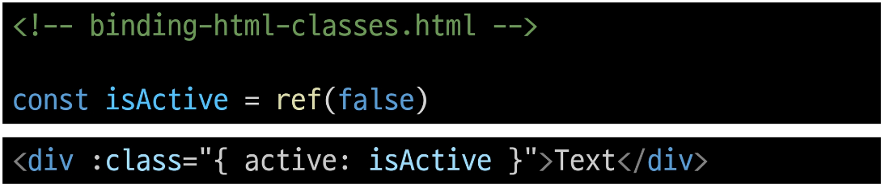

 - 객체에 더 많은 필드를 포함하여 여러 클래스를 전환할 수 있음
 - 예시 2
     - :class directive를 일반 클래스 속성과 함께 사용 가능
 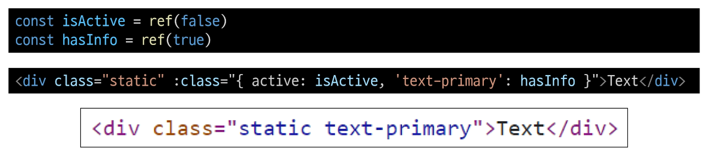

 - 반드시 inline 방식으로 작성하지 않아도 됨
 - 반응형 변수를 활용해 객체를 한 번에 작성하는 방법
 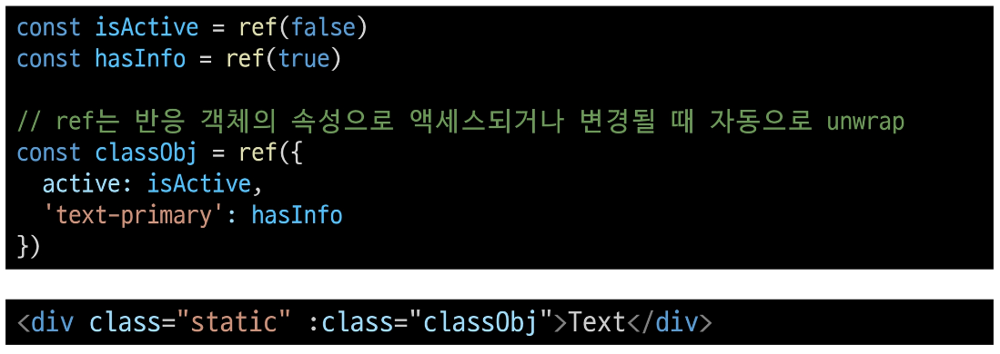

### 1.2 Binding HTML Classes - Binding to Arrays
 - :class를 배열에 바인딩하여 클래스 목록을 적용할 수 있음

 - 예시 1
 

 - 배열 구문 내에서 객체 구문을 사용하는 경우
 - 예시 2
 

### 2.1 Binding Inline Styles - Binding to Objects
 - :style은 JavaScript 객체 값에 대한 바인딩을 지원
 (HTML style 속성에 해당)

 - 예시 1
 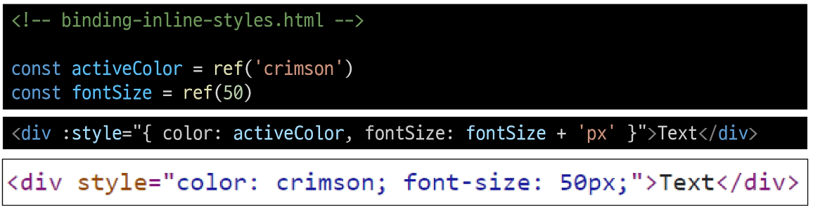

 - 실제 CSS에서 사용하는 것처럼 :style은 kebab-cased 키 문자열도 지원(단, camelCase 작성을 권장)

 - 예시 2
 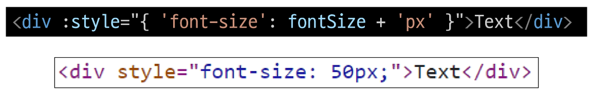

 - 반드시 inline 방식으로 작성하지 않아도 됨
 - 반응형 변수를 활용해 객체를 한 번에 작성하는 방법

 - 예시 3
 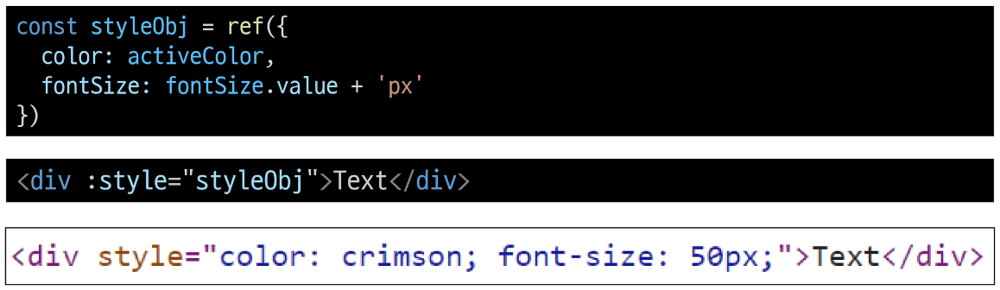

### 2.2 Binding Inline Styles - Binding to Arrays
 - 여러 스타일 객체를 배열에 작성해서 :style을 바인딩할 수 있음
 - 작성한 객체는 병합되어 동일한 요소에 적용
 - 예시 3
 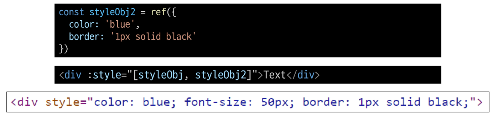

### v-bind 종합
 - https://vuejs.org/api/built-in-directives.html#v-bind

## Event Handling
### v-on
DOM 요소에 이벤트 리스너를 연결 및 수신

### v-on 구성
 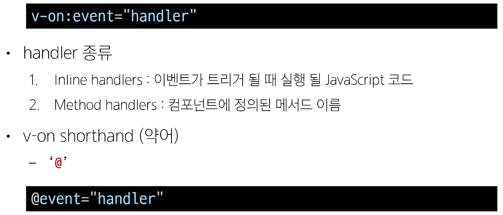

### 1. Inline handlers
 - Inline handlers는 주로 간단한 상황에 사용
 - HTML 요소 내에 직접 이벤트 핸들러를 정의하기 때문
 

### 2. Method Handlers
 - Inline handlers로는 불가능한 대부분의 상황에서 사용
 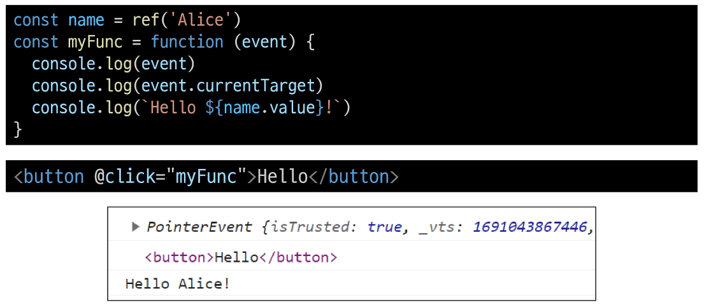

 - Method Handlers는 이를 트리거하는 기본 DOM event 객체를 자동으로 수신
 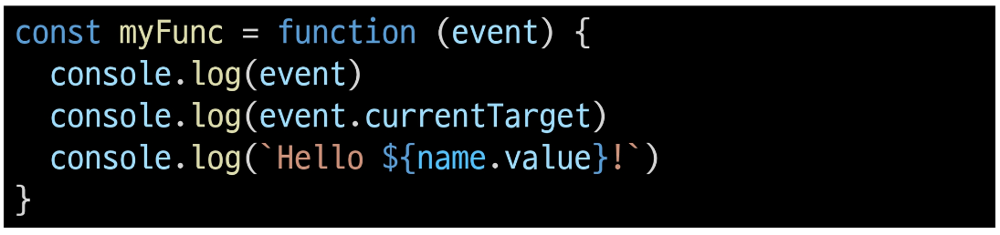

### Inline Handlers에서의 메서드 호출
 - 메서드 이름에 직접 바인딩하는 대신 Inline Handlers에서 메서드를 호출할 수도 있음
 - 이렇게 하면 기본 이벤트 대신 사용자 지정 인자를 전달할 수 있음
 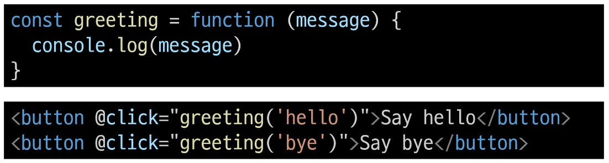

### Inline Handlers에서의 event 인자에 접근하기
 - Inline Handlers에서 원래 DOM 이벤트에 접근하기
 - $event 변수를 사용하여 메서드에 전달
 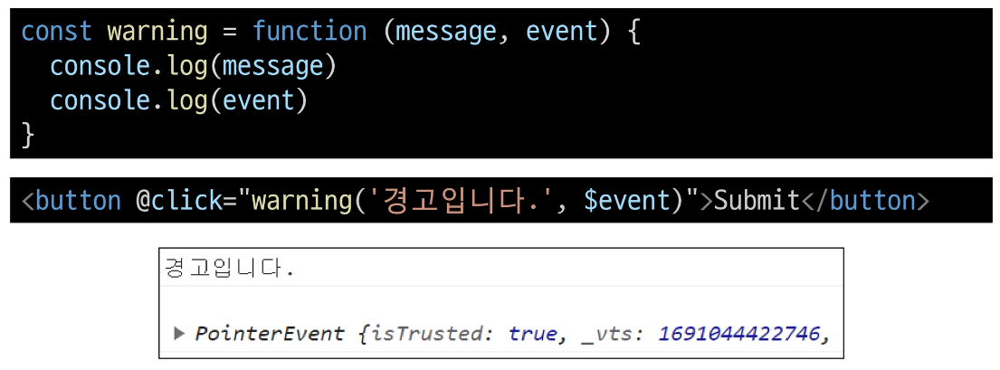

### Event Modifiers
 - Vue는 v-on에 대한 Event Modifiers를 제공해 event.preventDefault()와 같은 구문을 메서드에서 작성하지 않도록 함
 - stop, prevent, self 등 다양한 modifiers를 제공
     - 메서드는 DOM 이벤트에 대한 처리보다는 데이터에 관한 논리를 작성하는 것에 집중할 것
 

### Key Modifiers
 - Vue는 키보드 이벤트를 수신할 때 특정 키에 관한 별도 modifiers를 사용할 수 있음
 - 예시
     - key가 Enter일때만 onSubmit 이벤트를 호출하기
 

### v-on 종합
 - https://vuejs.org/api/built-in-directives.html#v-on

## Form Input Bindings
### Form Input Bindings
 - form을 처리할 때 사용자가 input에 입력하는 값을 실시간으로 JavaScript 상태에 동기화해야 하는 경우(양방향 바인딩)
 
 - 양방향 바인딩 방법
     1. v-bind와 v-on을 함께 사용
     2. v-model 사용

### 1. v-bind와 v-on을 함께 사용
 1. v-bind를 사용하여 input 요소의 value 속성 값을 입력 값으로 사용
 2. v-on을 사용하여 input 이벤트가 발생할 때마다 input 요소의 value 값을 별도 반응형 변수에 저장하는 핸들러를 호출
 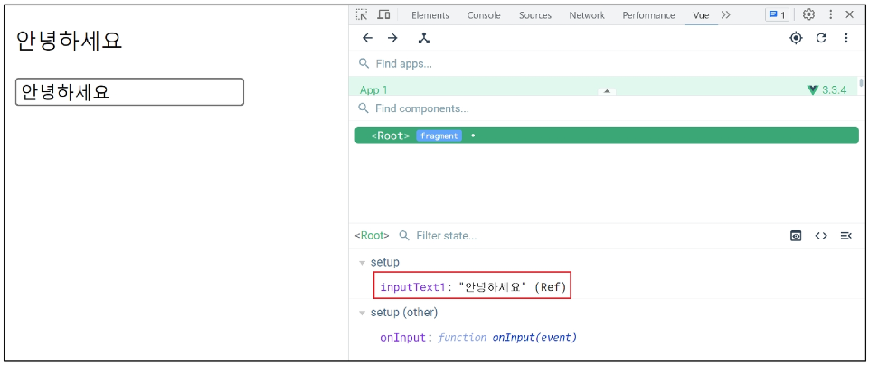
 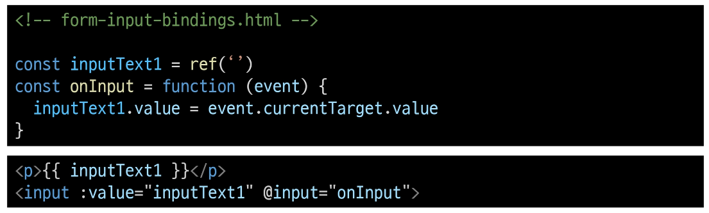

### v-model
form input 요소 또는 컴포넌트에서 양방향 바인딩을 만듦

### 2. v-model 사용
 - v-model을 사용하여 사용자 입력 데이터와 반응형 변수를 실시간 동기화
 

 - IME가 필요한 언어(한국어, 중국어, 일본어 등)의 경우 v-model이 제대로 업데이트되지 않음
 - 해당 언어에 대해 올바르게 응답하려면 v-bind와 v-on 방법을 사용해야 함

## v-model 활용
### v-model과 다양한 입력(input) 양식
 - v-model은 단순 Text input 뿐만 아니라 Checkbox, Radio, Select 등 다양한 타입의 사용자 입력 방식과 함께 사용 가능

### Checkbox 활용
 1. 단일 체크박스와 boolean 값 활용
 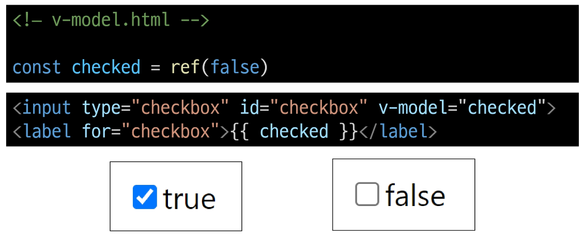

 2. 여러 체크박스와 배열 활용
     - 해당 배열에는 현재 선택된 체크박스의 값이 포함됨
 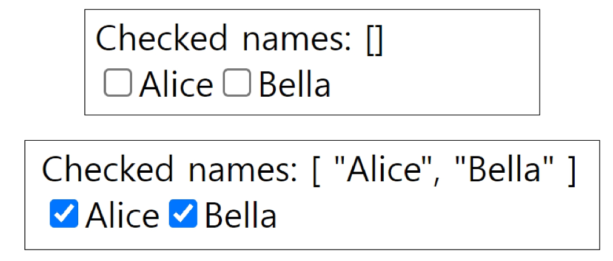
 

### Select 활용
 - select에서 v-model 표현식의 초기 값이 어떤 option과도 일치하지 않는 경우 select 요소는 "선택되지 않은(unselected)" 상태로 렌더링 됨
 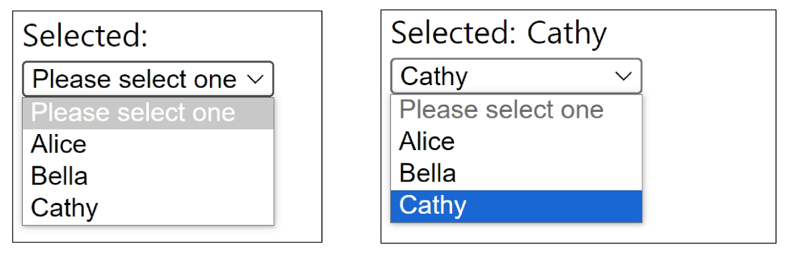

 - select에서 v-model 표현식의 초기 값이 어떤 option과도 일치하지 않는 경우 select 요소는 "선택되지 않은(unselected)" 상태로 렌더링 됨
 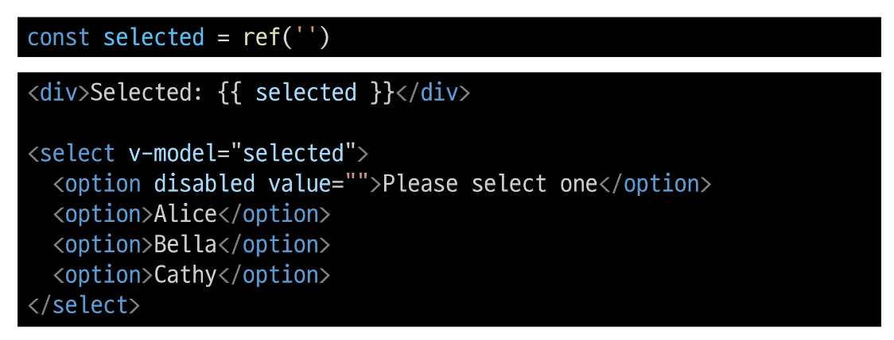

### v-model 종합
https://vuejs.org/api/built-in-directives.html#v-model

## 참고
### '$' 접두어가 붙은 변수
 - Vue 인스턴스 내에서 제공되는 내부 변수
 - 사용자가 지정한 반응형 변수나 메서드와 구분하기 위함
 - 주로 Vue 인스턴스 내부 상태를 다룰 때 사용

### IME (Input Method Editor)
 - 사용자가 입력 장치에서 기본적으로 사용할 수 없는 문자(비영어권 언어)를 입력할 수 있도록 하는 운영체제 구성 프로그램
 - 일반적으로 키보드 키보다 자모가 더 많은 언어에서 사용해야 함

 - IME 가 동작하는 방식과 Vue의 양방향 바인딩(v-model) 동작 방식이 상충하기 때문에 한국어 입력 시 예상대로 동작하지 않았던 것