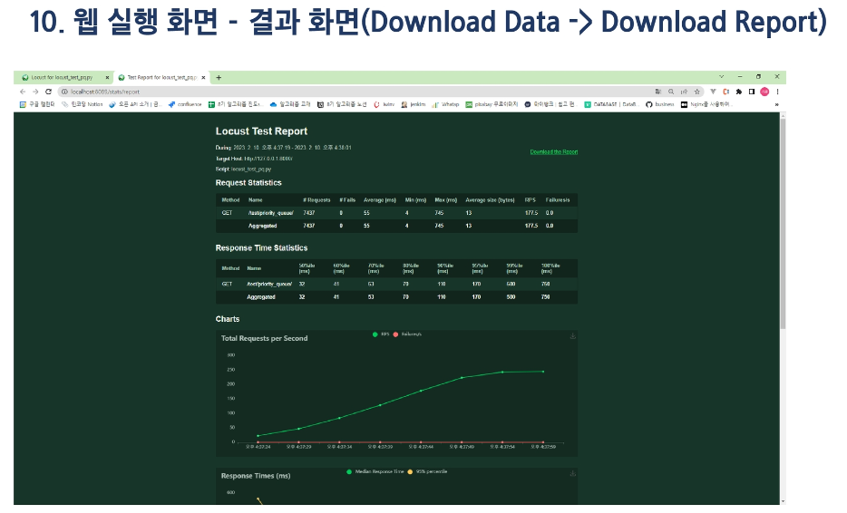

# 목표
## 프로젝트 목표
 - Locust 라는 툴을 이용하면 사진과 같이 성능 테스트를 할 수 있습니다.
 

## 테스트
### 테스트란?
 - 원하는 기능이 모두 구현되었는 지 확인하고, 숨겨져 있는 결함을 찾는 활동

 - 여러 가지 도구들을 활용하여 버그를 찾아내고 신뢰성, 보안, 성능 등을 검증하는 중요한 단계

 - 상황에 맞게 필요한 테스트를 진행해야 한다(암기 X)

### 성능 테스트
 - 핵심적인 테스트 중 하나
 - 특정 상황에서 시스템이 어느 정도 수준을 보이는가 혹은 어떻게 대처를 하는가를 테스트하는 과정
 - 목적
     - 여러 테스트를 통해 성능 저하가 발생하는 요인을 발견하고 제거
     - 시장에 출시되기 전에 발생할 수 있는 위험과 개선사항을 파악
     - 안정적이고 신뢰할 수 있는 제품을 빠르게 만들기 위함

 

 - 성능 테스트의 종류도 많습니다.
 - 그 중 프로젝트에서는 핵심인 부하 테스트와 스트레스 테스트를 배웁니다.

### 부하 테스트 (Load Testing)
 - 시스템에 임계점의 부하가 계속될 때 문제가 없는가?
 - 목적: 시스템의 신뢰도와 성능을 측정

 

### 부하 테스트 vs 스트레스 테스트

 

## API 성능 테스트
### Locust
 - 오픈 소스 부하 테스트 도구
 - 번역하면 메뚜기, 테스트 중 메뚜기 떼가 웹 사이트를 공격한다는 의미에서 착안
 - 내가 만든 서버에 수많은 사람이 동시에 들어올 때 어떤 일이 벌어지는 지 확인하는 부하 테스트를 할 수 있는 도구
 - Locust를 선택한 이유
     - 파이썬 언어로 테스트 시나리오를 간편하게 작성할 수 있습니다.
     - 결과를 웹에서 확인할 수 있는 UI를 지원합니다.

### Locust 사용법
 1. 테스트 스크립트 작성하기(공식문서 참조)
 

 2. Django 서버 실행 - 제공된 Django API 서버를 실행합니다.
 

 3. vscode 터미널 추가 & Locust 설치 및 실행
 

 4. Locust 정상 실행 시 터미널에 아래와 같이 접속할 수 있는 URL이 출력됩니다.
 

 - http://localhost:8089로 접속하면 Web 화면을 볼 수 있다.
     - 주의사항: 콘솔에서 출력되는 http://0.0.0.0:8089로 접속하면 에러가 난다.

 5. 웹 실행 화면 (http://localhost:8089 접속)
 

 6. 웹 실행 화면 - Statistics 탭
 

 7. 웹 실행 화면 -Charts 탭
 

 8. 웹 실행 화면 - Failures 탭
 

 9. 웹 실행 화면 - Current ratio 탭
 

 10. 웹 실행 화면 - 결과 화면(Download Data -> Download Report)
 

 11. 콘솔 종료 화면
 

## 정렬 알고리즘 테스트
### 테스트 주의사항
 - 오늘 테스트는 정석적인 방법과는 거리가 있습니다.
     - 정석: 서버에 배포된 API 또는 프로그램에 부하 테스트를 해야 합니다.
 - 하지만, 현재는 PC에서 작동 중인 서버로 요청을 보내는 것
     - PC의 성능에 따라 결과가 매우 달라집니다.
     - 현재 서버가 작동 중인 PC에서 테스트를 진행하므로, 테스트 중 다른 조작을 하지 말아야 합니다.

### 정렬 알고리즘 구현하기
 - 대상
     1. 파이썬 내장 정렬함수 = O(NlogN)
     2. 버블 정렬 = O(N^2)
     3. 우선순위 큐 - 삽입 = O(logN), 삭제:O(logN)
 - 시나리오 1. 랜덤 배열 크기 1,000 / 랜덤 범위 5,000의 배열을 만들어 가장 큰 값 찾기
 - 시나리오 2. (10배) 랜덤 배열 크기 10,000 / 랜덤 범위 50,000의 배열을 만들어 가장 큰 값 찾기

 - 가상 환경 설정
 - 테스트 용 Django 프로젝트 및 앱 생성
 

 - 각 정렬 알고리즘에 요청을 보낼 수 있도록 코드 작성
 
 

 - 테스트 스크립트 작성하기
 

## 정렬 알고리즘 테스트 - 시나리오 1
### 테스트 결과 예시 - Python Built-in Sort
 - 랜덤 배열 크기 1,000 / 랜덤 범위 5,000 
 - 동시 사용자: 500 / 동시 접속자 20
 

### 테스트 결과 예시 - 버블 정렬
 
 

### 테스트 결과 예시 - 우선순위 큐
 

### 테스트 결과 예시 - Python Built-in Sort
 

### 테스트 결과 예시 - 버블 정렬
 - 랜덤 배열 크기 10,000 / 랜덤 범위 50,000 / 동시 사용자 500 / 동시 접속자 20
 - 동시 사용자와 동시 접속자 수에 관계 없이 버블 정렬은 결과를 나타내지 못했습니다.
     - 원인 : 서버 시간 초과
 - 응답에 너무 많은 시간이 걸리는 알고리즘은 테스트 불가능!

### 테스트 결과 예씨 - 우선순위 큐
 

## 테스트 결론
### 결론
 - 직접 구현한 우선순위 큐보다 파이썬의 내장 함수가 안정적이고 빠릅니다.
     - 병목 현상이 발생하지 않음
     - 응답 시간이 최고/최악 모두 빠르다.

 - 알고리즘에 따라 서버 성능이 크게 좌우될 수 있습니다.
 - 테스트 결과가 보여주는 내용은 작성한 결론 외에도 수많은 정보를 내포하고 있습니다.
     - 추가적으로 많은 학습이 필요합니다.

### 요약
 - 테스트 및 성능 테스트의 개념을 알아보고, Locust를 활용한 부하 테스트를 해보았습니다.
 - 스트레스 테스트 등의 다른 테스트는 명확한 목표를 정하고 진행해야 합니다.
     - 개선사항의 방향을 찾기 위해 테스트를 진행합니다.
     - 예시) 우리 서버는 반드시 0.8초 이내에 모든 응답을 주어야 한다.
 - 여러 번 테스트를 해 보아야 정확한 결과를 받을 수 있습니다.
     - 최대 부하 지점(임계점)의 부하를 지속하여 서버를 테스트한다. == 부하 테스트
     - 과부하가 오는 시점(중단점)을 찾아 지속적 혹은 반복적으로 서버를 테스트한다. == 스트레스 테스트

### 관통 ver 1 - PJT08 도전 과제
 - 알고리즘 구현 및 성능 측정
 - Pandas 데이터 처리
 - Locust 성능 측정
 