# Vue 05 : component state flow

## Passing Props
### 같은 데이터 하지만 다른 컴포넌트
 - 동일한 사진 데이터가 한 화면에 다양한 위치에서 여러 번 출력되고 있음
 - 하지만 해당 페이지를 구성하는 컴포넌트가 여러 개라면 각 컴포넌트가 개별적으로 동일한 데이터를 관리해야 할까?
 - 그렇다면 사진을 변경해야할 때 모든 컴포넌트에 대해 변경 요청을 해야 함
    - 공통된 부모 컴포넌트에서 관리하자

 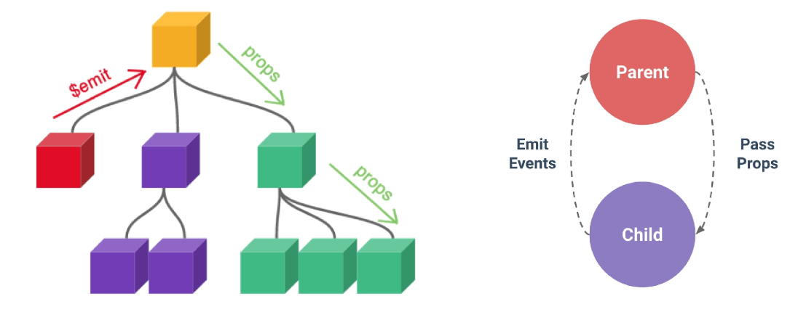
 - 부모는 자식에게 데이터를 전달(Pass Props)하며, 자식은 자신에게 일어난 일을 부모에게 알림(Emit event)

### Props
부모 컴포넌트로부터 자식 컴포넌트로 데이터를 전달하는 데 사용되는 속성

### Props 특징
 - 부모 속성이 업데이트되면 자식으로 전달되지만 그 반대는 안 됨
 - 즉, 자식 컴포넌트 내부에서 props를 변경하려고 시도해서는 안 되며 불가능
 - 또한 부모 컴포넌트가 업데이트될 때마다 이를 사용하는 자식 컴포넌트의 모든 props가 최신 값으로 업데이트 됨

 - 부모 컴포넌트에서만 변경하고 이를 내려받는 자식 컴포넌트는 자연스럽게 갱신

### One-way Data Flow
모든 props는 자식 속성과 부모 속성 사이에 '하향식 단방향 바인딩'을 형성
(one-way-down binding)

### 단방향인 이유
 - 하위 컴포넌트가 실수로 상위 컴포넌트의 상태를 변경하여 앱에서의 데이터 흐름을 이해하기 어렵게 만드는 것을 방지하기 위함
 - 데이터 흐름의 일관성 및 단순화

### 사전 준비
 1. Vue 프로젝트 생성
 2. 초기 생성된 컴포넌트 모두 삭제(App.vue 제외)
 3. src/assets 내부 파일 모두 삭제
 4. main.js 해당 코드 삭제
 5. App > Parent > ParentChild 컴포넌트 관계 작성

 - App 컴포넌트 작성
 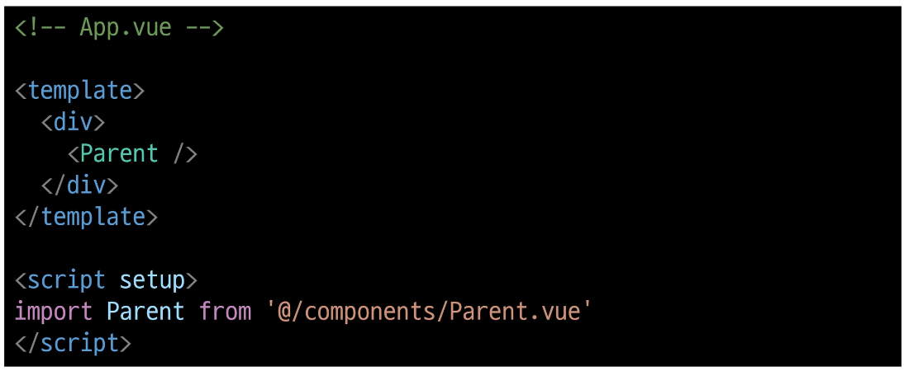

 - Parent 컴포넌트 작성
 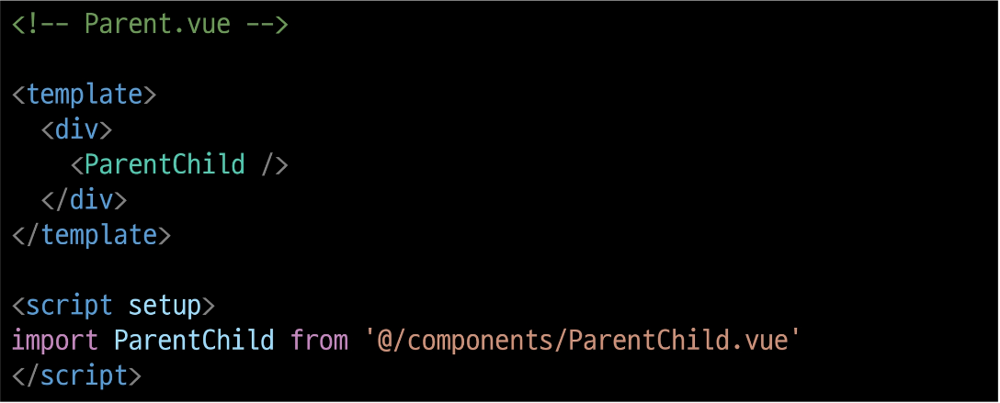

 - ParentChild 컴포넌트 작성
 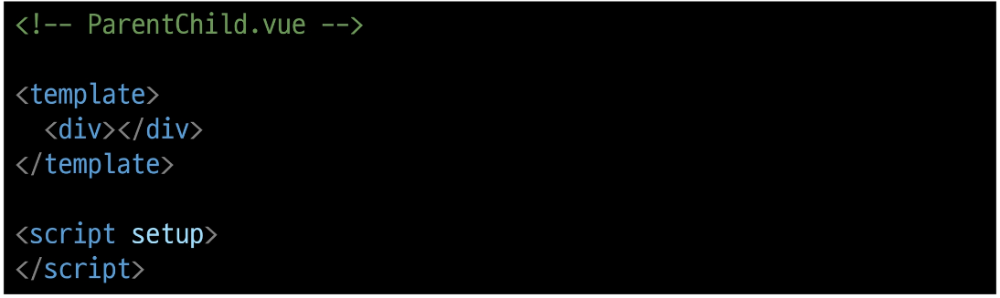

### Props 선언
 - 부모 컴포넌트에서 내려보낸 props를 사용하기 위해서는 자식 컴포넌트에서 명시적인 props 선언이 필요

 - 부모 컴포넌트 Parent에서 자식 컴포넌트 ParentChild에 보낼 props 작성
 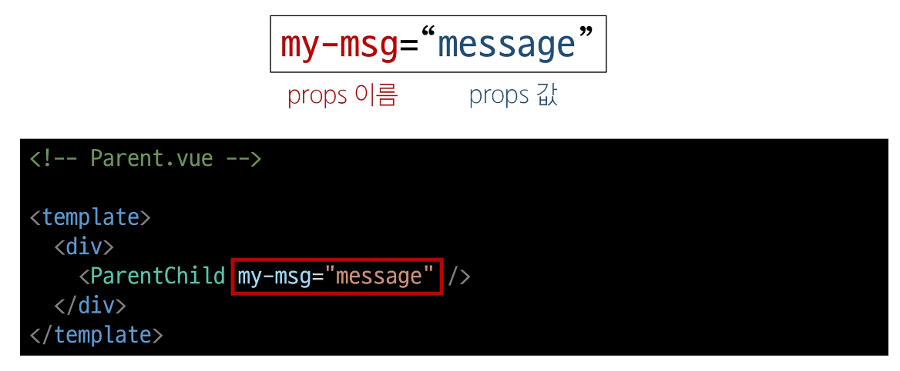

 - defineProps()를 사용하여 props를 선언
 - defineProps()에 작성하는 인자의 데이터 타입에 따라 선언 방식이 나뉨
 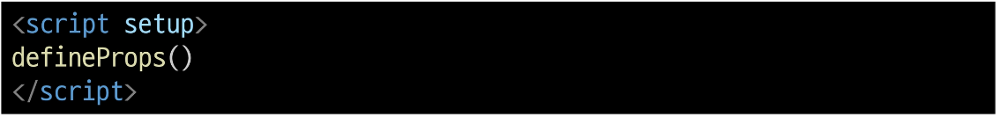

### Props 선언 2가지 방식
 1. 문자열 배열을 사용한 선언
 2. 객체를 사용한 선언

### 1. 문자열 배열을 사용한 선언
 - 배열의 문자열 요소로 props 선언
 - 문자열 요소의 이름은 전달된 props의 이름
 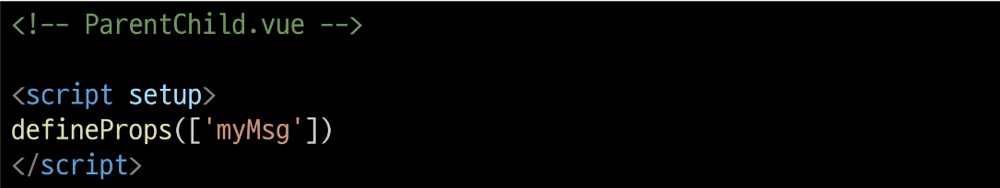

### 2. 객체를 사용한 선언
 - 각 객체 속성의 키가 전달받은 props 이름이 되며, 객체 속성의 값은 값이 될 데이터의 타입에 해당하는 생성자 함수(Number, String...)여야 함

 - 객체 선언 문법 사용 권장
 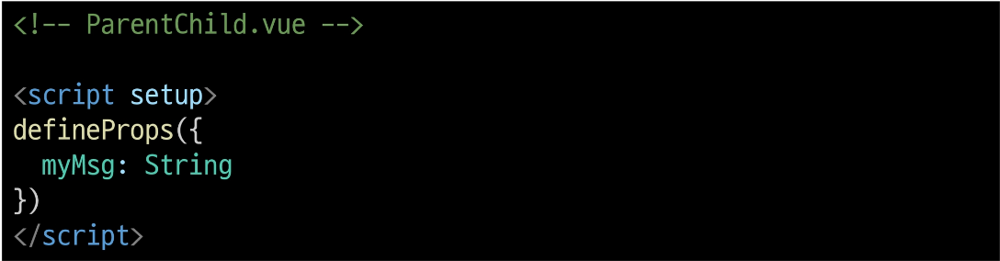

### props 데이터 사용
 - props 선언 후 템플릿에서 반응형 변수와 같은 방식으로 활용
 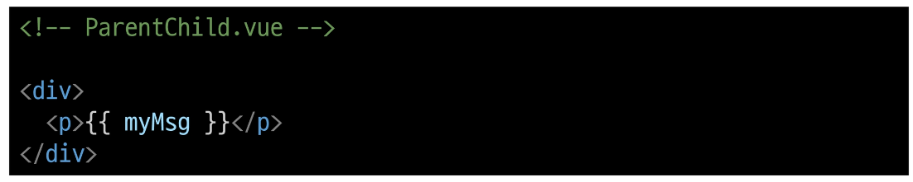
 - props를 객체로 반환하므로 필요한 경우 JavaScript에서 접근 가능
 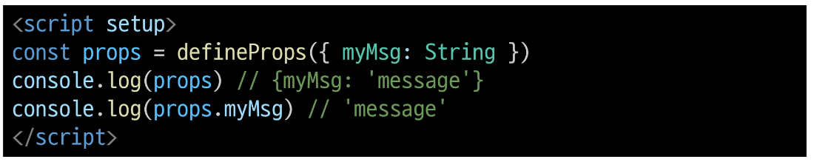

 - props 출력 결과 확인
 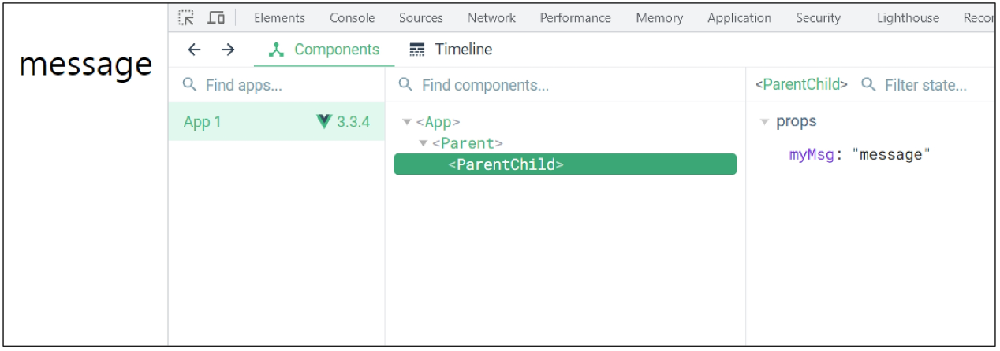

### 한 단계 더 props 내려 보내기
 - ParentChild 컴포넌트를 부모로 갖는 ParentGrandChild 컴포넌트 생성 및 등록
 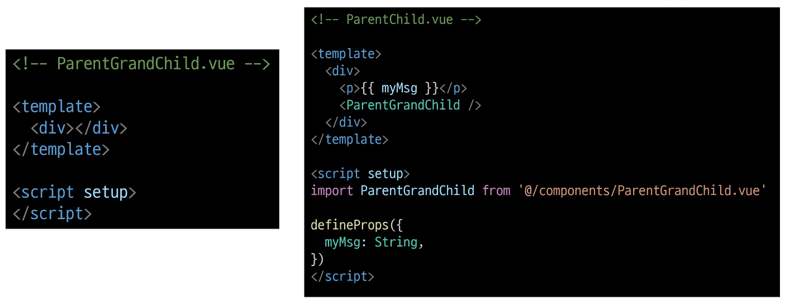

 - ParentChild 컴포넌트에서 Parent로부터 받은 props인 myMsg를 ParentGrandChild에게 전달
 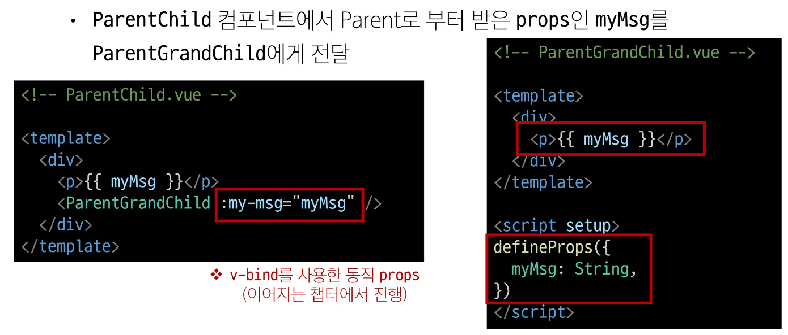

 - 출력 결과 확인
 - ParentGrandChild가 받아서 출력하는 props은 Parent에 정의되어있는 props이며 Parent가 props을 변경할 경우 이를 전달받고 있는 ParentChild, ParentGrandChild에서도 모두 업데이트 됨
 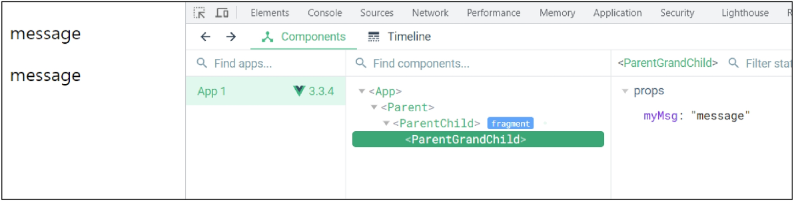

### Props 세부사항
 1. Props Name Casing (Props 이름 컨벤션)
 2. Static Props와 Dynamic Props

### 1. Props Name Casing
 - 자식 컴포넌트로 전달 시 (-> kebab-case)
 
 - 선언 및 템플릿 참조 시 (-> camelCase)
 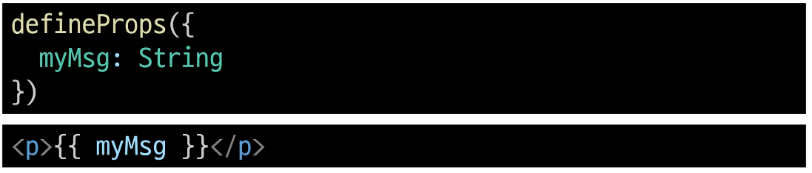

### 2. Static props & Dynamic props
 - 지금까지 작성한 것은 Static(정적) props
 - v-bind를 사용하여 '동적으로 할당된 props'를 사용할 수 있음

 1. Dynamic props 정의
 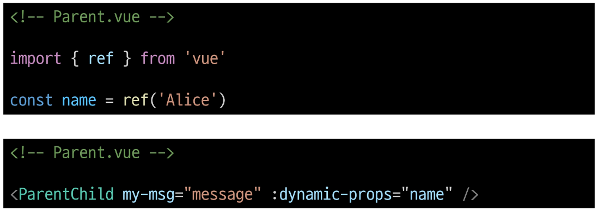

 2. Dynamic props 선언 및 출력
 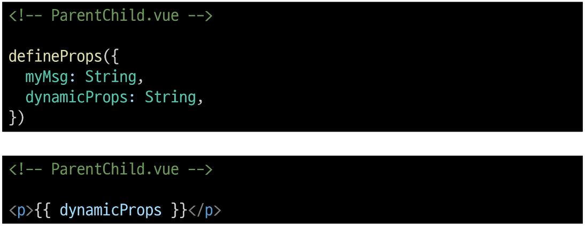

 3. Dynamic props 출력 확인
 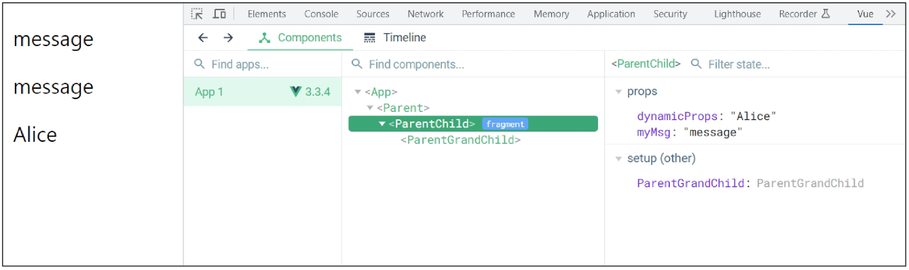

### 다른 디렉티브와 함께 사용
 - v-for와 함께 사용하여 반복되는 요소를 props로 전달하기
 - ParentItem 컴포넌트 생성 및 Parent의 하위 컴포넌트로 등록
 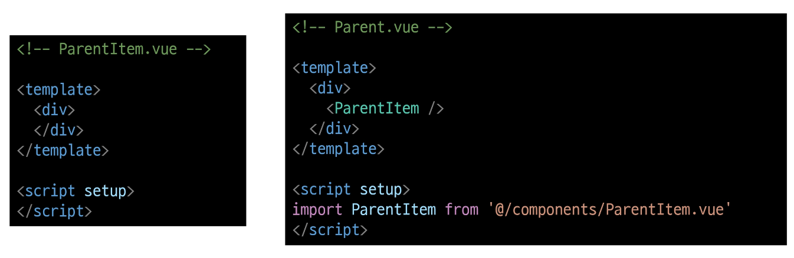

 - 데이터 정의 및 v-for 디렉티브의 반복 요소로 활용
 - 각 반복 요소를 props로 내려 보내기
 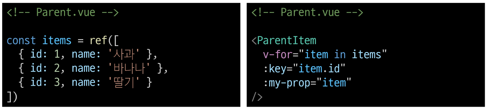

 - props 선언 및 출력 결과 확인
 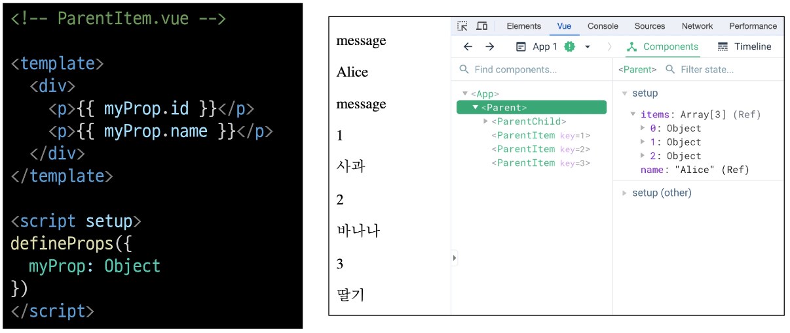

## Component Events
### Emit
 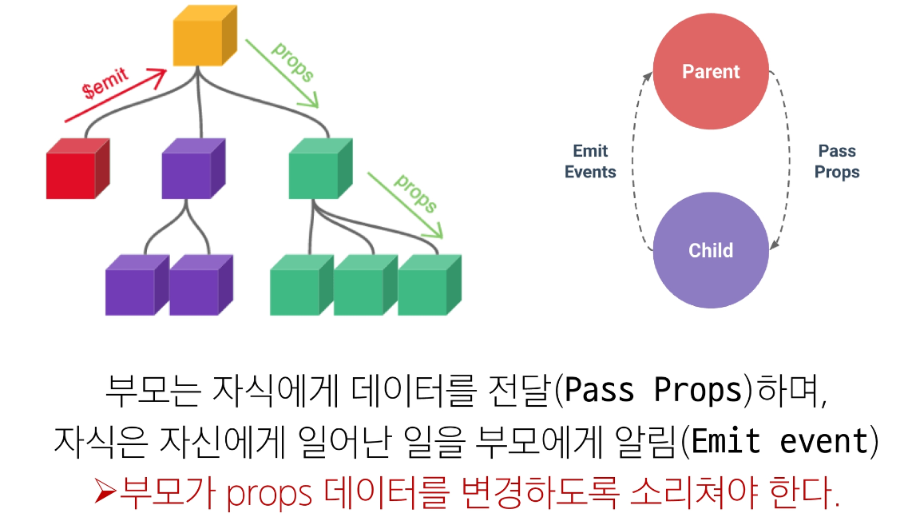

### $emit()
자식 컴포넌트가 이벤트를 발생시켜 부모 컴포넌트로 데이터를 전달하는 역할의 메서드

 - '$' 표기는 Vue 인스턴스의 내부 변수들을 가리킴
 - Life cycle hooks, 인스턴스 메서드 등 내부 특정 속성에 접근할 때 사용

### emit 메서드 구조
'$'emit(event, ...args)
 - event
     - 커스텀 이벤트 이름

- args
     - 추가 인자

### 이벤트 발신 및 수신 (Emitting and Listening to Events)
 - '$'emit을 사용하여 템플릿 표현식에서 직접 사용자 정의 이벤트를 발신
 

 - 그런 다음 부모는 v-on을 사용하여 수신할 수 있음
 

### 이벤트 발신 및 수신하기
 - ParentChild에서 someEvent라는 이름의 사용자 정의 이벤트를 발신
 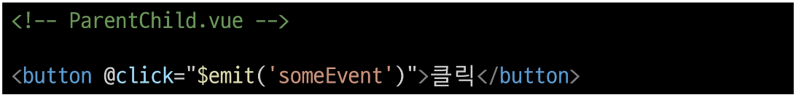

 - ParentChild의 부모 Parent는 v-on을 사용하여 발신된 이벤트를 수신
 - 수신 후 처리할 로직 및 콜백함수 호출
 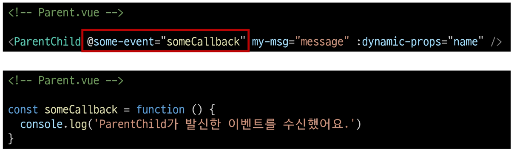

 - 이벤트 수신 결과
 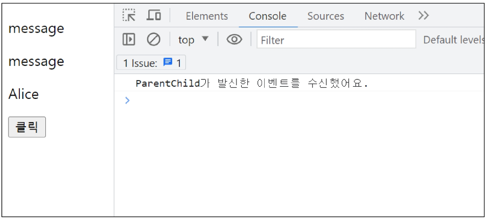

### emit 이벤트 선언
 - defineEmits()를 사용하여 발신한 이벤트를 선언
 - props와 마찬가지로 defineEmits()에 작성하는 인자의 데이터 타입에 따라 선언 방식이 나뉨 (배열, 객체)
 - defineEmits()는 '$'emit 대신 사용할 수 있는 동등한 함수를 반환 script에서는 '$'메서드를 접근할 수 없기 때문
 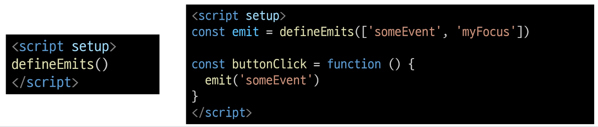

### 이벤트 선언 활용
 - 이벤트 선언 방식으로 추가 버튼 작성 및 결과 확인
 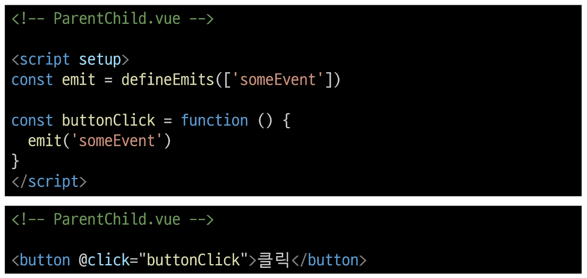

### 이벤트 인자(Event Arguments)
 - 이벤트 발신 추가 인자를 전달하여 값을 제공할 수 있음

### 이벤트 인자 전달 활용
 - ParentChild에서 이벤트를 발신하여 Parent로 추가 인자 전달하기
 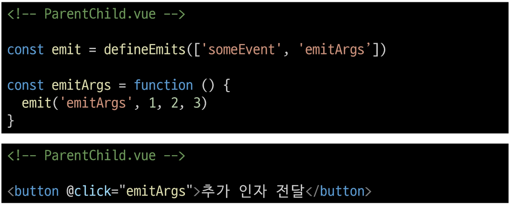

 - ParentChild에서 발신한 이벤트를 Parent에서 수신
 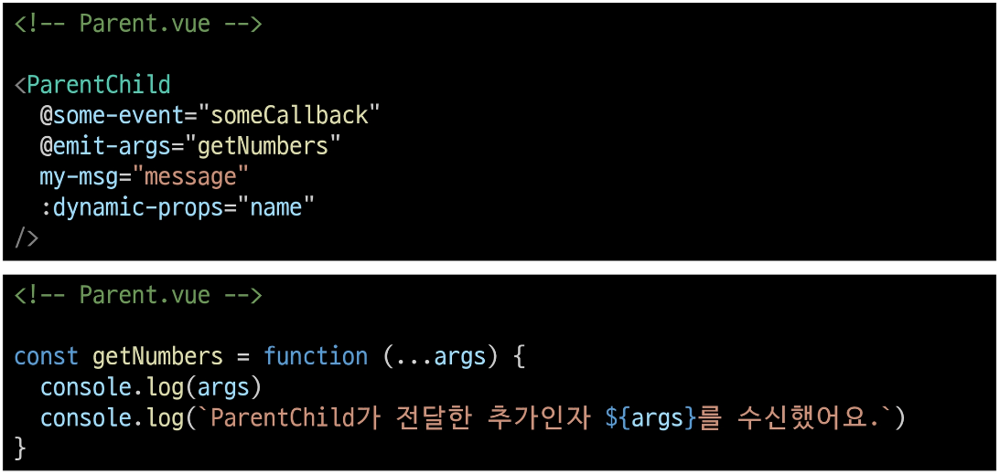

 - 추가 인자 전달 확인
 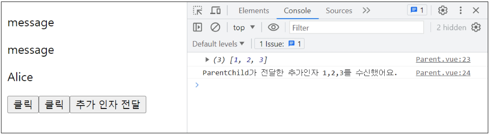

## 이벤트 세부사항
### Event Name Casing
 - 선언 및 발신 시 -> camelCase
 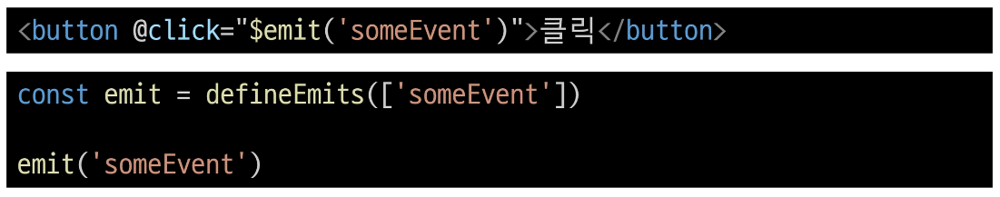

 - 부모 컴포넌트에서 수신 시 -> kebab-case
 

### emit 이벤트 실습
 - 최하단 컴포넌트 ParentGrandChild에서 Parent 컴포넌트의 name 변수 변경 요청하기
 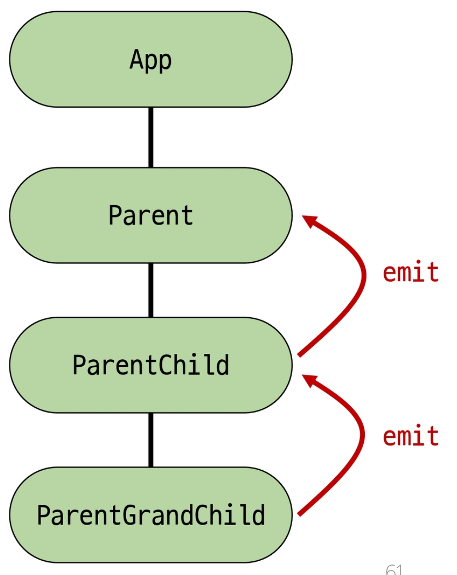

### emit 이벤트 실습 구현
 - ParentGrandChild에서 이름 변경을 요청하는 이벤트 발신
 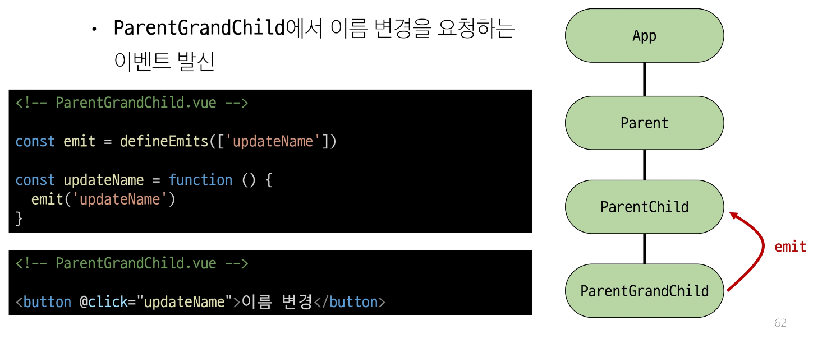

 - 이벤트 수신 후 이름 변경을 요청하는 이벤트 발신
 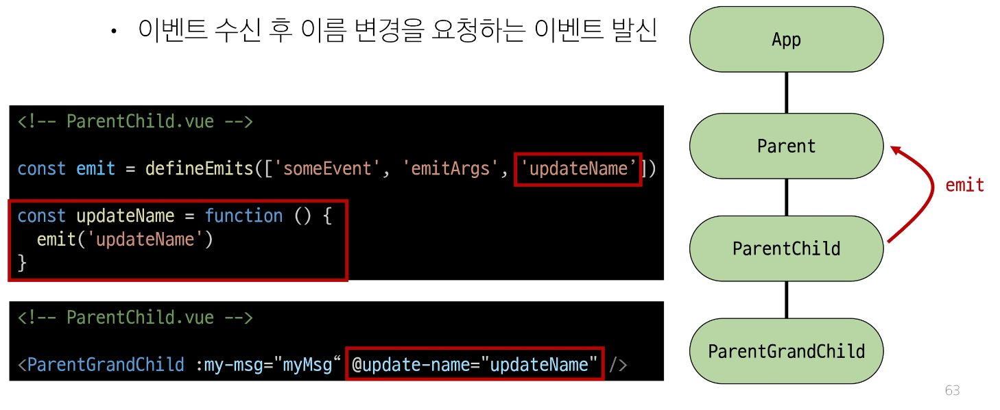

 - 이벤트 수신 후 이름 변수 변경 메서드 호출
 - 해당 변수를 props으로 받는 모든 곳에서 자동 업데이트
 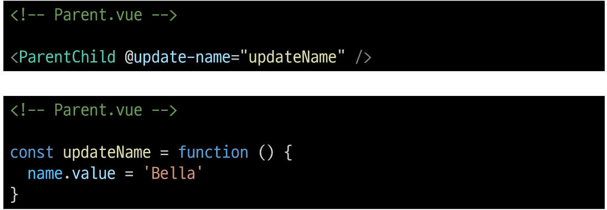

 - 버튼 클릭 후 결과 확인
 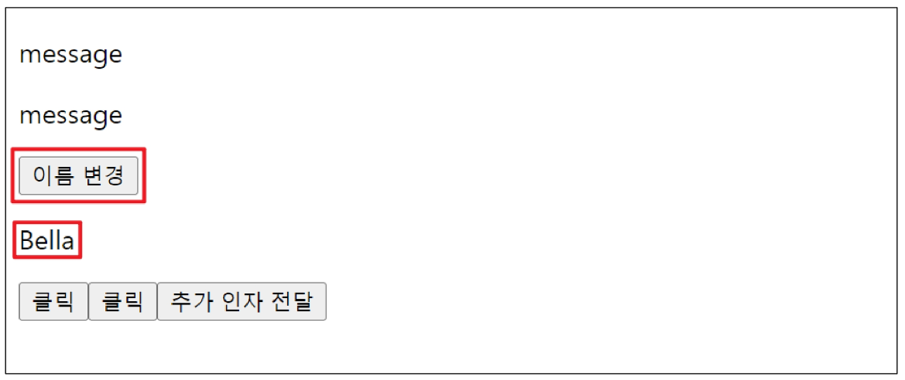

## 참고
### 주의: 정적 & 동적 props
 - 첫 번째는 정적 props로 문자열 '1'을 전달
 - 두 번째는 동적 props로 숫자 1을 전달
 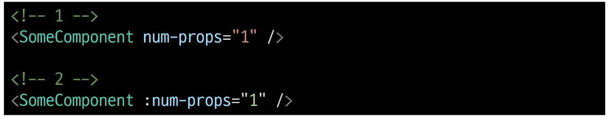

### Props 선언 시 객체 선언 문법을 권장하는 이유
 - 컴포넌트를 가독성이 좋게 문서화하는 데 도움이 되며, 다른 개발자가 잘못된 유형을 전달할 때에 브라우저 콘솔에 경고를 출력핟로고 함
 - 추가로 props에 대한 유효성 검사로써 활용 가능
 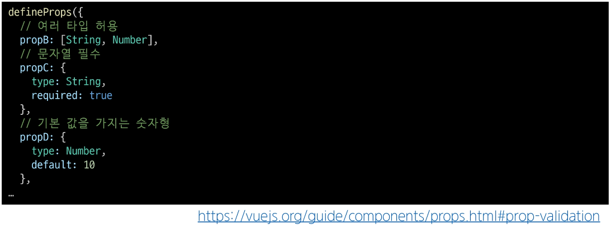

### emit 이벤트도 "객체 선언 문법"으로 작성 가능
 - emit 이벤트 또한 객체 구문으로 선언된 경우 유효성을 검사할 수 있음
 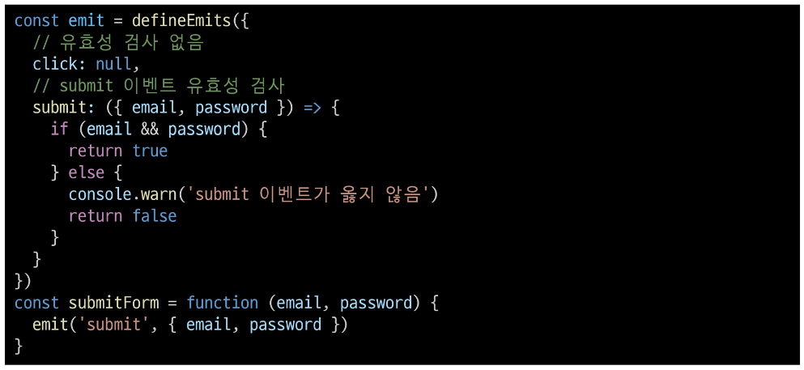
