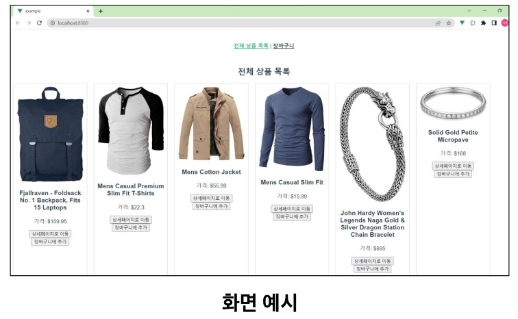

# 09 PJT
## Vue를 사용한 쇼핑몰 장바구니 기능 구현
## 목표
### 이번 프로젝트에서 구현할 애플리케이션
 - 백엔드 없이 프론트만으로 쇼핑몰 페이지를 구현합니다.
  

 - 쇼핑몰의 장바구니 기능도 구현합니다.

### 이번 프로젝트를 하기 위해 알아야 할 핵심 지식
 - Vue3
 - Fake Store API
     - 쇼핑몰 구현을 위해 개발용으로 제공되는 Fake API

### 진행 순서
 - 함께 개발하는 것
     - 쇼핑몰 장바구니 기능을 구현합니다.
     - 데이터는 Fake Store API를 활용하여 가져옵니다.

## 쇼핑몰 장바구니 기능 구현
### 쇼핑몰 데이터
 - FakeStore API란?
     - 가상의 온라인 쇼핑몰 데이터를 무료로 제공하는 API

 - FakeStore API
     - Docs: https://fakestoreapi.com/docs

### 우리가 구현할 페이지
 - 상품 목록 페이지
 - 상품 상세 페이지
 - 장바구니 페이지

### 화면 예시
 - 상품 목록 페이지
     - Card 형태로 상품 정보를 출력합니다.
     - 버튼 종류
         - 상세 페이지로 이동
         - 장바구니에 추가

 - 장바구니에 담은 상품 목록은 Local Storage에 저장합니다.

 - 상품 상세 페이지
     - 상품의 상세 저옵를 출력합니다.
     - 버튼 종류
         - 장바구니에 추가

 - 장바구니 페이지
     - 현재까지 장바구니에 담은 상품 목록을 출력합니다.
     - 버튼 목록
         - 상세 페이지로 이동
         - 장바구니에서 제거

### 금융 PJT09
 - 목표
     - 동영상 검색 및 나중에 볼 영상을 저장할 수 있는 서비스 구현
 - 특징
     - 외부 API(Youtube API)를 통한 데이터 수집